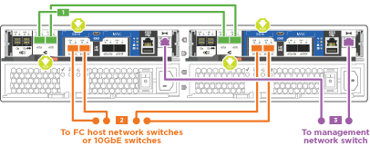
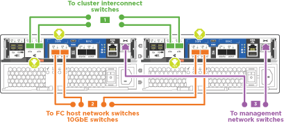
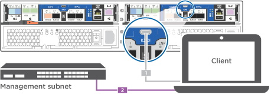

= 詳細步驟- AFF C190
:allow-uri-read: 
:icons: font
:imagesdir: ../media/

[role="lead"]
本節將詳細說明如何安裝AFF 一套功能完善的系統。

== 步驟1：準備安裝

若要安裝 AFF C190 系統、請建立帳戶並註冊系統。您也需要為系統庫存適當數量和類型的纜線、並收集特定的網路資訊。

.開始之前
* 請確定您有權存取 link:https://hwu.netapp.com["NetApp Hardware Universe"^] （HWU）以取得站台需求的相關資訊、以及設定系統的其他資訊。
* 請確定您可以存取 link:http://mysupport.netapp.com/documentation/productlibrary/index.html?productID=62286["版本資訊"^] 如ONTAP 需此系統的詳細資訊、請參閱您的版本的
* 請確定您的網站上有下列項目：
+
** 儲存系統的機架空間
** 2號十字螺絲起子
** 其他網路纜線、可將系統連接至網路交換器、筆記型電腦或主控台、並使用網路瀏覽器
** 具備RJ-45連線並可存取網頁瀏覽器的筆記型電腦或主控台

.步驟
. 打開所有包裝箱的內容物。
. 從控制器記錄系統序號。
+
image::../media/drw_ssn_label.png[系統序號範例]

. 設定您的帳戶：
+
.. 登入現有帳戶或建立帳戶。
.. 註冊（link:https://mysupport.netapp.com/eservice/registerSNoAction.do?moduleName=RegisterMyProduct["NetApp產品註冊"^]）您的系統。

. 下載並安裝 link:https://mysupport.netapp.com/site/tools/tool-eula/activeiq-configadvisor["NetApp下載Config Advisor"^] 在筆記型電腦上。
. 清點並記下您收到的纜線數量和類型。
+
下表列出您可能會收到的纜線類型。如果您收到的纜線未列於表中、請參閱 link:https://hwu.netapp.com["NetApp Hardware Universe"^] 找出纜線並識別其用途。

+
[cols="1,2,1,2"]
|===
| 纜線類型... | 產品編號與長度 | 連接器類型 | 適用於... 

 a| 
10 GbE纜線（訂單相依）
 a| 
X6566B-05-R6（112-00297）、0.5公尺

X6566B-2-R6（112-00299）、2公尺
 a| 
image:../media/oie_cable_sfp_gbe_copper.png["GbE SFP 銅線連接器"]
 a| 
叢集互連網路

 a| 
X6566B-2-R6（112-00299）、2公尺

X6566B-3-R6（112-00300）、3公尺

X6566B-5-R6（112-00301）、5公尺
 a| 
資料

 a| 
光纖網路纜線（訂單相依）
 a| 
X6553-R6（112-00188）、2公尺

X6536 - R6（112-00090）、5公尺

X654-R6（112-00189）、15公尺
 a| 
image:../media/oie_sfp_optical.png["光纖網路纜線 SFP"]

image::../media/oie_cable_fiber_lc_connector.png[光纖通道網路 LC 纜線]
 a| 
SFP + FC主機網路

 a| 
第6類、RJ-45（訂單相依）
 a| 
X6585-R6（112-00291）、3公尺

X6562-R6（112-00196）、5公尺
 a| 
image:../media/oie_cable_rj45.png["RJ-45 纜線連接器"]
 a| 
乙太網路主機與管理網路

 a| 
micro-USB主控台纜線
 a| 
不適用
 a| 
image:../media/oie_cable_micro_usb.png["Micro USB 接頭"]
 a| 
非Windows或Mac筆記型電腦/主控台軟體安裝期間的主控台連線

 a| 
電源線
 a| 
不適用
 a| 
image:../media/oie_cable_power.png["電源線"]
 a| 
開啟系統電源

|===
. 下載並完成 link:https://library.netapp.com/ecm/ecm_download_file/ECMLP2839002["叢集組態工作表"^]。

== 步驟2：安裝硬體

視情況、將您的系統安裝在 4 柱機架或 NetApp 系統機櫃中。

.步驟
. 視需要安裝軌道套件。
. 請依照軌道套件隨附的指示來安裝及固定系統。
+

NOTE: 您必須瞭解與系統重量相關的安全顧慮。

+
image::../media/drw_oie_fas2700_weight_caution.png[兩人提舉注意事項]

. 連接纜線管理裝置（如圖所示）。
+
image::../media/drw_cable_management_arm_install.png[連接纜線管理裝置]

. 將擋板放在系統正面。

== 步驟3：將控制器連接至網路

使用雙節點無交換器叢集方法或叢集互連網路方法、將控制器連接至網路。

下表列出兩個節點無交換器叢集網路纜線和交換式叢集網路纜線的纜線類型、以及圖示中的撥出號碼和纜線顏色。

[cols="20%,80%"]
|===
| 纜線 | 連線類型 

 a| 
image::../media/icon_square_1_green.png[圖示方塊 1 綠色]
 a| 
叢集互連

 a| 
image::../media/icon_square_2_yellow.png[編號 2]
 a| 
控制器以主控資料網路交換器

 a| 
image::../media/icon_square_3_orange.png[編號 3]
 a| 
控制器至管理網路交換器

|===
[role="tabbed-block"]
====
.選項1：雙節點無交換器叢集
--
瞭解如何連接雙節點無交換器叢集。

.開始之前
如需將系統連接至交換器的相關資訊、請聯絡您的網路管理員。

請務必檢查圖示箭頭、以瞭解纜線連接器的拉式彈片方向是否正確。

image::../media/oie_cable_pull_tab_down.png[纜線連接器、底部有拉片]

NOTE: 插入連接器時、您應該會感覺到它卡入到位；如果您沒有感覺到它卡入定位、請將其移除、將其翻轉、然後再試一次。

NOTE: 如果連接至光纖交換器、請先將SFP插入控制器連接埠、再將纜線連接至連接埠。

.關於這項工作
在控制器與交換器之間進行纜線連接時、請參閱下列纜線圖示。

UTA2 資料網路組態::
+
--

--
乙太網路組態::
+
--
image::../media/drw_c190_tnsc_ethernet_network_cabling_animated_gif.png[雙節點無交換器叢集 Eternet 網路纜線動畫]

--

在每個控制器模組上執行下列步驟。

.步驟
. 使用叢集互連纜線將叢集互連連接埠 e0a 連接至 e0a 、並將 e0b 連接至 e0b 。
 +
image:../media/drw_c190_u_tnsc_clust_cbling.png["叢集互連纜線"]
. 將控制器連接至 UTA2 資料網路或乙太網路。
+
UTA2 資料網路組態:: 使用下列其中一種纜線類型、將 e0c/0c 和 e0d/0d 或 e0e/0e 和 e0f/0f 資料連接埠連接至主機網路。
+
--
image:../media/drw_c190_u_fc_10gbe_cabling.png["資料連接埠連線"]

--
乙太網路組態:: 使用 Cat 6 RJ45 纜線將 e0c 透過 e0f 連接埠連接至主機網路。下圖所示。
+
--
image:../media/drw_c190_e_rj45_cbling.png["主機網路纜線"]

--

. 使用RJ45纜線將e0M連接埠連接至管理網路交換器。
+
image:../media/drw_c190_u_mgmt_cabling.png["管理連接埠纜線"]

IMPORTANT: 此時請勿插入電源線。

--
.選項2：交換式叢集
--
瞭解如何連接交換式叢集。

.開始之前
如需將系統連接至交換器的相關資訊、請聯絡您的網路管理員。

請務必檢查圖示箭頭、以瞭解纜線連接器的拉式彈片方向是否正確。

image::../media/oie_cable_pull_tab_down.png[纜線連接器、底部有拉片]

NOTE: 插入連接器時、您應該會感覺到它卡入到位；如果您沒有感覺到它卡入定位、請將其移除、將其翻轉、然後再試一次。

NOTE: 如果連接至光纖交換器、請先將SFP插入控制器連接埠、再將纜線連接至連接埠。

.關於這項工作
在控制器與交換器之間進行纜線連接時、請參閱下列纜線圖示。

統一化網路組態::
+
--

--
乙太網路組態::
+
--
image::../media/drw_c190_switched_ethernet_network_cabling_animated.png[交換式叢集乙太網路纜線動畫]

--

在每個控制器模組上執行下列步驟。

.步驟
. 使用叢集互連纜線將 e0a 和 e0b 纜線連接至叢集互連交換器。
+
image:../media/drw_c190_u_switched_clust_cbling.png["Cluster互 連纜線"]

. 將控制器連接至 UTA2 資料網路或乙太網路。
+
UTA2 資料網路組態:: 使用下列其中一種纜線類型、將 e0c/0c 和 e0d/0d 或 e0e/0e 和 e0f/0f 資料連接埠連接至主機網路。
+
--
image:../media/drw_c190_u_fc_10gbe_cabling.png["資料連接埠連線"]

--
乙太網路組態:: 使用 Cat 6 RJ45 纜線將 e0c 透過 e0f 連接埠連接至主機網路。
+
--
image:../media/drw_c190_e_rj45_cbling.png["主機網路纜線"]

--

. 使用RJ45纜線將e0M連接埠連接至管理網路交換器。
+
image:../media/drw_c190_u_mgmt_cabling.png["管理連接埠纜線"]

IMPORTANT: 此時請勿插入電源線。

--
====

== 步驟 4 ：完成系統設定

只要連線到交換器和筆記型電腦、或直接連線到系統中的控制器、然後連線到管理交換器、就能使用叢集探索來完成系統設定和組態。

[role="tabbed-block"]
====
.選項1：如果已啟用網路探索
--
瞭解如何完成系統設定如果您的筆記型電腦已啟用網路探索功能。

.步驟
. 將電源線插入控制器電源供應器、然後將電源線連接至不同電路上的電源。
. 開啟兩個節點的電源開關。
+
image::../media/drw_turn_on_power_switches_to_psus.png[開啟電源]

+

NOTE: 初始開機最多可能需要八分鐘...

. 請確定您的筆記型電腦已啟用網路探索功能。
+
如需詳細資訊、請參閱筆記型電腦的線上說明。

. 將筆記型電腦連接到管理交換器：

image::../media/dwr_laptop_to_switch_only.svg[DWR筆記型電腦只能切換]

. 選取ONTAP 列出的功能表圖示以探索：
+
image::../media/drw_autodiscovery_controler_select.png[選取 ONTAP 圖示]

+
.. 開啟檔案總管。
.. 按一下左窗格中的*網路*。
.. 按一下滑鼠右鍵並選取*重新整理*。
.. 按兩下ONTAP 任一個「資訊」圖示、並接受畫面上顯示的任何憑證。
+

NOTE: XXXXX是目標節點的系統序號。

+
系統管理程式隨即開啟。

. 使用System Manager引導式設定、使用您在中收集的資料來設定系統 link:https://library.netapp.com/ecm/ecm_download_file/ECMLP2862613["《組態指南》ONTAP"^]。
. 執行Config Advisor 下列項目來驗證系統的健全狀況：
. 完成初始組態之後、請前往 link:https://docs.netapp.com/us-en/ontap-family/["本文檔 ONTAP"] 網站以取得在 ONTAP 中設定其他功能的相關資訊。
+

NOTE: 統一化組態系統的預設連接埠組態為CNA模式；如果連線至FC主機網路、則必須修改FC模式的連接埠。

--
.選項2：如果未啟用網路探索
--
瞭解如果您的筆記型電腦未啟用網路探索、如何完成系統設定。

.步驟
. 連接纜線並設定筆記型電腦或主控台：
+
.. 使用N-8-1將筆記型電腦或主控台的主控台連接埠設為115200鮑。
+

NOTE: 請參閱筆記型電腦或主控台的線上說明、瞭解如何設定主控台連接埠。

.. 將主控台纜線連接至筆記型電腦或主控台、然後使用系統隨附的主控台纜線連接控制器上的主控台連接埠。
+
image::../media/drw_console_connect_fas2700_affa200.png[連線至主控台連接埠]

.. 將筆記型電腦或主控台連接至管理子網路上的交換器。
+

.. 使用管理子網路上的TCP/IP位址指派給筆記型電腦或主控台。

. 將電源線插入控制器電源供應器、然後將電源線連接至不同電路上的電源。
. 開啟兩個節點的電源開關。
+
image::../media/drw_turn_on_power_switches_to_psus.png[開啟電源]

+

NOTE: 初始開機最多可能需要八分鐘...

. 將初始節點管理IP位址指派給其中一個節點。
+
[cols="1,2"]
|===
| 如果管理網路有DHCP ... | 然後... 

 a| 
已設定
 a| 
記錄指派給新控制器的IP位址。

 a| 
未設定
 a| 
.. 使用Putty、終端機伺服器或您環境的等效產品來開啟主控台工作階段。
+

NOTE: 如果您不知道如何設定Putty、請查看筆記型電腦或主控台的線上說明。

.. 在指令碼提示時輸入管理IP位址。

|===
. 使用筆記型電腦或主控台上的System Manager來設定叢集：
+
.. 將瀏覽器指向節點管理IP位址。
+

NOTE: 地址格式為+https://x.x.x.x+。

.. 使用您在中收集的資料來設定系統 link:https://library.netapp.com/ecm/ecm_download_file/ECMLP2862613["《組態指南》ONTAP"^]。

. 執行Config Advisor 下列項目來驗證系統的健全狀況：
. 完成初始組態之後、請前往 link:https://docs.netapp.com/us-en/ontap-family/["ONTAP amp;document"] 網站以取得在 ONTAP 中設定其他功能的相關資訊。
+

NOTE: 統一化組態系統的預設連接埠組態為CNA模式；如果連線至FC主機網路、則必須修改FC模式的連接埠。

--
====