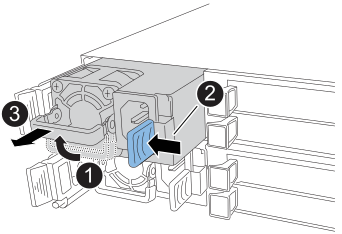
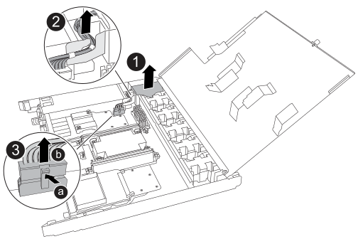
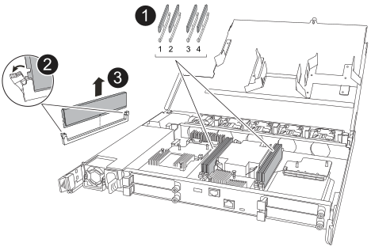
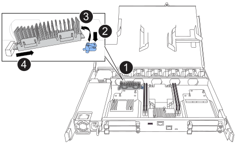
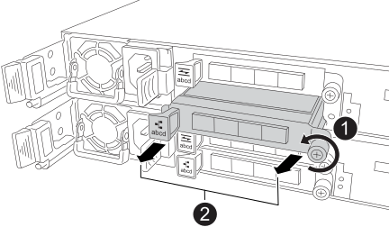

= 更換控制器 - AFF C30 和 AFF C60
:allow-uri-read: 
:icons: font
:imagesdir: ../media/

[role="lead"]
若要更換控制器，您必須移除受損的控制器，將 FRU 元件從受損的控制器移至更換控制器，在機箱中安裝更換控制器，設定時間和日期，然後重新安裝更換控制器。

== 步驟1：移除控制器

更換控制器或更換控制器內部的元件時，您必須從機箱中移除控制器。

.開始之前
儲存系統中的所有其他元件都必須正常運作；否則，您必須先聯絡 https://mysupport.netapp.com/site/global/dashboard["NetApp支援"]，才能繼續執行此程序。

.步驟
. 在受損的控制器上，請確定 NV LED 已關閉。
+
當 NV LED 熄滅時，即表示已完成減損，可安全移除受損的控制器。

+

NOTE: 如果 NV LED 閃爍（綠色），則表示正在減少目標。您必須等待 NV LED 關閉。不過，如果持續閃爍超過五分鐘，請先聯絡 https://mysupport.netapp.com/site/global/dashboard["NetApp支援"]，再繼續執行此程序。

+
NV LED 位於控制器上的 NV 圖示旁。

+
image::../media/drw_g_nvmem_led_ieops-1839.svg[NV 狀態 LED 位置]

[cols="1,4"]
|===

 a| 
image::../media/icon_round_1.png[編號 1]
 a| 
控制器上的 NV 圖示和 LED

|===
. 如果您尚未接地、請正確接地。
. 斷開受損控制器的電源：
+

NOTE: 電源供應器（ PSU ）沒有電源開關。

+
[cols="1,2"]
|===
| 如果您要中斷連線 .. | 然後... 

 a| 
AC PSU
 a| 
.. 打開電源線固定器。
.. 從 PSU 拔下電源線，並將其放在一邊。

 a| 
DC PSU
 a| 
.. 旋下 D-sub DC 電源線接頭上的兩個拇指螺絲。
.. 從 PSU 拔下電源線，並將其放在一邊。

|===
. 從受損的控制器拔下所有纜線。
+
追蹤纜線的連接位置。

. 移除受損的控制器：
+
下圖顯示移除控制器時控制器控點的操作（從控制器左側）：

+
image::../media/drw_g_and_t_handles_remove_ieops-1837.svg[控制器處理操作以移除控制器]

+
[cols="1,4"]
|===

 a| 
image::../media/icon_round_1.png[編號 1]
 a| 
在控制器的兩端，將垂直鎖定彈片向外推，以鬆開把手。

 a| 
image::../media/icon_round_2.png[編號 2]
 a| 
** 朝自己的方向拉動把手，將控制器從中板上取下。
+
拉動時，把手會從控制器伸出，然後感覺到阻力，請繼續拉動。

** 將控制器滑出機箱，同時支撐控制器的底部，並將其放置在平坦穩定的表面上。

 a| 
image::../media/icon_round_3.png[編號 3]
 a| 
如有需要，請將把手垂直轉動（在彈片旁），將其移出。

|===
. 逆時針轉動指旋螺絲以鬆開控制器護蓋，然後打開護蓋。

== 步驟2：移動電源供應器

將電源供應器（ PSU ）移至更換控制器。

. 將 PSU 從受損的控制器移出：
+
請確定左側控制器把手處於直立位置，以便您存取 PSU 。

[role="tabbed-block"]
====
.選項 1 ：移動 AC PSU
--
若要移動 AC PSU ，請完成下列步驟。

.步驟
. 從受損的控制器上取下 AC PSU ：
+

+
[cols="1,4"]
|===

 a| 
image::../media/icon_round_1.png[編號 1]
 a| 
將 PSU 把手向上旋轉至水平位置，然後抓住它。

 a| 
image::../media/icon_round_2.png[編號 2]
 a| 
用拇指按下藍色彈片，將 PSU 從控制器上鬆開。

 a| 
image::../media/icon_round_3.png[編號 3]
 a| 
將 PSU 從控制器中拉出，同時用另一隻手支撐其重量。

CAUTION: PSU很短。從控制器中取出時，請務必用雙手支撐，以免突然從控制器中迴轉而使您受傷。

|===
. 將 PSU 插入更換控制器：
+
.. 用雙手支撐 PSU 的邊緣，並將其與控制器的開口對齊。
.. 將 PSU 輕輕推入控制器，直到鎖定彈片卡入定位。
+
PSU 只能與內部連接器正確接合，並以一種方式鎖定到位。

+

NOTE: 為避免損壞內部連接器，將 PSU 滑入控制器時請勿過度施力。

.. 向下轉動握把、使其遠離正常作業。

--
.選項 2 ：移動 DC PSU
--
若要移動 DC PSU ，請完成下列步驟。

.步驟
. 從受損的控制器中移除 DC PSU ：
+
.. 將握把向上旋轉至水平位置、然後加以抓住。
.. 用拇指按下 Terracotta 標籤以釋放鎖定機制。
.. 將 PSU 從控制器中拉出，同時用另一隻手支撐其重量。
+

NOTE: PSU很短。從控制器中取出時，請務必用雙手支撐它，以免它從控制器中擺動而傷害您。

+
image::../media/drw_dcpsu_remove-replace-generic_IEOPS-788.svg[移除 DC PSU]

+
[cols="1,4"]
|===

 a| 
image::../media/icon_round_1.png[編號 1]
 a| 
指旋螺絲

 a| 
image::../media/icon_round_2.png[編號 2]
 a| 
D-sub DC 電源 PSU 電源線接頭

 a| 
image::../media/icon_round_3.png[編號 3]
 a| 
電源供應器握把

 a| 
image::../media/icon_round_4.png[編號 4.]
 a| 
Terracotta PSU 鎖定標籤

|===
. 將 PSU 插入更換控制器：
+
.. 用雙手支撐 PSU 的邊緣，並將其與控制器的開口對齊。
.. 將 PSU 輕輕滑入控制器，直到鎖定彈片卡入定位。
+
PSU 必須與內部連接器和鎖定機制正確接合。如果您覺得 PSU 未正確就位、請重複此步驟。

+

NOTE: 為避免損壞內部連接器，將 PSU 滑入控制器時請勿過度施力。

.. 向下轉動握把、使其遠離正常作業。

--
====

== 步驟3：移動風扇

將風扇移至更換控制器。

. 從受損的控制器中移除其中一個風扇：
+
image::../media/drw_g_fan_replace_ieops-1903.svg[更換風扇]

+
[cols="1,4"]
|===

 a| 
image::../media/icon_round_1.png[編號 1]
| 將風扇的兩側握在藍色觸控點上。 

 a| 
image::../media/icon_round_2.png[編號 2]
| 將風扇垂直向上拉出插槽。 
|===
. 將風扇對準導軌，然後向下推，直到風扇連接器完全插入插槽，將風扇插入更換控制器。
. 對其餘風扇重複這些步驟。

== 步驟4：搬移內華達州電池

將 NV 電池移至更換控制器。

. 從受損的控制器中取出 NV 電池：
+

+
[cols="1,4"]
|===

 a| 
image::../media/icon_round_1.png[編號 1]
 a| 
將 NV 電池從電池盒中取出。

 a| 
image::../media/icon_round_2.png[編號 2]
 a| 
從固定器上取下線束。

 a| 
image::../media/icon_round_3.png[編號 3]
 a| 
.. 推入並按住接頭上的彈片。
.. 將接頭向上拉出插槽。
+
拉起時，輕輕地將接頭從一端搖到一端（縱向），以將其取下。

|===
. 將 NV 電池安裝到更換控制器：
+
.. 將接線連接器插入其插槽。
.. 將線路沿電源供應器側邊佈線至其固定器，然後穿過 NV 電池盒正面的通道。
.. 將 NV 電池放入電池盒中。
+
NV 電池應齊平放入電池盒中。

== 步驟5：移動系統DIMM

將 DIMM 移至替換控制器。

如果您有 DIMM 擋片，則不需要移動它們，則應隨附更換控制器。

. 從受損的控制器中取出其中一個 DIMM ：
+

+
[cols="1,4"]
|===

 a| 
image::../media/icon_round_1.png[編號 1]
 a| 
DIMM 插槽編號和位置。

NOTE: 視您的儲存系統機型而定，您將擁有兩個或四個 DIMM 。

 a| 
image::../media/icon_round_2.png[編號 1]
 a| 
** 請注意插槽中 DIMM 的方向，以便您以正確的方向將 DIMM 插入替換控制器。
** 緩慢地推開 DIMM 插槽兩端的兩個 DIMM 彈出卡舌，以彈出 DIMM 。

IMPORTANT: 小心拿住DIMM的邊角或邊緣、避免對DIMM電路板元件造成壓力。

 a| 
image::../media/icon_round_3.png[編號 3]
 a| 
將 DIMM 從插槽中取出。

推出式彈片仍保持在開啟位置。

|===
. 在替換控制器中安裝 DIMM ：
+
.. 確定連接器上的 DIMM 彈出彈片處於開啟位置。
.. 拿住 DIMM 的邊角，然後將 DIMM 平直插入插槽。
+
DIMM底部插針之間的槽口應與插槽中的卡舌對齊。

+
正確插入時， DIMM 會很容易插入，但會緊密插入插槽中。如果沒有、請重新插入DIMM。

.. 目視檢查 DIMM ，確保 DIMM 完全對齊並完全插入插槽。
.. 小心地向下推DIMM頂端邊緣、但穩固地推入、直到彈出彈片卡入DIMM兩端的槽口為止。

. 對其餘的DIMM重複這些步驟。

== 步驟6：移動開機媒體

將開機媒體移至替換控制器。

. 從受損的控制器移除開機媒體：
+

+
[cols="1,4"]
|===

 a| 
image::../media/icon_round_1.png[編號 1]
 a| 
開機媒體位置

 a| 
image::../media/icon_round_2.png[編號 2]
 a| 
按下藍色標籤以釋放開機媒體的右端。

 a| 
image::../media/icon_round_3.png[編號 3]
 a| 
以小角度提起開機媒體的右端，以便在開機媒體的兩側獲得良好的抓握力。

 a| 
image::../media/icon_round_4.png[編號 4.]
 a| 
將開機媒體的左端輕輕拉出插槽。

|===
. 將開機媒體安裝到替換控制器：
+
.. 將開機媒體的插槽端滑入插槽。
.. 在開機媒體的另一端，按住藍色彈片（處於開啟位置），輕輕向下壓開機媒體的那一端，直到停止為止，然後放開彈片將開機媒體鎖定到位。

== 步驟 7 ：移動 I/O 模組

將 I/O 模組和任何 I/O 消隱模組移至替換控制器。

. 從其中一個 I/O 模組拔下纜線。
+
請務必在纜線上貼上標籤、讓您知道纜線的來源。

. 從受損的控制器中卸下 I/O 模組：
+
請務必追蹤I/O模組所在的插槽。

+
如果您要在插槽 4 中卸下 I/O 模組，請確定右側控制器把手位於直立位置，以便存取 I/O 模組。

+

+
[cols="1,4"]
|===

 a| 
image::../media/icon_round_1.png[編號 1]
 a| 
逆時針旋轉 I/O 模組指旋螺絲以鬆開。

 a| 
image::../media/icon_round_2.png[編號 2]
 a| 
使用左側的連接埠標籤和指旋螺絲，將 I/O 模組拉出控制器。

|===
. 將 I/O 模組安裝至更換控制器：
+
.. 將I/O模組與插槽邊緣對齊。
.. 輕輕地將 I/O 模組完全推入插槽，確保將模組正確插入連接器。
+
您可以使用左側的標籤和指旋螺絲推入 I/O 模組。

.. 順時針旋轉指旋螺絲以旋緊。

. 重複這些步驟，將其餘的 I/O 模組和任何 I/O 消隱模組移至替換控制器。

== 步驟 8 ：安裝控制器

將控制器重新安裝到機箱中，然後重新啟動。

.關於這項工作
下圖顯示重新安裝控制器時控制器控點（從控制器左側）的操作，並可作為控制器重新安裝步驟的其餘部分參考。

image::../media/drw_g_and_t_handles_reinstall_ieops-1838.svg[控制器處理操作以安裝控制器]

[cols="1,4"]
|===

 a| 
image::../media/icon_round_1.png[編號 1]
 a| 
如果您在維修控制器時將控制器把手直立（在彈片旁邊）移出，請將其向下旋轉至水平位置。

 a| 
image::../media/icon_round_2.png[編號 2]
 a| 
按下把手，將控制器重新插入機箱的一半，然後在指示下推動，直到控制器完全就位。

 a| 
image::../media/icon_round_3.png[編號 3]
 a| 
將把手旋轉至直立位置，並使用鎖定彈片鎖定定位。

|===
.步驟
. 合上控制器護蓋，然後順時針旋轉指旋螺絲，直到旋緊為止。
. 將控制器插入機箱的一半。
+
將控制器背面與機箱中的開口對齊，然後使用把手輕推控制器。

+

NOTE: 在接到指示之前，請勿將控制器完全插入機箱。

. 將主控台纜線連接到控制器的主控台連接埠和筆記型電腦，以便在控制器重新開機時，筆記型電腦接收主控台訊息。
. 將控制器完全插入機箱：
+
.. 用力推把手，直到控制器與中板接觸並完全就位為止。
+

NOTE: 將控制器滑入機箱時請勿過度施力，否則可能會損壞連接器。

.. 向上旋轉控制器把手，並使用彈片鎖定定位。
+

NOTE: 一旦控制器完全安裝在機箱中，就會開始開機。

. 按 CTRL-C 中止自動開機，讓控制器進入 Loader 提示。
. 在控制器上設定時間和日期：
+
確保您處於控制器的 Loader 提示符下。

+
.. 在控制器上顯示日期和時間：
+
`show date`

+

NOTE: 時間和日期預設為 GMT 。您可以選擇以當地時間和 24 小時模式顯示。

.. 設定目前 GMT 時間：
+
`set time hh:mm:ss`

+
您可以從健全的節點取得目前的 GMT ：

+
`date -u`

.. 設定 GMT 的目前日期：
+
`set date mm/dd/yyyy`

+
您可以從健全節點取得目前的 GMT ： +
`date -u`

. 視需要重新定位控制器。
. 將電源線重新連接至電源供應器（ PSU ）。
+
電源恢復至PSU後、狀態LED應為綠色。

+
[cols="1,2"]
|===
| 如果您正在重新連線 ... | 然後... 

 a| 
AC PSU
 a| 
.. 將電源線插入 PSU 。
.. 使用電源線固定器固定電源線。

 a| 
DC PSU
 a| 
.. 將 D-sub DC 電源線接頭插入 PSU 。
.. 鎖緊兩顆指旋螺絲，將 D-sub DC 電源線接頭固定至 PSU 。

|===

