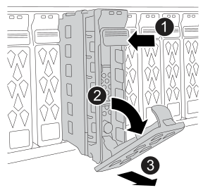

= 更換磁碟機 - AFF C30 和 AFF C60
:allow-uri-read: 
:icons: font
:imagesdir: ../media/

[role="lead"]
當磁碟機故障或需要升級時，請更換 AFF C30 或 AFF C60 系統中的磁碟機。更換程序包括識別故障的磁碟機，安全地移除磁碟機，以及安裝新磁碟機，以確保資料存取和系統效能不中斷。

您可以在I/O進行期間、不中斷營運地更換故障的SSD磁碟機。

.開始之前
* 儲存系統必須支援您要安裝的磁碟機。
+
https://hwu.netapp.com["NetApp Hardware Universe"^]

* 如果啟用自我加密磁碟機（ SED ）驗證，您必須使用 ONTAP 文件中的 SED 更換指示。
+
本白皮書中的說明ONTAP 說明說明更換SED之前和之後、您必須執行的其他步驟。

+
https://docs.netapp.com/us-en/ontap/encryption-at-rest/index.html["使用CLI進行NetApp加密概述"^]

* 儲存系統中的所有其他元件都必須正常運作；否則，請先聯絡， https://mysupport.netapp.com/site/global/dashboard["NetApp支援"]再繼續執行此程序。
* 驗證您要移除的磁碟機是否故障。
+
您可以執行「儲存磁碟show -disfed'命令來驗證磁碟機是否故障。故障磁碟機出現在故障磁碟機清單中。如果沒有、您應該稍候、然後再次執行命令。

+

NOTE: 視磁碟機類型和容量而定、磁碟機可能需要數小時才會出現在故障磁碟機清單中。

.關於這項工作
* 更換故障磁碟機時，您必須在移除磁碟機與插入替換磁碟機之間等待 70 秒，以便讓儲存系統辨識磁碟機已移除。
* 最佳做法是在熱插拔磁碟機之前，先安裝最新版本的磁碟資格認證套件（ DQP ）。
+
安裝最新版的DQP可讓您的系統辨識及使用新的合格磁碟機。如此可避免系統事件訊息、因為無法辨識磁碟機、因此無法取得非最新的磁碟機資訊並防止磁碟分割。此外、DQP也會通知您非最新的磁碟機韌體。

+
https://mysupport.netapp.com/site/downloads/firmware/disk-drive-firmware/download/DISKQUAL/ALL/qual_devices.zip["NetApp下載：磁碟認證套件"^]

* 最佳做法是在更換 FRU 元件之前，先在系統上安裝最新版本的 NVMe 機架模組（ NSM ）韌體和磁碟機韌體。
+
https://mysupport.netapp.com/site/downloads/firmware/disk-shelf-firmware["NetApp下載：磁碟櫃韌體"^]

+
https://mysupport.netapp.com/site/downloads/firmware/disk-drive-firmware["NetApp下載：磁碟機韌體"^]

+
[NOTE]
====
請勿將韌體還原至不支援機櫃及其元件的版本。

====
* 磁碟機韌體會自動更新（不中斷營運）、以安裝非最新韌體版本的新磁碟機。
+

NOTE: 每兩分鐘檢查一次磁碟機韌體。

* 如有需要，您可以開啟儲存系統位置（藍色） LED ，以協助實際定位受影響的儲存系統。使用 SSH 登入 BMC ，然後輸入 `system location-led _on_`命令。
+
儲存系統有三個位置 LED ：一個在操作員顯示面板上，一個在每個控制器上。位置LED會持續亮起30分鐘。

+
您可以輸入命令將其關閉 `system location-led _off_`。如果您不確定 LED 是否亮起或熄滅，可以輸入命令來檢查其狀態 `system location-led show`。

.步驟
. 如果您想要手動指派更換磁碟機的磁碟機所有權、則必須停用自動磁碟機指派（如果已啟用）。
+

NOTE: 您可以手動指派磁碟機擁有權、然後在本程序稍後重新啟用自動磁碟機指派。

+
.. 確認是否已啟用自動磁碟機指派：
+
`storage disk option show`

+
您可以在任一控制器上輸入命令。

+
如果啟用自動磁碟機指派，則輸出會顯示在 `on`欄中 `Auto Assign`（針對每個控制器）。

.. 如果啟用自動磁碟機指派，請停用：
+
`storage disk option modify -node node_name -autoassign off`

+
您必須停用兩個控制器上的自動磁碟機指派。

. 請妥善接地。
. 實體識別故障磁碟機。
+
當磁碟機故障時、系統會將警告訊息記錄到系統主控台、指出哪個磁碟機故障。此外、磁碟機櫃操作員顯示面板上的警示（黃色）LED和故障磁碟機也會亮起。

+

NOTE: 故障磁碟機上的活動（綠色）LED可亮起（持續亮起）、表示磁碟機已開機、但不應閃爍、這表示I/O活動。故障磁碟機沒有I/O活動。

. 移除故障磁碟機：
+

+
[cols="1,4"]
|===

 a| 
image::../media/icon_round_1.png[編號 1]
 a| 
按下磁碟機面上的釋放按鈕、以開啟CAM握把。

 a| 
image::../media/icon_round_2.png[編號 2]
 a| 
向下轉動 CAM 把手，將磁碟機從中間背板上鬆脫。

 a| 
image::../media/icon_round_3.png[編號 3]
 a| 
使用 CAM 把手將磁碟機滑出磁碟機支架，並用另一隻手支撐磁碟機。

移除磁碟機時、請務必用兩隻手支撐其重量。

NOTE: 由於磁碟機很脆弱，因此請盡量減少處理，以免損壞它們。

|===
. 請等待至少70秒、再插入替換磁碟機。
. 插入替換磁碟機：
+
.. 在凸輪把手處於開啟位置時，用雙手插入磁碟機。
.. 輕輕推動直到磁碟機停止。
.. 關閉 CAM 把手、使磁碟機完全插入中間背板、把手卡入定位。
+
請務必緩慢關閉CAM握把、使其與磁碟機正面正確對齊。

. 確認磁碟機的活動（綠色）LED亮起。
+
當磁碟機的活動LED持續亮起時、表示磁碟機已有電力。當磁碟機的活動LED燈在閃爍時、表示磁碟機已開機且I/O正在進行中。如果磁碟機韌體正在自動更新、LED會開始閃爍。

. 如果您要更換另一個磁碟機、請重複步驟3到步驟7。
. 如果您在步驟1中停用自動磁碟機指派、請手動指派磁碟機擁有權、然後視需要重新啟用自動磁碟機指派：
+
.. 顯示所有未擁有的磁碟機：
+
`storage disk show -container-type unassigned`

+
您可以在任一控制器上輸入命令。

.. 指派每個磁碟機：
+
`storage disk assign -disk disk_name -owner owner_name`

+
您可以在任一控制器上輸入命令。

+
您可以使用萬用字元一次指派多個磁碟機。

.. 如有需要，請重新啟用自動磁碟機指派：
+
`storage disk option modify -node node_name -autoassign on`

+
您必須在兩個控制器上重新啟用自動磁碟機指派。

. 如套件隨附的RMA指示所述、將故障零件退回NetApp。
+
請聯絡技術支援人員： https://mysupport.netapp.com/site/global/dashboard["NetApp支援"]如果您需要RMA編號或更換程序的其他協助、請撥打888-463-8277（北美）、00-800-44-638277（歐洲）或+800-800-80-800（亞太地區）。

