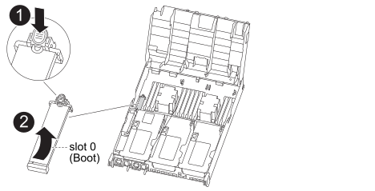

= 更換開機媒體AFF - REC400
:allow-uri-read: 
:icons: font
:imagesdir: ../media/

若要更換開機媒體、您必須移除受損的控制器模組、安裝替換的開機媒體、並將開機映像傳輸到USB快閃磁碟機。

== 步驟1：移除控制器模組

[role="lead"]
若要存取控制器模組內部的元件、您必須從機箱中移除控制器模組。

.步驟
. 如果您尚未接地、請正確接地。
. 釋放電源線固定器、然後從電源供應器拔下纜線。
. 解開將纜線綁定至纜線管理裝置的掛勾和迴圈帶、然後從控制器模組拔下系統纜線和SFP（如有需要）、並追蹤纜線的連接位置。
+
將纜線留在纜線管理裝置中、以便在重新安裝纜線管理裝置時、整理好纜線。

. 從控制器模組中取出纜線管理裝置、然後將其放在一旁。
. 向下按兩個鎖定栓、然後同時向下轉動兩個鎖條。
+
控制器模組會稍微移出機箱。

+
image::../media/drw_A400_Remove_controller.png[DRW A400移除控制器]

+
|===

 a| 
image:../media/legend_icon_01.png[""]
 a| 
鎖定鎖條

 a| 
image:../media/legend_icon_02.png[""]
 a| 
控制器稍微移出機箱

|===
. 將控制器模組滑出機箱。
+
將控制器模組滑出機箱時、請確定您支援控制器模組的底部。

. 將控制器模組放在穩固的平面上。

== 步驟2：更換開機媒體

[role="lead"]
您必須在控制器模組中找到開機媒體（請參閱控制器模組上的FRU對應圖）、然後依照指示進行更換。

.開始之前
雖然開機媒體的內容已加密、但最好先清除開機媒體的內容再進行更換。如需詳細資訊、請參閱 https://["波動性聲明"] 適用於您的系統、請至NetApp支援網站。

NOTE: 您必須登入NetApp支援網站、才能顯示系統的_波動聲明_。

您可以使用下列動畫、圖例或書面步驟來取代開機媒體。

.動畫-更換開機媒體
video::e0825a97-c57d-47d7-b87d-aad9012efa12[panopto]
.步驟
. 打開通風管：
+
image::../media/drw_A400_open-air-duct.png[DRW A400開放式通風管]

+
|===

 a| 
image:../media/legend_icon_01.png[""]
 a| 
鎖定彈片

 a| 
image:../media/legend_icon_02.png[""]
 a| 
將通風管滑向控制器背面

 a| 
image::../media/legend_icon_03.png[圖例圖示03]
 a| 
向上轉動通風管

|===
+
.. 將通風管側邊的鎖定彈片朝控制器模組中央按下。
.. 將通風管朝控制器模組背面滑入、然後將其向上旋轉至完全開啟的位置。

. 從控制器模組中找出並移除開機媒體：
+

+
|===

 a| 
image:../media/legend_icon_01.png[""]
 a| 
按下藍色按鈕

 a| 
image:../media/legend_icon_02.png[""]
 a| 
向上轉動開機媒體、然後從插槽中取出

|===
+
.. 按下開機媒體末端的藍色按鈕、直到開機媒體的邊緣清除藍色按鈕為止。
.. 向上轉動開機媒體、然後將開機媒體從插槽中輕拉出。

. 將替換開機媒體的邊緣與開機媒體插槽對齊、然後將其輕推入插槽。
. 檢查開機媒體、確定其完全正確地插入插槽中。
+
如有必要、請取出開機媒體並將其重新插入插槽。

. 將開機媒體鎖定到位：
+
.. 將開機媒體向下旋轉至主機板。
.. 用一根手指按下藍色按鈕、將開機媒體一端往開機媒體的末端推入藍色鎖定按鈕。
.. 向下推開機媒體時、請提起藍色鎖定按鈕、將開機媒體鎖定到位。

. 關閉通風管。

== 步驟3：將開機映像傳輸到開機媒體

[role="lead"]
您安裝的替換開機媒體沒有開機映像、因此您需要使用USB快閃磁碟機來傳輸開機映像。

.開始之前
* 您必須擁有一個USB快閃磁碟機、其格式必須為MBR/fat32、容量至少為4GB
* 與執行受損控制器相同ONTAP 版本之圖片的一份複本。您可以從NetApp支援網站的「下載」區段下載適當的映像
+
** 如果已啟用NVE、請使用NetApp Volume Encryption下載映像、如下載按鈕所示。
** 如果未啟用NVE、請下載不含NetApp Volume Encryption的映像、如下載按鈕所示。

* 如果您的系統是HA配對、則必須有網路連線。
* 如果您的系統是獨立式系統、則不需要網路連線、但在還原「var'檔案系統時、您必須執行額外的重新開機。

.步驟
. 從NetApp支援網站下載並複製適當的服務映像到USB快閃磁碟機。
+
.. 將服務映像下載到筆記型電腦的工作空間。
.. 解壓縮服務映像。
+

NOTE: 如果您使用Windows擷取內容、請勿使用WinZipto擷取netboot映像。使用其他擷取工具、例如7-Zip或WinRAR。

+
解壓縮服務映像檔中有兩個資料夾：

+
*** 開機
*** 《EFI'》

.. 將「efi」資料夾複製到USB快閃磁碟機的頂端目錄。
+
USB快閃磁碟機應具有受損控制器執行的EFI資料夾和相同服務映像（BIOS）版本。

.. 從筆記型電腦中取出USB隨身碟。

. 如果您尚未這麼做、請關閉通風管。
. 將控制器模組的一端與機箱的開口對齊、然後將控制器模組輕推至系統的一半。
. 重新安裝纜線管理裝置、並視需要重新連接系統。
+
重新啟用時、請記得重新安裝移除的媒體轉換器（SFP或QSFP）。

. 將電源線插入電源供應器、然後重新安裝電源線固定器。
. 將USB隨身碟插入控制器模組的USB插槽。
+
請確定您將USB隨身碟安裝在標示為USB裝置的插槽中、而非USB主控台連接埠中。

. 完成控制器模組的安裝：
+
.. 將電源線插入電源供應器、重新安裝電源線鎖環、然後將電源供應器連接至電源。
.. 將控制器模組穩固地推入機箱、直到它與中間板完全接入。
+
控制器模組完全就位時、鎖定鎖條會上升。

+

NOTE: 將控制器模組滑入機箱時、請勿過度施力、以免損壞連接器。

+
控制器模組一旦完全插入機箱、就會開始開機。準備好中斷開機程序。

.. 向上轉動鎖定栓、將其傾斜、使其從鎖定銷中取出、然後將其放低至鎖定位置。
.. 如果您尚未重新安裝纜線管理裝置、請重新安裝。

. 在載入程式提示字元下按Ctrl-C停止、以中斷開機程序。
+
如果您錯過此訊息、請按Ctrl-C、選取開機至維護模式選項、然後按「halt」控制器以開機至載入器。

. 如果控制器處於延伸或光纖附加MetroCluster 的功能不全、您必須還原FC介面卡組態：
+
.. 開機至維護模式：「boot_ONTAP maint」
.. 將MetroCluster 這個連接埠設為啟動器：「ucadmin modify -m ft _t_initiator介面卡名稱_」
.. 停止以返回維護模式：「halt（停止）」

+
系統開機時會執行變更。

