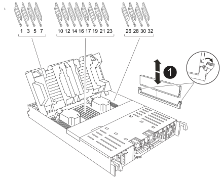

= 更換控制器 - AFF C80
:allow-uri-read: 
:icons: font
:imagesdir: ../media/

[role="lead"]
如果需要硬體故障，請更換 AFF C80 系統中的控制器。此程序包括移除受損的控制器，將元件移至更換控制器，安裝更換控制器，以及重新啟動系統。

== 步驟1：移除控制器模組

更換控制器模組或更換控制器模組內部的元件時、您必須從機箱中移除控制器模組。

.步驟
. 如果您尚未接地、請正確接地。
. 請用拇指推動每個磁碟機，直到您感覺到正向停止為止，以確保機箱中的所有磁碟機都穩固地安裝在中間背板上。
+
.影片 - 確認駕駛座椅
video::2c46e4af-2c21-4f12-b065-b38b003d0ea2[panopto]
+
image::../media/drw_a800_drive_seated_IEOPS-960.svg[將驅動器安裝到位]

. 根據系統狀態檢查控制器驅動器：
+
.. 在運作正常的控制器上，檢查是否有任何處於降級狀態、故障狀態或兩者兼具的狀態：
+
[source, cli]
----
storage aggregate show -raidstatus !*normal*
----
+
*** 如果命令返回 `There are no entries matching your query.`繼續<<Check-missing-drives,進入下一個子步驟，檢查是否有缺少的驅動器。>>。
*** 如果該命令返回任何其他結果，請從兩個控制器收集AutoSupport數據，並聯絡NetApp支援部門以取得進一步協助。
+
[source, cli]
----
system node autosupport invoke -node * -type all -message '<message_name>'
----

.. [[檢查缺少磁碟機]]檢查檔案系統或備用磁碟機是否有缺失磁碟機問題：
+
[source, cli]
----
event log show -severity * -node * -message-name *disk.missing*
----
+
*** 如果命令返回 `There are no entries matching your query.`繼續<<Check-the-amber-NVRAM,進入下一步>>。
*** 如果該命令返回任何其他結果，請從兩個控制器收集AutoSupport數據，並聯絡NetApp支援部門以取得進一步協助。
+
[source, cli]
----
system node autosupport invoke -node * -type all -message '<message_name>'
----

. [[檢查琥珀色NVRAM]]檢查琥珀色NVRAM ，確保位於故障控制器模組背面插槽 4/5 的狀態 LED 熄滅。尋找NV圖示。
+
image::../media/drw_a1K-70-90_nvram-led_ieops-1463.svg[NVRAM 注意與狀態 LED 位置圖]

+
[cols="1,4"]
|===

 a| 
image:../media/icon_round_1.png["編號 1"]
 a| 
NVRAM 狀態 LED

 a| 
image:../media/icon_round_2.png["編號 2"]
 a| 
NVRAM 注意 LED

|===
+
** 如果 NV LED 熄滅、請前往下一步。
** 如果 NV LED 閃爍、請等待閃爍停止。如果持續閃爍超過 5 分鐘、請聯絡技術支援部門尋求協助。

. 如果您尚未接地、請正確接地。
. 從控制器模組電源供應器（ PSU ）拔下控制器模組電源供應器纜線。
+

NOTE: 如果您的系統有直流電源、請從 PSU 拔下電源區塊。

. 從控制器模組拔下系統纜線、 SFP 和 QSFP 模組（如有需要）、並追蹤纜線的連接位置。
+
將纜線留在纜線管理裝置中、以便在重新安裝纜線管理裝置時、整理好纜線。

. 從控制器模組中取出纜線管理裝置。
. 向下按兩個鎖定栓、然後同時向下轉動兩個鎖條。
+
控制器模組會稍微移出機箱。

+
image::../media/drw_a70-90_pcm_remove_replace_ieops-1365.svg[控制器移除圖形]

+
[cols="1,4"]
|===

 a| 
image:../media/icon_round_1.png["編號 1"]
 a| 
鎖定鎖定

 a| 
image:../media/icon_round_2.png["編號 2"]
 a| 
鎖定銷

|===
. 將控制器模組滑出機箱、然後放在平穩的表面上。
+
將控制器模組滑出機箱時、請確定您支援控制器模組的底部。

== 步驟2：搬移電源供應器

將電源供應器移至更換控制器。

.步驟
. 旋轉CAM握把、以便在按下鎖定彈片的同時、將電源供應器從控制器模組中拉出。
+

CAUTION: 電源供應器不足。從控制器模組中取出時、請務必用兩隻手支撐、以免突然從控制器模組中迴轉而造成傷害。

+
image::../media/drw_a70-90_psu_remove_replace_ieops-1368.svg[PSU 移除]

+
[cols="1,4"]
|===

 a| 
image::../media/icon_round_1.png[編號 1]
| Terracotta PSU 鎖定標籤 

 a| 
image::../media/icon_round_2.png[編號 2]
 a| 
電源供應器

|===
. 將電源供應器移至新的控制器模組、然後安裝。
. 用兩隻手支撐電源供應器的邊緣、並將其與控制器模組的開口對齊、然後將電源供應器輕推入控制器模組、直到鎖定彈片卡入定位。
+
電源供應器只能與內部連接器正確接合、並以一種方式鎖定到位。

+

NOTE: 為避免損壞內部連接器、請勿在將電源供應器滑入系統時過度施力。

== 步驟3：移動風扇

將風扇模組移至更換的控制器模組。

.步驟
. 將風扇模組側邊的鎖定彈片夾住、然後將風扇模組從控制器模組中直接提出、以移除風扇模組。
+
image::../media/drw_a70-90_fan_remove_replace_ieops-1366.svg[移除風扇]

+
[cols="1,4"]
|===

 a| 
image::../media/icon_round_1.png[編號 1]
 a| 
風扇鎖定彈片

 a| 
image::../media/icon_round_2.png[編號 2]
 a| 
風扇模組

|===
. 將風扇模組移至替換控制器模組，然後將其邊緣與控制器模組中的開口對齊，並將其滑入，直到鎖定閂鎖咔嗒一聲卡入到位。
. 對其餘的風扇模組重複這些步驟。

== 步驟4：搬移內華達州電池

將NV電池移至更換的控制器模組。

.步驟
. 打開控制器模組中間的通風管蓋、找到 NV 電池。
+
image::../media/drw_a70-90_remove_replace_nvmembat_ieops-1369.svg[移動 NV 電池]

+
[cols="1,4"]
|===

 a| 
image::../media/icon_round_1.png[編號 1]
| NV 電池通風管 

 a| 
image::../media/icon_round_2.png[編號 2]
 a| 
NV 電池組插頭

|===
+
* 注意： * 當您停止系統時、 NV 模組 LED 會閃爍、同時將內容降級至快閃記憶體。完成轉出後、LED會關閉。

. 將電池向上提、以取用電池插頭。
. 擠壓電池插頭正面的固定夾、將插頭從插槽中拔下、然後從插槽拔下電池纜線。
. 將電池從通風管和控制器模組中取出。
. 將電池組移至更換控制器模組、然後將其安裝在更換的控制器模組中：
+
.. 打開更換控制器模組中的 NV 電池通風管。
.. 將電池插頭插入插槽、並確定插頭已鎖定到位。
.. 將電池套件插入插槽、然後穩固地向下按電池套件、以確保其鎖定到位。
.. 關閉 NV 電池通風管。

== 步驟5：移動系統DIMM

將 DIMM 移至更換的控制器模組。

.步驟
. 打開控制器頂端的控制器通風管。
+
.. 將手指插入通風管遠端的凹處。
.. 提起通風管、並將其向上旋轉至最遠的位置。

. 使用通風管頂端的 DIMM 對應圖，找出主機板上的系統 DIMM 。
+
下表列出了依機型而定的 DIMM 位置：

+
[cols="1,4"]
|===

| 模型 | DIMM 插槽位置 

 a| 
FAS70
| 3、10、19、26 

 a| 
FAS90
| 3 ， 7 ， 10 ， 14 ， 19 ， 23 ， 26 ， 30 
|===
+

+
[cols="1,4"]
|===

 a| 
image::../media/icon_round_1.png[編號 1]
| 系統DIMM 
|===
. 請注意插槽中的DIMM方向、以便您以適當的方向將DIMM插入更換的控制器模組。
. 緩慢地將DIMM兩側的兩個DIMM彈出彈片分開、然後將DIMM從插槽中滑出、藉此將DIMM從插槽中退出。
+

NOTE: 小心拿住DIMM的邊緣、避免對DIMM電路板上的元件施加壓力。

. 找到要安裝 DIMM 的替換控制器模組上的插槽。
. 將DIMM正面插入插槽。
+
DIMM可緊密插入插槽、但應該很容易就能裝入。如果沒有、請重新將DIMM與插槽對齊、然後重新插入。

+

NOTE: 目視檢查DIMM、確認其對齊並完全插入插槽。

. 在DIMM頂端邊緣小心地推入、但穩固地推入、直到彈出彈出彈片卡入DIMM兩端的槽口。
. 對其餘的DIMM重複這些步驟。
. 關閉控制器通風管。

== 步驟 6 ：移動 I/O 模組

將 I/O 模組移至更換的控制器模組。

.步驟
. 拔下目標I/O模組上的任何纜線。
+
請務必貼上纜線的標籤、以便知道纜線的來源。

. 向下拉纜線管理 ARM 內部的按鈕、然後向下旋轉纜線管理、即可向下旋轉纜線管理 ARM 。
+
image::../media/drw_a70_90_io_remove_replace_ieops-1532.svg[移除 I/O 模組]

+
[cols="1,4"]
|===

 a| 
image::../media/icon_round_1.png[編號 1]
| I/O 模組 CAM 控制桿 
|===
. 從控制器模組中移除 I/O 模組：
+
.. 按下目標 I/O 模組 CAM 鎖定按鈕。
.. 向下轉動凸輪栓鎖、直到卡入定位為止。對於水平模組、請將 CAM 儘量遠離模組。
.. 將手指連入凸輪桿開口處、然後將模組拉出控制器模組、即可將模組從控制器模組中移除。
+
請務必追蹤I/O模組所在的插槽。

.. 將替換 I/O 模組安裝至替換控制器模組中、方法是將 I/O 模組輕輕滑入插槽、直到 I/O 凸輪閂鎖開始與 I/O 凸輪銷接合、然後將 I/O 凸輪閂鎖完全推入、以將模組鎖定到位。

. 重複這些步驟、將插槽 6 和 7 中的模組以外的其他 I/O 模組移至替換控制器模組。
+

NOTE: 若要將 I/O 模組從插槽 6 和 7 中移出、您必須將包含這些 I/O 模組的承載器從受損的控制器模組移至更換的控制器模組。

. 將插槽 6 和 7 中包含 I/O 模組的承載器移至替換控制器模組：
+
.. 按下托架把手最右側的按鈕。將托架滑出受損的控制器模組、將其插入替換控制器模組、其位置與受損控制器模組相同。
.. 將托架輕輕推入更換的控制器模組、直到卡入定位。

== 步驟 7 ：移動系統管理模組

將系統管理模組移至更換的控制器模組。

.步驟
. 從受損的控制器模組中移除系統管理模組：
+
image::../media/drw_70-90_sys-mgmt_remove_ieops-1817.svg[移動系統管理模組]

+
[cols="1,4"]
|===

 a| 
image::../media/icon_round_1.png[編號 1]
 a| 
系統管理模組 CAM 栓鎖

|===
+
.. 按下系統管理 CAM 按鈕。
.. 向下轉動凸輪桿。
.. 將手指環入 CAM 槓桿、然後將模組直接從系統中拉出。

. 將系統管理模組安裝到更換控制器模組中、其插槽與受損控制器模組的插槽相同：
+
.. 將系統管理模組的邊緣與系統開口對齊、然後將其輕輕推入控制器模組。
.. 將模組輕輕滑入插槽、直到凸輪閂鎖開始與 I/O 凸輪銷接合、然後將凸輪閂鎖完全向上旋轉、將模組鎖定到位。

== 步驟 8 ：移動 NVRAM 模組

將 NVRAM 模組移至更換的控制器模組。

.步驟
. 從受損的控制器模組中移除 NVRAM 模組：
+
image::../media/drw_a70-90_nvram12_remove_replace_ieops-1370.svg[取下 NVRAM12 模組和 DIMM]

+
[cols="1,4"]
|===

 a| 
image:../media/icon_round_1.png["編號 1"]
 a| 
CAM 鎖定按鈕

 a| 
image:../media/icon_round_2.png["編號 2"]
 a| 
DIMM 鎖定彈片

|===
+
.. 按下 CAM LATCH 按鈕。
+
CAM按鈕會從機箱移出。

.. 轉動凸輪栓鎖至最遠位置。
.. 將手指插入 CAM 拉桿開口、然後將模組從機箱中拉出、即可從機箱中移除 NVRAM 模組。

. 將 NVRAM 模組安裝到替換控制器模組的插槽 4/5 中：
+
.. 將模組與插槽 4/5 中機箱開口的邊緣對齊。
.. 將模組一路輕輕滑入插槽、然後將 CAM 栓鎖往上推、將模組鎖定到位。

== 步驟9：安裝控制器模組

重新安裝控制器模組、然後重新啟動。

.步驟
. 將通風管往下轉動、以確保通風管完全關閉。
+
它必須與控制器模組金屬板齊平。

. 將控制器模組的一端與機箱的開口對齊、然後將控制器模組輕推至系統的一半。
+

NOTE: 在指示之前、請勿將控制器模組完全插入機箱。

. 重新安裝纜線管理 ARM （如果已移除）、但請勿將任何纜線重新連接至更換的控制器。
. 將主控台纜線插入替換控制器模組的主控台連接埠、然後重新連接至筆記型電腦、以便在重新開機時接收主控台訊息。
. 完成控制器模組的重新安裝：
+
.. 將控制器模組穩固地推入機箱、直到它與中間板完全接入。
+
控制器模組完全就位時、鎖定鎖條會上升。

+

NOTE: 將控制器模組滑入機箱時、請勿過度施力、以免損壞連接器。

+
.. 將鎖定閂向上旋轉至鎖定位置。
.. 插入電源。一旦電源恢復，控制器就會啟動並進入 LOADER 提示字元。

. 在 Loader 提示字元中、輸入 `show date`以在更換控制器上顯示日期和時間。日期和時間以 GMT 為準。
+

NOTE: 顯示的時間不一定是本地時間、會以 24 小時模式顯示。

. 使用命令設定 GMT 的目前時間 `set time hh:mm:ss`。您可以從合作夥伴節點取得目前的 GMT 、命令為 'date -u'command.
. 視需要重新設定儲存系統。
+
如果您移除收發器（ QSFP 或 SFP ）、請記得在使用光纖纜線時重新安裝。

. 將電源線插入電源供應器。
+

NOTE: 如果您有直流電源、請在控制器模組完全插入機箱後、將電源區塊重新連接至電源供應器。

.接下來呢？
更換損壞的AFF C80 控制器後，您需要：link:controller-replace-system-config-restore-and-verify.html["還原系統組態"] 。
