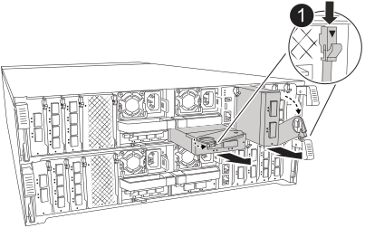

= 更換 I/O 模組 - AFF C80
:allow-uri-read: 
:icons: font
:imagesdir: ../media/

[role="lead"]
當您的AFF C80 系統中的 I/O 模組發生故障或需要升級以支援更高的效能或附加功能時，請更換該 I/O 模組。更換過程包括關閉控制器、更換故障的 I/O 模組、重新啟動控制器，以及將故障零件退回NetApp。您可以將此方法用於儲存系統支援的所有ONTAP版本。

.開始之前
* 您必須擁有可更換的零件。
* 請確定儲存系統中的所有其他元件都正常運作；如果沒有，請聯絡技術支援部門。

== 步驟1：關閉受損的控制器

使用下列其中一個選項來關閉或接管受損的控制器。

[role="tabbed-block"]
====
.選項1：大多數系統
--
若要關閉受損的控制器、您必須判斷控制器的狀態、並在必要時接管控制器、以便健全的控制器繼續從受損的控制器儲存設備提供資料。

.關於這項工作
* 如果您有 SAN 系統，則必須檢查故障控制器 SCSI 刀鋒的事件訊息  `cluster kernel-service show`。 `cluster kernel-service show`命令（從 priv 進階模式）會顯示節點名稱、link:https://docs.netapp.com/us-en/ontap/system-admin/display-nodes-cluster-task.html["仲裁狀態"]該節點的可用度狀態、以及該節點的作業狀態。
+
每個SCSI刀鋒處理序都應與叢集中的其他節點處於仲裁狀態。任何問題都必須先解決、才能繼續進行更換。

* 如果叢集有兩個以上的節點、則叢集必須處於仲裁狀態。如果叢集未達到法定人數、或健全的控制器顯示為「假」、表示符合資格和健全狀況、則您必須在關閉受損的控制器之前修正問題；請參閱 link:https://docs.netapp.com/us-en/ontap/system-admin/synchronize-node-cluster-task.html?q=Quorum["將節點與叢集同步"^]。

.步驟
. 如果啟用了「支援」功能、請叫用下列消息來禁止自動建立個案AutoSupport AutoSupport ：
+
`system node autosupport invoke -node * -type all -message MAINT=<# of hours>h`

+
下列AutoSupport 資訊不顯示自動建立案例兩小時：

+
`cluster1:> system node autosupport invoke -node * -type all -message MAINT=2h`

. 停用自動交還：
+
.. 從健康控制器的控制台輸入以下命令：
+
`storage failover modify -node _impaired_node_name_ -auto-giveback false`

.. 進入 `y`當您看到提示「您是否要停用自動回饋？」時

. 將受損的控制器移至載入器提示：
+
[cols="1,2"]
|===
| 如果受損的控制器正在顯示... | 然後... 

 a| 
載入程式提示
 a| 
前往下一步。

 a| 
正在等待恢復...
 a| 
按Ctrl-C、然後在出現提示時回應「y」。

 a| 
系統提示或密碼提示
 a| 
從健全的控制器接管或停止受損的控制器：

`storage failover takeover -ofnode _impaired_node_name_ -halt _true_`

--halt true_ 參數會帶您進入 Loader 提示字元。

|===

--
.選項2：控制器位於MetroCluster 一個不二之處
--

NOTE: 如果您的系統採用雙節點MetroCluster 的功能、請勿使用此程序。

若要關閉受損的控制器、您必須判斷控制器的狀態、並在必要時接管控制器、以便健全的控制器繼續從受損的控制器儲存設備提供資料。

* 如果叢集有兩個以上的節點、則叢集必須處於仲裁狀態。如果叢集未達到法定人數、或健全的控制器顯示為「假」、表示符合資格和健全狀況、則您必須在關閉受損的控制器之前修正問題；請參閱 link:https://docs.netapp.com/us-en/ontap/system-admin/synchronize-node-cluster-task.html?q=Quorum["將節點與叢集同步"^]。
* 如果您使用MetroCluster 的是功能不全的組態、則必須確認MetroCluster 已設定「功能不全」狀態、且節點處於啟用且正常的狀態（「MetroCluster 功能不全」）。

.步驟
. 如果啟用 AutoSupport 、請叫用 AutoSupport 命令來抑制自動建立個案： `system node autosupport invoke -node * -type all -message MAINT=number_of_hours_downh`
+
下列 AutoSupport 命令會禁止自動建立案例兩小時： `cluster1:*> system node autosupport invoke -node * -type all -message MAINT=2h`

. 停用健全控制器主控台的自動恢復功能：「torage容錯移轉修改–節點本機-自動恢復錯誤」
. 將受損的控制器移至載入器提示：
+
[cols="1,2"]
|===
| 如果受損的控制器正在顯示... | 然後... 

 a| 
載入程式提示
 a| 
前往下一步。

 a| 
正在等待恢復...
 a| 
按Ctrl-C、然後在出現提示時回應「y」。

 a| 
系統提示或密碼提示（輸入系統密碼）
 a| 
從健全的控制器停止或接管受損的控制器： `storage failover takeover -ofnode _impaired_node_name_`

當受損的控制器顯示正在等待恢復...時、請按Ctrl-C、然後回應「y」。

|===

--
====

== 步驟 2 ：更換故障 I/O 模組

若要更換 I/O 模組、請在控制器模組中找到該模組、然後依照特定步驟順序進行。

.步驟
. 如果您尚未接地、請正確接地。
. 拔下目標I/O模組上的任何纜線。
+
請務必在纜線上貼上標籤、讓您知道纜線的來源。

. 向下轉動纜線管理托盤、方法是拉動纜線管理托盤內部的按鈕、然後向下旋轉。
. 從控制器模組中卸下 I/O 模組：
+

NOTE: 下圖顯示移除水平和垂直 I/O 模組。一般而言、您只會移除一個 I/O 模組。

+

+
[cols="1,4"]
|===

 a| 
image:../media/icon_round_1.png["編號 1"]
 a| 
CAM 鎖定按鈕

|===
+
.. 按下 CAM LATCH 按鈕。
.. 轉動 CAM 栓鎖、使其儘可能遠離模組。
.. 將手指連入凸輪桿開口處、然後將模組拉出控制器模組、即可將模組從控制器模組中移除。
+
請務必追蹤I/O模組所在的插槽。

. 將I/O模組放在一邊。
. 將替換 I/O 模組安裝至目標插槽：
+
.. 將I/O模組與插槽邊緣對齊。
.. 將模組一路輕輕滑入控制器模組的插槽、然後將 CAM 栓鎖完全向上旋轉、將模組鎖定到位。

. 連接 I/O 模組纜線。
. 重複執行移除和安裝步驟、以更換控制器的其他模組。
. 將纜線管理承載器旋轉至鎖定位置。

== 步驟 3 ：重新啟動控制器

更換 I/O 模組之後，您必須重新啟動控制器。

.步驟
. 從載入程式提示重新啟動控制器：
+
`bye`

+

NOTE: 重新啟動功能受損的控制器時，也會重新初始化 I/O 模組和其他元件。

. 將受損的控制器歸還其儲存設備、使其恢復正常運作：
+
'容錯移轉還原-ofnode_disapped_node_name_'

. 從健全控制器的主控台還原自動恢復：
+
`storage failover modify -node local -auto-giveback true`

. 如果啟用 AutoSupport 、請還原自動建立案例：
+
`system node autosupport invoke -node * -type all -message MAINT=END`

== 步驟4：將故障零件歸還給NetApp

如套件隨附的RMA指示所述、將故障零件退回NetApp。如 https://mysupport.netapp.com/site/info/rma["零件退貨與更換"]需詳細資訊、請參閱頁面。
