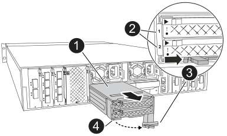
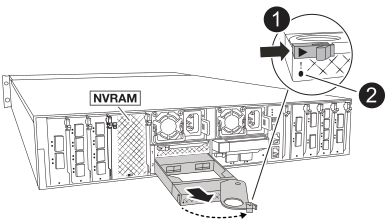

= 更換 Flash Cache 模組載體或快取模組： FAS70 和 FAS90
:allow-uri-read: 
:icons: font
:imagesdir: ../media/

[role="lead"]
FAS70 或 FAS90 系統中的 NVMe SSD Flash Cache 模組承載器包含一或兩個 Flash Cache 模組（快取模組），每個快取模組都整合一個 SSD Flash Cache 磁碟機。

FAS70 支援 2TB 快取模組、 FAS90 支援 4TB 快取模組。您無法在 Flash Cache 模組載體中混用容量不同的快取模組。

根據您需要更換的元件，您可以執行下列任一程序：整個 Flash Cache 模組載體或快取模組。

* <<更換 Flash Cache 模組承載器>>
* <<更換快取模組>>

== 更換 Flash Cache 模組承載器

Flash Cache 模組承載器位於插槽 6 中，最多可容納兩個 Flash Cache 模組。您無法熱交換 Flash Cache 模組承載器

.開始之前
* 確保您的儲存系統擁有適當的作業系統，可用於更換的 Flash Cache 模組承載器。
* 確認所有其他元件正常運作；否則、您必須聯絡技術支援部門。

=== 步驟1：關閉受損節點

使用下列其中一個選項來關閉或接管受損的控制器。

.選項 1 大多數系統
[%collapsible]
====
若要關閉受損的控制器、您必須判斷控制器的狀態、並在必要時接管控制器、以便健全的控制器繼續從受損的控制器儲存設備提供資料。

.開始之前
如果叢集有兩個以上的節點、則叢集必須處於仲裁狀態。如果叢集未達到法定人數、或健全的控制器顯示為「假」、表示符合資格和健全狀況、則您必須在關閉受損的控制器之前修正問題；請參閱 link:https://docs.netapp.com/us-en/ontap/system-admin/synchronize-node-cluster-task.html?q=Quorum["將節點與叢集同步"^]。

.步驟
. 如果啟用 AutoSupport 、請叫用 AutoSupport 訊息命令來抑制自動建立個案： `system node autosupport invoke -node * -type all -message MAINT=number_of_hours_downh`
+
下列 AutoSupport 命令會禁止自動建立案例兩小時： `cluster1:*> system node autosupport invoke -node * -type all -message MAINT=2h`

. 停用健全控制器主控台的自動恢復功能：「torage容錯移轉修改–節點本機-自動恢復錯誤」
. 將受損的控制器移至載入器提示：
+
[cols="1,2"]
|===
| 如果受損的控制器正在顯示... | 然後... 

 a| 
載入程式提示
 a| 
前往下一步。

 a| 
《等待贈品……》
 a| 
按Ctrl-C、然後在出現提示時回應「y」。

 a| 
系統提示或密碼提示（輸入系統密碼）
 a| 
從健全的控制器停止或接管受損的控制器： `storage failover takeover -ofnode _impaired_node_name_`

當受損的控制器顯示正在等待恢復...時、請按Ctrl-C、然後回應「y」。

|===

====
.選項 2 MetroCluster 組態
[%collapsible]
====

NOTE: 如果您的系統採用雙節點MetroCluster 的功能、請勿使用此程序。

若要關閉受損的控制器、您必須判斷控制器的狀態、並在必要時接管控制器、以便健全的控制器繼續從受損的控制器儲存設備提供資料。

* 如果叢集有兩個以上的節點、則叢集必須處於仲裁狀態。如果叢集未達到法定人數、或健全的控制器顯示為「假」、表示符合資格和健全狀況、則您必須在關閉受損的控制器之前修正問題；請參閱 link:https://docs.netapp.com/us-en/ontap/system-admin/synchronize-node-cluster-task.html?q=Quorum["將節點與叢集同步"^]。
* 如果您使用MetroCluster 的是功能不全的組態、則必須確認MetroCluster 已設定「功能不全」狀態、且節點處於啟用且正常的狀態（「MetroCluster 功能不全」）。

.步驟
. 如果啟用 AutoSupport 、請叫用 AutoSupport 命令來抑制自動建立個案： `system node autosupport invoke -node * -type all -message MAINT=number_of_hours_downh`
+
下列 AutoSupport 命令會禁止自動建立案例兩小時： `cluster1:*> system node autosupport invoke -node * -type all -message MAINT=2h`

. 停用健全控制器主控台的自動恢復功能：「torage容錯移轉修改–節點本機-自動恢復錯誤」
. 將受損的控制器移至載入器提示：
+
[cols="1,2"]
|===
| 如果受損的控制器正在顯示... | 然後... 

 a| 
載入程式提示
 a| 
前往下一步。

 a| 
正在等待恢復...
 a| 
按Ctrl-C、然後在出現提示時回應「y」。

 a| 
系統提示或密碼提示（輸入系統密碼）
 a| 
從健全的控制器停止或接管受損的控制器： `storage failover takeover -ofnode _impaired_node_name_`

當受損的控制器顯示正在等待恢復...時、請按Ctrl-C、然後回應「y」。

|===

====

=== 步驟 2 ：更換 Flash Cache 模組承載器

請執行下列步驟以更換 Flash Cache 模組承載器。

.步驟
. 如果您尚未接地、請正確接地。
. 在插槽 6 中找到故障的 Flash Cache 模組承載器，其位置是 Flash Cache 模組承載器正面亮起的琥珀色警示 LED 。
+

+
[cols="1,4"]
|===

 a| 
image:../media/icon_round_1.png["編號 1"]
 a| 
Flash Cache 模組載體

 a| 
image:../media/icon_round_2.png["編號 2"]
 a| 
快取模組插槽編號

 a| 
image:../media/icon_round_3.png["編號 3"]
 a| 
Flash Cache 模組載體 CAM 把手

 a| 
image:../media/icon_round_4.png["編號 4."]
 a| 
Flash Cache 模組載體故障 LED

|===
. 移除故障的 Flash Cache 模組載體：
+
.. 向下轉動纜線管理承載器、方法是拉動纜線管理承載器內側兩側的按鈕、然後向下旋轉承載器。
.. 捏住 Flash Cache 模組承載器底部的藍色彈片。
.. 將彈片從模組轉開。

. 將 Flash Cache 模組承載器從控制器模組中拉出，並將其放在防靜電墊上。
. 將快取模組移至替換的 Flash Cache 模組承載器：
+
.. 捏住快取模組頂端的 Terra Cotta 標籤、將 CAM 把手轉離快取模組。
.. 將手指插入 CAM 拉桿開口，然後將模組從 Flash Cache 模組承載器中拉出，即可將模組從機箱中移除。
.. 將快取模組安裝到替換 Flash Cache 模組承載器的同一個插槽中，然後將 CAM 把手旋轉到快取模組上的關閉位置，將其鎖定到位。

. 如果有第二個快取模組、請重複這些步驟。
. 將替換的 Flash Cache 模組承載器安裝到系統中：
+
.. 將模組與機箱插槽開口的邊緣對齊。
.. 將模組一路滑入機箱中的插槽、然後將 CAM 栓鎖完全向上旋轉、將模組鎖定到位。
.. 將纜線管理承載器向上旋轉至關閉位置。

=== 步驟 3 ：重新啟動控制器

更換 Flash Cache 模組承載器之後，您必須重新啟動控制器模組。

.步驟
. 在載入程式提示字元中、重新啟動節點：_by_
+

NOTE: 這會重新初始化 I/O 卡和其他元件、然後重新啟動節點。

. 將節點恢復為正常作業： _storage 容錯移轉恢復恢復 -ofnode_node_name_
. 如果自動恢復已停用、請重新啟用： _storage 容錯移轉修改 -node local -auto-贈 品 true_

=== 步驟4：將故障零件歸還給NetApp

如套件隨附的RMA指示所述、將故障零件退回NetApp。如 https://mysupport.netapp.com/site/info/rma["零件退貨與更換"]需詳細資訊、請參閱頁面。

== 更換快取模組

Flash Cache 模組（快取模組）位於插槽 6-1 或插槽 6-2 中，或插槽 6-1 和插槽 6-2 中。

您可以使用同一廠商或其他支援廠商提供的相同容量快取模組來熱交換個別的快取模組。

.開始之前
* 確保更換快取模組的容量與故障模組、來自同一廠商或其他支援廠商的容量相同。
* 確認所有其他元件正常運作；否則、您必須聯絡技術支援部門。
* 快取模組中的磁碟機不是現場可更換單元（ FRU ）。您必須更換整個快取模組。

.步驟
. 如果您尚未接地、請正確接地。
. 在插槽6中、透過快取模組正面亮起的黃色警示LED、找到故障快取模組。
. 準備好快取模組插槽以進行更換、如下所示：
+
.. 在目標節點上記錄快取模組容量、零件編號和序號： _ 系統節點執行本機 sysconfig -av 6_
.. 在管理權限層級中、準備要移除的目標快取模 `y`組插槽、並在系統提示是否繼續時回應： _system 控制器插槽模組移除 -node_name -slot slate_number_ 下列命令會準備好節點 1 上的插槽 6-1 以供移除、並顯示一則訊息、表示可以安全移除：
+
[listing]
----
::> system controller slot module remove -node node1 -slot 6-1

Warning: SSD module in slot 6-1 of the node node1 will be powered off for removal.
Do you want to continue? (y|n): _y_
The module has been successfully removed from service and powered off. It can now be safely removed.
----
.. 使用「系統控制器插槽模組show」命令顯示插槽狀態。
+
快取模組插槽狀態會顯示在 `powered-off`需要更換之快取模組的畫面輸出中。

+

NOTE: 請參閱 https://docs.netapp.com/us-en/ontap-cli-9121/["命令手冊頁"^] 以取得ONTAP 更多詳細資料。

. 移除快取模組：
+

+
[cols="1,4"]
|===

 a| 
image:../media/icon_round_1.png["編號 1"]
 a| 
快取模組 CAM 把手

 a| 
image:../media/icon_round_2.png["編號 2"]
 a| 
快取模組故障 LED

|===
+
.. 向下轉動纜線管理承載器、方法是拉動纜線管理承載器內側兩側的按鈕、然後向下旋轉承載器。
.. 按下快取模組前面的Terra cotta釋放按鈕。
.. 轉動凸輪把手至最遠的位置。
.. 將手指插入 CAM 槓桿開口，然後將模組從 Flash Cache 模組承載器中拉出，即可將快取模組模組從機箱中移除。
+
從 Flash Cache 模組載體中移除快取模組時，請務必支援快取模組。

. 安裝替換快取模組：
+
.. 將快取模組的邊緣與控制器模組的開口對齊。
.. 將快取模組輕推入支架、直到CAM把手上卡入。
.. 旋轉CAM握把、直到鎖定到位。
.. 將纜線管理承載器向上旋轉至關閉位置。

. 使用「系統控制器插槽模組insert」命令將替換快取模組上線、如下所示：
+
下列命令會準備節點1上的插槽6-1以供開機、並顯示已開機的訊息：

+
[listing]
----
::> system controller slot module insert -node node1 -slot 6-1

Warning: NVMe module in slot 6-1 of the node localhost will be powered on and initialized.
Do you want to continue? (y|n): `y`

The module has been successfully powered on, initialized and placed into service.
----
. 使用「系統控制器插槽模組show」命令來驗證插槽狀態。
+
確保命令輸出將的狀態報告為「已開機」、並準備好操作。

. 確認更換的快取模組已上線並已辨識、然後以視覺方式確認黃色警示LED未亮起：「syssconfig -av slid_number」
+

NOTE: 如果您以不同廠商的快取模組來取代快取模組、則命令輸出中會顯示新的廠商名稱。

. 如套件隨附的RMA指示所述、將故障零件退回NetApp。如 https://mysupport.netapp.com/site/info/rma["零件退貨與更換"^]需詳細資訊、請參閱頁面。

