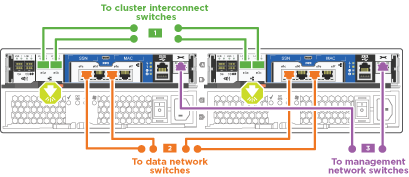

= 詳細指南 - FAS2700
:allow-uri-read: 
:icons: font
:imagesdir: ../media/

[role="lead"]
本頁提供安裝一般 NetApp 系統的詳細逐步指示。如果您需要更詳細的安裝說明、請使用本指南。

== 步驟1：準備安裝

若要安裝 FAS2700 系統、您必須在 NetApp 支援網站 上建立帳戶、註冊系統、並取得授權金鑰。您也需要為系統庫存適當數量和類型的纜線、並收集特定的網路資訊。

您必須能夠存取Hardware Universe 有關站台需求的資訊、以及設定系統的其他資訊。您也可以存取ONTAP 版本的《發行說明》、以取得更多關於此系統的資訊。

https://hwu.netapp.com["NetApp Hardware Universe"]

http://mysupport.netapp.com/documentation/productlibrary/index.html?productID=62286["尋找ONTAP 您版本的更新說明"]

您必須在網站上提供下列資訊：

* 儲存系統的機架空間
* 2號十字螺絲起子
* 其他網路纜線、可將系統連接至網路交換器、筆記型電腦或主控台、並使用網路瀏覽器
* 具備RJ-45連線並可存取網頁瀏覽器的筆記型電腦或主控台

.步驟
. 打開所有包裝箱的內容物。
. 從控制器記錄系統序號。
+
image::../media/drw_ssn_label.png[DRw SSN標籤]

. 設定您的帳戶：
+
.. 登入現有帳戶或建立帳戶。
.. 註冊您的系統。
+
https://mysupport.netapp.com/eservice/registerSNoAction.do?moduleName=RegisterMyProduct["NetApp產品註冊"]

. 在Config Advisor 筆記型電腦上下載並安裝此功能。
+
https://mysupport.netapp.com/site/tools/tool-eula/activeiq-configadvisor["NetApp下載Config Advisor"]

. 清點並記下您收到的纜線數量和類型。
+
下表列出您可能會收到的纜線類型。如果您收到的纜線未列於表中、請參閱Hardware Universe 《關於找出纜線並識別其用途的資訊》。

+
https://hwu.netapp.com["NetApp Hardware Universe"]

+
[cols="1,2,1,2"]
|===
| 纜線類型... | 產品編號與長度 | 連接器類型 | 適用於... 

 a| 
10 GbE纜線（訂單相依）
 a| 
X6566B-05-R6（112-00297）、0.5公尺

X6566B-2-R6（112-00299）、2公尺
 a| 
image:../media/oie_cable_sfp_gbe_copper.png[""]
 a| 
叢集互連網路

 a| 
10 GbE纜線（訂單相依）
 a| 
零件編號X6566B-2-R6（112-00299）、2公尺

或X6566B-3-R6（112-00300）、3公尺

X6566B-5-R6（112-00301）、5公尺
 a| 
image:../media/oie_cable_sfp_gbe_copper.png[""]
 a| 
資料

 a| 
光纖網路纜線（訂單相依）
 a| 
X6553-R6（112-00188）、2公尺

X6536 - R6（112-00090）、5公尺

X654-R6（112-00189）、15公尺
 a| 
image:../media/oie_cable_fiber_lc_connector.png[""]
 a| 
FC主機網路

 a| 
第6類、RJ-45（訂單相依）
 a| 
零件編號X6585-R6（112-00291）、3公尺

X6562-R6（112-00196）、5公尺
 a| 
image:../media/oie_cable_rj45.png[""]
 a| 
管理網路與乙太網路資料

 a| 
儲存設備（訂單相依）
 a| 
零件編號：X56030（112-00435）、0.5公尺

X6031A（112-00436）、1公尺

X6032A（112-00437）、2公尺

X6033A（112-00438）、3公尺
 a| 
image:../media/oie_cable_mini_sas_hd_to_mini_sas_hd.png[""]
 a| 
儲存設備

 a| 
micro-USB主控台纜線
 a| 
不適用
 a| 
image:../media/oie_cable_micro_usb.png[""]
 a| 
非Windows或Mac筆記型電腦/主控台軟體安裝期間的主控台連線

 a| 
電源線
 a| 
不適用
 a| 
image:../media/oie_cable_power.png[""]
 a| 
開啟系統電源

|===
. 下載並完成_Cluster組態工作表_。
+
https://library.netapp.com/ecm/ecm_download_file/ECMLP2839002["叢集組態工作表"]

== 步驟2：安裝硬體

您需要在4柱機架或NetApp系統機櫃中（視情況而定）安裝系統。

.步驟
. 視需要安裝軌道套件。
. 請依照軌道套件隨附的指示來安裝及固定系統。
+

NOTE: 您必須瞭解與系統重量相關的安全顧慮。

+
image::../media/drw_oie_fas2700_weight_caution.png[Drw oie fas2700重量注意事項]

. 連接纜線管理裝置（如圖所示）。
+
image::../media/drw_cable_management_arm_install.png[DRw纜線管理ARM 功能安裝]

. 將擋板放在系統正面。

== 步驟3：將控制器連接至網路

您可以使用雙節點無交換式叢集方法或使用叢集互連網路、將控制器連接至網路。

=== 選項1：連接雙節點無交換式叢集的纜線、統一化網路組態

控制器上的管理網路、UTA2資料網路和管理連接埠均連接至交換器。兩個控制器上的叢集互連連接埠均已連接好纜線。

您必須聯絡網路管理員、以取得有關將系統連線至交換器的資訊。

請務必檢查圖示箭頭、以瞭解纜線連接器的拉式彈片方向是否正確。

image::../media/oie_cable_pull_tab_down.png[OIE纜線下拉式彈片]

NOTE: 插入連接器時、您應該會感覺到它卡入到位；如果您沒有感覺到它卡入定位、請將其移除、將其翻轉、然後再試一次。

.步驟
. 您可以使用圖形或逐步指示來完成控制器與交換器之間的纜線連接：
+
image::../media/drw_2700_tnsc_unified_network_cabling_animated_gif.png[DRW 2700 tnscc統一化網路纜線動畫Gif]

+
[cols="1,3"]
|===
| 步驟 | 在每個控制器上執行 

 a| 
image:../media/oie_legend_icon_1_lg.png[""]
 a| 
使用叢集互連纜線將叢集互連連接埠彼此連接：

** e0a至e0a
** e0b至e0bimage:../media/drw_c190_u_tnsc_clust_cbling.png[""]

 a| 
image:../media/oie_legend_icon_2_o.png[""]
 a| 
使用下列其中一種纜線類型、將UTA2資料連接埠纜線連接至主機網路：

FC主機

** 0C和0d
** *或* 0e與0f a 10GbE
** e0c和e0d
** *或* e0e和e0f

NOTE: 您可以將一個連接埠配對連接為CNA、另一個連接埠配對連接為FC、也可以將兩個連接埠配對連接為CNA、或將兩個連接埠配對連接為FC。

image:../media/drw_c190_u_fc_10gbe_cbling.png[""]

 a| 
image:../media/oie_legend_icon_3_lp.png[""]
 a| 
使用RJ45纜線將e0M連接埠連接至管理網路交換器：

image:../media/drw_c190_u_mgmt_cbling.png[""]

 a| 
image:../media/oie_legend_icon_attn_symbol.png[""]
 a| 
此時請勿插入電源線。

|===
. 若要纜線連接儲存設備、請參閱 <<步驟4：連接磁碟機櫃的纜線控制器>>

=== 選項2：連接交換式叢集、統一化網路組態

控制器上的管理網路、UTA2資料網路和管理連接埠均連接至交換器。叢集互連連接埠已連接至叢集互連交換器。

您必須聯絡網路管理員、以取得有關將系統連線至交換器的資訊。

請務必檢查圖示箭頭、以瞭解纜線連接器的拉式彈片方向是否正確。

image::../media/oie_cable_pull_tab_down.png[OIE纜線下拉式彈片]

NOTE: 插入連接器時、您應該會感覺到它卡入到位；如果您沒有感覺到它卡入定位、請將其移除、將其翻轉、然後再試一次。

.步驟
. 您可以使用圖形或逐步指示來完成控制器與交換器之間的佈線：
+
image::../media/drw_2700_switched_unified_network_cabling_animated_gif.png[DRW 2700交換式統一網路纜線動畫Gif]

+
[cols="1,3"]
|===
| 步驟 | 在每個控制器模組上執行 

 a| 
image:../media/oie_legend_icon_1_lg.png[""]
 a| 
使用叢集互連纜線將e0a和e0b纜線連接至叢集互連交換器：

image:../media/drw_c190_u_switched_clust_cbling.png[""]

 a| 
image:../media/oie_legend_icon_2_o.png[""]
 a| 
使用下列其中一種纜線類型、將UTA2資料連接埠纜線連接至主機網路：

FC主機

** 0C和0d
** *或* 0e和0f

10GbE

** e0c和e0d
** *或* e0e與e0f

NOTE: 您可以將一個連接埠配對連接為CNA、另一個連接埠配對連接為FC、也可以將兩個連接埠配對連接為CNA、或將兩個連接埠配對連接為FC。

image:../media/drw_c190_u_fc_10gbe_cbling.png[""]

 a| 
image:../media/oie_legend_icon_3_lp.png[""]
 a| 
使用RJ45纜線將e0M連接埠連接至管理網路交換器：

image:../media/drw_c190_u_mgmt_cbling.png[""]

 a| 
image:../media/oie_legend_icon_attn_symbol.png[""]
 a| 
此時請勿插入電源線。

|===
. 若要纜線連接儲存設備、請參閱 <<步驟4：連接磁碟機櫃的纜線控制器>>

=== 選項3：連接雙節點無交換式叢集、乙太網路組態

控制器上的管理網路、乙太網路資料網路和管理連接埠均連接至交換器。兩個控制器上的叢集互連連接埠均已連接好纜線。

您必須聯絡網路管理員、以取得有關將系統連線至交換器的資訊。

請務必檢查圖示箭頭、以瞭解纜線連接器的拉式彈片方向是否正確。

image::../media/oie_cable_pull_tab_down.png[OIE纜線下拉式彈片]

NOTE: 插入連接器時、您應該會感覺到它卡入到位；如果您沒有感覺到它卡入定位、請將其移除、將其翻轉、然後再試一次。

.步驟
. 您可以使用圖形或逐步指示來完成控制器與交換器之間的纜線連接：
+
image::../media/drw_2700_tnsc_ethernet_network_cabling_animated_gif.png[DRW 2700 tnscc乙太網路纜線動畫Gif]

+
[cols="1,3"]
|===
| 步驟 | 在每個控制器上執行 

 a| 
image:../media/oie_legend_icon_1_lg.png[""]
 a| 
使用叢集互連纜線將叢集互連連接埠彼此連接：

** e0a至e0a
** e0b至e0bimage:../media/drw_c190_e_tnsc_clust_cbling.png[""]

 a| 
image:../media/oie_legend_icon_2_o.png[""]
 a| 
使用Cat 6 RJ45纜線將e0c纜線透過e0f連接埠連接至主機網路：

image:../media/drw_c190_e_rj45_cbling.png[""]

 a| 
image:../media/oie_legend_icon_3_lp.png[""]
 a| 
使用RJ45纜線將e0M連接埠連接至管理網路交換器：

image:../media/drw_c190_e_mgmt_cbling.png[""]

 a| 
image:../media/oie_legend_icon_attn_symbol.png[""]
 a| 
此時請勿插入電源線。

|===
. 若要纜線連接儲存設備、請參閱 <<步驟4：連接磁碟機櫃的纜線控制器>>

=== 選項4：纜線交換式叢集、乙太網路組態

控制器上的管理網路、乙太網路資料網路和管理連接埠均連接至交換器。叢集互連連接埠已連接至叢集互連交換器。

您必須聯絡網路管理員、以取得有關將系統連線至交換器的資訊。

請務必檢查圖示箭頭、以瞭解纜線連接器的拉式彈片方向是否正確。

image::../media/oie_cable_pull_tab_down.png[OIE纜線下拉式彈片]

NOTE: 插入連接器時、您應該會感覺到它卡入到位；如果您沒有感覺到它卡入定位、請將其移除、將其翻轉、然後再試一次。

.步驟
. 您可以使用圖形或逐步指示來完成控制器與交換器之間的佈線：
+

+
[cols="1,2"]
|===
| 步驟 | 在每個控制器模組上執行 

 a| 
image:../media/oie_legend_icon_1_lg.png[""]
 a| 
使用叢集互連纜線將e0a和e0b纜線連接至叢集互連交換器：

image:../media/drw_c190_e_switched_clust_cbling.png[""]

 a| 
image:../media/oie_legend_icon_2_o.png[""]
 a| 
使用Cat 6 RJ45纜線將e0c纜線透過e0f連接埠連接至主機網路：

image:../media/drw_c190_e_rj45_cbling.png[""]

 a| 
image:../media/oie_legend_icon_3_lp.png[""]
 a| 
使用RJ45纜線將e0M連接埠連接至管理網路交換器：

image:../media/drw_c190_e_mgmt_cbling.png[""]

 a| 
image:../media/oie_legend_icon_attn_symbol.png[""]
 a| 
此時請勿插入電源線。

|===
. 若要纜線連接儲存設備、請參閱 <<步驟4：連接磁碟機櫃的纜線控制器>>

== 步驟4：連接磁碟機櫃的纜線控制器

您必須使用內建儲存連接埠將控制器連接至機櫃。NetApp建議使用MP-HA纜線來連接具有外部儲存設備的系統。如果您有SAS磁帶機、可以使用單一路徑纜線。如果您沒有外部磁碟櫃、如果系統隨附SAS纜線、則可選擇（未顯示）連接至內部磁碟機的MP-HA纜線。

=== 選項1：HA與外部磁碟機櫃配對上的纜線儲存設備

您必須將機櫃對機櫃連接纜線、然後將兩個控制器纜線連接至磁碟機櫃。

請務必檢查圖示箭頭、以瞭解纜線連接器的拉式彈片方向是否正確。

image::../media/oie_cable_pull_tab_down.png[OIE纜線下拉式彈片]

.步驟
. 連接HA配對與外部磁碟機櫃：
+

NOTE: 範例使用DS224C。佈線與其他支援的磁碟機櫃類似。

+
image::../media/drw_2700_ha_storage_cabling_animated_gif.png[DRW 2700 ha儲存設備佈線動畫Gif]

+
[cols="1,3"]
|===
| 步驟 | 在每個控制器上執行 

 a| 
image:../media/oie_legend_icon_1_lo.png[""]
 a| 
將機櫃對機櫃連接埠連接至纜線。

** IOM A上的連接埠3連接至下方機櫃上IOM A上的連接埠1。
** IOM B上的連接埠3連接至下方機櫃上IOM B上的連接埠1。
+
image:../media/oie_cable_mini_sas_hd_to_mini_sas_hd.png[""] Mini-SAS HD至Mini-SAS HD纜線

 a| 

 a| 
將每個節點連接至堆疊中的IOM A。

** 控制器1連接埠0b至IOM堆疊中最後一個磁碟機櫃的連接埠3。
** 控制器2連接埠0A至IOM堆疊中第一個磁碟機櫃的連接埠1。
+
image:../media/oie_cable_mini_sas_hd_to_mini_sas_hd.png[""] Mini-SAS HD至Mini-SAS HD纜線

 a| 

 a| 
將每個節點連接至堆疊中的IOM B

** 控制器1連接埠0A至堆疊中第一個磁碟機櫃上的IOM B連接埠1。
** 控制器2連接埠0b連接至堆疊中最後一個磁碟機櫃上的IOM B連接埠3。image:../media/oie_cable_mini_sas_hd_to_mini_sas_hd.png[""] Mini-SAS HD至Mini-SAS HD纜線

|===
+
如果您有多個磁碟機櫃堆疊、請參閱磁碟機櫃類型的_安裝與佈線指南_。

. 若要完成系統設定、請參閱 <<步驟5：完成系統設定與組態設定>>

== 步驟5：完成系統設定與組態設定

您只需連線至交換器和筆記型電腦、或直接連線至系統中的控制器、然後連線至管理交換器、即可使用叢集探索功能完成系統設定和組態。

=== 選項1：如果已啟用網路探索、請完成系統設定

如果您的筆記型電腦已啟用網路探索功能、您可以使用自動叢集探索來完成系統設定與組態。

.步驟
. 請使用下列動畫來設定一或多個磁碟機櫃ID
+
.動畫-設定磁碟機櫃ID
video::c600f366-4d30-481a-89d9-ab1b0066589b[panopto]
. 將電源線插入控制器電源供應器、然後將電源線連接至不同電路上的電源。
. 開啟兩個節點的電源開關。
+
image::../media/drw_turn_on_power_switches_to_psus.png[啟用切換至PSU的電源]

+

NOTE: 初始開機最多可能需要八分鐘。

. 請確定您的筆記型電腦已啟用網路探索功能。
+
如需詳細資訊、請參閱筆記型電腦的線上說明。

. 請使用下列動畫將筆記型電腦連線至管理交換器。
+
.動畫-將筆記型電腦連接到管理交換器
video::d61f983e-f911-4b76-8b3a-ab1b0066909b[panopto]
. 選取ONTAP 列出的功能表圖示以探索：
+
image::../media/drw_autodiscovery_controler_select.png[選擇「自動探索控制器」]

+
.. 開啟檔案總管。
.. 按一下左窗格中的網路。
.. 按一下滑鼠右鍵、然後選取重新整理。
.. 按兩下ONTAP 任一個「資訊」圖示、並接受畫面上顯示的任何憑證。
+

NOTE: XXXXX是目標節點的系統序號。

+
系統管理程式隨即開啟。

. 使用System Manager引導式設定、使用您在《_ NetApp ONTAP 資訊系統組態指南_》中收集的資料來設定您的系統。
+
https://library.netapp.com/ecm/ecm_download_file/ECMLP2862613["《組態指南》ONTAP"]

. 執行Config Advisor 下列項目來驗證系統的健全狀況：
. 完成初始組態之後、請前往 https://www.netapp.com/data-management/oncommand-system-documentation/["S- ONTAP"] 頁面、以取得有關設定ONTAP 其他功能的資訊。

=== 選項2：如果未啟用網路探索、請完成系統設定與組態

如果您的筆記型電腦未啟用網路探索、您必須使用此工作完成組態設定。

.步驟
. 連接纜線並設定筆記型電腦或主控台：
+
.. 使用N-8-1將筆記型電腦或主控台的主控台連接埠設為115200鮑。
+

NOTE: 請參閱筆記型電腦或主控台的線上說明、瞭解如何設定主控台連接埠。

.. 將主控台纜線連接至筆記型電腦或主控台、然後使用系統隨附的主控台纜線連接控制器上的主控台連接埠。
+
image::../media/drw_console_connect_fas2700_affa200.png[DRW主控台連接fas2700 affa200]

.. 將筆記型電腦或主控台連接至管理子網路上的交換器。
+
image::../media/drw_client_to_mgmt_subnet_fas2700_affa220.png[從客戶端到管理子網路的DRW fas2700 affa220]

.. 使用管理子網路上的TCP/IP位址指派給筆記型電腦或主控台。

. 請使用下列動畫來設定一或多個磁碟機櫃ID：
+
.動畫-設定磁碟機櫃ID
video::c600f366-4d30-481a-89d9-ab1b0066589b[panopto]
. 將電源線插入控制器電源供應器、然後將電源線連接至不同電路上的電源。
. 開啟兩個節點的電源開關。
+
image::../media/drw_turn_on_power_switches_to_psus.png[啟用切換至PSU的電源]

+

NOTE: 初始開機最多可能需要八分鐘。

. 將初始節點管理IP位址指派給其中一個節點。
+
[cols="1-3"]
|===
| 如果管理網路有DHCP ... | 然後... 

 a| 
已設定
 a| 
記錄指派給新控制器的IP位址。

 a| 
未設定
 a| 
.. 使用Putty、終端機伺服器或您環境的等效產品來開啟主控台工作階段。
+

NOTE: 如果您不知道如何設定Putty、請查看筆記型電腦或主控台的線上說明。

.. 在指令碼提示時輸入管理IP位址。

|===
. 使用筆記型電腦或主控台上的System Manager來設定叢集：
+
.. 將瀏覽器指向節點管理IP位址。
+

NOTE: 位址的格式為 https://x.x.x.x[]。

.. 使用您在《NetApp ONTAP 產品介紹》指南中收集的資料來設定系統。
+
https://library.netapp.com/ecm/ecm_download_file/ECMLP2862613["《組態指南》ONTAP"]

. 執行Config Advisor 下列項目來驗證系統的健全狀況：
. 完成初始組態之後、請前往 https://www.netapp.com/data-management/oncommand-system-documentation/["S- ONTAP"] 頁面、以取得有關設定ONTAP 其他功能的資訊。

