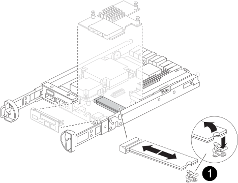

= 使用手動開機恢復流程更換 FAS2820 系統中的開機媒體
:allow-uri-read: 
:icons: font
:imagesdir: ../media/

[role="lead"]
FAS2820 系統中的開機媒體儲存著重要的韌體和組態資料。若要更換開機媒體，請移除並開啟受損的控制器模組、找到並更換開機媒體、將開機映像傳輸至 USB 磁碟機、將 USB 磁碟機插入控制器、然後啟動控制器。

如果您的儲存系統運作的是ONTAP 9.17.1 或更高版本，請使用link:bootmedia-replace-workflow-bmr.html["自動啟動恢復程序"]。如果您的系統運行的是早期版本的ONTAP，則必須使用手動啟動復原程序。

[[step-1-remove-the-controller-module]]
== 步驟1：移除控制器模組

.步驟
若要存取控制器內部的元件、您必須先從系統中移除控制器模組、然後移除控制器模組上的護蓋。

. 如果您尚未接地、請正確接地。
. 解開將纜線綁定至纜線管理裝置的掛勾和迴圈帶、然後從控制器模組拔下系統纜線和SFP（如有需要）、並追蹤纜線的連接位置。
. 壓下CAM把手上的栓鎖直到釋放為止、完全打開CAM把把、以從中間板釋放控制器模組、然後用兩隻手將控制器模組從機箱中拉出。
+
image::../media/drw_2850_pcm_remove_install_IEOPS-694.svg[移除控制器]

. 翻轉控制器模組、將其放置在平穩的表面上。
. 按下控制器模組兩側的藍色按鈕以鬆開護蓋、然後向上或向外旋轉控制器模組護蓋、以打開護蓋。
+
image::../media/drw_2850_open_controller_module_cover_IEOPS-695.svg[開啟控制器]

[cols="1,2"]
|===

 a| 
image::../media/icon_round_1.png[編號 1]
 a| 
控制器模組護蓋釋放按鈕

|===

[[step-2-replace-the-boot-media]]
== 步驟2：更換開機媒體

尋找位於控制器模組夾層卡下方的開機媒體，並依照指示進行更換。

[cols="1,2"]
|===

 a| 
image::../media/icon_round_1.png[編號 1]
 a| 
開機媒體鎖定標籤

|===
.步驟
. 如果您尚未接地、請正確接地。
. 使用下圖或控制器模組上的 FRU 對應圖移除夾層卡：
+
.. 將 IO 板從控制器模組中直接滑出、以將其卸下。
.. 鬆開夾層卡上的指旋螺絲。
+

NOTE: 您可以用手指或螺絲起子鬆開指旋螺絲。如果您使用手指、您可能需要向上旋轉 NV 電池、以便在其旁邊的指旋螺絲上以更好的方式購買。

.. 垂直向上提起夾層卡。

. 更換開機媒體：
+
.. 按下開機媒體外殼上的藍色按鈕、從外殼中釋放開機媒體、向上旋轉開機媒體、然後輕輕將其從開機媒體插槽中直接拉出。
+

NOTE: 請勿直接扭轉或拉起開機媒體、否則可能會損壞插槽或開機媒體。

.. 將替換開機媒體的邊緣與開機媒體插槽對齊、然後將其輕推入插槽。
檢查開機媒體、確定它已完全插入插槽、必要時請取出開機媒體、並將其重新插入插槽。
.. 按下藍色鎖定按鈕、將開機媒體完全向下旋轉、然後放開鎖定按鈕、將開機媒體鎖定到位。

. 重新安裝夾層卡：
+
.. 將主機板上的插槽與夾層卡上的插槽對齊、然後將插卡輕輕插入插槽。
.. 鎖緊夾層卡上的三個指旋螺絲。
.. 重新安裝 IO 板。

. 重新安裝控制器模組護蓋、並將其鎖定到位。

[[step-3-transfer-the-boot-image-to-the-boot-media]]
== 步驟3：將開機映像傳輸到開機媒體

使用安裝映像的 USB 快閃磁碟機、在替換開機媒體上安裝系統映像。在此過程中、您必須還原 var 檔案系統。

.開始之前
* 您必須擁有格式化為 MBL/FAT32 的 USB 快閃磁碟機、且容量至少為 4GB 。
* 您必須有網路連線。

.步驟
. 將適當的 ONTAP 映像版本下載到格式化的 USB 快閃磁碟機：
+
.. 使用 https://kb.netapp.com/on-prem/ontap/DM/Encryption/Encryption-KBs/How_to_determine_if_the_running_ONTAP_version_supports_Data_At_Rest_Encryption["如何確定您的 ONTAP 版本是否支援 NetApp Volume Encryption （NVE）"^]來確定目前是否支援 Volume 加密。
+
*** 如果叢集支援 NVE 、請下載具有 NetApp Volume Encryption 的映像。
*** 如果叢集不支援 NVE 、請下載不含 NetApp Volume Encryption 的映像。
請參閱 https://kb.netapp.com/onprem/ontap/os/Which_ONTAP_image_should_I_download%3F_With_or_without_Volume_Encryption%3F["我應該下載哪個 ONTAP 映像？是否使用 Volume Encryption ？"^] 以取得更多詳細資料。

. 從筆記型電腦中取出USB隨身碟。
. 安裝控制器模組：
+
.. 將控制器模組的一端與機箱的開口對齊、然後將控制器模組輕推至系統的一半。
.. 可重新安裝控制器模組。
+
重新啟用時、請記得重新安裝移除的媒體轉換器（SFP）。

. 將USB隨身碟插入控制器模組的USB插槽。
+
請確定您將USB隨身碟安裝在標示為USB裝置的插槽中、而非USB主控台連接埠中。

. 將控制器模組一路推入系統、確定CAM握把與USB快閃磁碟機分開、穩固推入CAM握把以完成控制器模組的安裝、將CAM握把推至關閉位置、然後鎖緊指旋螺絲。
+
控制器完全安裝到機箱後立即開始啟動，並在 LOADER 提示字元處停止。

.接下來呢？
更換開機媒體之後link:bootmedia-recovery-image-boot.html["啟動恢復映像"]，您需要。
