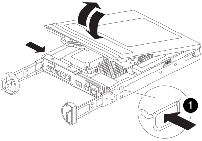

= 更換快取模組： FAS2820
:allow-uri-read: 
:icons: font
:imagesdir: ../media/

[role="lead"]
當系統登錄單AutoSupport 一的故障資訊（ASUP）訊息、指出模組已離線時、您必須更換控制器模組中的快取模組、否則會導致效能降低。

* 您必須使用從供應商處收到的替換FRU元件來更換故障元件。

== 步驟1：關閉受損的控制器

若要關閉受損的控制器、您必須判斷控制器的狀態、並在必要時接管控制器、以便健全的控制器繼續從受損的控制器儲存設備提供資料。

.關於這項工作
如果叢集有兩個以上的節點、則叢集必須處於仲裁狀態。如果叢集未達到法定人數、或健全的控制器顯示為「假」、表示符合資格與健全狀況、則您必須先修正問題、再關閉受損的控制器。

http://docs.netapp.com/ontap-9/topic/com.netapp.doc.dot-cm-sag/home.html["《系統管理參考資料》（英文） ONTAP"^]

您可能需要先清除快取模組的內容、然後再進行更換。

.步驟
. 雖然快取模組上的資料已加密、但您可能想要清除受損快取模組中的任何資料、並確認快取模組沒有資料：
+
.. 清除快取模組上的資料： `system controller flash-cache secure-erase run -node _node name_ localhost -device-id _device_number_`
+

NOTE: 執行 `system controller flash-cache show`如果您不知道 Flash Cache 裝置 ID ，請命令。

.. 確認資料已從快取模組中清除： `system controller flash-cache secure-erase show`
+
輸出應顯示快取模組狀態為「已清除」。

. 如果啟用了此功能、請叫用下列訊息來抑制自動建立案例：「System Node現象叫用節點*-type all -Message MAn=number_of_hs_Downh」AutoSupport AutoSupport AutoSupport
+
下列AutoSupport 資訊不顯示自動建立案例兩小時的訊息：「cluster1：*>系統節點AutoSupport 、叫用節點*-輸入ALL -Message MAn=2h」

. 如果受損的控制器是HA配對的一部分、請從健全控制器的主控台停用自動恢復功能：「torage容錯移轉修改節點本機-自動恢復錯誤」
. 將受損的控制器移至載入器提示：
+
[cols="1,2"]
|===
| 如果受損的控制器正在顯示... | 然後... 

 a| 
載入程式提示
 a| 
前往下一步。

 a| 
正在等待恢復...
 a| 
按Ctrl-C、然後在出現提示時回應「y」。

 a| 
系統提示或密碼提示（輸入系統密碼）
 a| 
接管或停止受損的控制器：

** 對於HA配對、請從健全的控制器接管受損的控制器：「儲存容錯移轉接管-節點_受損節點_節點名稱_」
+
當受損的控制器顯示正在等待恢復...時、請按Ctrl-C、然後回應「y」。

** 對於獨立式系統：「System Node halt _disbized_node_name_」

|===

== 步驟2：移除控制器模組

從系統中卸下控制器模組、然後卸下控制器模組上的護蓋。

.步驟
. 如果您尚未接地、請正確接地。
. 解開將纜線綁定至纜線管理裝置的掛勾和迴圈帶、然後從控制器模組拔下系統纜線和SFP（如有需要）、並追蹤纜線的連接位置。
+
將纜線留在纜線管理裝置中、以便在重新安裝纜線管理裝置時、整理好纜線。

. 從控制器模組的左側和右側移除纜線管理裝置、並將其放在一邊。
. 壓下CAM把手上的栓鎖直到釋放為止、完全打開CAM把把、以從中間板釋放控制器模組、然後用兩隻手將控制器模組從機箱中拉出。
+
image::../media/drw_2240_x_opening_cam_latch.svg[DRW 2240 x開啟CAM栓鎖]

. 翻轉控制器模組、將其放置在平穩的表面上。
. 按下控制器模組兩側的藍色按鈕以鬆開護蓋、然後向上或向外旋轉控制器模組護蓋、以打開護蓋。
+

[cols="1,3"]
|===

 a| 
image::../media/icon_round_1.png[編號 1]
 a| 
控制器模組護蓋釋放按鈕

|===

== 步驟3：更換快取模組

找到控制器內的快取模組、移除故障的快取模組、然後將其更換。

.動畫-取代快取模組
video::12b339c5-640a-4be8-a5fc-af47017276fd[panopto]
您的儲存系統必須符合特定條件、視您的情況而定：

* 它必須具備適用於您所安裝之快取模組的作業系統。
* 它必須支援快取容量。
* 儲存系統中的所有其他元件都必須正常運作；否則、您必須聯絡技術支援部門。

.步驟
. 如果您尚未接地、請正確接地。
. 找到控制器模組後方附近的故障快取模組、然後將其移除。
+
.. 按下藍色釋放按鈕、然後向上旋轉快取模組。
.. 將快取模組從外殼中直接拉出。
+
image::../media/drw_2850_replace_caching module_IEOPS-697.svg[DRW 2850 取代快取模組 IEOPS 697]

+
[cols="1,3"]
|===

 a| 
image::../media/icon_round_1.png[編號 1]
 a| 
快取模組釋放按鈕

|===

. 將替換快取模組的邊緣對齊外殼內的插槽、然後將其輕輕推入插槽。
. 驗證快取模組是否已完全正確插入插槽。
+
如有必要、請移除快取模組並將其重新插回插槽。

. 按下藍色鎖定按鈕、將快取模組完全向下旋轉、然後放開鎖定按鈕、將快取模組鎖定到位。
. 重新安裝控制器模組護蓋、並將其鎖定到位。

== 步驟4：重新安裝控制器模組

將控制器模組重新安裝到機箱中。

.步驟
. 如果您尚未接地、請正確接地。
. 如果您尚未更換控制器模組的護蓋、請將其裝回。
. 將控制器模組翻轉過來、並將端點對齊機箱的開口。
. 將控制器模組輕輕推入系統的一半。
+

NOTE: 在指示之前、請勿將控制器模組完全插入機箱。

. 視需要重新安裝系統。
+
如果您移除媒體轉換器（QSFP或SFP）、請記得在使用光纖纜線時重新安裝。

. 完成控制器模組的重新安裝：
+
.. 將CAM握把置於開啟位置時、將控制器模組穩固推入、直到它與中間背板接觸並完全就位、然後將CAM握把關閉至鎖定位置。
+

NOTE: 將控制器模組滑入機箱時、請勿過度施力、以免損壞連接器。

+
一旦控制器完全安裝在機箱中、就會開始開機。

.. 如果您尚未重新安裝纜線管理裝置、請重新安裝。
.. 使用掛勾和迴圈固定帶將纜線綁定至纜線管理裝置。

== 步驟 5 ：還原自動恢復和 AutoSupport

如果已停用、請還原自動恢復和 AutoSupport 。

. 使用還原自動恢復 `storage failover modify -node local -auto-giveback true` 命令。
. 如果觸發 AutoSupport 維護時段、請使用結束 `system node autosupport invoke -node * -type all -message MAINT=END`

== 步驟6：將故障零件歸還給NetApp

如套件隨附的RMA指示所述、將故障零件退回NetApp。如 https://mysupport.netapp.com/site/info/rma["零件退貨與更換"]需詳細資訊、請參閱頁面。
