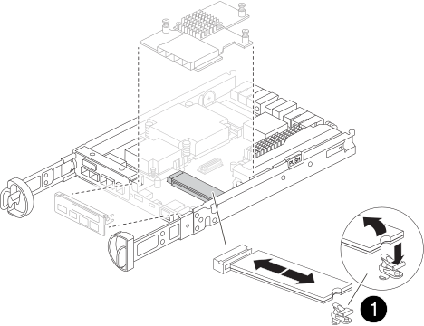
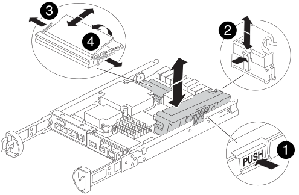

= 更換控制器模組硬體 - FAS2800
:allow-uri-read: 
:icons: font
:imagesdir: ../media/

[role="lead"]
更換受損的控制器模組硬體：移除受損的控制器、將 FRU 元件移至更換的控制器模組、在機箱中安裝更換的控制器模組、然後啟動更換的控制器模組。

.動畫-更換控制器模組
video::c83a3301-3161-4d65-86e8-af540147576a[panopto]

== 步驟1：移除控制器模組

從機箱中卸下受損的控制器模組。

. 如果您尚未接地、請正確接地。
. 解開將纜線綁定至纜線管理裝置的掛勾和迴圈帶、然後從控制器模組拔下系統纜線和SFP（如有需要）、並追蹤纜線的連接位置。
+
將纜線留在纜線管理裝置中、以便在重新安裝纜線管理裝置時、整理好纜線。

. 從控制器模組的左側和右側移除纜線管理裝置、並將其放在一邊。
. 如果您在拔下纜線後將 SFP 模組留在系統中、請將其移至更換的控制器模組。
. 壓下CAM把手上的栓鎖直到釋放為止、完全打開CAM把把、以從中間板釋放控制器模組、然後用兩隻手將控制器模組從機箱中拉出。
+
image::../media/drw_2240_x_opening_cam_latch.svg[DRW 2240 x開啟CAM栓鎖]

. 翻轉控制器模組、將其放置在平穩的表面上。
. 按下控制器模組兩側的藍色按鈕以鬆開護蓋、然後向上或向外旋轉控制器模組護蓋、以打開護蓋。
+
image::../media/drw_2850_open_controller_module_cover_IEOPS-695.svg[DRW 2850 開放式控制器模組涵蓋 IEOPS 695]

[cols="1,3"]
|===

 a| 
image::../media/icon_round_1.png[編號 1]
 a| 
控制器模組護蓋釋放按鈕

|===

== 步驟2：搬移NVMEM電池

從受損的控制器模組中取出 NVMEM 電池、然後將其安裝到更換的控制器模組中。

NOTE: 在指示之前、請勿插入 NVMEM 電池。

image::../media/drw_2850_replace_nvbattery_IEOPS-715.svg[DRW 2850 更換 nvbattery IEOPS 715]

[cols="1,3"]
|===

 a| 
image::../media/icon_round_1.png[編號 1]
 a| 
NVMEM 電池釋放按鈕

 a| 
image::../media/icon_round_2.png[圖示第 2 輪]
 a| 
NVMEM 電池插頭

|===
. 從控制器模組中取出電池：
+
.. 按下控制器模組側邊的藍色按鈕。
.. 向上滑動電池、直到其脫離固定支架、然後將電池從控制器模組中取出。
.. 擠壓電池插頭正面的固定夾、將插頭從插槽中拔下、然後從插槽拔下電池纜線。

. 將電池移至更換的控制器模組、然後安裝：
+
.. 將電池與金屬板側壁上的固定支架對齊。
.. 向下滑動電池組、直到電池卡榫卡入、然後卡入側牆的開口。
+

NOTE: 請勿插入電池。  將其餘元件移至替換控制器模組後、您就可以插入。

== 步驟 3 ：卸下夾層卡

從受損的控制器模組中取出 IO 板和 PCIe 夾層卡。

image::../media/drw_2850_replace_HIC_IEOPS-700.svg[DRW 2850 取代 HIC IEOPS 700]

[cols="1,3"]
|===

 a| 
image::../media/icon_round_1.png[編號 1]
 a| 
IO 板

 a| 
image::../media/icon_round_2.png[圖示第 2 輪]
 a| 
PCIe 夾層卡

|===
. 將 IO 板從控制器模組中直接滑出、以將其卸下。
. 鬆開夾層卡上的指旋螺絲。
+

NOTE: 您可以用手指或螺絲起子鬆開指旋螺絲。

. 垂直提起夾層卡、將其放在防靜電表面上。

== 步驟4：移動開機媒體

從受損的控制器模組中取出開機媒體、並將其安裝在替換的控制器模組中。

. 移除夾層卡後、請使用下圖或控制器模組上的 FRU 對應圖、找出開機媒體：
+

+
[cols="1,3"]
|===

 a| 
image::../media/icon_round_1.png[編號 1]
 a| 
開機媒體釋放按鈕

|===
. 移除開機媒體：
+
.. 按下開機媒體外殼上的藍色按鈕、將開機媒體從外殼中釋放。
.. 向上旋轉開機媒體、然後將其從開機媒體插槽中輕輕直接拉出。
+

NOTE: 請勿直接扭轉或拉起開機媒體、否則可能會損壞插槽或開機媒體。

. 將開機媒體安裝到更換的控制器模組：
+
.. 將替換開機媒體的邊緣與開機媒體插槽對齊、然後將其輕推入插槽。
.. 檢查開機媒體、確定其完全正確地插入插槽中。
+
如有必要、請取出開機媒體並將其重新插入插槽。

.. 按下開機媒體外殼上的藍色鎖定按鈕、將開機媒體完全向下旋轉、然後放開鎖定按鈕、將開機媒體鎖定到位。

== 步驟 5 ：在更換的控制器中安裝夾層卡

在更換的控制器模組中安裝夾層卡。

. 重新安裝夾層卡：
+
.. 將夾層卡與主機板上的插槽對齊。
.. 輕輕向下推卡、將卡插入插槽中。
.. 鎖緊夾層卡上的三個指旋螺絲。

. 重新安裝 IO 板。

== 步驟6：移動DIMM

從受損的控制器模組中取出 DIMM 、然後將其安裝到更換的控制器模組中。

[cols="1,3"]
|===

 a| 
image::../media/icon_round_1.png[編號 1]
 a| 
DIMM 鎖定閂鎖

 a| 
image::../media/icon_round_2.png[圖示第 2 輪]
 a| 
DIMM

|===
. 找到控制器模組上的 DIMM
+

NOTE: 請注意 DIMM 在插槽中的位置、以便您可以在更換控制器模組的相同位置、並以正確的方向插入 DIMM 。

. 從受損的控制器模組中取出 DIMM ：
+
.. 慢慢地將 DIMM 兩側的兩個 DIMM 彈出彈片往外推、將 DIMM 從插槽中退出。
+
DIMM 會稍微向上旋轉。

.. 儘量旋轉 DIMM 、然後將 DIMM 滑出插槽。
+

NOTE: 小心拿住DIMM的邊緣、避免對DIMM電路板上的元件施加壓力。

. 驗證是否未將 NVMEM 電池插入更換控制器模組。
. 將 DIMM 安裝在替換控制器中、其位置與受損控制器相同：
+
.. 在DIMM頂端邊緣小心地推入、但穩固地推入、直到彈出彈出彈片卡入DIMM兩端的槽口。
+
DIMM可緊密插入插槽、但應該很容易就能裝入。如果沒有、請重新將DIMM與插槽對齊、然後重新插入。

+

NOTE: 目視檢查DIMM、確認其對齊並完全插入插槽。

. 對其他 DIMM 重複這些步驟。

== 步驟 7 ：移動快取模組

從受損的控制器模組中移除快取模組、將其安裝到更換的控制器模組中。

image::../media/drw_2850_replace_caching module_IEOPS-697.svg[DRW 2850 取代快取模組 IEOPS 697]

[cols="1,3"]
|===

 a| 
image::../media/icon_round_1.png[編號 1]
 a| 
快取模組鎖定按鈕

|===
. 找到控制器模組後方附近的快取模組、然後將其移除：
+
.. 按下藍色鎖定按鈕、然後向上旋轉快取模組。
.. 將快取模組從外殼中直接拉出。

. 在替換控制器模組中安裝快取模組：
+
.. 將快取模組的邊緣與外殼的插槽對齊、然後將其輕推入插槽。
.. 驗證快取模組是否已完全正確插入插槽。
+
如有必要、請移除快取模組並將其重新插回插槽。

.. 按下藍色鎖定按鈕、將快取模組完全向下旋轉、然後放開鎖定按鈕、將快取模組鎖定到位。

. 插入 NVMEM 電池。
+
請確定插頭已鎖入主機板上的電池電源插槽。

+

NOTE: 如果很難插入電池、請從控制器模組中取出電池、插入電池、然後將電池重新裝入控制器模組。

. 重新安裝控制器模組護蓋。

== 步驟 8 ：安裝 NV 電池

將 NV 電池安裝到更換的控制器模組中。

. 將電池插頭插回控制器模組上的插槽。
+
請確定插頭已鎖入主機板上的電池插槽。

. 將電池與金屬板側壁上的固定支架對齊。
. 向下滑動電池組、直到電池卡榫卡入、然後卡入側牆的開口。
. 重新安裝控制器模組護蓋、並將其鎖定到位。

== 步驟 9 ：安裝控制器

將更換的控制器模組安裝到系統機箱中、然後啟動 ONTAP 。

NOTE: 系統可能會在開機時更新系統韌體。請勿中止此程序。此程序要求您中斷開機程序、這通常可在系統提示之後隨時進行。不過、如果系統在開機時更新系統韌體、則必須等到更新完成後、才能中斷開機程序。

. 如果您尚未接地、請正確接地。
. 如果您尚未更換控制器模組的護蓋、請將其裝回。
. 轉動控制器模組。
. 將控制器模組的一端與機箱的開口對齊、然後將控制器模組輕推至系統的一半。
+

NOTE: 在指示之前、請勿將控制器模組完全插入機箱。

. 完成控制器模組的重新安裝：
+
.. 將CAM握把置於開啟位置時、將控制器模組穩固推入、直到它與中間背板接觸並完全就位、然後將CAM握把關閉至鎖定位置。
+

NOTE: 將控制器模組滑入機箱時、請勿過度施力、以免損壞連接器。

+
控制器一旦安裝在機箱中、就會開始開機。

.. 如果您尚未重新安裝纜線管理裝置、請重新安裝。
.. 使用掛勾和迴圈固定帶將纜線綁定至纜線管理裝置。
+

NOTE: 您必須尋找「自動韌體更新主控台」訊息。如果出現更新訊息、請勿按 `Ctrl-C` 中斷開機程序、直到您看到確認更新完成的訊息為止。如果韌體更新中止、開機程序會結束至載入程式提示字元。您必須執行 `update_flash` 命令、然後輸入 `bye -g` 重新啟動系統。

*重要事項：*在開機過程中、您可能會看到下列提示：

* 系統ID不相符的提示警告、並要求覆寫系統ID。回應 `y` 進入此提示。
* 提示警告：在HA組態中進入維護模式時、您必須確保健全的控制器保持停機狀態。回應 `y` 進入此提示。

