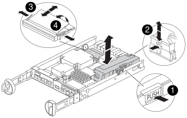

= 更換 FAS2820 系統中的 DIMM 以修復記憶體容量錯誤
:allow-uri-read: 
:icons: font
:imagesdir: ../media/

[role="lead"]
當 FAS2820 系統控制器出現諸如基於 Health Monitor 警示的過多 CECC（可修正錯誤修正碼）錯誤或不可修正的 ECC 錯誤等錯誤時，您必須更換控制器中的 DIMM。這些錯誤通常是由單一 DIMM 故障引起的，導致儲存系統無法開機 ONTAP。

如果系統中的任何其他組件無法正常運作，請聯絡技術支援。

您必須使用從供應商處收到的替換FRU元件來更換故障元件。

.動畫-更換DIMM
video::6c035199-9b79-494b-9c65-af9a015ffaf0[panopto]

[[step-1-shut-down-the-impaired-controller]]
== 步驟1：關閉受損的控制器

接管並停止故障控制器，以便正常控制器繼續從故障控制器的儲存提供資料。為此，您需要在 AutoSupport 中停用自動建立案例功能、停用自動復原功能，並將故障控制器置於 LOADER 提示字元。LOADER 提示字元是安全的停止狀態，您可以從中更換 FRU。

如果叢集有兩個以上的節點、則叢集必須處於仲裁狀態。如果叢集未達到法定人數、或健全的控制器顯示為「假」、表示符合資格和健全狀況、則您必須在關閉受損的控制器之前修正問題；請參閱 link:https://docs.netapp.com/us-en/ontap/system-admin/synchronize-node-cluster-task.html?q=Quorum["將節點與叢集同步"^]。

.步驟
. 如果啟用了「支援」功能、請叫用下列消息來禁止自動建立個案AutoSupport AutoSupport ：
+
`system node autosupport invoke -node * -type all -message MAINT=<number of hours down>h`

+
這樣可以防止在您規劃的維護視窗期間自動建立支援案例。最長抑制時間為 72 小時。如果您的維護提前完成，您可以透過呼叫包含 `MAINT=END`的 AutoSupport 訊息來重新啟用案例建立功能。如需詳細資訊，請參閱 https://kb.netapp.com/Support_Bulletins/Customer_Bulletins/SU92["如何在排程維護期間抑制自動建立案例"^]。

+
下列AutoSupport 資訊不顯示自動建立案例兩小時：

+
`cluster1:*> system node autosupport invoke -node * -type all -message MAINT=2h`

. 如果受損的控制器是HA配對的一部分、請從健全控制器的主控台停用自動恢復功能：「torage容錯移轉修改節點本機-自動恢復錯誤」
. 將受損的控制器移至載入器提示：
+
[cols="1,2"]
|===
| 如果受損的控制器正在顯示... | 然後... 

 a| 
載入程式提示
 a| 
移至「移除控制器模組」。

 a| 
正在等待恢復...
 a| 
按Ctrl-C、然後回應「y」。

 a| 
系統提示或密碼提示（輸入系統密碼）
 a| 
從正常控制器接管或停止受損的控制器：「torage容錯移轉接管-節點_受損節點_節點名稱_」

當受損的控制器顯示正在等待恢復...時、請按Ctrl-C、然後回應「y」。

|===

[[step-2-remove-controller-module]]
== 步驟2：移除控制器模組

從系統中卸下控制器模組、然後卸下控制器模組護蓋。

.步驟
. 如果您尚未接地、請正確接地。
. 解開將纜線綁定至纜線管理裝置的掛勾和迴圈帶、然後從控制器模組拔下系統纜線和SFP（如有需要）、並追蹤纜線的連接位置。
+
將纜線留在纜線管理裝置中、以便在重新安裝纜線管理裝置時、整理好纜線。

. 從控制器模組的左側和右側移除纜線管理裝置、並將其放在一邊。
. 壓下CAM把手上的栓鎖直到釋放為止、完全打開CAM把把、以從中間板釋放控制器模組、然後用兩隻手將控制器模組從機箱中拉出。
+
image::../media/drw_2850_pcm_remove_install_IEOPS-694.svg[移除控制器]

. 翻轉控制器模組、將其放置在平穩的表面上。
. 按下控制器模組兩側的藍色按鈕以鬆開護蓋、然後向上或向外旋轉控制器模組護蓋、以打開護蓋。
+
image::../media/drw_2850_open_controller_module_cover_IEOPS-695.svg[開啟控制器]

[cols="1,3"]
|===

 a| 
image::../media/icon_round_1.png[編號 1]
 a| 
控制器模組護蓋釋放按鈕

|===

[[step-3-replace-the-dimms]]
== 步驟3：更換DIMM

找到控制器內的 DIMM 、將其卸下並裝回。

NOTE: 在更換 DIMM 之前、您需要從控制器模組拔下 NVMEM 電池。

.步驟
. 如果您尚未接地、請正確接地。
+
在更換系統元件之前、您必須執行乾淨的系統關機、以避免在非揮發性記憶體（NVMEM）中遺失未寫入的資料。LED位於控制器模組背面。尋找下列圖示：

+

. 如果NVMEM LED未更新、則在NVMEM中沒有任何內容；您可以跳過下列步驟、繼續執行本程序中的下一個工作。
. 如果NVMEM LED正在閃燈、則表示NVMEM中有資料、您必須中斷電池連線以清除記憶體：
+
.. 按下控制器模組側邊的藍色按鈕、將電池從控制器模組中取出。
.. 向上滑動電池、直到其脫離固定支架、然後將電池從控制器模組中取出。
.. 找到電池纜線、按下電池插頭上的固定夾、將鎖定夾從插頭插槽中鬆開、然後從插槽拔下電池纜線。
.. 確認NVMEM LED不再亮起。
.. 重新連接電池連接器、然後重新檢查控制器背面的 LED 。
.. 拔下電池纜線。

. 找到控制器模組上的DIMM。
. 請注意 DIMM 在插槽中的方向和位置、以便以正確的方向插入替換 DIMM 。
. 緩慢地將DIMM兩側的兩個DIMM彈出彈片分開、然後將DIMM從插槽中滑出、藉此將DIMM從插槽中退出。
+
DIMM 向上旋轉了一點。

. 儘量旋轉 DIMM 、然後將 DIMM 滑出插槽。
+

NOTE: 小心拿住DIMM的邊緣、避免對DIMM電路板上的元件施加壓力。

+

+
[cols="1,3"]
|===

 a| 
image::../media/icon_round_1.png[編號 1]
 a| 
NVRAM 電池釋放鈕

 a| 
image::../media/icon_round_2.png[編號 2]
 a| 
NVRAM電池插塞

 a| 
image::../media/icon_round_3.png[編號 3]
 a| 
DIMM推出式彈片

 a| 
image::../media/icon_round_4.png[編號 4.]
 a| 
DIMM

|===
. 從防靜電包裝袋中取出備用DIMM、拿住DIMM的邊角、然後將其對準插槽。
+
DIMM插針之間的槽口應與插槽中的卡舌對齊。

. 將DIMM正面插入插槽。
+
DIMM 與插槽配合緊密，但應該可以輕鬆插入。如果插入困難，請重新對準 DIMM 與插槽的位置，然後重新插入。

+

NOTE: 目視檢查DIMM、確認其對齊並完全插入插槽。

. 在DIMM頂端邊緣小心地推入、但穩固地推入、直到彈出彈出彈片卡入DIMM兩端的槽口。
. 重新連接 NVRAM 電池：
+
.. 插入 NVRAM 電池。
+
請確定插頭已鎖入主機板上的電池電源插槽。

.. 將電池與金屬板側壁上的固定支架對齊。
.. 向下滑動電池組、直到電池卡榫卡入、然後卡入側牆的開口。

. 重新安裝控制器模組護蓋。

[[step-4-reinstall-the-controller-module]]
== 步驟4：重新安裝控制器模組

將控制器模組重新安裝到機箱中。

.步驟
. 如果您尚未接地、請正確接地。
. 如果您尚未更換控制器模組的護蓋、請將其裝回。
. 將控制器模組翻轉過來、並將端點對齊機箱的開口。
. 將控制器模組輕輕推入系統的一半。
+

NOTE: 在指示之前、請勿將控制器模組完全插入機箱。

. 視需要重新安裝系統。
+
如果您移除媒體轉換器（QSFP或SFP）、請記得在使用光纖纜線時重新安裝。

. 完成控制器模組的重新安裝：
+
.. 將CAM握把置於開啟位置時、將控制器模組穩固推入、直到它與中間背板接觸並完全就位、然後將CAM握把關閉至鎖定位置。
+

NOTE: 將控制器模組滑入機箱時、請勿過度施力、以免損壞連接器。

+
控制器一旦安裝在機箱中、就會開始開機。

.. 如果您尚未重新安裝纜線管理裝置、請重新安裝。
.. 使用掛勾和迴圈固定帶將纜線綁定至纜線管理裝置。

. 重新啟動控制器模組。
+

NOTE: 在開機程序期間、您可能會看到下列提示：

+
** 系統ID不相符的提示警告、並要求覆寫系統ID。
** 提示警告：在HA組態中進入維護模式時、您必須確保健全的控制器保持停機狀態。您可以安全地回應這些提示。

[[step-5-restore-automatic-giveback-and-autosupport]]
== 步驟 5 ：還原自動恢復和 AutoSupport

如果已停用、請還原自動恢復和 AutoSupport 。

. 使用還原自動恢復 `storage failover modify -node local -auto-giveback true` 命令。
. 如果觸發 AutoSupport 維護時段、請使用結束 `system node autosupport invoke -node * -type all -message MAINT=END` 命令。

[[step-6-return-the-failed-part-to-netapp]]
== 步驟6：將故障零件歸還給NetApp

如套件隨附的RMA指示所述、將故障零件退回NetApp。如 https://mysupport.netapp.com/site/info/rma["零件退貨與更換"]需詳細資訊、請參閱頁面。
