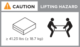
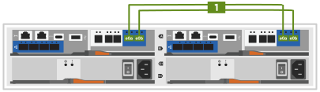
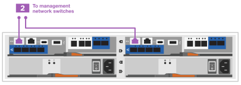
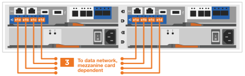
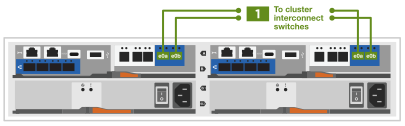
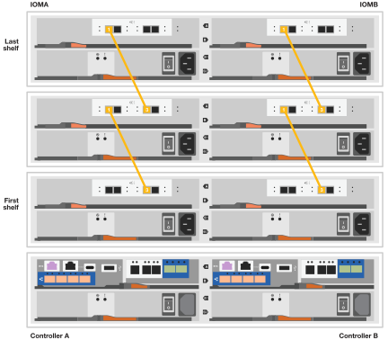
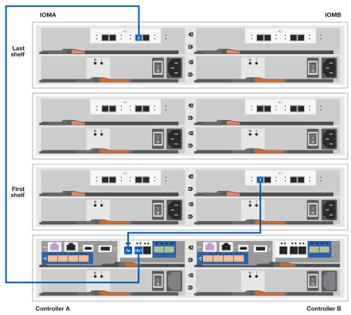
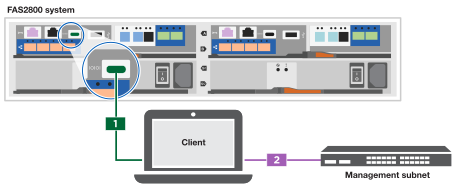

= 詳細步驟： FAS2800
:allow-uri-read: 
:icons: font
:imagesdir: ../media/

[role="lead"]
本程序提供安裝一般 NetApp 儲存系統的詳細逐步指示。如果您需要更詳細的安裝指示、請使用此程序。

== 步驟1：準備安裝

.開始之前
您必須在網站上提供下列資訊：

* 儲存系統的機架空間位於電信機架或系統機櫃中。
+
** 2U 適用於儲存系統
** 2U 或 4U 適用於系統中的每個磁碟機櫃

* 2號十字螺絲起子
* 額外的網路纜線、可將儲存系統連接至網路交換器、筆記型電腦或主控台、並使用網頁瀏覽器
* 具備RJ-45連線並可存取網頁瀏覽器的筆記型電腦或主控台
+
** 存取 https://hwu.netapp.com["NetApp Hardware Universe"] 以取得站台需求的相關資訊、以及設定儲存系統的其他資訊。
** 您可能也想要存取 http://mysupport.netapp.com/documentation/productlibrary/index.html?productID=62286["ONTAP 9 版本的版本資訊"] 如需此儲存系統的詳細資訊、請參閱您的 ONTAP 版本。

.步驟
. 打開所有包裝箱並清點內容物。
+

IMPORTANT: 有特定電力需求的客戶必須檢查 https://hwu.netapp.com["NetApp Hardware Universe"] 以瞭解其組態選項。

. 存取 https://docs.netapp.com/us-en/ontap/task_configure_ontap.html#assign-a-node-management-ip-address["使用系統管理員在新叢集上設定 ONTAP"^]
+
.. 檢閱要求和程序步驟。
.. 完成以收集儲存系統的相關資訊 https://docs.netapp.com/us-en/ontap/task_configure_ontap.html["設定工作表 ^ （需要工作表的 URL ）"]。
.. 記錄控制器的儲存系統序號。
+
image::../media/drw_ssn_label.svg[DRw SSN標籤]

下表列出您可能會收到的纜線類型。如果您收到的纜線未列於表中、請參閱 https://hwu.netapp.com["NetApp Hardware Universe"] 找出纜線並識別其用途。

[cols="1,2,1,2"]
|===
| 纜線類型... | 產品編號與長度 | 連接器類型 | 適用於... 

 a| 
10 GbE 、 SFP28 纜線（依訂單而定）
 a| 
X6566B-05-R6 、 0.5 、

X6566B-2-R6 、 2m
 a| 

 a| 
網路纜線

 a| 
25Gb 乙太網路、 SFP28
 a| 
X66240A-05 、 0.5 公尺

X66240-2 、 2m

X66240A-5 、 5 公尺
 a| 

 a| 
網路纜線

 a| 
32GB 光纖通道、
SFP+ （目標 / 啟動器）
 a| 
X66250-2 、 2m

X66250-5 、 5 分鐘

X66250-15 、 15 分鐘
 a| 

 a| 
FC 網路

 a| 
第6類、RJ-45（訂單相依）
 a| 
X6561-R6

X6562-R6
 a| 

 a| 
管理網路與乙太網路資料

 a| 
儲存設備
 a| 
X66030 、 0.5 公尺

X66031A 、 1m

X66032A 、 2 公尺
 a| 
image::../media/oie_cable_mini_sas_hd_to_mini_sas_hd.svg[OIE纜線迷你SAS HD到迷你SAS HD]
 a| 
儲存設備

 a| 
USB-C 主控台纜線
 a| 
無產品編號標籤
 a| 

 a| 
非Windows或Mac筆記型電腦/主控台軟體安裝期間的主控台連線

 a| 
電源線
 a| 
無產品編號標籤
 a| 

 a| 
開啟儲存系統電源

 a| 
選用 FC 纜線
 a| 
選用 FC 纜線
 a| 

 a| 
額外的 FC 網路纜線

|===

== 步驟2：安裝硬體

視情況、將儲存系統安裝在電信機架或 NetApp 儲存系統機櫃中。

.步驟
. 視需要安裝軌道套件。
. 請依照軌道套件隨附的說明安裝及保護您的儲存系統。
+

NOTE: 您必須注意與儲存系統重量相關的安全考量。

+

. 連接纜線管理裝置（如圖所示）。
+
image::../media/drw_cable_management_arm_install.svg[DRw纜線管理ARM 功能安裝]

. 將擋板放在儲存系統的正面。

== 步驟3：將控制器連接至網路

將控制器以雙節點無交換器叢集或交換式叢集的形式連接至網路。

下表列出兩個節點無交換器叢集和交換式叢集的纜線類型、以及撥出電話號碼和纜線顏色。

[cols="20%,80%"]
|===
| 纜線 | 連線類型 

 a| 

 a| 
叢集互連

 a| 

 a| 
管理網路交換器

 a| 

 a| 
主機網路交換器

|===
.開始之前
* 如需將儲存系統連接至交換器的相關資訊、請聯絡您的網路管理員。
* 請查看圖例箭頭、瞭解正確的纜線連接器推拉式彈片方向。
+
** 插入連接器時、您應該會覺得它卡入定位；如果您不覺得卡住、請將其取下、將纜線頭翻轉過來、然後再試一次。
** 如果連接至光纖交換器、請先將SFP插入控制器連接埠、再將纜線連接至連接埠。

image::../media/oie_cable_pull_tab_down.svg[OIE纜線下拉式彈片]

[role="tabbed-block"]
====
.選項1：連接雙節點無交換式叢集
--
為無交換器的雙節點叢集連接網路連線和叢集互連連接埠佈線。

.關於這項工作
使用動畫或逐步說明完成控制器與交換器之間的纜線。

.動畫 - 無交換器的雙節點叢集佈線
video::90577508-fa79-46cf-b18a-afe8016325af[panopto]
.步驟
. 使用叢集互連纜線將叢集互連連接埠 e0a 連接至 e0a 、並將 e0b 連接至 e0b ：
+

+
* 叢集互連纜線 *

+

. 使用RJ45纜線將e0M連接埠連接至管理網路交換器：
+

+
* RJ45 纜線 *

+

. 將夾層卡連接埠連接至主機網路。
+

+
.. 如果您有 4 埠乙太網路資料網路、請將連接埠 e1a 至 e1d 連接至乙太網路資料網路。
+
*** 4 埠、 10/25Gb 乙太網路、 SFP28
+

+

*** 4 埠、 10GBASE-T 、 RJ45
+

.. 如果您有 4 埠光纖通道資料網路、請將連接埠 1a 至 1D 的纜線連接至 FC 網路。
+
*** 4 埠、 32GB 光纖通道、 SFP+ （僅限目標）
+

*** 4 埠、 32GB 光纖通道、 SFP+ （啟動器 / 目標）
+

.. 如果您有 2+2 卡（ 2 個連接埠與乙太網路連線、 2 個連接埠與光纖通道連線）、請將連接埠 e1a 與 e1b 的纜線連接至 FC 資料網路、並將連接埠 e1c 和 e1d 連接至乙太網路資料網路。
+
*** 2 埠、 10/25Gb 乙太網路（ SFP28 ） + 2 埠 32GB FC （ SFP+ ）
+

+

IMPORTANT: 請勿插入電源線。

--
.選項2：連接交換式叢集
--
為交換式叢集連接網路連線和叢集互連連接埠。

.關於這項工作
使用動畫或逐步說明完成控制器與交換器之間的纜線。

.動畫-交換式叢集纜線
video::6553a3db-57dd-4247-b34a-afe8016315d4[panopto]
.步驟
. 使用叢集互連纜線將叢集互連連接埠 e0a 連接至 e0a 、並將 e0b 連接至 e0b ：
+

+

. 使用RJ45纜線將e0M連接埠連接至管理網路交換器：
+

+

. 將夾層卡連接埠連接至主機網路。
+

+
.. 如果您有 4 埠乙太網路資料網路、請將連接埠 e1a 至 e1d 連接至乙太網路資料網路。
+
*** 4 埠、 10/25Gb 乙太網路、 SFP28
+

+

*** 4 埠、 10GBASE-T 、 RJ45
+

.. 如果您有 4 埠光纖通道資料網路、請將連接埠 1a 至 1D 的纜線連接至 FC 網路。
+
*** 4 埠、 32GB 光纖通道、 SFP+ （僅限目標）
+

*** 4 埠、 32GB 光纖通道、 SFP+ （啟動器 / 目標）
+

.. 如果您有 2+2 卡（ 2 個連接埠與乙太網路連線、 2 個連接埠與光纖通道連線）、請將連接埠 e1a 與 e1b 的纜線連接至 FC 資料網路、並將連接埠 e1c 和 e1d 連接至乙太網路資料網路。
+
*** 2 埠、 10/25Gb 乙太網路（ SFP28 ） + 2 埠 32GB FC （ SFP+ ）
+

+

IMPORTANT: 請勿插入電源線。

--
====

== 步驟4：連接磁碟機櫃的纜線控制器

將控制器連接至外部儲存設備。

下表列出磁碟機櫃與儲存系統之間的纜線類型、以及圖示中的撥出電話號碼和纜線顏色。

NOTE: 範例使用DS224C。佈線與其他支援的磁碟機櫃類似。請參閱 https://docs.netapp.com/us-en/ontap-systems/sas3/install-new-system.html["安裝及纜線架以安裝新系統-機櫃配備IOM12/IOM12B模組"^] 以取得更多資訊。

[cols="20%,80%"]
|===
| 纜線 | 連線類型 

 a| 
image::../media/oie_legend_icon_1_lo.svg[OIE 圖例圖示 1 lo]
 a| 
機櫃到機櫃的纜線

 a| 
image::../media/oie_legend_icon_2_mb.svg[OIE 圖例圖示 2 MB]
 a| 
控制器 A 至磁碟機櫃

 a| 
image::../media/oie_legend_icon_3_t.svg[OIE 圖例圖示 3 t]
 a| 
控制器 B 至磁碟機櫃

|===
請務必檢查圖示箭頭、以瞭解纜線連接器的拉式彈片方向是否正確。

image::../media/oie_cable_pull_tab_down.svg[OIE纜線下拉式彈片]

.關於這項工作
請使用動畫或逐步說明、完成控制器與磁碟機櫃之間的纜線連接。

IMPORTANT: 請勿在 FAS2800 上使用連接埠 0b2 。此 SAS 連接埠不供 ONTAP 使用、且永遠停用。請參閱 https://docs.netapp.com/us-en/ontap-systems/sas3/install-new-system.html["在新的儲存系統中安裝機櫃"^] 以取得更多資訊。

.動畫 - 磁碟機櫃纜線
video::b2a7549d-8141-47dc-9e20-afe8016f4386[panopto]
.步驟
. 將機櫃對機櫃連接埠連接至纜線。
+
.. IOM A 上的連接埠 1 至 IOM A 的連接埠 3 、位於機架正下方。
.. IOM B 上的連接埠 1 至 IOM B 的連接埠 3 、位於機架正下方。
+
image::../media/oie_cable_mini_sas_hd_to_mini_sas_hd.svg[OIE纜線迷你SAS HD到迷你SAS HD]

+
* Mini-SAS HD 至 Mini-SAS HD 纜線 *

+

. 將控制器 A 纜線連接至磁碟機櫃。
+
.. 控制器 A 連接埠 0A 至堆疊中第一個磁碟機櫃上的 IOM B 連接埠 1 。
.. 控制器 A 連接埠 0b1 至 IOM A 連接埠 3 、位於堆疊中最後一個磁碟機櫃上。
+
image::../media/oie_cable_mini_sas_hd_to_mini_sas_hd.svg[OIE纜線迷你SAS HD到迷你SAS HD]

+
* Mini-SAS HD 至 Mini-SAS HD 纜線 *

+

. 將控制器 B 連接至磁碟機櫃。
+
.. 控制器 B 連接埠 0A 至堆疊中第一個磁碟機櫃上的 IOM A 連接埠 1 。
.. 控制器 B 連接埠 0b1 至堆疊中最後一個磁碟機櫃上的 IOM B 連接埠 3 。
+
image::../media/oie_cable_mini_sas_hd_to_mini_sas_hd.svg[OIE纜線迷你SAS HD到迷你SAS HD]

+
* Mini-SAS HD 至 Mini-SAS HD 纜線 *

+
image::../media/dwr-2800_controller2-to shelves_IEOPS-897.svg[DWR 2800 控制器 2 至機櫃 IEOPS 897]

== 步驟 5 ：完整的儲存系統設定與組態

使用選項 1 ：（如果已啟用網路探索）或選項 2 ：（如果未啟用網路探索）來完成儲存系統的設定和組態。

[role="tabbed-block"]
====
.選項1：如果已啟用網路探索
--
如果您的筆記型電腦已啟用網路探索、請使用自動叢集探索來完成儲存系統設定和組態。

.步驟
. 請使用下列動畫來開啟機櫃電源並設定機櫃 ID 。
+
.動畫-設定磁碟機櫃ID
video::c600f366-4d30-481a-89d9-ab1b0066589b[panopto]
. 開啟控制器電源
+
.. 將電源線插入控制器電源供應器、然後將電源線連接至不同電路上的電源。
.. 開啟兩個節點的電源開關。
+

NOTE: 初始開機最多可能需要八分鐘。

+
image::../media/dwr_2800_turn_on_power_IEOPS-898.svg[DWR 2800 開啟電源 IEOPS 898]

. 請確定您的筆記型電腦已啟用網路探索功能。
+
如需詳細資訊、請參閱筆記型電腦的線上說明。

. 將筆記型電腦連接到管理交換器。
. 請使用圖示或步驟來探索儲存系統節點以進行設定：
+
image::../media/drw_autodiscovery_controler_select.svg[選擇「自動探索控制器」]

+
.. 開啟檔案總管。
.. 按一下左窗格中的網路。
.. 按一下滑鼠右鍵、然後選取重新整理。
.. 按兩下ONTAP 任一個「資訊」圖示、並接受畫面上顯示的任何憑證。
+

NOTE: xxxxx 是目標節點的儲存系統序號。

+
系統管理程式隨即開啟。

. 使用 System Manager 引導式設定、使用您在中收集的資料來設定儲存系統 <<步驟1：準備安裝>>。
. 建立帳戶或登入您的帳戶。
+
.. 按一下 https://mysupport.netapp.com["mysupport.netapp.com"]
.. 如果您需要建立帳戶或登入帳戶、請按一下 _ 建立帳戶 _ 。

. 下載並安裝 https://mysupport.netapp.com/site/tools["Active IQ Config Advisor"]
+
.. 執行 Active IQ Config Advisor 以驗證儲存系統的健全狀況。

. 請至登錄您的系統 https://mysupport.netapp.com/site/systems/register[]。
. 完成初始組態之後、請前往 https://www.netapp.com/support-and-training/documentation/["NetApp ONTAP 資源"] 頁面、以取得有關設定ONTAP 其他功能的資訊。

--
.選項2：如果未啟用網路探索
--
如果您的筆記型電腦未啟用網路探索、請手動完成組態和設定。

.步驟
. 連接纜線並設定筆記型電腦或主控台：
+
.. 使用N-8-1將筆記型電腦或主控台的主控台連接埠設為115200鮑。
+

NOTE: 請參閱筆記型電腦或主控台的線上說明、瞭解如何設定主控台連接埠。

.. 將主控台纜線連接至筆記型電腦或主控台、然後使用儲存系統隨附的主控台纜線連接控制器上的主控台連接埠、然後 c 將筆記型電腦或主控台連接至管理子網路上的交換器。
+

.. 使用管理子網路上的TCP/IP位址指派給筆記型電腦或主控台。

. 請使用下列動畫來設定一或多個磁碟機櫃ID：
+
.動畫-設定磁碟機櫃ID
video::c600f366-4d30-481a-89d9-ab1b0066589b[panopto]
. 將電源線插入控制器電源供應器、然後將電源線連接至不同電路上的電源。
. 開啟兩個節點的電源開關。
+
image::../media/dwr_2800_turn_on_power_IEOPS-898.svg[DWR 2800 開啟電源 IEOPS 898]

+

NOTE: 初始開機最多可能需要八分鐘。

. 將初始節點管理IP位址指派給其中一個節點。
+
[cols="20%,80%"]
|===
| 如果管理網路有DHCP ... | 然後... 

 a| 
已設定
 a| 
記錄指派給新控制器的IP位址。

 a| 
未設定
 a| 
.. 使用Putty、終端機伺服器或您環境的等效產品來開啟主控台工作階段。
+

NOTE: 如果您不知道如何設定Putty、請查看筆記型電腦或主控台的線上說明。

.. 在指令碼提示時輸入管理IP位址。

|===
. 使用筆記型電腦或主控台上的System Manager來設定叢集：
+
.. 將瀏覽器指向節點管理IP位址。
+

NOTE: 地址格式為+https://x.x.x.x.+

.. 使用您在中收集的資料來設定儲存系統 <<步驟1：準備安裝>>...

. 建立帳戶或登入您的帳戶。
+
.. 按一下 https://mysupport.netapp.com["mysupport.netapp.com"]
.. 如果您需要建立帳戶或登入帳戶、請按一下 _ 建立帳戶 _ 。

. 下載並安裝 https://mysupport.netapp.com/site/tools["Active IQ Config Advisor"]
+
.. 執行 Active IQ Config Advisor 以驗證儲存系統的健全狀況。

. 請至登錄您的系統 https://mysupport.netapp.com/site/systems/register[]。
. 完成初始組態之後、請前往 https://www.netapp.com/support-and-training/documentation/["NetApp ONTAP 資源"] 頁面、以取得有關設定ONTAP 其他功能的資訊。

--
====