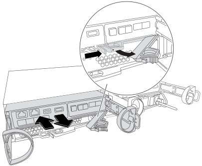
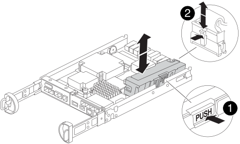

= 更換 NVMEM 電池 - FAS2820
:allow-uri-read: 
:icons: font
:imagesdir: ../media/

[role="lead"]
若要更換系統中的NVMEM電池、您必須將控制器模組從系統中取出、開啟、更換電池、然後關閉並更換控制器模組。

系統中的所有其他元件都必須正常運作；否則、您必須聯絡 https://mysupport.netapp.com/site/global/dashboard["NetApp支援"]。

== 步驟1：關閉受損的控制器

若要關閉受損的控制器、您必須判斷控制器的狀態、並在必要時接管控制器、以便健全的控制器繼續從受損的控制器儲存設備提供資料。

如果叢集有兩個以上的節點、則叢集必須處於仲裁狀態。如果叢集未達到法定人數、或健全的控制器顯示為「假」、表示符合資格和健全狀況、則您必須在關閉受損的控制器之前修正問題；請參閱 link:https://docs.netapp.com/us-en/ontap/system-admin/synchronize-node-cluster-task.html?q=Quorum["將節點與叢集同步"^]。

.步驟
. 如果啟用了此功能、請叫用下列訊息來抑制自動建立案例：「System Node現象叫用節點*-type all -Message MAn=_number_of_hs_dable_h」AutoSupport AutoSupport AutoSupport
+
下列AutoSupport 資訊不顯示自動建立案例兩小時的訊息：「cluster1：*>系統節點AutoSupport 、叫用節點*-輸入ALL -Message MAn=2h」

. 如果受損的控制器是HA配對的一部分、請從健全控制器的主控台停用自動恢復功能：「torage容錯移轉修改節點本機-自動恢復錯誤」
. 將受損的控制器移至載入器提示：
+
[cols="1,2"]
|===
| 如果受損的控制器正在顯示... | 然後... 

 a| 
載入程式提示
 a| 
移至「移除控制器模組」。

 a| 
正在等待恢復...
 a| 
按Ctrl-C、然後回應「y」。

 a| 
系統提示或密碼提示（輸入系統密碼）
 a| 
從正常控制器接管或停止受損的控制器：「torage容錯移轉接管-節點_受損節點_節點名稱_」

當受損的控制器顯示正在等待恢復...時、請按Ctrl-C、然後回應「y」。

|===

== 步驟 2 ：移除並開啟控制器模組

卸下並打開控制器模組。

.步驟
. 如果您尚未接地、請正確接地。
. 解開將纜線綁定至纜線管理裝置的掛勾和迴圈帶、然後從控制器模組拔下系統纜線和SFP（如有需要）、並追蹤纜線的連接位置。
+
將纜線留在纜線管理裝置中、以便在重新安裝纜線管理裝置時、整理好纜線。

. 從控制器模組的左側和右側移除纜線管理裝置、並將其放在一邊。
. 擠壓 CAM 把手上的閂鎖、直到其鬆開、完全打開 CAM 把手、從中間背板上鬆開控制器模組、然後用雙手將控制器模組從機箱中拉出一半。
+

. 檢查控制器模組背面的 NVMEM LED 。  尋找 NV 圖示：
+

+

NOTE: 如果系統處於「等待恢復」狀態、或系統未正確接管或停止（未認可的資料）、則當從控制器拔下電源時、面板上的綠色 NV LED 會開始閃爍。  如果合作夥伴控制器模組未成功接管受損的控制器模組、請聯絡 https://mysupport.netapp.com/site/global/dashboard["NetApp支援"]

+
** 如果從機箱中卸下控制器模組時綠色的 NV 狀態 LED 開始閃爍：
+
*** 確認控制器已由合作夥伴控制器模組進行乾淨接管、或是故障控制器顯示正在等待恢復、閃爍的 LED 可忽略、您可以從機箱中完全移除受損的控制器。

** 如果綠色的 NV LED 燈熄滅、您可以從機箱中完全移除受損的控制器。

== 步驟3：更換NVMEM電池

從系統中取出故障的 NVMEM 電池、並更換為新的 NVMEM 電池。

.步驟
. 如果您尚未接地、請正確接地。
. 從機箱中卸下控制模組。
. 翻轉控制器模組、將其放置在平穩的表面上。
. 按下控制器模組兩側的藍色按鈕以鬆開護蓋、然後向上或向外旋轉控制器模組護蓋、以打開護蓋。
+
image::../media/drw_2850_open_controller_module_cover_IEOPS-695.svg[DRW 2850 開放式控制器模組涵蓋 IEOPS 695]

. 在控制器模組中找到NVMEM電池。
+
.動畫 - 更換 NV 電池
video::592217fb-4868-4294-a559-af4701725598[panopto]
+

+
[cols="1,3"]
|===

 a| 
image::../media/icon_round_1.png[編號 1]
 a| 
電池釋放彈片

 a| 
image::../media/icon_round_2.png[圖示第 2 輪]
 a| 
電池電源接頭

|===
. 從控制器模組中取出故障電池：
+
.. 按下控制器模組側邊的藍色按鈕。
.. 向上滑動電池、直到其脫離固定支架、然後將電池從控制器模組中取出。
.. 從控制器模組拔下電池

. 從包裝中取出替換電池。
安裝替換電池：
+
.. 將電池插頭插回控制器模組上的插槽。
+
請確定插頭已鎖入主機板上的電池插槽。

.. 將電池與金屬板側壁上的固定支架對齊。
.. 向下滑動電池組、直到電池卡榫卡入、然後卡入側牆的開口。

. 重新安裝控制器模組護蓋、並將其鎖定到位。

== 步驟4：重新安裝控制器模組

更換控制器模組中的元件之後、請將其重新安裝到機箱中。

.步驟
. 如果您尚未接地、請正確接地。
. 如果您尚未更換控制器模組的護蓋、請將其裝回。
. 將控制器模組翻轉過來、並將端點對齊機箱的開口。
. 將控制器模組的一端與機箱的開口對齊、然後將控制器模組輕推至系統的一半。
+

NOTE: 在指示之前、請勿將控制器模組完全插入機箱。

. 視需要重新安裝系統。
+
如果您移除媒體轉換器（QSFP或SFP）、請記得在使用光纖纜線時重新安裝。

. 完成控制器模組的重新安裝：
+
.. 將CAM握把置於開啟位置時、將控制器模組穩固推入、直到它與中間背板接觸並完全就位、然後將CAM握把關閉至鎖定位置。
+

NOTE: 將控制器模組滑入機箱時、請勿過度施力、以免損壞連接器。

+
控制器一旦安裝在機箱中、就會開始開機。

.. 如果您尚未重新安裝纜線管理裝置、請重新安裝。
.. 使用掛勾和迴圈固定帶將纜線綁定至纜線管理裝置。

. 重新啟動控制器模組。
+

NOTE: 在開機程序期間、您可能會看到下列提示：

+
** 系統ID不相符的提示警告、並要求覆寫系統ID。
** 提示警告：在HA組態中進入維護模式時、您必須確保健全的控制器保持停機狀態。您可以安全地回應這些提示。

== 步驟 5 ：還原自動恢復和自動支援

如果已停用、請還原自動恢復和 AutoSupport 。

. 使用還原自動恢復 `storage failover modify -node local -auto-giveback true` 命令。
. 如果觸發 AutoSupport 維護時段、請使用結束 `system node autosupport invoke -node * -type all -message MAINT=END` 命令。

== 步驟6：將故障零件歸還給NetApp

如套件隨附的RMA指示所述、將故障零件退回NetApp。如 https://mysupport.netapp.com/site/info/rma["零件退貨與更換"]需詳細資訊、請參閱頁面。
