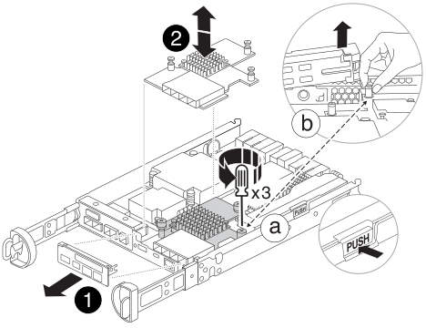

= 更換夾層卡 - FAS2820
:allow-uri-read: 
:icons: font
:imagesdir: ../media/

[role="lead"]
將纜線、任何 SFP 和 QSFP 模組從插卡上拔下、裝回故障的夾層卡、然後重新讀取插卡、以更換夾層卡。

* 您可以將此程序用於ONTAP 系統支援的所有版本的功能
* 系統中的所有其他元件都必須正常運作；否則、您必須聯絡技術支援部門。

.動畫 - 更換夾層卡
video::a8ec891d-f6f6-4479-9ca2-af47017254ff[panopto]

== 步驟1：關閉受損的控制器

若要關閉受損的控制器、您必須判斷控制器的狀態、並在必要時接管控制器、以便健全的控制器繼續從受損的控制器儲存設備提供資料。

如果叢集有兩個以上的節點、則叢集必須處於仲裁狀態。如果叢集未達到法定人數、或健全的控制器顯示為「假」、表示符合資格和健全狀況、則您必須在關閉受損的控制器之前修正問題；請參閱 link:https://docs.netapp.com/us-en/ontap/system-admin/synchronize-node-cluster-task.html?q=Quorum["將節點與叢集同步"^]。

.步驟
. 如果啟用了此功能、請叫用下列訊息來抑制自動建立案例：「System Node現象叫用節點*-type all -Message MAn=_number_of_hs_dable_h」AutoSupport AutoSupport AutoSupport
+
下列AutoSupport 資訊不顯示自動建立案例兩小時的訊息：「cluster1：*>系統節點AutoSupport 、叫用節點*-輸入ALL -Message MAn=2h」

. 如果受損的控制器是HA配對的一部分、請從健全控制器的主控台停用自動恢復功能：「torage容錯移轉修改節點本機-自動恢復錯誤」
. 將受損的控制器移至載入器提示：
+
[cols="1,2"]
|===
| 如果受損的控制器正在顯示... | 然後... 

 a| 
載入程式提示
 a| 
移至「移除控制器模組」。

 a| 
正在等待恢復...
 a| 
按Ctrl-C、然後回應「y」。

 a| 
系統提示或密碼提示（輸入系統密碼）
 a| 
從正常控制器接管或停止受損的控制器：「torage容錯移轉接管-節點_受損節點_節點名稱_」

當受損的控制器顯示正在等待恢復...時、請按Ctrl-C、然後回應「y」。

|===

== 步驟2：移除控制器模組

從系統中卸下控制器模組、然後卸下控制器模組上的護蓋。

.步驟
. 如果您尚未接地、請正確接地。
. 解開將纜線綁定至纜線管理裝置的掛勾和迴圈帶、然後從控制器模組拔下系統纜線和SFP（如有需要）、並追蹤纜線的連接位置。
+
將纜線留在纜線管理裝置中、以便在重新安裝纜線管理裝置時、整理好纜線。

. 從控制器模組的左側和右側移除纜線管理裝置、並將其放在一邊。
. 壓下CAM把手上的栓鎖直到釋放為止、完全打開CAM把把、以從中間板釋放控制器模組、然後用兩隻手將控制器模組從機箱中拉出。
+
image::../media/drw_2850_pcm_remove_install_IEOPS-694.svg[DRW 2850 PCM 移除安裝 IEOPS 694]

. 翻轉控制器模組、將其放置在平穩的表面上。
. 按下控制器模組兩側的藍色按鈕以鬆開護蓋、然後向上或向外旋轉控制器模組護蓋、以打開護蓋。
+
image::../media/drw_2850_open_controller_module_cover_IEOPS-695.svg[DRW 2850 開放式控制器模組涵蓋 IEOPS 695]

[cols="1,3"]
|===

 a| 
image::../media/icon_round_1.png[編號 1]
 a| 
控制器模組護蓋釋放按鈕

|===

== 步驟 3 ：更換夾層卡

更換夾層卡。

. 如果您尚未接地、請正確接地。
. 使用下圖或控制器模組上的 FRU 對應圖移除夾層卡：
+

+
[cols="1,3"]
|===

 a| 
image::../media/icon_round_1.png[編號 1]
 a| 
IO 板

 a| 
image::../media/icon_round_2.png[圖示第 2 輪]
 a| 
PCIe 夾層卡

|===
+
.. 將 IO 板從控制器模組中直接滑出、以將其卸下。
.. 鬆開夾層卡上的指旋螺絲、然後垂直提起夾層卡。
+

NOTE: 您可以用手指或螺絲起子鬆開指旋螺絲。如果您使用手指、您可能需要向上旋轉 NV 電池、以便在其旁邊的指旋螺絲上以更好的方式購買。

. 重新安裝夾層卡：
+
.. 將替換夾層卡插頭上的插槽與主機板上的插槽對齊、然後將插卡輕輕平齊插入插槽。
.. 鎖緊夾層卡上的三個指旋螺絲。
.. 重新安裝 IO 板。

. 重新安裝控制器模組護蓋、並將其鎖定到位。

== 步驟4：安裝控制器模組

重新安裝控制器模組。

.步驟
. 如果您尚未接地、請正確接地。
. 如果您尚未更換控制器模組的護蓋、請將其裝回。
. 將控制器模組翻轉過來、並將端點對齊機箱的開口。
. 將控制器模組輕輕推入系統的一半。將控制器模組的末端與機箱中的開口對齊、然後將控制器模組輕輕推入系統的一半。
+

NOTE: 在指示之前、請勿將控制器模組完全插入機箱。

. 視需要重新安裝系統。
+
如果您移除媒體轉換器（QSFP或SFP）、請記得在使用光纖纜線時重新安裝。

. 完成控制器模組的重新安裝：
+
.. 將CAM握把置於開啟位置時、將控制器模組穩固推入、直到它與中間背板接觸並完全就位、然後將CAM握把關閉至鎖定位置。
+

NOTE: 將控制器模組滑入機箱時、請勿過度施力、以免損壞連接器。

+
控制器一旦安裝在機箱中、就會開始開機。

.. 如果您尚未重新安裝纜線管理裝置、請重新安裝。
.. 使用掛勾和迴圈固定帶將纜線綁定至纜線管理裝置。

. 將控制器恢復正常運作、方法是歸還儲存設備：「torage容錯移轉恢復-ofnode_disapped_node_name_」
. 使用還原自動恢復 `storage failover modify -node local -auto-giveback true` 命令。
. 如果觸發 AutoSupport 維護時段、請使用結束 `system node autosupport invoke -node * -type all -message MAINT=END` 命令。

== 步驟5：將故障零件歸還給NetApp

如套件隨附的RMA指示所述、將故障零件退回NetApp。如 https://mysupport.netapp.com/site/info/rma["零件退貨與更換"]需詳細資訊、請參閱頁面。
