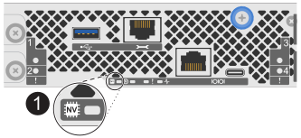

= 移除控制器 - FAS50
:allow-uri-read: 
:icons: font
:imagesdir: ../media/

[role="lead"]
更換控制器或更換控制器內部的元件時，您必須從機箱中移除控制器。

.開始之前
請確定儲存系統中的所有其他元件都正常運作；否則，您必須先聯絡 https://mysupport.netapp.com/site/global/dashboard["NetApp支援"]，才能繼續執行此程序。

.步驟
. 在受損的控制器上，請確定 NV LED 已關閉。
+
當 NV LED 熄滅時，即表示已完成減損，可安全移除受損的控制器。

+

NOTE: 如果 NV LED 閃爍（綠色），則表示正在減少目標。您必須等待 NV LED 關閉。不過，如果持續閃爍超過五分鐘，請先聯絡 https://mysupport.netapp.com/site/global/dashboard["NetApp支援"]，再繼續執行此程序。

+
NV LED 位於控制器上的 NV 圖示旁。

+

[cols="1,4"]
|===

 a| 
image::../media/icon_round_1.png[編號 1]
 a| 
控制器上的 NV 圖示和 LED

|===
. 如果您尚未接地、請正確接地。
. 斷開受損控制器的電源：
+

NOTE: 電源供應器（ PSU ）沒有電源開關。

+
[cols="1,2"]
|===
| 如果您要中斷連線 .. | 然後... 

 a| 
AC PSU
 a| 
.. 打開電源線固定器。
.. 從 PSU 拔下電源線，並將其放在一邊。

 a| 
DC PSU
 a| 
.. 旋下 D-sub DC 電源線接頭上的兩個拇指螺絲。
.. 從 PSU 拔下電源線，並將其放在一邊。

|===
. 從受損的控制器拔下所有纜線。
+
追蹤纜線的連接位置。

. 移除受損的控制器：
+
下圖顯示移除控制器時控制器控點的操作（從控制器左側）：

+
image::../media/drw_g_and_t_handles_remove_ieops-1837.svg[控制器處理操作以移除控制器]

+
[cols="1,4"]
|===

 a| 
image::../media/icon_round_1.png[編號 1]
 a| 
在控制器的兩端，將垂直鎖定彈片向外推，以鬆開把手。

 a| 
image::../media/icon_round_2.png[編號 2]
 a| 
** 朝自己的方向拉動把手，將控制器從中板上取下。
+
拉動時，把手會從控制器伸出，然後感覺到阻力，請繼續拉動。

** 將控制器滑出機箱，同時支撐控制器的底部，並將其放置在平坦穩定的表面上。

 a| 
image::../media/icon_round_3.png[編號 3]
 a| 
如有需要，請將把手垂直轉動（在彈片旁），將其移出。

|===

