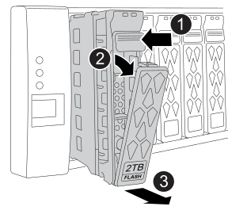

= 熱交換快取模組： FAS50
:allow-uri-read: 
:icons: font
:imagesdir: ../media/

[role="lead"]
您可以從相同或不同支援的廠商熱交換相同容量的 NVMe SSD 快取模組（ Flash Cache 模組）。

.開始之前
您的儲存系統必須符合特定條件、視您的情況而定：

* 您的儲存系統必須具備適當的作業系統，才能用於您要安裝的快取模組。
* 更換快取模組的容量必須與故障快取模組相同、但可以來自不同的支援廠商。
* 儲存系統中的所有其他元件都必須正常運作；否則，請先聯絡 https://mysupport.netapp.com/site/global/dashboard["NetApp支援"]再繼續。

.步驟
. 請妥善接地。
. 在快取模組正面，以亮起的琥珀色警示 LED 燈找出故障快取模組。
+
快取模組可以位於磁碟機支架 0 或 23 中。

. 移除快取模組：
+

+
[cols="20%,80%"]
|===

 a| 
image::../media/icon_round_1.png[編號 1]
 a| 
按下模組面上的釋放按鈕以開啟 CAM 把手。

 a| 
image::../media/icon_round_2.png[編號 2]
 a| 
向下轉動 CAM 把手，將模組從中間背板上鬆脫。

 a| 
image::../media/icon_round_3.png[編號 3]
 a| 
使用 CAM 把手將模組滑出磁碟機支架，並用另一隻手支撐模組。

移除模組時，請務必用雙手支撐模組的重量。

|===
. 插入替代快取模組之前，請至少等待 70 秒。
. 安裝替換快取模組：
+
.. 在凸輪把手處於開啟位置時，請用雙手插入模組。
.. 輕輕推動，直到模組停止。
.. 關閉 CAM 把手，使模組完全插入中間背板，把手卡入定位。
+
請務必緩慢關閉凸輪把手，使其與模組正面正確對齊。

. 確認模組的活動（綠色） LED 亮起。
. 如套件隨附的RMA指示所述、將故障零件退回NetApp。如 https://mysupport.netapp.com/site/info/rma["零件退貨與更換"^]需詳細資訊、請參閱頁面。

