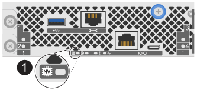
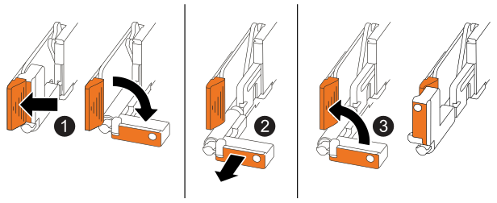
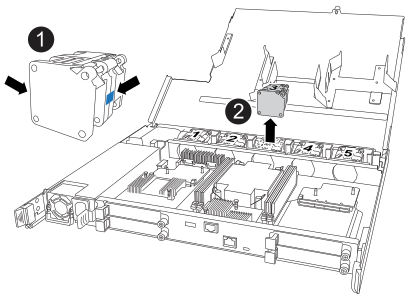
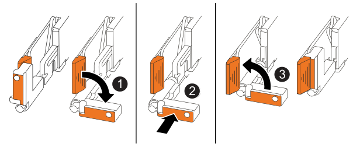

= 更換風扇模組： FAS50
:allow-uri-read: 
:icons: font
:imagesdir: ../media/

[role="lead"]
當風扇故障或無法有效運作時，請更換 FAS50 系統中的風扇模組，因為這可能會影響系統冷卻和整體效能。更換程序包括關閉控制器，移除控制器，更換風扇，重新安裝控制器，以及將故障零件退回 NetApp 。

.關於這項工作
如有需要，您可以開啟儲存系統位置（藍色） LED ，以協助實際定位受影響的儲存系統。使用 SSH 登入 BMC ，然後輸入 `system location-led _on_`命令。

儲存系統有三個位置 LED ：一個在操作員顯示面板上，一個在每個控制器上。位置LED會持續亮起30分鐘。

您可以輸入命令將其關閉 `system location-led _off_`。如果您不確定 LED 是否亮起或熄滅，可以輸入命令來檢查其狀態 `system location-led show`。

== 步驟1：關閉受損的控制器

使用下列其中一個選項來關閉或接管受損的控制器。

[role="tabbed-block"]
====
.選項1：大多數系統
--
若要關閉受損的控制器、您必須判斷控制器的狀態、並在必要時接管控制器、以便健全的控制器繼續從受損的控制器儲存設備提供資料。

.關於這項工作
* 如果您有 SAN 系統，則必須檢查故障控制器 SCSI 刀鋒的事件訊息  `cluster kernel-service show`。 `cluster kernel-service show`命令（從 priv 進階模式）會顯示節點名稱、link:https://docs.netapp.com/us-en/ontap/system-admin/display-nodes-cluster-task.html["仲裁狀態"]該節點的可用度狀態、以及該節點的作業狀態。
+
每個SCSI刀鋒處理序都應與叢集中的其他節點處於仲裁狀態。任何問題都必須先解決、才能繼續進行更換。

* 如果叢集有兩個以上的節點、則叢集必須處於仲裁狀態。如果叢集未達到法定人數、或健全的控制器顯示為「假」、表示符合資格和健全狀況、則您必須在關閉受損的控制器之前修正問題；請參閱 link:https://docs.netapp.com/us-en/ontap/system-admin/synchronize-node-cluster-task.html?q=Quorum["將節點與叢集同步"^]。

.步驟
. 如果啟用了「支援」功能、請叫用下列消息來禁止自動建立個案AutoSupport AutoSupport ：
+
`system node autosupport invoke -node * -type all -message MAINT=<# of hours>h`

+
下列AutoSupport 資訊不顯示自動建立案例兩小時：

+
`cluster1:> system node autosupport invoke -node * -type all -message MAINT=2h`

. 停用自動交還：
+
.. 從健康控制器的控制台輸入以下命令：
+
`storage failover modify -node _impaired_node_name_ -auto-giveback false`

.. 進入 `y`當您看到提示「您是否要停用自動回饋？」時

. 將受損的控制器移至載入器提示：
+
[cols="1,2"]
|===
| 如果受損的控制器正在顯示... | 然後... 

 a| 
載入程式提示
 a| 
前往下一步。

 a| 
正在等待恢復...
 a| 
按Ctrl-C、然後在出現提示時回應「y」。

 a| 
系統提示或密碼提示
 a| 
從健全的控制器接管或停止受損的控制器：

`storage failover takeover -ofnode _impaired_node_name_ -halt _true_`

--halt true_ 參數會帶您進入 Loader 提示字元。

|===

--
.選項2：控制器位於MetroCluster 一個不二之處
--
若要關閉受損的控制器、您必須判斷控制器的狀態、並在必要時接管控制器、以便健全的控制器繼續從受損的控制器儲存設備提供資料。

* 如果叢集有兩個以上的節點、則叢集必須處於仲裁狀態。如果叢集未達到法定人數、或健全的控制器顯示為「假」、表示符合資格和健全狀況、則您必須在關閉受損的控制器之前修正問題；請參閱 link:https://docs.netapp.com/us-en/ontap/system-admin/synchronize-node-cluster-task.html?q=Quorum["將節點與叢集同步"^]。
* 您必須確認已設定 MetroCluster 組態狀態，且節點處於啟用和正常狀態：
+
`metrocluster node show`

.步驟
. 如果啟用了「支援」功能、請叫用下列消息來禁止自動建立個案AutoSupport AutoSupport ：
+
`system node autosupport invoke -node * -type all -message MAINT=number_of_hours_downh`

+
下列AutoSupport 資訊不顯示自動建立案例兩小時：

+
`cluster1:*> system node autosupport invoke -node * -type all -message MAINT=2h`

. 停用自動交還：
+
.. 從健康控制器的控制台輸入以下命令：
+
`storage failover modify -node local -auto-giveback false`

.. 進入 `y`當您看到提示「您是否要停用自動回饋？」時

. 將受損的控制器移至載入器提示：
+
[cols="1,2"]
|===
| 如果受損的控制器正在顯示... | 然後... 

 a| 
載入程式提示
 a| 
前往下一節。

 a| 
正在等待恢復...
 a| 
按Ctrl-C、然後在出現提示時回應「y」。

 a| 
系統提示或密碼提示（輸入系統密碼）
 a| 
從健全的控制器接管或停止受損的控制器：

`storage failover takeover -ofnode _impaired_node_name_ -halt _true_`

--halt true_ 參數會帶您進入 Loader 提示字元。

|===

--
====

== 步驟2：移除控制器

更換控制器或更換控制器內部的元件時，您必須從機箱中移除控制器。

.開始之前
請確定儲存系統中的所有其他元件都正常運作；否則，您必須先聯絡 https://mysupport.netapp.com/site/global/dashboard["NetApp支援"]，才能繼續執行此程序。

.步驟
. 在受損的控制器上，請確定 NV LED 已關閉。
+
當 NV LED 熄滅時，即表示已完成減損，可安全移除受損的控制器。

+

NOTE: 如果 NV LED 閃爍（綠色），則表示正在減少目標。您必須等待 NV LED 關閉。不過，如果持續閃爍超過五分鐘，請先聯絡 https://mysupport.netapp.com/site/global/dashboard["NetApp支援"]，再繼續執行此程序。

+
NV LED 位於控制器上的 NV 圖示旁。

+

[cols="1,4"]
|===

 a| 
image::../media/icon_round_1.png[編號 1]
 a| 
控制器上的 NV 圖示和 LED

|===
. 如果您尚未接地、請正確接地。
. 斷開受損控制器的電源：
+

NOTE: 電源供應器（ PSU ）沒有電源開關。

+
[cols="1,2"]
|===
| 如果您要中斷連線 .. | 然後... 

 a| 
AC PSU
 a| 
.. 打開電源線固定器。
.. 從 PSU 拔下電源線，並將其放在一邊。

 a| 
DC PSU
 a| 
.. 旋下 D-sub DC 電源線接頭上的兩個拇指螺絲。
.. 從 PSU 拔下電源線，並將其放在一邊。

|===
. 從受損的控制器拔下所有纜線。
+
追蹤纜線的連接位置。

. 移除受損的控制器：
+
下圖顯示移除控制器時控制器控點的操作（從控制器左側）：

+

+
[cols="1,4"]
|===

 a| 
image::../media/icon_round_1.png[編號 1]
 a| 
在控制器的兩端，將垂直鎖定彈片向外推，以鬆開把手。

 a| 
image::../media/icon_round_2.png[編號 2]
 a| 
** 朝自己的方向拉動把手，將控制器從中板上取下。
+
拉動時，把手會從控制器伸出，然後感覺到阻力，請繼續拉動。

** 將控制器滑出機箱，同時支撐控制器的底部，並將其放置在平坦穩定的表面上。

 a| 
image::../media/icon_round_3.png[編號 3]
 a| 
如有需要，請將把手垂直轉動（在彈片旁），將其移出。

|===
. 逆時針轉動指旋螺絲以鬆開控制器護蓋，然後打開護蓋。

== 步驟 3 ：更換風扇

若要更換風扇，請移除故障風扇，並更換新風扇。

.步驟
. 查看主控台錯誤訊息，識別您必須更換的風扇。
. 移除故障風扇：
+

+
[cols="1,4"]
|===

 a| 
image::../media/icon_round_1.png[編號 1]
| 將風扇的兩側握在藍色觸控點上。 

 a| 
image::../media/icon_round_2.png[編號 2]
| 將風扇垂直向上拉出插槽。 
|===
. 將更換的風扇對準導軌，然後向下推，直到風扇接頭完全插入插槽。

== 步驟4：重新安裝控制器模組

將控制器重新安裝到機箱中，然後重新啟動。

.關於這項工作
下圖顯示重新安裝控制器時控制器控點（從控制器左側）的操作，並可作為控制器重新安裝步驟的其餘部分參考。

[cols="1,4"]
|===

 a| 
image::../media/icon_round_1.png[編號 1]
 a| 
如果您在維修控制器時將控制器把手直立（在彈片旁邊）移出，請將其向下旋轉至水平位置。

 a| 
image::../media/icon_round_2.png[編號 2]
 a| 
按下把手，將控制器重新插入機箱的一半，然後在指示下推動，直到控制器完全就位。

 a| 
image::../media/icon_round_3.png[編號 3]
 a| 
將把手旋轉至直立位置，並使用鎖定彈片鎖定定位。

|===
.步驟
. 合上控制器護蓋，然後順時針旋轉指旋螺絲，直到旋緊為止。
. 將控制器插入機箱的一半。
+
將控制器背面與機箱中的開口對齊，然後使用把手輕推控制器。

+

NOTE: 在接到指示之前，請勿將控制器完全插入機箱。

. 將主控台纜線連接到控制器的主控台連接埠和筆記型電腦，以便在控制器重新開機時，筆記型電腦接收主控台訊息。
+

NOTE: 此時請勿連接任何其他纜線或電源線。

. 將控制器完全插入機箱：
+
.. 用力推把手，直到控制器與中板接觸並完全就位為止。
+

NOTE: 將控制器滑入機箱時請勿過度施力，否則可能會損壞連接器。

.. 向上旋轉控制器把手，並使用彈片鎖定定位。
+

NOTE: 更換的控制器會從正常運作的控制器接收電力，並在完全插入機箱後立即開始開機。

. 視需要重新定位控制器。
. 將電源線重新連接至電源供應器（ PSU ）。
+
電源恢復至PSU後、狀態LED應為綠色。

+
[cols="1,2"]
|===
| 如果您正在重新連線 ... | 然後... 

 a| 
AC PSU
 a| 
.. 將電源線插入 PSU 。
.. 使用電源線固定器固定電源線。

 a| 
DC PSU
 a| 
.. 將 D-sub DC 電源線接頭插入 PSU 。
.. 鎖緊兩顆指旋螺絲，將 D-sub DC 電源線接頭固定至 PSU 。

|===
. 將受損的控制器歸還其儲存設備、使其恢復正常運作：
+
'容錯移轉還原-ofnode_disapped_node_name_'

. 從健全控制器的主控台還原自動恢復：
+
`storage failover modify -node local -auto-giveback true`

. 如果啟用了AutoSupport ，則復原（取消抑制）自動案例建立：
+
`system node autosupport invoke -node * -type all -message MAINT=END`

== 步驟5：將故障零件歸還給NetApp

如套件隨附的RMA指示所述、將故障零件退回NetApp。如 https://mysupport.netapp.com/site/info/rma["零件退貨與更換"]需詳細資訊、請參閱頁面。
