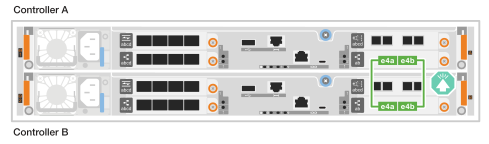
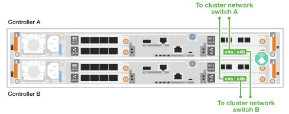
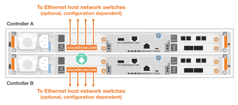
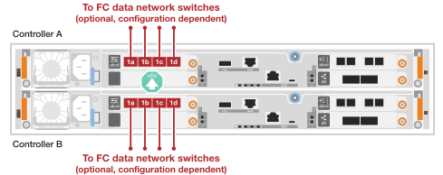
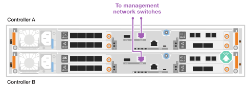
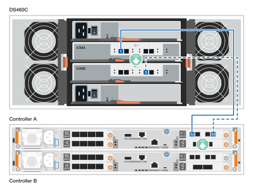
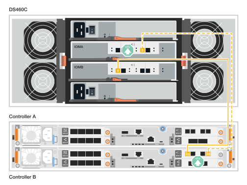
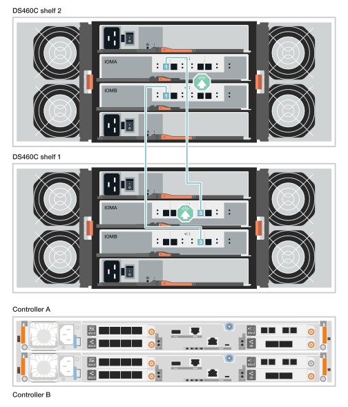
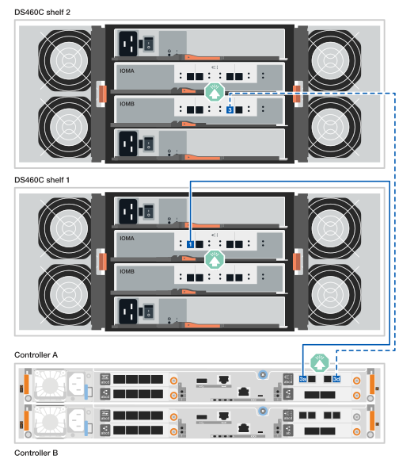
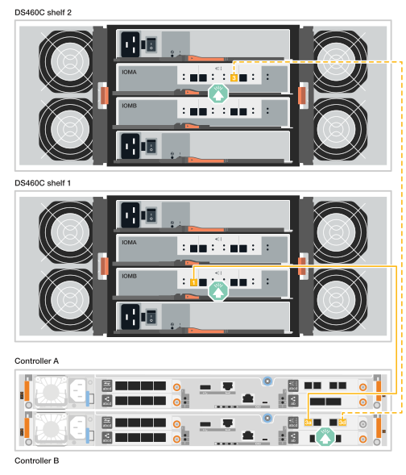

= 硬體佈線： FAS50
:allow-uri-read: 
:icons: font
:imagesdir: ../media/

[role="lead"]
安裝 FAS50 儲存系統硬體後，請將控制器連接至網路和機櫃。

.開始之前
如需將儲存系統連接至網路交換器的相關資訊，請聯絡您的網路管理員。

.關於這項工作
* 將連接器插入連接埠時，纜線連接器拉片上的箭頭圖示會顯示正確的方向（上或下）。
+
插入連接器時、您應該會感覺到它卡入到位；如果您沒有感覺到它卡入定位、請將其移除、將其翻轉、然後再試一次。

+
image:../media/drw_cable_pull_tab_direction_ieops-1699.svg["纜線拉片方向"]

* 如果要將纜線連接至光纖交換器，請先將光纖收發器插入控制器連接埠，再將纜線連接至交換器連接埠。

== 步驟 1 ：連接叢集 / HA 連線

建立 ONTAP 叢集連線。對於無交換器叢集，請將控制器彼此連接。對於交換式叢集，請將控制器連接至叢集網路交換器。

[NOTE]
====
叢集/HA 佈線範例展示了常見的配置。

如果您在此處看不到您的組態，請前往link:https://hwu.netapp.com["NetApp Hardware Universe"^]以取得完整的組態和插槽優先順序資訊，以連接儲存系統。

====
[role="tabbed-block"]
====
.無交換器叢集纜線
--
.FAS50 配備一個雙埠 40/100 GbE I/O 模組
[%collapsible]
=====
.步驟
. 連接叢集 / HA 互連連線：
+

NOTE: 叢集互連流量和 HA 流量共用相同的實體連接埠（位於插槽 4 的 I/O 模組上）。連接埠為 40/100 GbE 。

+
.. 纜線控制器 A 連接埠 E4A 至控制器 B 連接埠 E4A 。
.. 纜線控制器 A 連接埠 e4b 至控制器 B 連接埠 e4b 。
+
*100 GbE 叢集 / HA 互連纜線 *

+
image::../media/oie_cable100_gbe_qsfp28.png[叢集 HA 100 GbE 纜線]

+

=====
--
.交換式叢集纜線
--
.FAS50 配備一個雙埠 40/100 GbE I/O 模組
[%collapsible]
=====
. 將控制器連接至叢集網路交換器：
+

NOTE: 叢集互連流量和 HA 流量共用相同的實體連接埠（位於插槽 4 的 I/O 模組上）。連接埠為 40/100 GbE 。

+
.. 纜線控制器 A 連接埠 E4A 至叢集網路交換器 A
.. 纜線控制器 A 連接埠 e4b 至叢集網路交換器 B
.. 纜線控制器 B 連接埠 E4A 至叢集網路交換器 A
.. 纜線控制器 B 連接埠 e4b 至叢集網路交換器 B
+
*40/100 GbE 叢集 / HA 互連纜線 *

+
image::../media/oie_cable100_gbe_qsfp28.png[叢集 HA 40/100 GbE 纜線]

+

=====
--
====

== 步驟 2 ：連接主機網路連線

將控制器連接至乙太網路或 FC 主機網路。

[NOTE]
====
主機網路佈線範例展示了常見的配置。

如果您在此處看不到您的組態，請前往link:https://hwu.netapp.com["NetApp Hardware Universe"^]以取得完整的組態和插槽優先順序資訊，以連接儲存系統。

====
[role="tabbed-block"]
====
.乙太網路主機纜線
--
.FAS50 配備一個 4 埠 10/25 GbE I/O 模組
[%collapsible]
=====
.步驟
. 在每個控制器上，將連接埠 E2A ， e2b ， e2c 和 e2d 連接至乙太網路主機網路交換器。
+
*10/25 GbE 纜線 *

+
image:../media/oie_cable_sfp_gbe_copper.png["GbE SFP 銅線連接器，寬度 = 100px"]

+

=====
--
.FC 主機纜線
--
.FAS50 配備一個 4 埠 64 Gb/s FC I/O 模組
[%collapsible]
=====
.步驟
. 在每個控制器上，將連接埠 1a ， 1b ， 1c 和 1D 連接至 FC 主機網路交換器。
+
* 64 Gb/s FC 纜線 *

+
image:../media/oie_cable_sfp_gbe_copper.png["64 GB 光纖通道纜線，寬度 = 100px"]

+

=====
--
====

== 步驟 3 ：連接管理網路連線

將控制器連接至管理網路。

. 將每個控制器上的管理（扳手）連接埠連接到管理網路交換器。
+
* 1000BASE-T RJ-45 纜線 *

+
image::../media/oie_cable_rj45.png[RJ-45 纜線]

+

IMPORTANT: 請勿插入電源線。

== 步驟 4 ：連接機櫃連接線

下列程序說明如何將控制器連接至一或兩個 DS460C 機櫃。

.關於這項工作
* 佈線範例顯示 DS460C 機櫃；但支援額外的 SAS 機櫃link:https://hwu.netapp.com["NetApp Hardware Universe"^]，請參閱。
+
其他支援的 SAS 磁碟櫃的纜線類似。請參閱。 link:../sas3/install-new-system.html["安裝並連接新系統安裝所需的機櫃"^]您也可以參閱link:../sas3/overview-cabling-rules-examples.html["SAS 纜線路徑，工作表和範例概觀"^]。

* 如需儲存系統支援的最大機櫃數量，以及所有的纜線選項，例如光纖和交換器連接選項link:https://hwu.netapp.com["NetApp Hardware Universe"^]，請參閱。
* 圖形顯示控制器 A 的藍色纜線和控制器 B 的黃色纜線。
* 您可以使用儲存系統隨附的儲存纜線，其纜線類型可能如下：
+
* Mini-SAS HD 纜線 *

+
image::../media/oie_cable_mini_sas_hd_to_mini_sas_hd.svg[Mini-SAS HD 纜線]

[role="tabbed-block"]
====
.選項 1 ：一個 DS460C 機櫃
--
將每個控制器連接至 DS460C 機櫃上的每個 IOM12 模組。

.步驟
. 將控制器A纜線連接至機櫃：
+
.. 纜線控制器 A 連接埠 3a 至 IOMA 連接埠 1 。
.. 纜線控制器 A 連接埠 3D 至 IOMB 連接埠 3 。
+

. 將控制器B纜線連接至機櫃：
+
.. 纜線控制器 B 連接埠 3a 至 IOMB 連接埠 1 。
.. 纜線控制器 B 連接埠 3D 至 IOMA 連接埠 3 。
+

--
.選項 2 ：兩個 DS460C 機櫃
--
將每個控制器連接至兩個 DS460C 機櫃上的 IOM12 模組。

. 纜線連接機櫃與機櫃：
+
.. 纜線架 1 IOMA 連接埠 3 至機架 2 IOMA 連接埠 1 。
.. 纜線架 1 IOMB 連接埠 3 至機架 2 IOMB 連接埠 1 。
+

. 將控制器A纜線連接至磁碟櫃：
+
.. 纜線控制器 A 連接埠 3a 至機櫃 1 IOMA 連接埠 1 。
.. 纜線控制器 A 連接埠 3D 至機櫃 2 IOMB 連接埠 3 。
+

. 將控制器B纜線連接至磁碟櫃：
+
.. 纜線控制器 B 連接埠 3a 至機櫃 1 IOMB 連接埠 1 。
.. 纜線控制器 B 連接埠 3D 至機櫃 2 IOMA 連接埠 3 。
+

--
====
.接下來呢？
為儲存系統連接硬體之後，您link:install-power-hardware.html["開啟儲存系統電源"]就可以了。
