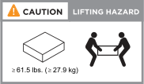
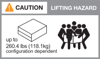

= 安裝要求 - FAS50
:allow-uri-read: 
:icons: font
:imagesdir: ../media/

[role="lead"]
檢閱 FAS50 儲存系統的需求。

== 安裝所需的設備

若要安裝儲存系統、您需要下列設備和工具。

* 存取網頁瀏覽器以設定儲存系統
* 靜電釋放（ ESD ）固定帶
* 手電筒
* 具備 USB/ 序列連線的筆記型電腦或主控台
* 2號十字螺絲起子

== 起重預防措施

儲存系統和儲存櫃很重。抬起和移動這些項目時請務必謹慎。

=== 儲存系統重量

移動或提起儲存系統時、請採取必要的預防措施。

儲存系統最重可達 53.8 磅（ 24.4 公斤）。若要抬起儲存系統，請使用兩個人或液壓舉升設備。

=== 機櫃重量

移動或舉起貨架時，請採取必要的預防措施。

DS460C 機櫃最重可達 260.4 磅（ 181.1 公斤）。若要抬起機架，您可能需要最多五個人或液壓起重。請將所有元件保留在機架中（前後），以避免機架重量不均衡。

.相關資訊
* https://library.netapp.com/ecm/ecm_download_file/ECMP12475945["安全資訊與法規注意事項"^]

.接下來呢？
檢閱儲存系統的安裝需求與考量之後link:install-prepare.html["準備安裝"]，您就可以了。
