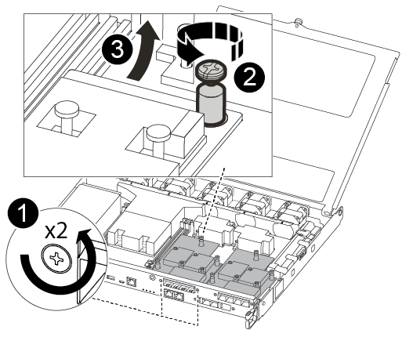
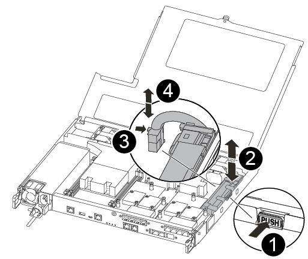

= 更換控制器模組硬體- FAS500f
:allow-uri-read: 
:icons: font
:imagesdir: ../media/

[role="lead"]
若要更換控制器模組硬體、您必須移除受損的控制器、將FRU元件移至更換的控制器模組、在機箱中安裝更換的控制器模組、然後將系統開機至維護模式。

== 步驟1：移除控制器模組

更換控制器模組內部的元件時、您必須從機箱中移除控制器模組。

請務必貼上纜線的標籤、以便知道纜線的來源。

您可以使用下列視訊或表格步驟來更換控制器模組：

.動畫-更換控制器模組
video::ab0ebe6b-e891-489c-aab4-ac5b015c8f01[panopto]
. 如果您尚未接地、請正確接地。
. 從來源拔下控制器模組電源供應器。
. 釋放電源線固定器、然後從電源供應器拔下纜線。
. 將您的手指插入控制器模組兩側的鎖定機制、用姆指按下拉桿、然後將控制器從機箱中輕拉幾英吋。
+

NOTE: 如果您在移除控制器模組時遇到困難、請將指標手指從內側穿過指孔（手臂交叉）。

+
image::../media/drw_a250_pcm_remove_install.png[DRw a250 PCM移除安裝]

+
|===

 a| 
image:../media/legend_icon_01.png["編號 1"]
| 槓桿 

 a| 
image:../media/legend_icon_02.png["編號 2"]
 a| 
閉鎖機制

|===
. 用兩隻手抓住控制器模組的兩側、將其從機箱中輕拉出、然後放在平穩的表面上。
. 逆時鐘轉動控制器模組正面的指旋螺絲、然後打開控制器模組護蓋。
+
image::../media/drw_a250_open_controller_module_cover.png[DRw a250開啟控制器模組護蓋]

+
|===

 a| 
image:../media/legend_icon_01.png["編號 1"]
| 指旋螺絲 

 a| 
image:../media/legend_icon_02.png["編號 2"]
 a| 
控制器模組護蓋。

|===
. 取出通風管蓋。
+
image::../media/drw_a250_remove_airduct_cover.png[DRw a250移除通風管蓋]

== 步驟2：移動電源供應器

更換控制器模組時、您必須將電源供應器從受損的控制器模組移至更換的控制器模組。

. 拔下電源供應器。
. 打開電源線固定器、然後從電源供應器拔下電源線。
. 從電源拔下電源線。
. 旋轉CAM握把、以便在按下鎖定彈片的同時、將電源供應器從控制器模組中拉出。
+

CAUTION: 將控制器模組滑入機箱時、請勿過度施力、以免損壞連接器。

+
image::../media/drw_a250_replace_psu.png[DRw a250更換PSU]

+
|===

 a| 
image:../media/legend_icon_01.png["編號 1"]
| 藍色電源供應器鎖定彈片 

 a| 
image:../media/legend_icon_02.png["編號 2"]
 a| 
電源供應器

|===
. 將電源供應器移至新的控制器模組、然後安裝。
. 用兩隻手支撐電源供應器的邊緣、並將其與控制器模組的開口對齊、然後將電源供應器輕推入控制器模組、直到鎖定彈片卡入定位。
+
電源供應器只能與內部連接器正確接合、並以一種方式鎖定到位。

+

IMPORTANT: 為避免損壞內部連接器、請勿在將電源供應器滑入系統時過度施力。

== 步驟3：移動風扇

更換故障的控制器模組時、您必須將風扇從受損的控制器模組移至更換模組。

. 將風扇模組的側邊夾緊、然後將風扇模組從控制器模組中直接提出、以移除風扇模組。
+
image::../media/drw_a250_replace_fan.png[DRw a250更換風扇]

+
|===

 a| 
image:../media/legend_icon_01.png["編號 1"]
| 風扇模組 
|===
. 將風扇模組移至更換的控制器模組、並將風扇模組的邊緣與控制器模組的開孔對齊、然後將風扇模組滑入。
. 對其餘的風扇模組重複這些步驟。

== 步驟4：移動開機媒體

在控制器模組的通風管下方、在該功能中有一個開機媒體裝置AFF 。您必須將其從受損的控制器模組移至更換的控制器模組。

您需要使用#1磁十字頭螺絲起子來移除將開機媒體固定到位的螺絲。由於控制器模組內的空間限制、您也應該有磁鐵將螺絲移至、以免遺失。

. 找到並將開機媒體從受損的控制器模組移至更換的控制器模組。
+
image::../media/drw_a250_replace_boot_media.png[DRW a250更換開機媒體]

+
|===

 a| 
image:../media/legend_icon_01.png["編號 1"]
| 在受損的控制器模組中、移除將開機媒體固定至主機板的螺絲。 

 a| 
image:../media/legend_icon_02.png["編號 2"]
 a| 
將開機媒體從受損的控制器模組中取出。

|===
+
.. 使用#1磁性螺絲起子、將螺絲從開機媒體上取下、並將其安全地放在磁碟機上。
.. 將開機媒體從插槽中直接輕拉出、並將其對齊替換控制器模組中的位置。
.. 使用#1磁性螺絲起子、插入並鎖緊行李廂媒體上的螺絲。
+

NOTE: 請勿在鎖緊開機媒體上的螺絲時施力、否則可能會造成問題。

== 步驟5：移動DIMM

若要移動DIMM、請從受損的控制器找到並將其移至更換控制器、然後依照特定的步驟順序進行。

image::../media/drw_a250_dimm_replace.png[更換DRW a250 DIMM]

IMPORTANT: 將每個DIMM安裝在受損控制器模組中所佔用的相同插槽中。

. 緩慢地將DIMM兩側的DIMM彈出彈片分開、然後將DIMM從插槽中滑出。
+

IMPORTANT: 抓住DIMM邊緣、避免對DIMM電路板上的元件施加壓力。

. 在更換的控制器模組上找到對應的DIMM插槽。
. 確定DIMM插槽上的DIMM彈出彈片處於開啟位置、然後將DIMM正面插入插槽。
+
DIMM可緊密裝入插槽。如果沒有、請重新插入DIMM、將其與插槽重新對齊。

. 目視檢查DIMM、確認其對齊並完全插入插槽。
. 對其餘的DIMM重複這些步驟。

== 步驟6：移動夾層卡

若要移動夾層卡、您必須從連接埠移除纜線和任何QSFP和SFP、將夾層卡移至替換控制器、將任何QSFP和SFP重新安裝至連接埠、然後將連接埠連接至纜線。

. 從受損的控制器模組找出並移動夾層卡。
+

+
|===

 a| 
image:../media/legend_icon_01.png["編號 1"]
| 卸下控制器模組正面的螺絲。 

 a| 
image:../media/legend_icon_02.png["編號 2"]
 a| 
旋鬆控制器模組中的螺絲。

 a| 
image:../media/legend_icon_03.png["編號 3"]
 a| 
移動夾層卡。

|===
. 拔下任何與夾層卡相關的纜線。
+
請務必貼上纜線的標籤、以便知道纜線的來源。

+
.. 移除夾層卡中的任何SFP或QSFP模組、並將其放在一旁。
.. 使用#1磁性螺絲起子、將受損控制器模組正面和夾層卡上的螺絲取下、並將其安全地放在磁碟機上。
.. 將夾層卡從插槽中輕拉出、並將其移至更換控制器中的相同位置。
.. 將夾層卡輕對齊替換控制器中的位置。
.. 使用#1磁性螺絲起子、插入並鎖緊替換控制器模組正面和夾層卡上的螺絲。
+

NOTE: 請勿在鎖緊夾層卡上的螺絲時施力、否則可能會使其碎裂。

. 如果受損的控制器模組中有另一個夾層卡、請重複這些步驟。
. 將移除的SFP或QSFP模組插入夾層卡。

== 步驟7：搬移內華達州電池

更換控制器模組時、您必須將損壞的控制器模組中的NV-電池移至更換的控制器模組。

. 找到並將NVMEM電池從受損的控制器模組移至更換的控制器模組。
+

+
|===

 a| 
image:../media/legend_icon_01.png["編號 1"]
| 擠壓電池插頭表面的固定夾。 

 a| 
image:../media/legend_icon_02.png["編號 2"]
 a| 
從插槽拔下電池纜線。

 a| 
image:../media/legend_icon_03.png["編號 3"]
 a| 
抓住電池、然後按下標有「推」的藍色鎖定彈片。

 a| 
image:../media/legend_icon_04.png["編號 4."]
 a| 
將電池從電池座和控制器模組中取出。

|===
. 找到電池插塞、然後擠壓電池插塞正面的固定夾、將插塞從插槽中鬆脫。
. 抓住電池並按下標有「推」的藍色鎖定彈片、然後將電池從電池座和控制器模組中取出。
. 在更換的控制器模組上找到對應的NV-電池座、然後將NV-電池對準電池座。
. 將內華達州電池插頭插入插槽。
. 將電池套件沿金屬板側邊牆向下推、直到側邊牆面掛勾上的支撐彈片插入電池套件上的插槽、然後電池套件栓扣卡入側邊牆上的插槽、並卡入插槽。
. 穩固地向下按電池套件、確定已鎖定到位。

== 步驟8：安裝控制器模組

將所有元件從受損的控制器模組移至更換的控制器模組之後、您必須將更換的控制器模組安裝到機箱中、然後將其開機至維護模式。

您可以使用下列圖例或書面步驟、在機箱中安裝更換的控制器模組。

. 如果您尚未安裝、請安裝通風管。
+
image::../media/drw_a250_install_airduct_cover.png[DRw a250安裝通風管蓋]

. 合上控制器模組護蓋、然後鎖緊指旋螺絲。
+
image::../media/drw_a250_close_controller_module_cover.png[DRw a250合上控制器模組護蓋]

+
|===

 a| 
image:../media/legend_icon_01.png["編號 1"]
| 控制器模組護蓋 

 a| 
image:../media/legend_icon_02.png["編號 2"]
 a| 
指旋螺絲

|===
. 將控制器模組的一端與機箱的開口對齊、然後將控制器模組輕推至系統的一半。
+

NOTE: 在指示之前、請勿將控制器模組完全插入機箱。

. 僅連接管理連接埠和主控台連接埠、以便存取系統以執行下列各節中的工作。
+

NOTE: 您將在本程序稍後將其餘纜線連接至控制器模組。

. 將控制器模組插入機箱。
. 確保鎖定機制臂鎖定在完全延伸位置。
. 用兩隻手將控制器模組對齊並輕推入鎖定機制臂、直到它停止為止。
. 將指標手指放在鎖定機制內側的指孔中。
. 向下壓鎖定機制頂端的橘色彈片、然後將控制器模組輕推到停止點上。
. 從鎖定機制頂端釋放您的指稱、然後繼續推動、直到鎖定機制卡入定位為止。
+
控制器模組一旦完全插入機箱、就會開始開機。準備好中斷開機程序。

+
控制器模組應完全插入、並與機箱邊緣齊平。

