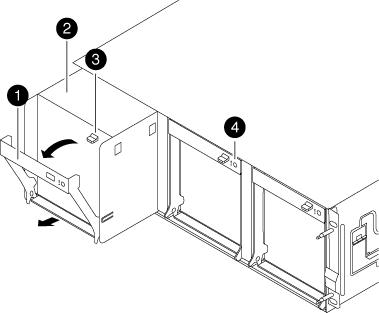

= 在 FAS8200 系統中熱插拔風扇
:allow-uri-read: 
:icons: font
:imagesdir: ../media/

[role="lead"]
在不中斷服務的情況下，您可以熱插拔 FAS8200 系統中的故障風扇模組。請在兩分鐘內完成更換，以避免控制器過熱。

NOTE: 從機箱中取出風扇模組之後、您必須在兩分鐘內裝回。系統氣流中斷、控制器模組或模組會在兩分鐘後關機、以避免過熱。

. 如果您尚未接地、請正確接地。
. 用兩隻手抓住擋板兩側的開孔、然後朝自己的方向拉動擋板、直到擋板從機箱框架上的球形接線柱中釋放為止、以卸下擋板（如有必要）。
. 查看主控台錯誤訊息、並查看每個風扇模組上的警示LED、以識別您必須更換的風扇模組。
. 向下按風扇模組CAM把手上的釋放栓鎖、然後向下拉CAM把。
+
風扇模組會稍微移出機箱。

+

+
|===

 a| 
image:../media/icon_round_1.png["編號 1"]
| CAM握把 

 a| 
image:../media/icon_round_2.png["編號 2"]
 a| 
風扇模組

 a| 
image:../media/icon_round_3.png["編號 3"]
 a| 
CAM握把釋放栓鎖

 a| 
image:../media/icon_round_4.png["編號 4."]
 a| 
風扇模組注意LED

|===
. 將風扇模組從機箱中筆直拉出。用空閒的手扶住它，以免它從機箱中甩出。
+

CAUTION: 風扇模組很短。請務必用手支撐風扇模組的底部、以免突然從機箱中掉落而造成傷害。

. 將風扇模組放在一邊。
. 將備用風扇模組與開孔對齊、然後滑入機箱、將其插入機箱。
. 將風扇模組CAM握把穩固推入、使其完全插入機箱。
+
當風扇模組完全就位時、CAM握把會稍微提高。

. 將凸輪把手向上擺動至關閉位置，直到凸輪把手釋放閂鎖卡入鎖定位置。
+
風扇安裝後、風扇LED應為綠色、並可加速運作速度。

. 將擋板對齊球柱、然後將擋板輕推至球柱上。
. 如套件隨附的RMA指示所述、將故障零件退回NetApp。如 https://mysupport.netapp.com/site/info/rma["零件退貨與更換"^]需詳細資訊、請參閱頁面。

