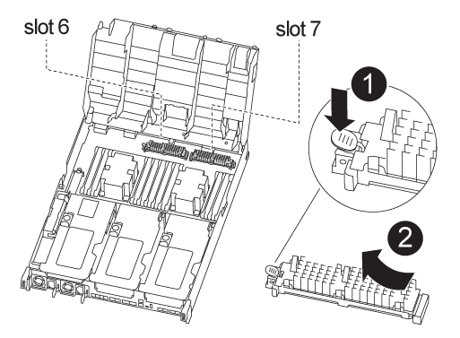

= 更換快取模組- FAS8300和FAS8700
:allow-uri-read: 
:icons: font
:imagesdir: ../media/

[role="lead"]
當系統登錄單AutoSupport 一的故障資訊（ASUP）訊息、指出模組已離線時、您必須更換控制器模組中的快取模組、否則會導致效能降低。

NOTE: Ver2 控制器模組在 FAS8000 中只有一個快取模組插槽。FAS8700 沒有 Ver2 控制器模組。快取模組功能不受插槽移除影響。

* 您必須使用從供應商處收到的替換FRU元件來更換故障元件。

== 步驟1：關閉受損的控制器

根據儲存系統硬體組態的不同、您可以使用不同的程序來關閉或接管受損的控制器。

[role="tabbed-block"]
====
.選項1：大多數組態
--
若要關閉受損的控制器、您必須判斷控制器的狀態、並在必要時接管控制器、以便健全的控制器繼續從受損的控制器儲存設備提供資料。

.關於這項工作
如果叢集有兩個以上的節點、則叢集必須處於仲裁狀態。如果叢集未達到法定人數、或健全的控制器顯示為「假」、表示符合資格與健全狀況、則您必須先修正問題、再關閉受損的控制器。

link:https://docs.netapp.com/us-en/ontap/system-admin/synchronize-node-cluster-task.html?q=Quorum["將節點與叢集同步"^]

您可能需要先清除快取模組的內容、然後再進行更換。

.步驟
. 雖然快取模組上的資料已加密、但您可能想要清除受損快取模組中的任何資料、並確認快取模組沒有資料：
+
.. 清除快取模組上的資料： `system controller flash-cache secure-erase run -node _node name_ localhost -device-id _device_number_`
+

NOTE: 執行 `system controller flash-cache show` 如果您不知道快閃快取裝置ID、則命令。

.. 確認資料已從快取模組中清除： `system controller flash-cache secure-erase show`

. 如果啟用了此功能、請叫用下列訊息來抑制自動建立案例：「System Node現象叫用節點*-type all -Message MAn=_number_of_hs_dable_h」AutoSupport AutoSupport AutoSupport
+
下列AutoSupport 資訊不顯示自動建立案例兩小時的訊息：「cluster1：*>系統節點AutoSupport 、叫用節點*-輸入ALL -Message MAn=2h」

. 停用健全控制器主控台的自動恢復功能：「torage容錯移轉修改–節點本機-自動恢復錯誤」
. 將受損的控制器移至載入器提示：
+
[cols="1,2"]
|===
| 如果受損的控制器正在顯示... | 然後... 

 a| 
載入程式提示
 a| 
前往下一步。

 a| 
正在等待恢復...
 a| 
按Ctrl-C、然後回應「y」。

 a| 
系統提示或密碼提示（輸入系統密碼）
 a| 
接管或停止受損的控制器：「暫停容錯移轉接管-節點_受損節點_節點_名稱_」當受損的控制器顯示正在等待恢復...時、請按Ctrl-C、然後回應「y」。

|===

--
.選項2：控制器位於雙節點MetroCluster 的不二
--
若要關閉受損的控制器、您必須判斷控制器的狀態、並在必要時切換控制器、使健全的控制器繼續從受損的控制器儲存設備提供資料。

.關於這項工作
* 如果您使用NetApp儲存加密、則必須依照的「將FIPS磁碟機或SED恢復為未受保護模式」一節中的指示、重設MSID link:https://docs.netapp.com/us-en/ontap/encryption-at-rest/return-seds-unprotected-mode-task.html["使用CLI進行NetApp加密總覽"^]。
* 您必須在本程序結束時保持電源供應器開啟、才能為健全的控制器提供電力。

.步驟
. 檢查MetroCluster 「不正常」狀態、判斷受損的控制器是否已自動切換至「正常」控制器MetroCluster ：「不正常」
. 視是否發生自動切換而定、請根據下表繼續進行：
+
[cols="1,2"]
|===
| 如果控制器受損... | 然後... 

 a| 
已自動切換
 a| 
繼續下一步。

 a| 
尚未自動切換
 a| 
從健全的控制器執行計畫性的切換作業MetroCluster ：「『交換切換’」

 a| 
尚未自動切換、您嘗試使用MetroCluster 「還原切換」命令進行切換、切換遭到否決
 a| 
請檢閱否決訊息、如有可能、請解決此問題、然後再試一次。如果您無法解決問題、請聯絡技術支援部門。

|===
. 從MetroCluster 存續的叢集執行「f恢復 階段Aggregate」命令、以重新同步資料集合體。
+
[listing]
----
controller_A_1::> metrocluster heal -phase aggregates
[Job 130] Job succeeded: Heal Aggregates is successful.
----
+
如果治療被否決、您可以選擇MetroCluster 使用「-overre-etoes」參數重新發出「還原」命令。如果您使用此選用參數、系統將會置換任何軟質否決、以防止修復作業。

. 使用MetroCluster flexoperationshow命令確認作業已完成。
+
[listing]
----
controller_A_1::> metrocluster operation show
    Operation: heal-aggregates
      State: successful
Start Time: 7/25/2016 18:45:55
   End Time: 7/25/2016 18:45:56
     Errors: -
----
. 使用「shorage Aggregate show」命令來檢查集合體的狀態。
+
[listing]
----
controller_A_1::> storage aggregate show
Aggregate     Size Available Used% State   #Vols  Nodes            RAID Status
--------- -------- --------- ----- ------- ------ ---------------- ------------
...
aggr_b2    227.1GB   227.1GB    0% online       0 mcc1-a2          raid_dp, mirrored, normal...
----
. 使用「MetroCluster f恢復 階段根集合體」命令來修復根集合體。
+
[listing]
----
mcc1A::> metrocluster heal -phase root-aggregates
[Job 137] Job succeeded: Heal Root Aggregates is successful
----
+
如果修復被否決、您可以選擇使用MetroCluster -overrover-etoes參數重新發出「還原」命令。如果您使用此選用參數、系統將會置換任何軟質否決、以防止修復作業。

. 在MetroCluster 目的地叢集上使用「停止作業show」命令、確認修復作業已完成：
+
[listing]
----

mcc1A::> metrocluster operation show
  Operation: heal-root-aggregates
      State: successful
 Start Time: 7/29/2016 20:54:41
   End Time: 7/29/2016 20:54:42
     Errors: -
----
. 在受損的控制器模組上、拔下電源供應器。

--
====

== 步驟2：移除控制器模組

若要存取控制器模組內部的元件、您必須從機箱中移除控制器模組。

您可以使用下列動畫、圖例或書面步驟、將控制器模組從機箱中移除。

.動畫-移除控制器模組
video::75b6fa91-96b9-4323-b156-aae10007c9a5[panopto]
image::../media/drw_A400_Remove_controller.png[DRW A400移除控制器]

.步驟
. 如果您尚未接地、請正確接地。
. 釋放電源線固定器、然後從電源供應器拔下纜線。
. 解開將纜線綁定至纜線管理裝置的掛勾和迴圈帶、然後從控制器模組拔下系統纜線和SFP（如有需要）、並追蹤纜線的連接位置。
+
將纜線留在纜線管理裝置中、以便在重新安裝纜線管理裝置時、整理好纜線。

. 從控制器模組中取出纜線管理裝置、然後將其放在一旁。
. 向下按兩個鎖定栓、然後同時向下轉動兩個鎖條。
+
控制器模組會稍微移出機箱。

. 將控制器模組滑出機箱。
+
將控制器模組滑出機箱時、請確定您支援控制器模組的底部。

. 將控制器模組放在穩固的平面上。

== 步驟3：更換快取模組

若要更換快取模組（在控制器標籤上稱為快閃快取）、請找出控制器內的插槽、然後依照特定的步驟順序進行。請參閱控制器模組上的FRU對應圖、以瞭解Flash Cache的位置。

NOTE: 插槽 6 僅適用於 FAS8000 Ver2 控制器。

您的儲存系統必須符合特定條件、視您的情況而定：

* 它必須具備適用於您所安裝之快取模組的作業系統。
* 它必須支援快取容量。
* 雖然快取模組的內容已加密、但最好先清除模組的內容再進行更換。如需詳細資訊、請參閱 https://mysupport.netapp.com/info/web/ECMP1132988.html["波動性聲明"] 適用於您的系統、請至NetApp支援網站。
+

NOTE: 您必須登入NetApp支援網站、才能顯示系統的_波動聲明_。

* 儲存系統中的所有其他元件都必須正常運作；否則、您必須聯絡技術支援部門。

您可以使用下列動畫、圖例或書面步驟來取代快取模組。

.動畫-取代快取模組
video::d5f75ac5-b4f3-4b49-984b-aad9012f0c8e[panopto]

.步驟
. 如果您尚未接地、請正確接地。
. 打開通風管：
+
.. 將通風管側邊的鎖定彈片朝控制器模組中央按下。
.. 將通風管朝控制器模組背面滑入、然後將其向上旋轉至完全開啟的位置。

. 使用控制器模組上的FRU對應圖、找出故障的快取模組並將其移除：
+
視您的組態而定、控制器模組中可能有零、一個或兩個快取模組。使用控制器模組內的FRU對應來協助找出快取模組。

+
.. 按下藍色釋放卡舌。
+
快取模組端點會從「版本」索引標籤中增加。

.. 向上旋轉快取模組、將其從插槽中滑出。

. 安裝替換快取模組：
+
.. 將替換快取模組的邊緣與插槽對齊、然後將其輕緩插入插槽。
.. 將快取模組朝主機板方向向下旋轉。
.. 將手指放在快取模組的末端、用藍色按鈕向下推快取模組末端、然後提起鎖定按鈕、將快取模組鎖定到位。

. 關閉通風管：
+
.. 將通風管向下旋轉至控制器模組。
.. 將通風管滑向提升板、將其鎖定到位。

== 步驟4：安裝控制器模組

更換控制器模組中的元件之後、您必須將控制器模組重新安裝到機箱中。

您可以使用下列動畫、圖例或書面步驟、在機箱中安裝控制器模組。

.動畫-安裝控制器模組
video::9249fdb8-1522-437d-9280-aae10007c97b[panopto]
image::../media/drw_A400_Install_controller_source.png[DRW A400安裝控制器來源]

.步驟
. 如果您尚未這麼做、請關閉通風管。
. 將控制器模組的一端與機箱的開口對齊、然後將控制器模組輕推至系統的一半。
+

NOTE: 在指示之前、請勿將控制器模組完全插入機箱。

. 僅連接管理連接埠和主控台連接埠、以便存取系統以執行下列各節中的工作。
+

NOTE: 您將在本程序稍後將其餘纜線連接至控制器模組。

. 完成控制器模組的安裝：
+
.. 將電源線插入電源供應器、重新安裝電源線鎖環、然後將電源供應器連接至電源。
.. 使用鎖定鎖條、將控制器模組穩固地推入機箱、直到鎖定鎖條開始上升。
+

NOTE: 將控制器模組滑入機箱時、請勿過度施力、以免損壞連接器。

.. 將鎖定鎖條向上轉動、將鎖定鎖條向內傾、使其脫離鎖定插銷、將控制器推入到底、然後將鎖定鎖條向下推入鎖定位置、以將控制器模組完全裝入機箱。
+
控制器模組一旦完全插入機箱、就會開始開機。

.. 如果您尚未重新安裝纜線管理裝置、請重新安裝。
.. 中斷正常開機程序、然後按「Ctrl-C」開機至載入器。
+

NOTE: 如果系統在開機功能表停止、請選取開機至載入器選項。

.. 在載入程式提示下、輸入「bye」重新初始化PCIe卡和其他元件。

== 步驟5：將控制器模組還原為運作狀態

您必須重新設計系統、歸還控制器模組、然後重新啟用自動恢復功能。

.步驟
. 視需要重新安裝系統。
+
如果您移除媒體轉換器（QSFP或SFP）、請記得在使用光纖纜線時重新安裝。

. 將控制器恢復正常運作、方法是歸還儲存設備：「torage容錯移轉恢復-ofnode_disapped_node_name_」
. 如果停用自動還原、請重新啟用：「儲存容錯移轉修改節點本機-自動恢復true」

== 步驟7：在雙節點MetroCluster 的不二組態中切換回集合體

完成雙節點MetroCluster 的故障恢復組態中的FRU更換之後、您就可以執行MetroCluster 還原還原作業。這會將組態恢復至正常運作狀態、使先前受損站台上的同步來源儲存虛擬機器（SVM）現在處於作用中狀態、並從本機磁碟集區提供資料。

此工作僅適用於雙節點MetroCluster 的不完整組態。

.步驟
. 驗證所有節點是否都處於「啟用」狀態：MetroCluster 「顯示節點」
+
[listing]
----
cluster_B::>  metrocluster node show

DR                           Configuration  DR
Group Cluster Node           State          Mirroring Mode
----- ------- -------------- -------------- --------- --------------------
1     cluster_A
              controller_A_1 configured     enabled   heal roots completed
      cluster_B
              controller_B_1 configured     enabled   waiting for switchback recovery
2 entries were displayed.
----
. 確認所有SVM上的重新同步已完成：MetroCluster 「Svserver show」
. 驗證修復作業所執行的任何自動LIF移轉是否已成功完成：「MetroCluster 還原檢查LIF show」
. 從存續叢集中的任何節點使用「MetroCluster 還原」命令執行切換。
. 確認切換作業已完成：MetroCluster 「不顯示」
+
當叢集處於「等待切換」狀態時、切換回復作業仍在執行中：

+
[listing]
----
cluster_B::> metrocluster show
Cluster              Configuration State    Mode
--------------------	------------------- 	---------
 Local: cluster_B configured       	switchover
Remote: cluster_A configured       	waiting-for-switchback
----
+
當叢集處於「正常」狀態時、即可完成切換作業：

+
[listing]
----
cluster_B::> metrocluster show
Cluster              Configuration State    Mode
--------------------	------------------- 	---------
 Local: cluster_B configured      		normal
Remote: cluster_A configured      		normal
----
+
如果切換需要很長時間才能完成、您可以使用「MetroCluster show config-repl複 寫res同步 狀態show」命令來檢查進行中的基準狀態。

. 重新建立任何SnapMirror或SnapVault 不完整的組態。

== 步驟8：完成更換程序

如套件隨附的RMA指示所述、將故障零件退回NetApp。請參閱 https://mysupport.netapp.com/site/info/rma["產品退貨安培；更換"] 頁面以取得更多資訊。
