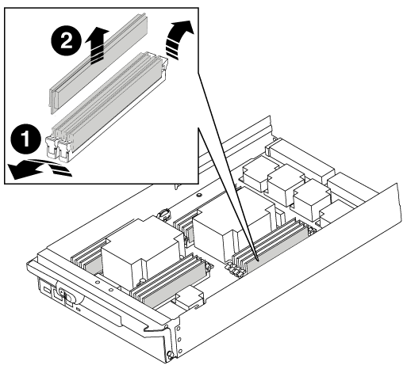

= 更換DIMM AFF - FASA700和FAS9000
:allow-uri-read: 
:icons: font
:imagesdir: ../media/

[role="lead"]
當系統登錄的可修正錯誤修正碼（ECC）數量不斷增加時、您必須更換控制器模組中的DIMM；否則會導致系統嚴重錯誤。

系統中的所有其他元件都必須正常運作；否則、您必須聯絡技術支援部門。

您必須使用從供應商處收到的替換FRU元件來更換故障元件。

== 步驟1：關閉受損的控制器

[role="lead"]
根據儲存系統硬體組態的不同、您可以使用不同的程序來關閉或接管受損的控制器。

=== 選項1：大多數組態

[role="lead"]
若要關閉受損的控制器、您必須判斷控制器的狀態、並在必要時接管控制器、以便健全的控制器繼續從受損的控制器儲存設備提供資料。

如果叢集有兩個以上的節點、則叢集必須處於仲裁狀態。如果叢集未達到法定人數、或健全的控制器顯示為「假」、表示符合資格和健全狀況、則您必須在關閉受損的控制器之前修正問題；請參閱 link:https://docs.netapp.com/us-en/ontap/system-admin/index.html["使用CLI進行系統管理總覽"^]。

.步驟
. 如果啟用了此功能、請叫用下列訊息來抑制自動建立案例：「System Node現象叫用節點*-type all -Message MAn=number_of_hs_Downh」AutoSupport AutoSupport AutoSupport
+
下列AutoSupport 資訊不顯示自動建立案例兩小時的訊息：「cluster1：*>系統節點AutoSupport 、叫用節點*-輸入ALL -Message MAn=2h」

. 停用健全控制器主控台的自動恢復功能：「torage容錯移轉修改–節點本機-自動恢復錯誤」
. 將受損的控制器移至載入器提示：
+
[cols="1,2"]
|===
| 如果受損的控制器正在顯示... | 然後... 

 a| 
載入程式提示
 a| 
移至「移除控制器模組」。

 a| 
正在等待恢復...
 a| 
按Ctrl-C、然後在出現提示時回應「y」。

 a| 
系統提示或密碼提示（輸入系統密碼）
 a| 
從正常控制器接管或停止受損的控制器：「torage容錯移轉接管-節點_受損節點_節點名稱_」

當受損的控制器顯示正在等待恢復...時、請按Ctrl-C、然後回應「y」。

|===

=== 選項2：控制器位於MetroCluster 一個不二之處

NOTE: 如果您的系統採用雙節點MetroCluster 的功能、請勿使用此程序。

若要關閉受損的控制器、您必須判斷控制器的狀態、並在必要時接管控制器、以便健全的控制器繼續從受損的控制器儲存設備提供資料。

* 如果叢集有兩個以上的節點、則叢集必須處於仲裁狀態。如果叢集未達到法定人數、或健全的控制器顯示為「假」、表示符合資格和健全狀況、則您必須在關閉受損的控制器之前修正問題；請參閱 link:https://docs.netapp.com/us-en/ontap/system-admin/index.html["使用CLI進行系統管理總覽"^]。
* 如果您使用MetroCluster 的是功能不全的組態、則必須確認MetroCluster 已設定「功能不全」狀態、且節點處於啟用且正常的狀態（「MetroCluster 功能不全」）。

.步驟
. 如果啟用了此功能、請叫用下列訊息來抑制自動建立案例：「System Node現象叫用節點*-type all -Message MAn=number_of_hs_Downh」AutoSupport AutoSupport AutoSupport
+
下列AutoSupport 資訊不顯示自動建立案例兩小時的訊息：「cluster1：*>系統節點AutoSupport 、叫用節點*-輸入ALL -Message MAn=2h」

. 停用健全控制器主控台的自動恢復功能：「torage容錯移轉修改–節點本機-自動恢復錯誤」
. 將受損的控制器移至載入器提示：
+
[cols="1,2"]
|===
| 如果受損的控制器正在顯示... | 然後... 

 a| 
載入程式提示
 a| 
移至「移除控制器模組」。

 a| 
正在等待恢復...
 a| 
按Ctrl-C、然後在出現提示時回應「y」。

 a| 
系統提示或密碼提示（輸入系統密碼）
 a| 
從正常控制器接管或停止受損的控制器：「torage容錯移轉接管-節點_受損節點_節點名稱_」

當受損的控制器顯示正在等待恢復...時、請按Ctrl-C、然後回應「y」。

|===

=== 選項3：控制器位於雙節點MetroCluster 的不二

[role="lead"]
若要關閉受損的控制器、您必須判斷控制器的狀態、並在必要時切換控制器、使健全的控制器繼續從受損的控制器儲存設備提供資料。

.關於這項工作
* 如果您使用NetApp儲存加密、則必須依照的「將FIPS磁碟機或SED恢復為未受保護模式」一節中的指示、重設MSID link:https://docs.netapp.com/us-en/ontap/encryption-at-rest/return-seds-unprotected-mode-task.html["使用CLI進行NetApp加密總覽"^]。
* 您必須在本程序結束時保持電源供應器開啟、才能為健全的控制器提供電力。

.步驟
. 檢查MetroCluster 「不正常」狀態、判斷受損的控制器是否已自動切換至「正常」控制器MetroCluster ：「不正常」
. 視是否發生自動切換而定、請根據下表繼續進行：
+
[cols="1,2"]
|===
| 如果控制器受損... | 然後... 

 a| 
已自動切換
 a| 
繼續下一步。

 a| 
尚未自動切換
 a| 
從健全的控制器執行計畫性的切換作業MetroCluster ：「『交換切換’」

 a| 
尚未自動切換、您嘗試使用MetroCluster 「還原切換」命令進行切換、切換遭到否決
 a| 
請檢閱否決訊息、如有可能、請解決此問題、然後再試一次。如果您無法解決問題、請聯絡技術支援部門。

|===
. 從MetroCluster 存續的叢集執行「f恢復 階段Aggregate」命令、以重新同步資料集合體。
+
[listing]
----
controller_A_1::> metrocluster heal -phase aggregates
[Job 130] Job succeeded: Heal Aggregates is successful.
----
+
如果治療被否決、您可以選擇MetroCluster 使用「-overre-etoes」參數重新發出「還原」命令。如果您使用此選用參數、系統將會置換任何軟質否決、以防止修復作業。

. 使用MetroCluster flexoperationshow命令確認作業已完成。
+
[listing]
----
controller_A_1::> metrocluster operation show
    Operation: heal-aggregates
      State: successful
Start Time: 7/25/2016 18:45:55
   End Time: 7/25/2016 18:45:56
     Errors: -
----
. 使用「shorage Aggregate show」命令來檢查集合體的狀態。
+
[listing]
----
controller_A_1::> storage aggregate show
Aggregate     Size Available Used% State   #Vols  Nodes            RAID Status
--------- -------- --------- ----- ------- ------ ---------------- ------------
...
aggr_b2    227.1GB   227.1GB    0% online       0 mcc1-a2          raid_dp, mirrored, normal...
----
. 使用「MetroCluster f恢復 階段根集合體」命令來修復根集合體。
+
[listing]
----
mcc1A::> metrocluster heal -phase root-aggregates
[Job 137] Job succeeded: Heal Root Aggregates is successful
----
+
如果修復被否決、您可以選擇使用MetroCluster -overrover-etoes參數重新發出「還原」命令。如果您使用此選用參數、系統將會置換任何軟質否決、以防止修復作業。

. 在MetroCluster 目的地叢集上使用「停止作業show」命令、確認修復作業已完成：
+
[listing]
----

mcc1A::> metrocluster operation show
  Operation: heal-root-aggregates
      State: successful
 Start Time: 7/29/2016 20:54:41
   End Time: 7/29/2016 20:54:42
     Errors: -
----
. 在受損的控制器模組上、拔下電源供應器。

== 步驟2：移除控制器模組

[role="lead"]
若要存取控制器內部的元件、您必須先從系統中移除控制器模組、然後移除控制器模組上的護蓋。

.步驟
. 如果您尚未接地、請正確接地。
. 從受損的控制器模組拔下纜線、並追蹤纜線的連接位置。
. 將CAM把手上的橘色按鈕向下推、直到解鎖為止。
+
image::../media/drw_9000_remove_pcm.png[DRw 9000移除PCM]

+
|===

 a| 
image:../media/legend_icon_01.png[""]
 a| 
CAM握把釋放鈕

 a| 
image:../media/legend_icon_02.png[""]
 a| 
CAM握把

|===
. 旋轉CAM握把、使其完全脫離機箱的控制器模組、然後將控制器模組滑出機箱。
+
將控制器模組滑出機箱時、請確定您支援控制器模組的底部。

. 將控制器模組蓋面朝上放置在穩固的平面上、按下機箱蓋上的藍色按鈕、將機箱蓋滑到控制器模組的背面、然後向上轉動機箱蓋、將其從控制器模組中取出。
+
image::../media/drw_9000_pcm_open.png[已開啟的DRw 9000 PCM]

+
|===

 a| 
image:../media/legend_icon_01.png[""]
 a| 
控制器模組護蓋鎖定按鈕

|===

== 步驟3：更換DIMM

[role="lead"]
若要更換DIMM、請在控制器內找到DIMM、然後依照特定的步驟順序進行。

.步驟
. 如果您尚未接地、請正確接地。
. 找到控制器模組上的DIMM。
+

NOTE: 每個系統記憶體DIMM的每個DIMM插槽旁邊、主機板上都有一個LED。故障的LED每兩秒會閃爍一次。

+
image::../media/drw_9000_dimm_map.png[DRw 9000 DIMM對應]

. 緩慢地將DIMM兩側的兩個DIMM彈出彈片分開、然後將DIMM從插槽中滑出、藉此將DIMM從插槽中退出。
+

NOTE: 小心拿住DIMM的邊緣、避免對DIMM電路板上的元件施加壓力。

+

+
[cols="1,3"]
|===

 a| 
image:../media/legend_icon_01.png[""]
 a| 
DIMM推出式彈片

 a| 
image:../media/legend_icon_02.png[""]
 a| 
DIMM

|===
. 從防靜電包裝袋中取出備用DIMM、拿住DIMM的邊角、然後將其對準插槽。
+
DIMM插針之間的槽口應與插槽中的卡舌對齊。

. 確定連接器上的DIMM彈出彈片處於開啟位置、然後將DIMM正面插入插槽。
+
DIMM可緊密插入插槽、但應該很容易就能裝入。如果沒有、請重新將DIMM與插槽對齊、然後重新插入。

+

NOTE: 目視檢查DIMM、確認其對齊並完全插入插槽。

. 在DIMM頂端邊緣小心地推入、但穩固地推入、直到彈出彈出彈片卡入DIMM兩端的槽口。
. 合上控制器模組護蓋。

== 步驟4：安裝控制器

[role="lead"]
將元件安裝到控制器模組之後、您必須將控制器模組裝回系統機箱、然後啟動作業系統。

對於同一機箱中有兩個控制器模組的HA配對、安裝控制器模組的順序特別重要、因為當您將控制器模組完全裝入機箱時、它會嘗試重新開機。

.步驟
. 如果您尚未接地、請正確接地。
. 如果您尚未更換控制器模組的護蓋、請將其裝回。
. 將控制器模組的一端與機箱的開口對齊、然後將控制器模組輕推至系統的一半。
+

NOTE: 在指示之前、請勿將控制器模組完全插入機箱。

. 僅連接管理連接埠和主控台連接埠、以便存取系統以執行下列各節中的工作。
+

NOTE: 您將在本程序稍後將其餘纜線連接至控制器模組。

. 完成控制器模組的重新安裝：
+
.. 如果您尚未重新安裝纜線管理裝置、請重新安裝。
.. 將控制器模組穩固地推入機箱、直到它與中間板完全接入。
+
控制器模組完全就位時、鎖定鎖條會上升。

+

NOTE: 將控制器模組滑入機箱時、請勿過度施力、以免損壞連接器。

+
控制器模組一旦完全插入機箱、就會開始開機。準備好中斷開機程序。

.. 向上轉動鎖定栓、將其傾斜、使其從鎖定銷中取出、然後將其放低至鎖定位置。
.. 當您看到「Press Ctrl-C for Boot Menu（按Ctrl-C進入開機功能表）」時、請按「Ctrl-C」來中斷開機程序。
.. 從顯示的功能表中選取要開機至維護模式的選項。

== 步驟5：執行系統層級診斷

[role="lead"]
安裝新的DIMM之後、您應該執行診斷程式。

您的系統必須處於載入器提示狀態、才能啟動系統層級診斷。

診斷程序中的所有命令都會從要更換元件的節點發出。

.步驟
. 如果要服務的節點不在載入程式提示下、請執行下列步驟：
+
.. 從顯示的功能表中選取「維護模式」選項。
.. 節點開機至維護模式後、停止節點：「halt」（停止）
+
發出命令之後、您應該等到系統在載入程式提示字元停止。

+

NOTE: 在開機過程中、您可以安全地回應「y」提示：

+
*** 當您在HA組態中進入維護模式時、必須確保健全的節點保持停機狀態的提示警告。

. 在載入程式提示字元下、存取專為系統層級診斷所設計的特殊驅動程式、以正常運作：「boot_diags'（boot_diags'）
+
在開機過程中、您可以安全地回應提示「y」、直到出現「維護模式」提示（*>）為止。

. 對系統記憶體執行診斷：「ldiag設備執行-devmem」
. 驗證更換DIMM後是否未發生硬體問題：「ldiag設備狀態-devmem -long -stStatus fected'（L診斷 設備狀態-devmem -long狀態失敗）」
+
如果沒有測試失敗、系統層級的診斷會返回提示、或列出測試元件所導致的故障完整狀態。

. 根據上述步驟的結果繼續進行：
+
[cols="1,2"]
|===
| 如果系統層級的診斷測試... | 然後... 

 a| 
已完成、沒有任何故障
 a| 
.. 清除狀態記錄：「ldiag」裝置的清除狀態
.. 確認記錄已清除：「ldiag設備狀態」
+
畫面會顯示下列預設回應：

_SLDIAG：沒有記錄訊息。_

.. 退出維護模式：「halt」
+
節點會顯示載入程式提示。

.. 從載入程式提示字元「bye」開機節點
.. 使節點恢復正常操作。

 a| 
HA配對
 a| 
執行回饋：「儲存容錯移轉回傳-ofnode_replace_node_name_」

NOTE: 如果停用自動還原、請使用儲存容錯移轉修改命令重新啟用。

 a| 
雙節點MetroCluster 的不全功能組態
 a| 
繼續下一步。

更新程序的下一項工作是執行此程序。MetroCluster

 a| 
獨立組態
 a| 
繼續下一步。

無需採取任何行動。

您已完成系統層級的診斷。

 a| 
導致某些測試失敗
 a| 
判斷問題的原因：

.. 退出維護模式：「halt」
+
發出命令後、請等待系統在載入程式提示字元停止。

.. 根據機箱中的控制器模組數量、關閉或離開電源供應器：
+
*** 如果機箱中有兩個控制器模組、請讓電源供應器保持開啟狀態、以便為其他控制器模組提供電力。
*** 如果機箱中有一個控制器模組、請關閉電源供應器、然後從電源插座拔下它們。

.. 確認您已注意到執行系統層級診斷所需的所有考量事項、纜線是否穩固連接、以及硬體元件是否已正確安裝在儲存系統中。
.. 引導您正在維修的控制器模組、並在系統提示您進入「Boot（開機）」功能表時按「Ctrl-C」中斷開機：
+
*** 如果機箱中有兩個控制器模組、請將您要維修的控制器模組完全裝入機箱。
+
控制器模組完全就位時會開機。

*** 如果機箱中有一個控制器模組、請連接電源供應器、然後將其開啟。

.. 從功能表中選取開機至維護模式。
.. 輸入以下命令退出維護模式：「halt（停止）」
+
發出命令後、請等待系統在載入程式提示字元停止。

.. 重新執行系統層級的診斷測試。

|===

== 步驟6：在雙節點MetroCluster 的不二組態中切換回集合體

[role="lead"]
完成雙節點MetroCluster 的故障恢復組態中的FRU更換之後、您就可以執行MetroCluster 還原還原作業。這會將組態恢復至正常運作狀態、使先前受損站台上的同步來源儲存虛擬機器（SVM）現在處於作用中狀態、並從本機磁碟集區提供資料。

此工作僅適用於雙節點MetroCluster 的不完整組態。

.步驟
. 驗證所有節點是否都處於「啟用」狀態：MetroCluster 「顯示節點」
+
[listing]
----
cluster_B::>  metrocluster node show

DR                           Configuration  DR
Group Cluster Node           State          Mirroring Mode
----- ------- -------------- -------------- --------- --------------------
1     cluster_A
              controller_A_1 configured     enabled   heal roots completed
      cluster_B
              controller_B_1 configured     enabled   waiting for switchback recovery
2 entries were displayed.
----
. 確認所有SVM上的重新同步已完成：MetroCluster 「Svserver show」
. 驗證修復作業所執行的任何自動LIF移轉是否已成功完成：「MetroCluster 還原檢查LIF show」
. 從存續叢集中的任何節點使用「MetroCluster 還原」命令執行切換。
. 確認切換作業已完成：MetroCluster 「不顯示」
+
當叢集處於「等待切換」狀態時、切換回復作業仍在執行中：

+
[listing]
----
cluster_B::> metrocluster show
Cluster              Configuration State    Mode
--------------------	------------------- 	---------
 Local: cluster_B configured       	switchover
Remote: cluster_A configured       	waiting-for-switchback
----
+
當叢集處於「正常」狀態時、即可完成切換作業：

+
[listing]
----
cluster_B::> metrocluster show
Cluster              Configuration State    Mode
--------------------	------------------- 	---------
 Local: cluster_B configured      		normal
Remote: cluster_A configured      		normal
----
+
如果切換需要很長時間才能完成、您可以使用「MetroCluster show config-repl複 寫res同步 狀態show」命令來檢查進行中的基準狀態。

. 重新建立任何SnapMirror或SnapVault 不完整的組態。

== 步驟7：將故障零件歸還給NetApp

[role="lead"]
如套件隨附的RMA指示所述、將故障零件退回NetApp。請參閱 https://mysupport.netapp.com/site/info/rma["產品退貨安培；更換"] 頁面以取得更多資訊。
