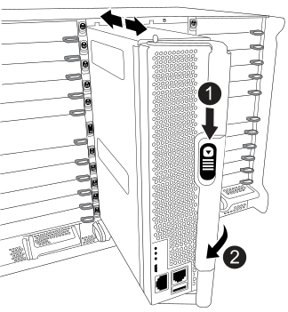
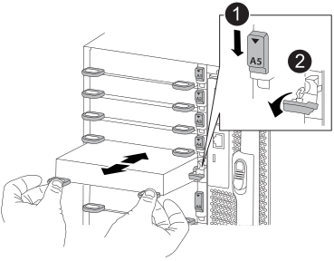
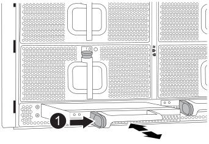
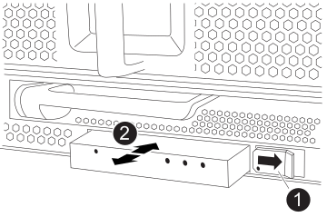

= 搬移及更換硬體- FAS9500
:allow-uri-read: 
:icons: font
:imagesdir: ../media/

[role="lead"]
若要更換機箱、您必須從損壞的機箱中移除元件、並將其安裝在替換機箱中。

== 步驟1：移除電源供應器

更換機箱時、請先關閉電源供應器、拔下電源供應器、然後從損壞的機箱背面卸下四個電源供應器。

. 如果您尚未接地、請正確接地。
. 關閉電源供應器並拔下電源線：
+
.. 關閉電源供應器上的電源開關。
.. 打開電源線固定器、然後從電源供應器拔下電源線。
.. 從電源拔下電源線。

. 按住電源供應器把手上的 terra cotta 鎖定按鈕、然後將電源供應器從機箱中拉出。
+

NOTE: 移除電源供應器時、請務必用兩隻手支撐其重量。

+
.動畫-移除/安裝PSU
video::590b3414-6ea5-42b2-b7f4-ae78004b86a4[panopto]
+
image::../media/drw_9500_remove_install_PSU_module.svg[移除 PSU]

+
[cols="20%,80%"]
|===

 a| 
image::../media/icon_round_1.png[編號 1]
 a| 
Terra cotta 鎖定按鈕

|===
. 針對任何剩餘的電源供應器、重複上述步驟。

== 步驟2：卸下風扇

裝回機箱時、您必須卸下機箱正面的六個風扇模組。

. 如果您尚未接地、請正確接地。
. 用兩隻手抓住擋板兩側的開孔、然後朝自己的方向拉動擋板、直到擋板從機箱框架上的球形接線柱中釋放為止、以卸下擋板（如有必要）。
. 按下風扇模組上的 terra cotta 鎖定按鈕、將風扇模組直接從機箱中拉出、並確保您可以用自己的手來支撐它。
+

NOTE: 風扇模組很短。請務必用手支撐風扇模組的底部、以免突然從機箱中掉落而造成傷害。

+
.動畫-移除/安裝風扇
video::86b0ed39-1083-4b3a-9e9c-ae78004c2ffc[panopto]
+
image::../media/drw_9500_remove_install_fan.svg[卸下風扇]

+
[cols="20%,80%"]
|===

 a| 
image:../media/icon_round_1.png["編號 1"]
 a| 
Terra cotta 鎖定按鈕

 a| 
image:../media/icon_round_2.png["編號 2"]
 a| 
將風扇滑入/滑出機箱

|===
. 將風扇模組放在一邊。
. 對其餘的任何風扇模組重複上述步驟。

== 步驟3：移除控制器模組

若要更換機箱、您必須將控制器模組或模組從損壞的機箱中移除。

. 如果您尚未接地、請正確接地。
. 從受損的控制器模組拔下纜線、並追蹤纜線的連接位置。
. 向下滑動凸輪把手上的赤陶鎖定按鈕、直到解鎖為止。
+
.動畫-移除控制器模組
video::5e029a19-8acc-4fa1-be5d-ae78004b365a[panopto]
+

+
[cols="20%,80%"]
|===

 a| 
image:../media/icon_round_1.png["編號 1"]
 a| 
CAM 把手鎖定按鈕

 a| 
image:../media/icon_round_2.png["編號 2"]
 a| 
CAM握把

|===
. 旋轉CAM握把、使其完全脫離機箱的控制器模組、然後將控制器模組滑出機箱。
+
將控制器模組滑出機箱時、請確定您支援控制器模組的底部。

. 將控制器模組放在一旁安全的地方、並追蹤其來源的機箱插槽、以便將其安裝在替換機箱的相同插槽中。
. 如果機箱中有另一個控制器模組、請重複這些步驟。

== 步驟4：移除I/O模組

若要從受損機箱（包括 NVRAM 模組）中移除 I/O 模組、請依照特定步驟順序進行。將快閃快取模組移至替換機箱時，您不需要從 NVRAM 模組中移除快閃快取模組（如果有）。

. 如果您尚未接地、請正確接地。
. 拔下與目標I/O模組相關的任何纜線。
+
請務必貼上纜線的標籤、以便知道纜線的來源。

. 從機箱中移除目標I/O模組：
+
.. 按下有字母和編號的凸輪鎖定按鈕。
+
CAM 鎖定按鈕會移離機箱。

.. 向下轉動CAM栓鎖、直到其處於水平位置。
+
I/O模組從機箱鬆脫、並從I/O插槽移出約1/2英吋。

.. 拉動模組面兩側的拉片、將I/O模組從機箱中移除。
+
請務必追蹤I/O模組所在的插槽。

+
.動畫-移除/安裝I/O模組
video::0903b1f9-187b-4bb8-9548-ae9b0012bb21[panopto]
+

+
[cols="20%,80%"]
|===

 a| 
image::../media/icon_round_1.png[編號 1]
 a| 
I/O CAM栓鎖有編號和編號

 a| 
image::../media/icon_round_2.png[編號 2]
 a| 
I/O CAM栓鎖完全解除鎖定

|===

. 將I/O模組放在一邊。
. 對損壞機箱中的其餘 I/O 模組重複上述步驟。

== 步驟5：移除分段控制器電源模組

從損壞的機箱正面卸下兩個分段控制器電源模組。

. 如果您尚未接地、請正確接地。
. 按下模組把手上的 terra cotta 鎖定按鈕、然後將 DCPM 滑出機箱。
+
.動畫-移除/安裝DCPM
video::c067cf9d-35b8-4fbe-9573-ae78004c2328[panopto]
+

+
[cols="20%,80%"]
|===

 a| 
image::../media/icon_round_1.png[編號 1]
 a| 
DCPM terra cotta 鎖定按鈕

|===
. 將 DCPM 放在安全的地方、然後對其餘的 DCPM 重複此步驟。

== 步驟 6 ：取下 USB LED 模組

取下 USB LED 模組。

.動畫-移除/安裝USB模組
video::bc46a3e8-6541-444e-973b-ae78004bf153[panopto]

[cols="20%,80%"]
|===

 a| 
image::../media/icon_round_1.png[編號 1]
 a| 
退出模組。

 a| 
image:../media/icon_round_2.png["編號 2"]
 a| 
滑出機箱。

|===
. 將 USB LED 模組放在受損機箱正面、直接放在電源供應器托架下方。
. 按下模組右側的黑色鎖定按鈕、將模組從機箱中釋放、然後將其滑出受損的機箱。
. 將模組放在安全的地方。

== 步驟 7 ：從設備機架或系統機櫃內更換機箱

您必須先從設備機架或系統機櫃中移除現有機箱、才能安裝替換機箱。

. 從機箱安裝點卸下螺絲。
+

NOTE: 如果系統位於系統機櫃中、您可能需要移除後固定托架。

. 在兩到三個人的協助下、將受損的機箱滑出系統機櫃或設備機架中的 _L_ 支架中的機架軌道、然後將其放在一邊。
. 如果您尚未接地、請正確接地。
. 使用兩三個人、將替換機箱裝入設備機架或系統機櫃、方法是將機箱引導至系統機櫃的機架軌道或設備機架的_L_支架。
. 將機箱完全滑入設備機架或系統機櫃。
. 使用您從受損機箱中卸下的螺絲、將機箱正面固定至設備機架或系統機櫃。
. 將機箱背面固定至設備機架或系統機櫃。
. 如果您使用的是纜線管理支架、請將其從受損的機箱中取出、然後將其安裝在替換機箱上。

== 步驟8：更換機箱時、請安裝取消階段控制器電源模組

將替換機箱安裝到機架或系統機櫃之後、您必須將取消階段的控制器電源模組重新安裝到機櫃中。

. 如果您尚未接地、請正確接地。
. 將 DCPM 的末端對準機箱開口、然後將其輕輕滑入機箱、直到卡入定位。
+

NOTE: 模組和插槽均採用鎖定式設計。請勿強制模組進入開啟位置。如果模組不容易進入、請重新對齊模組、然後將其滑入機箱。

. 對其餘的 DCPM 重複此步驟。

== 步驟9：在機箱中安裝風扇

若要在更換機箱時安裝風扇模組、您必須執行特定的工作順序。

. 如果您尚未接地、請正確接地。
. 將備用風扇模組的邊緣與機箱的開孔對齊、然後將其滑入機箱、直到卡入定位。
+
將風扇模組成功插入機箱時、黃色警示LED燈會閃四次。

. 對其餘的風扇模組重複這些步驟。
. 將擋板對齊球柱、然後將擋板輕推至球柱上。

== 步驟10：安裝I/O模組

若要安裝 I/O 模組，包括受損機箱的 NVRAM / 快閃快取模組，請依照特定步驟順序進行。

您必須安裝機箱、才能將 I/O 模組安裝到替換機箱的對應插槽中。

. 如果您尚未接地、請正確接地。
. 在機架或機櫃中安裝替換機箱之後、將I/O模組輕推入插槽、直到有字母和編號的I/O CAM栓鎖開始卡入、將I/O模組安裝到替換機箱的對應插槽中、 然後將I/O CAM栓鎖推到底、將模組鎖定到位。
. 視需要重新安裝I/O模組。
. 針對您保留的其餘I/O模組、重複上述步驟。
+

NOTE: 如果損壞的機箱有空白 I/O 面板、請將其移至更換的機箱。

== 步驟11：安裝電源供應器

在更換機箱時安裝電源供應器、需要將電源供應器安裝到替換機箱、並連接至電源。

. 如果您尚未接地、請正確接地。
. 請確定電源供應器的搖滾器位於關閉位置。
. 用兩隻手支撐電源供應器邊緣、並將其與系統機箱的開孔對齊、然後將電源供應器輕推入機箱、直到鎖定到位。
+
電源供應器採用鎖定式設計、只能以單一方式安裝。

+

IMPORTANT: 將電源供應器滑入系統時、請勿過度施力。您可能會損壞連接器。

. 重新連接電源線、並使用電源線鎖定機制將其固定至電源供應器。
+

IMPORTANT: 只能將電源線連接至電源供應器。此時請勿將電源線連接至電源。

. 針對任何剩餘的電源供應器、重複上述步驟。

== 步驟 12 安裝 USB LED 模組

在替換機箱中安裝 USB LED 模組。

. 找到替換機箱正面的 USB LED 模組插槽、直接位於 DCPM 托架下方。
. 將模組邊緣與 USB LED 凹槽對齊、然後將模組輕輕推入機箱、直到卡入定位。

== 步驟 13 ：安裝控制器

將控制器模組和任何其他元件安裝到替換機箱後、請啟動系統。

. 如果您尚未接地、請正確接地。
. 將電源供應器連接至不同的電源、然後開啟電源。
. 將控制器模組的一端與機箱的開口對齊、然後將控制器模組輕推至系統的一半。
+

NOTE: 在指示之前、請勿將控制器模組完全插入機箱。

. 將主控台重新連接至控制器模組、然後重新連接管理連接埠。
. 將CAM握把放在開啟位置時、將控制器模組滑入機箱、然後將控制器模組穩固推入、直到它與中間背板接觸並完全就位、然後關閉CAM握把、直到卡入鎖定位置。
+

IMPORTANT: 將控制器模組滑入機箱時、請勿過度施力、否則可能會損壞連接器。

+
控制器模組一旦完全插入機箱、就會開始開機。

. 重複上述步驟、將第二個控制器安裝到更換的機箱中。
. 啟動每個控制器。

