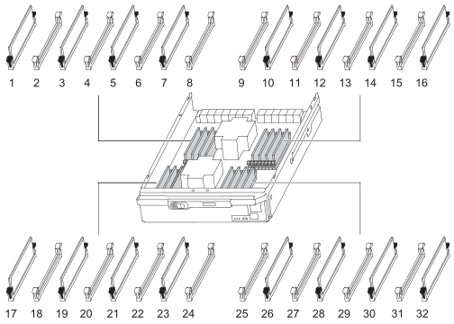
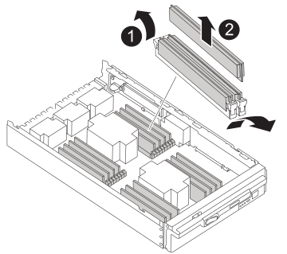

= 更換DIMM - FAS9500
:allow-uri-read: 
:icons: font
:imagesdir: ../media/

[role="lead"]
當儲存系統遇到錯誤時、您必須更換控制器中的 DIMM 、例如根據健全狀況監視器警示或不可修正的 ECC 錯誤（可修正的錯誤修正碼）過多、通常是由於單一 DIMM 故障而導致、導致儲存系統無法開機 ONTAP 。

.開始之前
系統中的所有其他元件都必須正常運作；否則、您必須聯絡技術支援部門。

您必須使用從供應商處收到的替換FRU元件來更換故障元件。

== 步驟1：關閉受損節點

若要關閉受損的控制器、您必須判斷控制器的狀態、並在必要時接管控制器、以便健全的控制器繼續從受損的控制器儲存設備提供資料。

.關於這項工作
* 如果您有 SAN 系統，則必須檢查故障控制器 SCSI 刀鋒的事件訊息  `cluster kernel-service show`。 `cluster kernel-service show`命令（從 priv 進階模式）會顯示節點名稱、link:https://docs.netapp.com/us-en/ontap/system-admin/display-nodes-cluster-task.html["仲裁狀態"]該節點的可用度狀態、以及該節點的作業狀態。
+
每個SCSI刀鋒處理序都應與叢集中的其他節點處於仲裁狀態。任何問題都必須先解決、才能繼續進行更換。

* 如果叢集有兩個以上的節點、則叢集必須處於仲裁狀態。如果叢集未達到法定人數、或健全的控制器顯示為「假」、表示符合資格和健全狀況、則您必須在關閉受損的控制器之前修正問題；請參閱 link:https://docs.netapp.com/us-en/ontap/system-admin/synchronize-node-cluster-task.html?q=Quorum["將節點與叢集同步"^]。

.步驟
. 如果啟用 AutoSupport 、請叫用 AutoSupport 訊息來隱藏自動建立個案： `system node autosupport invoke -node * -type all -message MAINT=<# of hours>h`
+
下列AutoSupport 資訊不顯示自動建立案例兩小時： `cluster1:> system node autosupport invoke -node * -type all -message MAINT=2h`

. 停用健全控制器主控台的自動恢復功能：「torage容錯移轉修改–節點本機-自動恢復錯誤」
+

NOTE: 當您看到_是否要停用自動恢復？_時、請輸入「y」。

. 將受損的控制器移至載入器提示：
+
[cols="1,2"]
|===
| 如果受損的控制器正在顯示... | 然後... 

 a| 
載入程式提示
 a| 
前往下一步。

 a| 
正在等待恢復...
 a| 
按Ctrl-C、然後在出現提示時回應「y」。

 a| 
系統提示或密碼提示
 a| 
從正常控制器接管或停止受損的控制器：「torage容錯移轉接管-節點_受損節點_節點名稱_」

當受損的控制器顯示正在等待恢復...時、請按Ctrl-C、然後回應「y」。

|===

== 步驟2：移除控制器模組

若要存取控制器內部的元件、您必須先從系統中移除控制器模組、然後移除控制器模組上的護蓋。

. 如果您尚未接地、請正確接地。
. 從受損的控制器模組拔下纜線、並追蹤纜線的連接位置。
. 將CAM把手上的Terra cotta按鈕向下推、直到解鎖為止。
+
.動畫-移除控制器
video::5e029a19-8acc-4fa1-be5d-ae78004b365a[panopto]
+
image::../media/drw_9500_remove_PCM.svg[DRw 9500-WCM移除]

+
[cols="20%,80%"]
|===

 a| 
image::../media/icon_round_1.png[編號 1]
 a| 
CAM握把釋放鈕

 a| 
image::../media/icon_round_2.png[圖示第 2 輪]
 a| 
CAM握把

|===
. 旋轉CAM握把、使其完全脫離機箱的控制器模組、然後將控制器模組滑出機箱。
+
將控制器模組滑出機箱時、請確定您支援控制器模組的底部。

. 將控制器模組蓋面朝上放置在穩固的平面上、按下機箱蓋上的藍色按鈕、將機箱蓋滑到控制器模組的背面、然後向上轉動機箱蓋、將其從控制器模組中取出。
+
image::../media/drw_9500_PCM_open.svg[已開啟的DRw 95PCM]

+
[cols="20%,80%"]
|===

 a| 
image::../media/icon_round_1.png[編號 1]
 a| 
控制器模組護蓋鎖定按鈕

|===

== 步驟3：更換DIMM

若要更換DIMM、請在控制器內找到DIMM、然後依照特定的步驟順序進行。

NOTE: Ver2 控制器的 DIMM 插槽較少。DIMM 插槽編號並未減少支援的 DIMM 數量或變更。將 DIMM 移至新的控制器模組時、請將 DIMM 安裝至與受損控制器模組相同的插槽編號 / 位置。  請參閱 Ver2 控制器模組上的 FRU 對應圖、瞭解 DIMM 插槽位置。

. 如果您尚未接地、請正確接地。
. 找到控制器模組上的DIMM。
+

. 緩慢地將DIMM兩側的兩個DIMM彈出彈片分開、然後將DIMM從插槽中滑出、藉此將DIMM從插槽中退出。
+

IMPORTANT: 小心拿住DIMM的邊緣、避免對DIMM電路板上的元件施加壓力。

+
.動畫-更換DIMM
video::d62a4c7c-8296-4d60-9981-ae78004b36f7[panopto]
+

+
[cols="20%,80%"]
|===

 a| 
image::../media/icon_round_1.png[編號 1]
 a| 
DIMM推出式彈片

 a| 
image::../media/icon_round_2.png[圖示第 2 輪]
 a| 
DIMM

|===
. 從防靜電包裝袋中取出備用DIMM、拿住DIMM的邊角、然後將其對準插槽。
+
DIMM插針之間的槽口應與插槽中的卡舌對齊。

. 確定連接器上的DIMM彈出彈片處於開啟位置、然後將DIMM正面插入插槽。
+
DIMM可緊密插入插槽、但應該很容易就能裝入。如果沒有、請重新將DIMM與插槽對齊、然後重新插入。

+

IMPORTANT: 目視檢查DIMM、確認其對齊並完全插入插槽。

. 在DIMM頂端邊緣小心地推入、但穩固地推入、直到彈出彈出彈片卡入DIMM兩端的槽口。
. 合上控制器模組護蓋。

== 步驟4：安裝控制器

將元件安裝到控制器模組之後、您必須將控制器模組裝回系統機箱、然後啟動作業系統。

對於同一機箱中有兩個控制器模組的HA配對、安裝控制器模組的順序特別重要、因為當您將控制器模組完全裝入機箱時、它會嘗試重新開機。

. 如果您尚未接地、請正確接地。
. 如果您尚未更換控制器模組的護蓋、請將其裝回。
+
image::../media/drw_9500_PCM_open.svg[已開啟的DRw 95PCM]

+
[cols="20%,80%"]
|===

 a| 
image::../media/icon_round_1.png[編號 1]
 a| 
控制器模組護蓋鎖定按鈕

|===
. 將控制器模組的一端與機箱的開口對齊、然後將控制器模組輕推至系統的一半。
+
.動畫-安裝控制器
video::f2aa14b4-0d95-4109-b410-ae78004b35c9[panopto]
+
image::../media/drw_9500_remove_PCM.svg[DRw 9500-WCM移除]

+
[cols="20%,80%"]
|===

 a| 
image::../media/icon_round_1.png[編號 1]
 a| 
CAM握把釋放鈕

 a| 
image::../media/icon_round_2.png[圖示第 2 輪]
 a| 
CAM握把

|===
+

NOTE: 在指示之前、請勿將控制器模組完全插入機箱。

. 僅連接管理連接埠和主控台連接埠、以便存取系統以執行下列各節中的工作。
+

NOTE: 您將在本程序稍後將其餘纜線連接至控制器模組。

. 完成控制器模組的重新安裝：
+
.. 如果您尚未重新安裝纜線管理裝置、請重新安裝。
.. 將控制器模組穩固地推入機箱、直到它與中間板完全接入。
+
控制器模組完全就位時、鎖定鎖條會上升。

+

IMPORTANT: 將控制器模組滑入機箱時、請勿過度施力、以免損壞連接器。

+
控制器模組一旦完全插入機箱、就會開始開機。

.. 向上轉動鎖定栓、將其傾斜、使其從鎖定銷中取出、然後將其放低至鎖定位置。

== 步驟5：將故障零件歸還給NetApp

如套件隨附的RMA指示所述、將故障零件退回NetApp。如 https://mysupport.netapp.com/site/info/rma["零件退貨與更換"]需詳細資訊、請參閱頁面。
