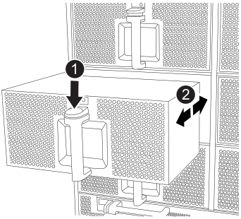

= 在 FAS9500 系統中熱插拔風扇
:allow-uri-read: 
:icons: font
:imagesdir: ../media/

[role="lead"]
若要在 FAS9500 系統中熱插拔風扇模組而不中斷服務，必須執行特定的任務順序。

IMPORTANT: 最佳實務做法是在將風扇模組從機箱中取出後兩分鐘內將其更換。系統可以繼續運作，但 ONTAP 會向主控台傳送有關降級風扇模組的訊息，直到風扇模組更換為止。

.步驟
. 如果您尚未接地、請正確接地。
. 用兩隻手抓住擋板兩側的開孔、然後朝自己的方向拉動擋板、直到擋板從機箱框架上的球形接線柱中釋放為止、以卸下擋板（如有必要）。
. 查看主控台錯誤訊息、並查看每個風扇模組上的警示LED、以識別您必須更換的風扇模組。
. 按下風扇模組上的Terra cotta按鈕、將風扇模組從機箱中直接拉出、確保您可以用手支撐。
+

IMPORTANT: 風扇模組很短。請務必用手支撐風扇模組的底部、以免突然從機箱中掉落而造成傷害。

+
.動畫-移除/安裝風扇
video::86b0ed39-1083-4b3a-9e9c-ae78004c2ffc[panopto]
+

+
[cols="20%,80%"]
|===

 a| 
image::../media/icon_round_1.png[編號 1]
 a| 
Terra cotta釋放鈕

 a| 
image::../media/icon_round_2.png[編號 2]
 a| 
將風扇滑入/滑出機箱

|===
. 將風扇模組放在一邊。
. 將備用風扇模組的邊緣與機箱的開孔對齊、然後將其滑入機箱、直到卡入定位。
+
將風扇模組成功插入機箱時、黃色警示LED燈會閃四次。

. 將擋板對齊球柱、然後將擋板輕推至球柱上。
. 如套件隨附的RMA指示所述、將故障零件退回NetApp。如 https://mysupport.netapp.com/site/info/rma["零件退貨與更換"^]需詳細資訊、請參閱頁面。

