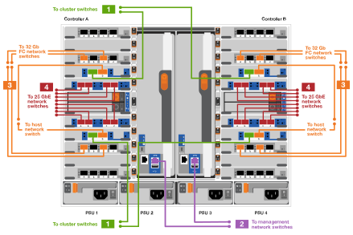

= 詳細步驟- FAS9500
:allow-uri-read: 
:icons: font
:imagesdir: ../media/

[role="lead"]
本文提供安裝典型NetApp系統的詳細逐步指示。如果您需要更詳細的安裝指示、請參閱本文。

== 步驟1：準備安裝

若要安裝系統、您必須在NetApp支援網站上建立帳戶、註冊系統並取得授權金鑰。您也需要為系統庫存適當數量和類型的纜線、並收集特定的網路資訊。

您必須能夠存取 https://hwu.netapp.com["NetApp Hardware Universe"^] 以取得站台需求的相關資訊、以及設定系統的其他資訊。

您可能也想要存取 http://mysupport.netapp.com/documentation/productlibrary/index.html?productID=62286["發行說明ONTAP"^] 如ONTAP 需此系統的詳細資訊、請參閱您的版本的

您必須在網站上提供下列資訊：

* 儲存系統的機架空間
* 2號十字螺絲起子
* 其他網路纜線、可將系統連接至網路交換器、筆記型電腦或主控台、並使用網路瀏覽器

.步驟
. 打開所有包裝箱的內容物。
. 從控制器記錄系統序號。
+
image::../media/drw_ssn_label.svg[DRw SSN標籤]

. 清點並記下您收到的纜線數量和類型。
+
下表列出您可能會收到的纜線類型。如果您收到的纜線未列於表中、請參閱Hardware Universe 《關於找出纜線並識別其用途的資訊》。

+
https://hwu.netapp.com["NetApp Hardware Universe"^]

+
[cols="1,2,1,2"]
|===
| 纜線類型... | 產品編號與長度 | 連接器類型 | 適用於... 

 a| 
25 GbE資料纜線
 a| 
X66240A-05（112-00639）、0.5公尺

X66240A-2（112-00598）、2公尺

X66240A-5（112-00600）、5公尺
| image:../media/oie_cable_sfp_gbe_copper.svg["寬=85px"]  a| 
網路纜線

 a| 
32 GB FC（SFP+ Op）
 a| 
X66250-2（112-00342）、2公尺

X66250-5（112-003444）、5公尺

X66250-15（112-00346）、15公尺
 a| 
image::../media/oie_cable_sfp_gbe_copper.svg[OIE纜線SFP GbE銅線]
 a| 
FC光纖網路纜線

 a| 
40 GbE網路纜線
 a| 
X66100-1（112-00542）、1公尺

X66100-3（112-00543）、3公尺

X66100-5（112-00544）、5公尺
 a| 
image::../media/oie_cable100_gbe_qsfp28.svg[OIE纜線100 GbE qsfp28]
 a| 
乙太網路資料、叢集網路

 a| 
100 GbE纜線
 a| 
X6621B-1（112-00573）、1公尺

X66211B-2（112-00574）、2公尺

X66211B-5（112-00576）、5公尺
 a| 
image::../media/oie_cable100_gbe_qsfp28.svg[OIE纜線100 GbE qsfp28]
 a| 
網路、

乙太網路資料、

叢集網路

 a| 
光纖纜線
 a| 
X6031A（112-00436）、1公尺

X6032A（112-00437）、2公尺

X6033A（112-00438）、3公尺
 a| 
image::../media/oie_cable_fiber_lc_connector.svg[OIE纜線光纖LC連接器]
 a| 
FC光纖網路

 a| 
第6類、RJ-45（訂單相依）
 a| 
零件編號X6585-R6（112-00291）、3公尺

X6562-R6（112-00196）、5公尺
 a| 
image::../media/oie_cable_rj45.svg[OIE纜線RJ45]
 a| 
管理網路與乙太網路資料

 a| 
儲存設備
 a| 
X6031A（112-00436）、1公尺

X6032A（112-00437）、2公尺

X6033A（112-00438）、3公尺
 a| 
image::../media/oie_cable_mini_sas_hd_to_mini_sas_hd.svg[OIE纜線迷你SAS HD到迷你SAS HD]
 a| 
儲存設備

 a| 
micro-USB主控台纜線
 a| 
不適用
 a| 

 a| 
非Windows或Mac筆記型電腦/主控台軟體安裝期間的主控台連線

 a| 
電源線
 a| 
不適用
 a| 
image::../media/oie_cable_power.svg[OIE纜線電源]
 a| 
開啟系統電源

|===
. 檢閱 https://library.netapp.com/ecm/ecm_download_file/ECMLP2862613["《組態指南》ONTAP"^] 並收集該指南所列的必要資訊。

== 步驟2：安裝硬體

您需要在4柱機架或NetApp系統機櫃中（視情況而定）安裝系統。

. 視需要安裝軌道套件。
. 請依照軌道套件隨附的指示來安裝及固定系統。
+

NOTE: 您必須瞭解與系統重量相關的安全顧慮。

+
左側的標籤表示機箱為空、右側的標籤則表示系統已滿。

+
image::../media/drw_9500_lifting_icon.svg[DRw 9500起重圖示]

. 連接纜線管理裝置（如圖所示）。
+
image::../media/drw_9500_cable_management_arms.svg[DRW 9500纜線管理臂]

. 將擋板放在系統正面。

== 步驟3：將控制器連接至網路

您可以使用雙節點無交換式叢集方法或使用叢集互連網路、將控制器連接至網路。

[role="tabbed-block"]
====
.選項1：雙節點無交換器叢集
--
控制器上的管理網路、資料網路和管理連接埠均連接至交換器。兩個控制器上的叢集互連連接埠均已連接好纜線。

您必須聯絡網路管理員、以取得有關將系統連線至交換器的資訊。

將纜線插入連接埠時、請務必檢查纜線拉片的方向。所有網路模組連接埠的纜線拉式彈片均已上線。

image::../media/oie_cable_pull_tab_up.svg[OIE纜線拉片向上]

NOTE: 插入連接器時、您應該會感覺到它卡入到位；如果您沒有感覺到它卡入定位、請將其移除、將其翻轉、然後再試一次。

. 請使用動畫或圖例來完成控制器與交換器之間的佈線：
+
.動畫：雙節點無交換式叢集佈線
video::da08295f-ba8c-4de7-88c3-ae7c0170408d[panopto]
+
image::../media/drw_9500_tnsc_network_cabling.svg[DRW 9500-scc網路纜線]

+
[cols="20%,80%"]
|===
| 步驟 | 在每個控制器上執行 

 a| 
image::../media/oie_legend_icon_1_lg.svg[OIE圖例圖示1 LG]
 a| 
纜線叢集互連連接埠：

** 插槽A4和B4（E4A）
** 插槽A8和B8（e8a）

image::../media/oie_cable100_gbe_qsfp28.svg[OIE纜線100 GbE qsfp28]

 a| 
image::../media/oie_legend_icon_2_lp.svg[OIE圖例圖示2 lp]
 a| 
纜線控制器管理（扳手）連接埠。

image::../media/oie_cable_rj45.svg[OIE纜線RJ45]

 a| 
image::../media/oie_legend_icon_3_o.svg[OIE圖例圖示3 o]
 a| 
纜線32 Gb FC網路交換器：

插槽A3和B3（e3a和e3c）的連接埠、插槽A3和B9（e9a和e9c）的連接埠、連接至32 GB FC網路交換器。

image::../media/oie_cable_sfp_gbe_copper.svg[OIE纜線SFP GbE銅線]

40GbE主機網路交換器：

將插槽A4和B4（e4b）中的主機端b連接埠、插槽A8和B8（e8b）連接至主機交換器。

image::../media/oie_cable100_gbe_qsfp28.svg[OIE纜線100 GbE qsfp28]

 a| 
image::../media/oie_legend_icon_4_dr.svg[OIE圖例圖示4災難恢復]
 a| 
纜線25 GbE連線：

將插槽a5和b5（5a、5b、c和5d）和插槽a7和b7（7a、7b、7c和7d）中的纜線連接埠連接至25 GbE網路交換器。

image::../media/oie_cable_sfp_gbe_copper.svg[OIE纜線SFP GbE銅線]

|===
. 將電源纜線連接至PSU、並將其連接至不同的電源（未顯示）。
. 將纜線固定在纜線管理臂上（未顯示）。
. 若要纜線連接儲存設備、請參閱 <<Step 4: Cable controllers to drive shelves>>。

--
.選項2：交換式叢集
--
控制器上的管理網路、資料網路和管理連接埠均連接至交換器。叢集互連和HA連接埠均以纜線連接至叢集/ HA交換器。

您必須聯絡網路管理員、以取得有關將系統連線至交換器的資訊。

將纜線插入連接埠時、請務必檢查纜線拉片的方向。所有網路模組連接埠的纜線拉式彈片均已上線。

image::../media/oie_cable_pull_tab_up.svg[OIE纜線拉片向上]

NOTE: 插入連接器時、您應該會感覺到它卡入到位；如果您沒有感覺到它卡入定位、請將其移除、將其翻轉、然後再試一次。

. 請使用動畫或圖例來完成控制器與交換器之間的佈線：
+
.動畫-交換式叢集纜線
video::3ad3f118-8339-4683-865f-ae7c0170400c[panopto]
+

+
[cols="20%,80%"]
|===
| 步驟 | 在每個控制器上執行 

 a| 
image::../media/oie_legend_icon_1_lg.svg[OIE圖例圖示1 LG]
 a| 
纜線叢集互連A連接埠：

** 連接至叢集網路交換器的插槽A4和B4（E4A）。
** 插槽A8和B8（e8a）連接至叢集網路交換器。

image::../media/oie_cable100_gbe_qsfp28.svg[OIE纜線100 GbE qsfp28]

 a| 
image::../media/oie_legend_icon_2_lp.svg[OIE圖例圖示2 lp]
 a| 
纜線控制器管理（扳手）連接埠。

image::../media/oie_cable_rj45.svg[OIE纜線RJ45]

 a| 
image::../media/oie_legend_icon_3_o.svg[OIE圖例圖示3 o]
 a| 
纜線32 Gb FC網路交換器：

插槽A3和B3（e3a和e3c）的連接埠、插槽A3和B9（e9a和e9c）的連接埠、連接至32 GB FC網路交換器。

image::../media/oie_cable_sfp_gbe_copper.svg[OIE纜線SFP GbE銅線]

40GbE主機網路交換器：

將插槽A4和B4（e4b）中的主機端b連接埠、插槽A8和B8（e8b）連接至主機交換器。

image::../media/oie_cable100_gbe_qsfp28.svg[OIE纜線100 GbE qsfp28]

 a| 
image::../media/oie_legend_icon_4_dr.svg[OIE圖例圖示4災難恢復]
 a| 
纜線25 GbE連線：

將插槽a5和b5（5a、5b、c和5d）和插槽a7和b7（7a、7b、7c和7d）中的纜線連接埠連接至25 GbE網路交換器。

image::../media/oie_cable_sfp_gbe_copper.svg[OIE纜線SFP GbE銅線]

|===
. 將電源纜線連接至PSU、並將其連接至不同的電源（未顯示）。
. 將纜線固定在纜線管理臂上（未顯示）。
. 若要纜線連接儲存設備、請參閱 <<Step 4: Cable controllers to drive shelves>>。

--
====

== 步驟4：連接磁碟機櫃的纜線控制器

您必須將機櫃對機櫃連線纜線、然後將兩個控制器纜線連接至DS212C或DS224C磁碟機櫃。

NOTE: 如需更多SAS纜線連接資訊和工作表、請參閱 https://docs.netapp.com/us-en/ontap-systems/sas3/overview-cabling-rules-examples.html["SAS纜線佈線規則、工作表和範例總覽-搭載IOM12模組的磁碟櫃"^]

.開始之前
* 填寫系統的SAS纜線工作表。請參閱 https://docs.netapp.com/us-en/ontap-systems/sas3/overview-cabling-rules-examples.html["SAS纜線佈線規則、工作表和範例總覽-搭載IOM12模組的磁碟櫃"^]。
* 請務必檢查圖示箭頭、以瞭解纜線連接器的拉式彈片方向是否正確。儲存模組的纜線拉片朝上、而磁碟櫃上的拉片則朝下。

image::../media/oie_cable_pull_tab_up.svg[OIE纜線拉片向上]

image::../media/oie_cable_pull_tab_down.svg[OIE纜線下拉式彈片]

NOTE: 插入連接器時、您應該會感覺到它卡入到位；如果您沒有感覺到它卡入定位、請將其移除、將其翻轉、然後再試一次。

. 請使用下列動畫或圖片、將控制器連接至三個（一疊磁碟機櫃、一疊兩個磁碟機櫃）DS224C磁碟機櫃。
+
.動畫：磁碟機櫃佈線
video::c958aae6-9d08-4d3d-a213-ae7c017040cd[panopto]
+
image::../media/drw_9500_sas_shelf_cabling.svg[DRW 9500-SAS機櫃佈線]

+
[cols="20%,80%"]
|===
| 步驟 | 在每個控制器上執行 

 a| 
image::../media/oie_legend_icon_1_mb.svg[OIE圖例圖示1 MB]
 a| 
使用圖示將磁碟機櫃堆疊1連接至控制器、以供參考。

image::../media/oie_cable_mini_sas_hd_to_mini_sas_hd.svg[OIE纜線迷你SAS HD到迷你SAS HD]

Mini-SAS纜線

 a| 
image::../media/oie_legend_icon_2_t.svg[OIE圖例圖示2 t]
 a| 
使用圖示將磁碟機櫃堆疊2連接至控制器、以供參考。

image::../media/oie_cable_mini_sas_hd_to_mini_sas_hd.svg[OIE纜線迷你SAS HD到迷你SAS HD]

Mini-SAS纜線

|===
. 若要完成系統設定、請參閱 <<Step 5: Complete system setup and configuration>>。

== 步驟5：完成系統設定與組態設定

您只需連線至交換器和筆記型電腦、或直接連線至系統中的控制器、然後連線至管理交換器、即可使用叢集探索功能完成系統設定和組態。

[role="tabbed-block"]
====
.選項1：如果已啟用網路探索
--
如果您的筆記型電腦已啟用網路探索功能、您可以使用自動叢集探索來完成系統設定與組態。

. 使用下列動畫或繪圖來設定一或多個磁碟機櫃ID：
+
.動畫-設定您的機櫃ID&#8217/s
video::95a29da1-faa3-4ceb-8a0b-ac7600675aa6[panopto]
+
image::../media/drw_power-on_set_shelf_ID_set.svg[在設定機櫃ID集上啟動的DRW]

+
[cols="20%,80%"]
|===

 a| 
image::../media/legend_icon_01.svg[圖例圖示01]
 a| 
取下端蓋。

 a| 
image::../media/legend_icon_02.svg[圖例圖示02]
 a| 
按住機櫃ID按鈕、直到第一位數開始閃燈、然後按下以前進至0-9。

NOTE: 第一個數字會持續閃爍

 a| 
image::../media/legend_icon_03.svg[圖例圖示03]
 a| 
按住機櫃ID按鈕、直到第二位數開始閃爍、然後按下以前進至0-9。

NOTE: 第一位數會停止閃爍、第二位數會繼續閃爍。

 a| 
image::../media/legend_icon_04.svg[圖例圖示04]
 a| 
更換端蓋。

 a| 

 a| 
等待10秒鐘、等待黃色LED（！） 如需顯示、請關閉磁碟機櫃電源、然後重新開啟以設定機櫃ID。

|===
. 將電源線插入控制器電源供應器、然後將電源線連接至不同電路上的電源。
. 開啟兩個節點的電源開關。
+
.動畫-開啟控制器的電源
video::a905e56e-c995-4704-9673-adfa0005a891[panopto]
+
image::../media/drw_9500_power-on.svg[已開啟DRW 9500電源]

+

NOTE: 初始開機最多可能需要八分鐘。

. 請確定您的筆記型電腦已啟用網路探索功能。
+
如需詳細資訊、請參閱筆記型電腦的線上說明。

. 請使用下列動畫將筆記型電腦連線至管理交換器。
+
.動畫：將筆記型電腦連接至管理交換器
video::d61f983e-f911-4b76-8b3a-ab1b0066909b[panopto]
+
image::../media/dwr_laptop_to_switch_only.svg[DWR筆記型電腦只能切換]

. 選取ONTAP 列出的功能表圖示以探索：
+
image::../media/drw_autodiscovery_controler_select.svg[選擇「自動探索控制器」]

+
.. 開啟檔案總管。
.. 按一下左窗格中的網路。
.. 按一下滑鼠右鍵、然後選取重新整理。
.. 按兩下ONTAP 任一個「資訊」圖示、並接受畫面上顯示的任何憑證。
+

NOTE: XXXXX是目標節點的系統序號。

+
系統管理程式隨即開啟。

. 使用System Manager引導式設定、使用您在中收集的資料來設定系統 https://library.netapp.com/ecm/ecm_download_file/ECMLP2862613["《組態指南》ONTAP"^]。
. 設定您的帳戶並下載Active IQ Config Advisor 更新：
+
.. 登入現有帳戶或建立帳戶。
+
https://mysupport.netapp.com/eservice/public/now.do["NetApp支援註冊"^]

.. 註冊您的系統。
+
https://mysupport.netapp.com/eservice/registerSNoAction.do?moduleName=RegisterMyProduct["NetApp產品註冊"^]

.. 下載Active IQ Config Advisor
+
https://mysupport.netapp.com/site/tools/tool-eula/activeiq-configadvisor["NetApp下載Config Advisor"^]

. 執行Config Advisor 下列項目來驗證系統的健全狀況：
. 完成初始組態之後、請前往 https://www.netapp.com/data-management/oncommand-system-documentation/["S-&《系統管理程式文件》資源ONTAP ONTAP"^] 頁面、以取得有關設定ONTAP 其他功能的資訊。

--
.選項2：如果未啟用網路探索
--
如果您未使用Windows或Mac型筆記型電腦或主控台、或未啟用自動探索、則必須使用此工作完成組態設定。

. 連接纜線並設定筆記型電腦或主控台：
+
.. 使用N-8-1將筆記型電腦或主控台的主控台連接埠設為115200鮑。
+

NOTE: 請參閱筆記型電腦或主控台的線上說明、瞭解如何設定主控台連接埠。

.. 使用系統隨附的主控台纜線將主控台纜線連接至筆記型電腦或主控台、然後將筆記型電腦連接至管理子網路上的交換器。
+
image::../media/drw_9500_cable_console_switch_controller.svg[DRW 9500纜線主控台交換器控制器]

.. 使用管理子網路上的TCP/IP位址指派給筆記型電腦或主控台。

. 請使用下列動畫來設定一或多個磁碟機櫃ID：
+
.動畫-設定您的機櫃ID&#8217/s
video::95a29da1-faa3-4ceb-8a0b-ac7600675aa6[panopto]
+
image::../media/drw_power-on_set_shelf_ID_set.svg[在設定機櫃ID集上啟動的DRW]

+
[cols="20%,80%"]
|===

 a| 
image::../media/legend_icon_01.svg[圖例圖示01]
 a| 
取下端蓋。

 a| 
image::../media/legend_icon_02.svg[圖例圖示02]
 a| 
按住機櫃ID按鈕、直到第一位數開始閃燈、然後按下以前進至0-9。

NOTE: 第一個數字會持續閃爍

 a| 
image::../media/legend_icon_03.svg[圖例圖示03]
 a| 
按住機櫃ID按鈕、直到第二位數開始閃爍、然後按下以前進至0-9。

NOTE: 第一位數會停止閃爍、第二位數會繼續閃爍。

 a| 
image::../media/legend_icon_04.svg[圖例圖示04]
 a| 
更換端蓋。

 a| 

 a| 
等待10秒鐘、等待黃色LED（！） 如需顯示、請關閉磁碟機櫃電源、然後重新開啟以設定機櫃ID。

|===
. 將電源線插入控制器電源供應器、然後將電源線連接至不同電路上的電源。
. 開啟兩個節點的電源開關。
+
.動畫-開啟控制器的電源
video::a905e56e-c995-4704-9673-adfa0005a891[panopto]
+
image::../media/drw_9500_power-on.svg[已開啟DRW 9500電源]

+

NOTE: 初始開機最多可能需要八分鐘。

. 將初始節點管理IP位址指派給其中一個節點。
+
[cols="1,2"]
|===
| 如果管理網路有DHCP ... | 然後... 

 a| 
已設定
 a| 
記錄指派給新控制器的IP位址。

 a| 
未設定
 a| 
.. 使用Putty、終端機伺服器或您環境的等效產品來開啟主控台工作階段。
+

NOTE: 如果您不知道如何設定Putty、請查看筆記型電腦或主控台的線上說明。

.. 在指令碼提示時輸入管理IP位址。

|===
. 使用筆記型電腦或主控台上的System Manager來設定叢集：
+
.. 將瀏覽器指向節點管理IP位址。
+

NOTE: 地址格式為+https://x.x.x.x+。

.. 使用您在中收集的資料來設定系統 https://library.netapp.com/ecm/ecm_download_file/ECMLP2862613["《組態指南》ONTAP"^] 。

. 設定您的帳戶並下載Active IQ Config Advisor 更新：
+
.. 登入現有帳戶或建立帳戶。
+
https://mysupport.netapp.com/eservice/public/now.do["NetApp支援註冊"^]

.. 註冊您的系統。
+
https://mysupport.netapp.com/eservice/registerSNoAction.do?moduleName=RegisterMyProduct["NetApp產品註冊"^]

.. 下載Active IQ Config Advisor
+
https://mysupport.netapp.com/site/tools/tool-eula/activeiq-configadvisor["NetApp下載Config Advisor"^]

. 執行Config Advisor 下列項目來驗證系統的健全狀況：
. 完成初始組態之後、請前往 https://www.netapp.com/data-management/oncommand-system-documentation/["S-&《系統管理程式文件》資源ONTAP ONTAP"^] 頁面、以取得有關設定ONTAP 其他功能的資訊。

--
====