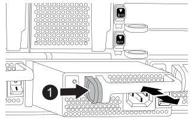

= 交換電源供應器- FAS9500
:allow-uri-read: 
:icons: font
:imagesdir: ../media/

[role="lead"]
交換電源供應器包括關閉、拔下及移除電源供應器、以及安裝、連接及開啟更換的電源供應器。

系統中的所有其他元件都必須正常運作；否則、您必須聯絡技術支援部門。

.關於這項工作
* 電源供應器備援且可熱交換。
* 本程序是針對一次更換一個電源供應器而撰寫。
+

NOTE: 最好是在從機箱中取出電源供應器的兩分鐘內進行更換。系統仍可繼續運作、但ONTAP 在更換電源供應器之前、無法將降級電源供應器的相關訊息傳送至主控台。

* 系統中有四個電源供應器。
* 電源供應器為自動調整範圍。
+

IMPORTANT: 請勿混用不同效率額定值的PSU。永遠像這樣更換。

.步驟
. 根據主控台錯誤訊息或電源供應器上的LED、識別您要更換的電源供應器。
. 如果您尚未接地、請正確接地。
. 關閉電源供應器並拔下電源線：
+
.. 關閉電源供應器上的電源開關。
.. 打開電源線固定器、然後從電源供應器拔下電源線。

. 按住電源供應器握把上的Terra cotta按鈕、然後將電源供應器從機箱中拉出。
+

CAUTION: 移除電源供應器時、請務必用兩隻手支撐其重量。

+
.動畫-移除/安裝PSU
video::590b3414-6ea5-42b2-b7f4-ae78004b86a4[panopto]
+

+
[cols="20%,80%"]
|===

 a| 
image::../media/legend_icon_01.svg[圖例圖示01]
 a| 
鎖定按鈕

|===
. 確定新電源供應器的開關位於「關閉」位置。
. 用兩隻手支撐電源供應器邊緣、並將其與系統機箱的開孔對齊、然後將電源供應器輕推入機箱、直到鎖定到位。
+
電源供應器採用鎖定式設計、只能以單一方式安裝。

+

IMPORTANT: 將電源供應器滑入系統時、請勿過度施力。您可能會損壞連接器。

. 重新連接電源供應器纜線：
+
.. 將電源線重新連接至電源供應器。
.. 使用電源線固定器將電源線固定至電源供應器。
+
電源恢復後、狀態LED應為綠色。

. 開啟新電源供應器的電源、然後確認電源供應器活動LED的運作。
+
當PSU完全插入機箱時、綠色電源LED會亮起、而黃色警示LED會開始閃爍、但會在幾分鐘後關閉。

. 如套件隨附的RMA指示所述、將故障零件退回NetApp。如 https://mysupport.netapp.com/site/info/rma["零件退貨與更換"^]需詳細資訊、請參閱頁面。

