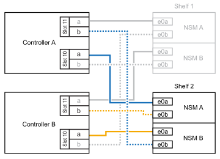
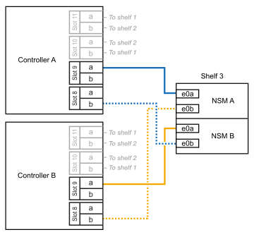

= 連接 AFF 系統的纜線架 - NS224 機櫃
:allow-uri-read: 
:icons: font
:imagesdir: ../media/

[role="lead"]
每個要熱新增的 NS224 機櫃都要連接纜線、以便每個機櫃都有兩個連線至 HA 配對中的每個控制器。

.關於這項工作
您的硬體系統可能與配備 NSM100 模組的 NS224 機櫃和配備 NSM100B 模組的 NS224 機櫃相容。若要檢查硬體和機櫃的相容性和連接埠名稱，請參閱 https://hwu.netapp.com["NetApp Hardware Universe"]。

.連接至 AFF A1K 的纜線架
[%collapsible]
====
您可以將最多三個額外的 NS224 機櫃（總共四個機櫃）熱新增至 AFF A1K HA 配對。

.開始之前
* 您必須已檢閱 link:requirements-hot-add-shelf.html["熱新增需求和最佳實務做法"]。
* 您必須已完成中的適用程序 link:prepare-hot-add-shelf.html["準備熱新增機櫃"]。
* 您必須已安裝機櫃、開啟電源、並依照中所述設定機櫃 ID link:prepare-hot-add-shelf.html["安裝用於熱新增的機櫃"]。

.關於這項工作
* 本程序假設您的 HA 配對至少有一個現有的 NS224 機櫃。
* 此程序可解決下列熱新增案例：
+
** 在 HA 配對中熱新增第二個機櫃、每個控制器都有兩個具備切換功能的 I/O 模組。（您已安裝第二個 I/O 模組、並將第一個機櫃重新連接至兩個 I/O 模組、或是已將第一個機櫃連接至兩個 I/O 模組。將第二個機櫃連接至兩個 I/O 模組）。
** 在 HA 配對中熱新增第三個機櫃、每個控制器都有三個具備切換功能的 I/O 模組。（您已安裝第三個 I/O 模組、並將第三個機櫃連接至第三個 I/O 模組）。
** 在 HA 配對中熱新增第三個機櫃、每個控制器都有四個具備切換功能的 I/O 模組。（您已安裝第三和第四個 I/O 模組、並將第三個機櫃連接至第三和第四個 I/O 模組）。
** 在 HA 配對中熱新增第四個機櫃、每個控制器都有四個具備切換功能的 I/O 模組。（您已安裝第四個 I/O 模組、並將第三個機櫃重新連接至第三個和第四個 I/O 模組、或已將第三個機櫃連接至第三個和第四個 I/O 模組。將第四個機櫃連接至第三個和第四個 I/O 模組）。

.步驟
. 如果您要熱新增的NS224磁碟櫃是HA配對中的第二個NS224磁碟櫃、請完成下列子步驟。
+
否則、請前往下一步。

+
.. 纜線櫃NSM A連接埠e0a、用於控制器A插槽10連接埠A（E10A）。
.. 纜線櫃NSM A連接埠e0b至控制器B插槽11連接埠b（e11b）。
.. 纜線櫃NSM B連接埠e0A至控制器B插槽10連接埠A（E10A）。
.. 纜線櫃NSM B連接埠e0b至控制器A插槽11連接埠b（e11b）。
+
下圖重點說明 HA 配對中第二個機櫃的纜線、每個控制器中有兩個具備切換功能的 I/O 模組：

+

. 如果您要熱新增的 NS224 機櫃是 HA 配對中的第三個 NS224 機櫃、每個控制器中有三個具備切換功能的 I/O 模組、請完成下列子步驟。否則、請前往下一步。
+
.. 纜線架 NSM A 連接埠 e0a 至控制器插槽 9 連接埠 A （ e9a ）。
.. 纜線櫃NSM A連接埠e0b至控制器B插槽9連接埠b（e9b）。
.. 纜線架 NSM B 連接埠 e0A 至控制器 B 插槽 9 連接埠 A （ e9a ）。
.. 纜線櫃NSM B連接埠e0b至控制器A插槽9連接埠b（e9b）。
+
下圖重點說明 HA 配對中第三個機櫃的纜線、每個控制器中有三個具備切入功能的 I/O 模組：

+
image::../media/drw_ns224_vino_m_3shelves_3cards_ieops-1643.svg[AFF / ASA A1K 纜線，含三個機櫃和三個 IO 模組]

. 如果您要熱新增的 NS224 機櫃是 HA 配對中的第三個 NS224 機櫃、每個控制器中有四個具備切換功能的 I/O 模組、請完成下列子步驟。否則、請前往下一步。
+
.. 纜線架 NSM A 連接埠 e0a 至控制器插槽 9 連接埠 A （ e9a ）。
.. 纜線櫃NSM A連接埠e0b至控制器B插槽8連接埠b（e8b）。
.. 纜線架 NSM B 連接埠 e0A 至控制器 B 插槽 9 連接埠 A （ e9a ）。
.. 纜線櫃NSM B連接埠e0b至控制器A插槽8連接埠b（e8b）。
+
下圖重點說明 HA 配對中第三個機櫃的纜線、每個控制器中有四個具備切入功能的 I/O 模組：

+

. 如果您要熱新增的 NS224 機櫃是 HA 配對中的第四個 NS224 機櫃、每個控制器中有四個具備切換功能的 I/O 模組、請完成下列子步驟。
+
.. 纜線架 NSM A 連接埠 e0a 至控制器插槽 8 連接埠 A （ e8a ）。
.. 纜線櫃NSM A連接埠e0b至控制器B插槽9連接埠b（e9b）。
.. 纜線架 NSM B 連接埠 e0A 至控制器 B 插槽 8 連接埠 A （ e8a ）。
.. 纜線櫃NSM B連接埠e0b至控制器A插槽9連接埠b（e9b）。
+
下圖重點說明 HA 配對中第四個機櫃的纜線、每個控制器中有四個具備切入功能的 I/O 模組：

+
image::../media/drw_ns224_vino_m_4shelves_4cards_ieops-1645.svg[AFF / ASA A1K 纜線，含四個機櫃和四個 IO 模組]

. 使用驗證熱添加的機櫃是否已正確連接 https://mysupport.netapp.com/site/tools/tool-eula/activeiq-configadvisor["Active IQ Config Advisor"^]。
+
如果產生任何纜線錯誤、請遵循所提供的修正行動。

.接下來呢？
如果您在準備此程序時停用了自動磁碟機指派、則需要手動指派磁碟機所有權、然後視需要重新啟用自動磁碟機指派。前往 link:complete-hot-add-shelf.html["完成熱新增"]。

否則、您就會完成熱新增機櫃程序。

====
.連接至 AFF A20 的纜線架
[%collapsible]
====
當需要額外儲存（至內部機櫃）時，您可以將一個 NS224 機櫃熱新增至 AFF A20 HA 配對。

.開始之前
* 您必須已檢閱 link:requirements-hot-add-shelf.html["熱新增需求和最佳實務做法"]。
* 您必須已完成中的適用程序 link:prepare-hot-add-shelf.html["準備熱新增機櫃"]。
* 您必須已安裝機櫃、開啟電源、並依照中所述設定機櫃 ID link:prepare-hot-add-shelf.html["安裝用於熱新增的機櫃"]。

.關於這項工作
* 本程序假設您的 HA 配對只有內部儲存設備（無外部機櫃），而且您正在熱新增至一個額外機櫃。
* 此程序可解決下列熱新增案例：
+
** 將第一個機櫃熱新增至 HA 配對、並在每個控制器中使用一個具備切換功能的 I/O 模組。
** 將第一個機櫃熱新增至 HA 配對、每個控制器都有兩個具備切換功能的 I/O 模組。

* 這些系統與 NSM100 模組的 NS224 機櫃和 NSM100B 模組的 NS224 機櫃相容。為確保將控制器連接至正確的連接埠，請將每個圖表中的「 X 」取代為模組的正確連接埠編號：
+
[cols="1,4"]
|===
| 模組類型 | 連接埠標籤 

 a| 
NSM100
 a| 
"0"

例如 e0a

 a| 
NSM100B
 a| 
"1"

例如： e1a.

|===

.步驟
. 如果您要在每個控制器模組中使用一組具備切換功能的連接埠（一個具備切換功能的 I/O 模組）來熱新增一個機櫃、而且這是 HA 配對中唯一的 NS224 機櫃、請完成下列子步驟。
+
否則、請前往下一步。

+

NOTE: 此步驟假設您已在插槽 3 中安裝具備 ROCE 功能的 I/O 模組。

+
.. 纜線架 NSM A 連接埠 exa 至控制器插槽 3 連接埠 A （ e3a ）。
.. 纜線架 NSM A 連接埠 EXB 至控制器 B 插槽 3 連接埠 b （ e3b ）。
.. 纜線架 NSM B 連接埠 exa 至控制器 B 插槽 3 連接埠 A （ e3a ）。
.. 纜線架 NSM B 連接埠 EXB 至控制器 A 插槽 3 連接埠 b （ e3b ）。
+
下圖顯示使用每個控制器模組中一個具備RoCE功能的I/O模組、連接一個熱新增機櫃的纜線：

+
image::../media/drw_ns224_g_1shelf_1card_ieops-2002.svg[AFF / ASA A20 纜線，含一個機櫃和一個 IO 模組]

. 如果您要在每個控制器模組中使用兩組具備 ROCE 功能的連接埠（兩個具備 ROCE 功能的 I/O 模組）來熱新增一個機櫃，請完成下列子步驟。
+
.. 纜線 NSM A 連接埠 exa 至控制器 A 插槽 3 連接埠 A （ e3a ）。
.. 纜線 NSM A 連接埠 EXB 至控制器 B 插槽 1 連接埠 b （ e1b ）。
.. 將 NSM B 連接埠 exa 連接至控制器 B 插槽 3 連接埠 A （ e3a ）。
.. 將 NSM B 連接埠 EXB 連接至控制器 A 插槽 1 連接埠 b （ e1b ）。

下圖顯示每個控制器模組中使用兩個具備切換功能的 I/O 模組、為一個熱新增機櫃佈線的情況：

image::../media/drw_ns224_g_1shelf_2card_ieops-2005.svg[AFF / ASA A20 纜線，含一個機櫃和兩個 IO 模組]

. 使用驗證熱添加的機櫃是否已正確連接 https://mysupport.netapp.com/site/tools/tool-eula/activeiq-configadvisor["Active IQ Config Advisor"^]。
+
如果產生任何纜線錯誤、請遵循所提供的修正行動。

.接下來呢？
如果您在準備此程序時停用了自動磁碟機指派、則需要手動指派磁碟機所有權、然後視需要重新啟用自動磁碟機指派。前往 link:complete-hot-add-shelf.html["完成熱新增"]。

否則、您就會完成熱新增機櫃程序。

====
.連接至 AFF A30 ， AFF A50 ， AFF C30 或 AFF C60 的纜線架
[%collapsible]
====
當需要額外儲存（至內部機櫃）時，您最多可以將兩個 NS224 機櫃熱新增至 AFF A30 ， AFF C30 ， AFF A50 或 AFF C60 HA 配對。

.開始之前
* 您必須已檢閱 link:requirements-hot-add-shelf.html["熱新增需求和最佳實務做法"]。
* 您必須已完成中的適用程序 link:prepare-hot-add-shelf.html["準備熱新增機櫃"]。
* 您必須已安裝機櫃、開啟電源、並依照中所述設定機櫃 ID link:prepare-hot-add-shelf.html["安裝用於熱新增的機櫃"]。

.關於這項工作
* 本程序假設您的 HA 配對只有內部儲存設備（無外部機櫃），而且每個控制器中最多可熱新增兩個額外機櫃和兩個具備切換功能的 I/O 模組。
* 此程序可解決下列熱新增案例：
+
** 將第一個機櫃熱新增至 HA 配對、並在每個控制器中使用一個具備切換功能的 I/O 模組。
** 將第一個機櫃熱新增至 HA 配對、每個控制器都有兩個具備切換功能的 I/O 模組。
** 熱 - 將第二個機櫃新增至 HA 配對、每個控制器都有兩個具備切換功能的 I/O 模組。

* 這些系統與 NSM100 模組的 NS224 機櫃和 NSM100B 模組的 NS224 機櫃相容。為確保將控制器連接至正確的連接埠，請將每個圖表中的「 X 」取代為模組的正確連接埠編號：
+
[cols="1,4"]
|===
| 模組類型 | 連接埠標籤 

 a| 
NSM100
 a| 
"0"

例如 e0a

 a| 
NSM100B
 a| 
"1"

例如： e1a.

|===

.步驟
. 如果您要在每個控制器模組中使用一組具備切換功能的連接埠（一個具備切換功能的 I/O 模組）來熱新增一個機櫃、而且這是 HA 配對中唯一的 NS224 機櫃、請完成下列子步驟。
+
否則、請前往下一步。

+

NOTE: 此步驟假設您已在插槽 3 中安裝具備 ROCE 功能的 I/O 模組。

+
.. 纜線架 NSM A 連接埠 exa 至控制器插槽 3 連接埠 A （ e3a ）。
.. 纜線架 NSM A 連接埠 EXB 至控制器 B 插槽 3 連接埠 b （ e3b ）。
.. 纜線架 NSM B 連接埠 exa 至控制器 B 插槽 3 連接埠 A （ e3a ）。
.. 纜線架 NSM B 連接埠 EXB 至控制器 A 插槽 3 連接埠 b （ e3b ）。
+
下圖顯示使用每個控制器模組中一個具備RoCE功能的I/O模組、連接一個熱新增機櫃的纜線：

+
image::../media/drw_ns224_g_1shelf_1card_ieops-2002.svg[AFF / ASA A30 的纜線,452px,AFF/ASA A50]

. 如果您在每個控制器模組中使用兩組具備RoCE功能的連接埠（兩個具備RoCE功能的I/O模組）熱新增一或兩個磁碟櫃、請完成適用的子步驟。
+

NOTE: 此步驟假設您已在插槽 3 和 1 中安裝具備 ROCE 功能的 I/O 模組。

+
[cols="1,3"]
|===
| 磁碟櫃 | 纜線 

 a| 
機櫃1.
 a| 
.. 纜線 NSM A 連接埠 exa 至控制器 A 插槽 3 連接埠 A （ e3a ）。
.. 纜線 NSM A 連接埠 EXB 至控制器 B 插槽 1 連接埠 b （ e1b ）。
.. 將 NSM B 連接埠 exa 連接至控制器 B 插槽 3 連接埠 A （ e3a ）。
.. 將 NSM B 連接埠 EXB 連接至控制器 A 插槽 1 連接埠 b （ e1b ）。
.. 如果您要快速新增第二個擱板，請完成「`擱板 2`」子步驟；否則，請前往下一步。

下圖顯示每個控制器模組中使用兩個具備切換功能的 I/O 模組、為一個熱新增機櫃佈線的情況：

image::../media/drw_ns224_g_1shelf_2card_ieops-2005.svg[AFF / ASA A30 的纜線,452px,AFF/ASA A50]

 a| 
機櫃2.
 a| 
.. 纜線 NSM A 連接埠 exa 至控制器插槽 1 連接埠 A （ e1a ）。
.. 纜線 NSM A 連接埠 EXB 至控制器 B 插槽 3 連接埠 b （ e3b ）。
.. 將 NSM B 連接埠 exa 連接至控制器 B 插槽 1 連接埠 A （ e1a ）。
.. 將 NSM B 連接埠 EXB 連接至控制器 A 插槽 3 連接埠 b （ e3b ）。
.. 前往下一步。

下圖顯示使用每個控制器模組中兩個具備 CE 功能的 I/O 模組、為兩個熱新增機櫃進行纜線連接：

image::../media/drw_ns224_g_2shelf_2card_ieops-2003.svg[AFF ASA 纜線,452px,AFF/ASA A50]

|===
. 使用驗證熱添加的機櫃是否已正確連接 https://mysupport.netapp.com/site/tools/tool-eula/activeiq-configadvisor["Active IQ Config Advisor"^]。
+
如果產生任何纜線錯誤、請遵循所提供的修正行動。

.接下來呢？
如果您在準備此程序時停用了自動磁碟機指派、則需要手動指派磁碟機所有權、然後視需要重新啟用自動磁碟機指派。前往 link:complete-hot-add-shelf.html["完成熱新增"]。

否則、您就會完成熱新增機櫃程序。

====
.連接至 AFF A70 ， AFF A90 或 AFF C80 的纜線架
[%collapsible]
====
當需要額外儲存（至內部機櫃）時，您最多可以將兩個 NS224 機櫃熱新增至 AFF A70 ， AFF A90 或 AFF C80 HA 配對。

.開始之前
* 您必須已檢閱 link:requirements-hot-add-shelf.html["熱新增需求和最佳實務做法"]。
* 您必須已完成中的適用程序 link:prepare-hot-add-shelf.html["準備熱新增機櫃"]。
* 您必須已安裝機櫃、開啟電源、並依照中所述設定機櫃 ID link:prepare-hot-add-shelf.html["安裝用於熱新增的機櫃"]。

.關於這項工作
* 本程序假設您的 HA 配對只有內部儲存設備（無外部機櫃）、而且每個控制器中最多可熱新增兩個額外機櫃和兩個具備切換功能的 I/O 模組。
* 此程序可解決下列熱新增案例：
+
** 將第一個機櫃熱新增至 HA 配對、並在每個控制器中使用一個具備切換功能的 I/O 模組。
** 將第一個機櫃熱新增至 HA 配對、每個控制器都有兩個具備切換功能的 I/O 模組。
** 熱 - 將第二個機櫃新增至 HA 配對、每個控制器都有兩個具備切換功能的 I/O 模組。

.步驟
. 如果您要在每個控制器模組中使用一組具備切換功能的連接埠（一個具備切換功能的 I/O 模組）來熱新增一個機櫃、而且這是 HA 配對中唯一的 NS224 機櫃、請完成下列子步驟。
+
否則、請前往下一步。

+

NOTE: 此步驟假設您已在插槽 11 中安裝具備 ROCE 功能的 I/O 模組。

+
.. 纜線櫃NSM A連接埠e0a、用於控制器A插槽11連接埠A（e11a）。
.. 纜線櫃NSM A連接埠e0b至控制器B插槽11連接埠b（e11b）。
.. 纜線櫃NSM B連接埠e0A至控制器B插槽11連接埠A（e11a）。
.. 纜線櫃NSM B連接埠e0b至控制器A插槽11連接埠b（e11b）。
+
下圖顯示使用每個控制器模組中一個具備RoCE功能的I/O模組、連接一個熱新增機櫃的纜線：

+
image::../media/drw_ns224_vino_i_1shelf_1card_ieops-1639.svg[AFF / ASA A70 或 A90 的纜線，含一個機櫃和一個 IO 模組]

. 如果您在每個控制器模組中使用兩組具備RoCE功能的連接埠（兩個具備RoCE功能的I/O模組）熱新增一或兩個磁碟櫃、請完成適用的子步驟。
+

NOTE: 此步驟假設您已在插槽 11 和 8 中安裝具備 ROCE 功能的 I/O 模組。

+
[cols="1,3"]
|===
| 磁碟櫃 | 纜線 

 a| 
機櫃1.
 a| 
.. 將NSM A連接埠e0a纜線連接至控制器A插槽11連接埠A（e11a）。
.. 將NSM A連接埠e0b纜線連接至控制器B插槽8連接埠b（e8b）。
.. 將NSM B連接埠e0A纜線連接至控制器B插槽11連接埠A（e11a）。
.. 將NSM B連接埠e0b纜線連接至控制器A插槽8連接埠b（e8b）。
.. 如果您要快速新增第二個擱板，請完成「`擱板 2`」子步驟；否則，請前往下一步。

下圖顯示每個控制器模組中使用兩個具備切換功能的 I/O 模組、為一個熱新增機櫃佈線的情況：

image::../media/drw_ns224_vino_i_1shelf_2cards_ieops-1640.svg[配備一個機櫃和兩個 IO 模組的 AFF / ASA A70 或 A90 纜線]

 a| 
機櫃2.
 a| 
.. 將NSM A連接埠e0a纜線連接至控制器A插槽8連接埠A（e8a）。
.. 將NSM A連接埠e0b纜線連接至控制器B插槽11連接埠b（e11b）。
.. 將NSM B連接埠e0A纜線連接至控制器B插槽8連接埠A（e8a）。
.. 將NSM B連接埠e0b纜線連接至控制器A插槽11連接埠b（e11b）。
.. 前往下一步。

下圖顯示使用每個控制器模組中兩個具備 CE 功能的 I/O 模組、為兩個熱新增機櫃進行纜線連接：

image::../media/drw_ns224_vino_i_2shelves_2cards_ieops-1641.svg[配備兩個機櫃和兩個 IO 模組的 AFF / ASA A70 或 A90 纜線]

|===
. 使用驗證熱添加的機櫃是否已正確連接 https://mysupport.netapp.com/site/tools/tool-eula/activeiq-configadvisor["Active IQ Config Advisor"^]。
+
如果產生任何纜線錯誤、請遵循所提供的修正行動。

.接下來呢？
如果您在準備此程序時停用了自動磁碟機指派、則需要手動指派磁碟機所有權、然後視需要重新啟用自動磁碟機指派。前往 link:complete-hot-add-shelf.html["完成熱新增"]。

否則、您就會完成熱新增機櫃程序。

====
.連接至 AFF A250 或 AFF C250 的纜線架
[%collapsible]
====
當需要額外儲存時、您最多可以在 AFF A250 或 AFF C250 HA 配對中熱新增一個 NS224 機櫃。

.開始之前
* 您必須已檢閱 link:requirements-hot-add-shelf.html["熱新增需求和最佳實務做法"]。
* 您必須已完成中的適用程序 link:prepare-hot-add-shelf.html["準備熱新增機櫃"]。
* 您必須已安裝機櫃、開啟電源、並依照中所述設定機櫃 ID link:prepare-hot-add-shelf.html["安裝用於熱新增的機櫃"]。

.關於這項工作
從平台機箱背面看、左側的RoCE卡連接埠為連接埠「a」（e1a）、右側連接埠為連接埠「b」（e1b）。

.步驟
. 纜線連接機櫃：
+
.. 纜線櫃NSM A連接埠e0a、用於控制器A插槽1連接埠A（e1a）。
.. 纜線櫃NSM A連接埠e0b至控制器B插槽1連接埠b（e1b）。
.. 纜線櫃NSM B連接埠e0A至控制器B插槽1連接埠A（e1a）。
.. 纜線櫃NSM B連接埠e0b連接至控制器A插槽1連接埠b（e1b）。+下圖顯示機櫃佈線完成後的情形。
+
image::../media/drw_ns224_a250_c250_f500f_1shelf_ieops-1824.svg[使用一個 NS224 機櫃和一組 PCIe 卡連接埠的 AFF / ASA A250 C250 或 FAS500f 纜線]

. 使用驗證熱添加的機櫃是否已正確連接 https://mysupport.netapp.com/site/tools/tool-eula/activeiq-configadvisor["Active IQ Config Advisor"^]。
+
如果產生任何纜線錯誤、請遵循所提供的修正行動。

.接下來呢？
如果您在準備此程序時停用了自動磁碟機指派、則需要手動指派磁碟機所有權、然後視需要重新啟用自動磁碟機指派。前往 link:complete-hot-add-shelf.html["完成熱新增"]。

否則、您就會完成熱新增機櫃程序。

====
.連接至 AFF A400 或 AFF C400 的纜線架
[%collapsible]
====
如何為 NS224 機櫃接線以進行熱新增、取決於您是否有 AFF A400 或 AFF C400 HA 配對。

.開始之前
* 您必須已檢閱 link:requirements-hot-add-shelf.html["熱新增需求和最佳實務做法"]。
* 您必須已完成中的適用程序 link:prepare-hot-add-shelf.html["準備熱新增機櫃"]。
* 您必須已安裝機櫃、開啟電源、並依照中所述設定機櫃 ID link:prepare-hot-add-shelf.html["安裝用於熱新增的機櫃"]。

* 連接至 AFF A400 HA 配對的纜線架 *

對於 AFF A400 HA 配對、您可以熱新增最多兩個機櫃、並視需要使用板載連接埠 e0c/e0d 和插槽 5 中的連接埠。

.步驟
. 如果您要在每個控制器上使用一組具備切換功能的連接埠（內建具備切換功能的連接埠）來熱新增一個機櫃、而且這是 HA 配對中唯一的 NS224 機櫃、請完成下列子步驟。
+
否則、請前往下一步。

+
.. 纜線櫃NSM A連接埠e0a至控制器A連接埠e0c。
.. 纜線櫃NSM A連接埠e0b至控制器B連接埠e0d。
.. 纜線櫃NSM B連接埠e0A至控制器B連接埠e0c。
.. 纜線櫃NSM B連接埠e0b連接至控制器A連接埠e0d。
+
下圖顯示使用每個控制器上一組具備磁碟功能的連接埠、為一個熱新增機櫃進行纜線連接的情況：

+
image::../media/drw_ns224_a400_1shelf.png[一組 NS224 機櫃和一組內建連接埠，用於 AFF / ASA A400 的纜線]

. 如果您要在每個控制器上使用兩組具備切換功能的連接埠（主機板內建連接埠和具備 PCIe 卡切換功能的連接埠）來熱新增一個或兩個機櫃、請完成下列子步驟。
+
[cols="1,3"]
|===
| 磁碟櫃 | 纜線 

 a| 
機櫃1.
 a| 
.. 將NSM A連接埠e0a連接至控制器A連接埠e0c。
.. 將NSM A連接埠e0b纜線連接至控制器B插槽5連接埠2（e5b）。
.. 將NSM B連接埠e0A纜線連接至控制器B連接埠e0c。
.. 將NSM B連接埠e0b纜線連接至控制器A插槽5連接埠2（e5b）。
.. 如果您要快速新增第二個擱板，請完成「`擱板 2`」子步驟；否則，請前往下一步。

 a| 
機櫃2.
 a| 
.. 將NSM A連接埠e0a纜線連接至控制器A插槽5連接埠1（e5a）。
.. 將NSM A連接埠e0b纜線連接至控制器B連接埠e0d。
.. 將NSM B連接埠e0A纜線連接至控制器B插槽5連接埠1（e5a）。
.. 將NSM B連接埠e0b纜線連接至控制器A連接埠e0d。
.. 前往下一步。

|===
+
下圖顯示兩個熱新增磁碟櫃的纜線佈線：

+
image::../media/drw_ns224_a400_2shelves_IEOPS-983.svg[使用兩個 NS224 機櫃，一組內建連接埠和一組 PCIe 卡連接埠的 ASA A400 纜線]

. 使用驗證熱添加的機櫃是否已正確連接 https://mysupport.netapp.com/site/tools/tool-eula/activeiq-configadvisor["Active IQ Config Advisor"^]。
+
如果產生任何纜線錯誤、請遵循所提供的修正行動。

. 如果您在準備此程序時停用了自動磁碟機指派、則需要手動指派磁碟機所有權、然後視需要重新啟用自動磁碟機指派。請參閱。 link:complete-hot-add-shelf.html["完成熱新增"]
+
否則、您將完成此程序。

* 連接至 AFF C400 HA 配對的纜線架 *

對於 AFF C400 HA 配對、您可以熱新增最多兩個機櫃、並視需要使用插槽 4 和 5 中的連接埠。

.步驟
. 如果您要在每個控制器上使用一組具備切換功能的連接埠來熱新增一個機櫃、而且這是 HA 配對中唯一的 NS224 機櫃、請完成下列子步驟。
+
否則、請前往下一步。

+
.. 纜線櫃NSM A連接埠e0a、用於控制器A插槽4連接埠1（E4A）。
.. 纜線櫃NSM A連接埠e0b至控制器B插槽4連接埠2（e4b）。
.. 纜線櫃NSM B連接埠e0A至控制器B插槽4連接埠1（E4A）。
.. 纜線櫃NSM B連接埠e0b連接至控制器A插槽4連接埠2（e4b）。
+
下圖顯示使用每個控制器上一組具備磁碟功能的連接埠、為一個熱新增機櫃進行纜線連接的情況：

+
image::../media/drw_ns224_c400_1shelf_IEOPS-985.svg[使用一個 NS224 機櫃和一組 PCIe 卡連接埠的 AFF / ASA C400 纜線]

. 如果您要在每個控制器上使用兩組具備 ROCE 功能的連接埠來熱新增一個或兩個機櫃、請完成下列子步驟。
+
[cols="1,3"]
|===
| 磁碟櫃 | 纜線 

 a| 
機櫃1.
 a| 
.. 將NSM A連接埠e0a纜線連接至控制器A插槽4連接埠1（E4A）。
.. 將NSM A連接埠e0b纜線連接至控制器B插槽5連接埠2（e5b）。
.. 將NSM B連接埠e0A纜線連接至控制器B連接埠插槽4連接埠1（E4A）。
.. 將NSM B連接埠e0b纜線連接至控制器A插槽5連接埠2（e5b）。
.. 如果您要快速新增第二個擱板，請完成「`擱板 2`」子步驟；否則，請前往下一步。

 a| 
機櫃2.
 a| 
.. 將NSM A連接埠e0a纜線連接至控制器A插槽5連接埠1（e5a）。
.. 將NSM A連接埠e0b纜線連接至控制器B插槽4連接埠2（e4b）。
.. 將NSM B連接埠e0A纜線連接至控制器B插槽5連接埠1（e5a）。
.. 將NSM B連接埠e0b纜線連接至控制器A插槽4連接埠2（e4b）。
.. 前往下一步。

|===
+
下圖顯示兩個熱新增磁碟櫃的纜線佈線：

+
image::../media/drw_ns224_c400_2shelves_IEOPS-984.svg[使用兩個 NS224 機櫃和兩組 PCIe 卡連接埠的 AFF / ASA C400 纜線]

. 使用驗證熱添加的機櫃是否已正確連接 https://mysupport.netapp.com/site/tools/tool-eula/activeiq-configadvisor["Active IQ Config Advisor"^]。
+
如果產生任何纜線錯誤、請遵循所提供的修正行動。

.接下來呢？
如果您在準備此程序時停用了自動磁碟機指派、則需要手動指派磁碟機所有權、然後視需要重新啟用自動磁碟機指派。前往 link:complete-hot-add-shelf.html["完成熱新增"]。

否則、您就會完成熱新增機櫃程序。

====
.連接至 AFF A800 或 AFF C800 的纜線架
[%collapsible]
====
如何在 AFF A800 或 AFF C800 HA 配對中連接 NS224 機櫃、取決於您要熱新增的機櫃數量、以及您在控制器上使用的具備 ROCE 功能的連接埠集數（一或兩個）。

.開始之前
* 您必須已檢閱 link:requirements-hot-add-shelf.html["熱新增需求和最佳實務做法"]。
* 您必須已完成中的適用程序 link:prepare-hot-add-shelf.html["準備熱新增機櫃"]。
* 您必須已安裝機櫃、開啟電源、並依照中所述設定機櫃 ID link:prepare-hot-add-shelf.html["安裝用於熱新增的機櫃"]。

.步驟
. 如果您要在每個控制器上使用一組具備切換功能的連接埠（一個具備切換功能的 PCIe 卡）來熱新增一個機櫃、而且這是 HA 配對中唯一的 NS224 機櫃、請完成下列子步驟。
+
否則、請前往下一步。

+

NOTE: 此步驟假設您已在插槽5中安裝具備RoCE功能的PCIe卡。

+
.. 纜線櫃NSM A連接埠e0a、用於控制器A插槽5連接埠A（e5a）。
.. 纜線櫃NSM A連接埠e0b至控制器B插槽5連接埠b（e5b）。
.. 纜線櫃NSM B連接埠e0A至控制器B插槽5連接埠A（e5a）。
.. 纜線櫃NSM B連接埠e0b連接至控制器A插槽5連接埠b（e5b）。
+
下圖顯示使用每個控制器上一個具備切換功能的 PCIe 卡來連接一個熱插拔機櫃的纜線：

+
image::../media/drw_ns224_a800_c800_1shelf_IEOPS-964.svg[使用一個 NS224 機櫃和一個 PCIe 卡，連接 AFF / ASA A800 或 AFF / ASA C800 的纜線]

. 如果您要在每個控制器上使用兩組具備切換功能的連接埠（兩個具備切換功能的 PCIe 卡）來熱新增一個或兩個磁碟櫃、請完成適用的子步驟。
+

NOTE: 此步驟假設您已在插槽5和插槽3中安裝具備RoCE功能的PCIe卡。

+
[cols="1,3"]
|===
| 磁碟櫃 | 纜線 

 a| 
機櫃1.
 a| 

NOTE: 這些子步驟假設您是從機櫃連接埠e0a佈線至插槽5中具有RoCE功能的PCIe卡、而非插槽3開始佈線。

.. 將NSM A連接埠e0a纜線連接至控制器A插槽5連接埠A（e5a）。
.. 將NSM A連接埠e0b纜線連接至控制器B插槽3連接埠b（e3b）。
.. 將NSM B連接埠e0A纜線連接至控制器B插槽5連接埠A（e5a）。
.. 將NSM B連接埠e0b纜線連接至控制器A插槽3連接埠b（e3b）。
.. 如果您要快速新增第二個擱板，請完成「`擱板 2`」子步驟；否則，請前往下一步。

 a| 
機櫃2.
 a| 

NOTE: 這些子步驟假設您是從機櫃連接埠e0a佈線至插槽3中具有RoCE功能的PCIe卡、而非插槽5（與機櫃1的佈線子步驟相關）開始佈線。

.. 將NSM A連接埠e0a纜線連接至控制器A插槽3連接埠A（e3a）。
.. 將NSM A連接埠e0b纜線連接至控制器B插槽5連接埠b（e5b）。
.. 將NSM B連接埠e0A纜線連接至控制器B插槽3連接埠A（e3a）。
.. 將NSM B連接埠e0b纜線連接至控制器A插槽5連接埠b（e5b）。
.. 前往下一步。

|===
+
下圖顯示兩個熱新增磁碟櫃的纜線佈線：

+
image::../media/drw_ns224_a800_c800_2shelves_IEOPS-966.svg[新南威爾斯224 a800 c800 2個機櫃IEOPS 9666]

. 使用驗證熱添加的機櫃是否已正確連接 https://mysupport.netapp.com/site/tools/tool-eula/activeiq-configadvisor["Active IQ Config Advisor"^]。
+
如果產生任何纜線錯誤、請遵循所提供的修正行動。

.接下來呢？
如果您在準備此程序時停用了自動磁碟機指派、則需要手動指派磁碟機所有權、然後視需要重新啟用自動磁碟機指派。前往 link:complete-hot-add-shelf.html["完成熱新增"]。

否則、您就會完成熱新增機櫃程序。

====
.連接至 AFF A900 的纜線架
[%collapsible]
====
如果需要額外的儲存空間、您可以將最多三個額外的NS224磁碟機櫃（總共四個磁碟櫃）熱新增至AFF 一對《非洲》HA配對。

.開始之前
* 您必須已檢閱 link:requirements-hot-add-shelf.html["熱新增需求和最佳實務做法"]。
* 您必須已完成中的適用程序 link:prepare-hot-add-shelf.html["準備熱新增機櫃"]。
* 您必須已安裝機櫃、開啟電源、並依照中所述設定機櫃 ID link:prepare-hot-add-shelf.html["安裝用於熱新增的機櫃"]。

.關於這項工作
* 此程序假設您的HA配對至少有一個現有的NS224磁碟櫃、而且您要熱新增最多三個額外的磁碟櫃。
* 如果您的HA配對只有一個現有的NS224磁碟櫃、則此程序假設磁碟櫃已連接至每個控制器上兩個具有RoCE功能的100GbE I/O模組。

.步驟
. 如果您要熱新增的NS224磁碟櫃是HA配對中的第二個NS224磁碟櫃、請完成下列子步驟。
+
否則、請前往下一步。

+
.. 纜線櫃NSM A連接埠e0a、用於控制器A插槽10連接埠A（E10A）。
.. 纜線櫃NSM A連接埠e0b至控制器B插槽2連接埠b（e2b）。
.. 纜線櫃NSM B連接埠e0A至控制器B插槽10連接埠A（E10A）。
.. 纜線櫃NSM B連接埠e0b至控制器A插槽2連接埠b（e2b）。
+
下圖顯示第二個機櫃纜線（和第一個機櫃）。

+
image::../media/drw_ns224_a900_2shelves.png[配備兩個 NS224 機櫃和兩個 IO 模組的 AFF / ASA A900 纜線]

. 如果您要熱新增的NS224磁碟櫃是HA配對中的第三個NS224磁碟櫃、請完成下列子步驟。
+
否則、請前往下一步。

+
.. 纜線櫃NSM A連接埠e0a、用於控制器A插槽1連接埠A（e1a）。
.. 纜線櫃NSM A連接埠e0b至控制器B插槽11連接埠b（e11b）。
.. 纜線櫃NSM B連接埠e0A至控制器B插槽1連接埠A（e1a）。
.. 纜線櫃NSM B連接埠e0b至控制器A插槽11連接埠b（e11b）。
+
下圖顯示第三個機櫃的纜線。

+
image::../media/drw_ns224_a900_3shelves.png[配備三個 NS224 機櫃和四個 IO 模組的 AFF / ASA A900 纜線]

. 如果您要熱新增的NS224磁碟櫃是HA配對中的第四個NS224磁碟櫃、請完成下列子步驟。
+
否則、請前往下一步。

+
.. 纜線櫃NSM A連接埠e0a、用於控制器A插槽11連接埠A（e11a）。
.. 纜線櫃NSM A連接埠e0b至控制器B插槽1連接埠b（e1b）。
.. 纜線櫃NSM B連接埠e0A至控制器B插槽11連接埠A（e11a）。
.. 纜線櫃NSM B連接埠e0b連接至控制器A插槽1連接埠b（e1b）。
+
下圖顯示第四個磁碟櫃的纜線。

+
image::../media/drw_ns224_a900_4shelves.png[四個 NS224 機櫃和四個 IO 模組的 AFF / ASA A900 纜線]

. 使用驗證熱添加的機櫃是否已正確連接 https://mysupport.netapp.com/site/tools/tool-eula/activeiq-configadvisor["Active IQ Config Advisor"^]。
+
如果產生任何纜線錯誤、請遵循所提供的修正行動。

.接下來呢？
如果您在準備此程序時停用了自動磁碟機指派、則需要手動指派磁碟機所有權、然後視需要重新啟用自動磁碟機指派。前往 link:complete-hot-add-shelf.html["完成熱新增"]。

否則、您就會完成熱新增機櫃程序。

====