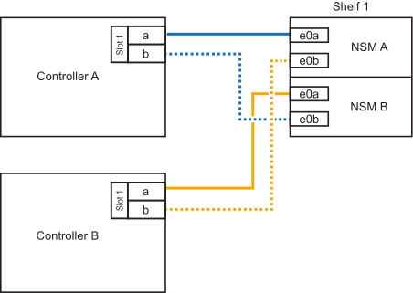

= 從纜線架到可用性結束的系統 - NS224 機櫃
:allow-uri-read: 
:icons: font
:imagesdir: ../media/

[role="lead"]
每個要熱新增的 NS224 機櫃都要連接纜線、以便每個機櫃都有兩個連線至 HA 配對中的每個控制器。

.連接至 AFF A320 的纜線架
[%collapsible]
====
您可以在需要額外儲存時、將第二個機櫃熱新增至現有的 HA 配對。

.開始之前
* 您必須已檢閱 link:requirements-hot-add-shelf.html["熱新增需求和最佳實務做法"]。
* 您必須已完成中的適用程序 link:prepare-hot-add-shelf.html["準備熱新增機櫃"]。
* 您必須已安裝機櫃、開啟電源、並依照中所述設定機櫃 ID link:prepare-hot-add-shelf.html["安裝用於熱新增的機櫃"]。

.步驟
. 將機架連接至控制器。
+
.. 將NSM A連接埠e0a連接至控制器A連接埠e0e。
.. 將NSM A連接埠e0b纜線連接至控制器B連接埠e0b。
.. 將NSM B連接埠e0A纜線連接至控制器B連接埠e0e。
.. 將NSM B連接埠e0b纜線連接至控制器A連接埠e0b。+下圖顯示熱新增機櫃（機櫃2）的佈線：
+
image::../media/drw_ns224_a320_2shelves_direct_attached.png[AFF A320 的纜線、含兩個 NS224 機櫃和三組內建連接埠]

. 使用驗證熱添加的機櫃是否已正確連接 https://mysupport.netapp.com/site/tools/tool-eula/activeiq-configadvisor["Active IQ Config Advisor"^]。
+
如果產生任何纜線錯誤、請遵循所提供的修正行動。

.接下來呢？
如果您在準備此程序時停用了自動磁碟機指派、則需要手動指派磁碟機所有權、然後視需要重新啟用自動磁碟機指派。前往 link:complete-hot-add-shelf.html["完成熱新增"]。

否則、您就會完成熱新增機櫃程序。

====
.連接至 AFF A700 的纜線架
[%collapsible]
====
如何將 NS224 機櫃連接至 AFF A700 HA 配對、取決於您要熱新增的機櫃數量、以及您在控制器上使用的具備 ROCE 功能的連接埠集數（一或兩個）。

.開始之前
* 您必須已檢閱 link:requirements-hot-add-shelf.html["熱新增需求和最佳實務做法"]。
* 您必須已完成中的適用程序 link:prepare-hot-add-shelf.html["準備熱新增機櫃"]。
* 您必須已安裝機櫃、開啟電源、並依照中所述設定機櫃 ID link:prepare-hot-add-shelf.html["安裝用於熱新增的機櫃"]。
* 如果您要熱新增初始 NS224 機櫃（ HA 配對中沒有 NS224 機櫃）、則必須在每個控制器中安裝核心傾印模組（ X9170A 、 NVMe 1TB SSD ）、以支援核心傾印（儲存核心檔案）。
+
請參閱。 link:../fas9000/caching-module-and-core-dump-module-replace.html["更換快取模組、或新增/更換核心傾印模組（AFF 即：VA700和FAS9000）"^]

.步驟
. 如果您要在每個控制器上使用一組具備切換功能的連接埠（一個具備切換功能的 I/O 模組）來熱新增一個機櫃、而且這是 HA 配對中唯一的 NS224 機櫃、請完成下列子步驟。
+
否則、請前往下一步。

+

NOTE: 此步驟假設您已在每個控制器的插槽 3 中安裝具備 ROCE 功能的 I/O 模組、而非插槽 7 。

+
.. 纜線櫃NSM A連接埠e0a、用於控制插槽3連接埠a
.. 纜線櫃NSM A連接埠e0b至控制器B插槽3連接埠b.
.. 纜線櫃NSM B連接埠e0A至控制器B插槽3連接埠a
.. 纜線櫃NSM B連接埠e0b連接至控制器A插槽3連接埠b.
+
下圖顯示使用每個控制器中一個具備切換功能的 I/O 模組來連接一個熱新增機櫃的纜線：

+
image::../media/drw_ns224_a700_1shelf.png[AFF A700 的纜線、其中包含一個 NS224 機櫃和一組 IO 模組連接埠]

. 如果您要在每個控制器中使用兩組具備 ROCE 功能的連接埠（兩個具備 ROCE 功能的 I/O 模組）來熱新增一個或兩個機櫃、請完成適用的子步驟。
+
[cols="1,3"]
|===
| 磁碟櫃 | 纜線 

 a| 
機櫃1.
 a| 

NOTE: 這些子步驟假設您是從機櫃連接埠e0a佈線至插槽3中具有RoCE功能的I/O模組、而非插槽7開始佈線。

.. 將NSM A連接埠e0a纜線連接至控制器A插槽3連接埠a
.. 將NSM A連接埠e0b纜線連接至控制器B插槽7連接埠b.
.. 將NSM B連接埠e0A纜線連接至控制器B插槽3連接埠a
.. 將NSM B連接埠e0b纜線連接至控制器A插槽7連接埠b.
.. 如果您要快速新增第二個擱板，請完成「`擱板 2`」子步驟；否則，請前往下一步。

 a| 
機櫃2.
 a| 

NOTE: 這些子步驟假設您是從機櫃連接埠e0a佈線至插槽7中具備RoCE功能的I/O模組、而非插槽3（與機櫃1的佈線子步驟相關）開始佈線。

.. 將NSM A連接埠e0a纜線連接至控制器A插槽7連接埠a
.. 將NSM A連接埠e0b纜線連接至控制器B插槽3連接埠b.
.. 將NSM B連接埠e0A纜線連接至控制器B插槽7連接埠a
.. 將NSM B連接埠e0b纜線連接至控制器A插槽3連接埠b.
.. 前往下一步。

|===
+
下圖顯示第一個和第二個熱新增磁碟櫃的纜線佈線：

+
image::../media/drw_ns224_a700_2shelves.png[AFF A700 的纜線、配備兩個 NS224 機櫃和兩組 IO 模組連接埠]

. 使用驗證熱添加的機櫃是否已正確連接 https://mysupport.netapp.com/site/tools/tool-eula/activeiq-configadvisor["Active IQ Config Advisor"^]。
+
如果產生任何纜線錯誤、請遵循所提供的修正行動。

.接下來呢？
如果您在準備此程序時停用了自動磁碟機指派、則需要手動指派磁碟機所有權、然後視需要重新啟用自動磁碟機指派。前往 link:complete-hot-add-shelf.html["完成熱新增"]。

否則、您就會完成熱新增機櫃程序。

====
.連接至 FAS500f 的纜線架
[%collapsible]
====
當需要額外的儲存設備時、您可以將一個 NS224 機櫃熱新增至 FAS500f HA 配對。

.開始之前
* 您必須已檢閱 link:requirements-hot-add-shelf.html["熱新增需求和最佳實務做法"]。
* 您必須已完成中的適用程序 link:prepare-hot-add-shelf.html["準備熱新增機櫃"]。
* 您必須已安裝機櫃、開啟電源、並依照中所述設定機櫃 ID link:prepare-hot-add-shelf.html["安裝用於熱新增的機櫃"]。

.關於這項工作
從平台機箱背面看、左側的RoCE卡連接埠為連接埠「a」（e1a）、右側連接埠為連接埠「b」（e1b）。

.步驟
. 纜線連接機櫃：
+
.. 纜線櫃NSM A連接埠e0a、用於控制器A插槽1連接埠A（e1a）。
.. 纜線櫃NSM A連接埠e0b至控制器B插槽1連接埠b（e1b）。
.. 纜線櫃NSM B連接埠e0A至控制器B插槽1連接埠A（e1a）。
.. 纜線櫃NSM B連接埠e0b連接至控制器A插槽1連接埠b（e1b）。+下圖顯示機櫃佈線完成後的情形。
+

. 使用驗證熱添加的機櫃是否已正確連接 https://mysupport.netapp.com/site/tools/tool-eula/activeiq-configadvisor["Active IQ Config Advisor"^]。
+
如果產生任何纜線錯誤、請遵循所提供的修正行動。

.接下來呢？
如果您在準備此程序時停用了自動磁碟機指派、則需要手動指派磁碟機所有權、然後視需要重新啟用自動磁碟機指派。前往 link:complete-hot-add-shelf.html["完成熱新增"]。

否則、您就會完成熱新增機櫃程序。

====