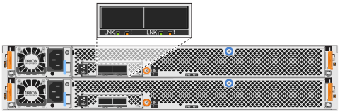

= 熱插拔纜線總覽 - NS224 機櫃
:allow-uri-read: 
:icons: font
:imagesdir: ../media/

[role="lead"]
每個要熱新增的 NS224 機櫃都要連接纜線、以便每個機櫃都有兩個連線至 HA 配對中的每個控制器。

本纜線一節說明如何將 NS224 機櫃連接至下列儲存系統：

* link:cable-aff-systems-hot-add-shelf.html["連接至 AFF 系統的纜線"]
* link:cable-asa-systems-hot-add-shelf.html["連接至 ASA 系統的纜線"]
* link:cable-eoa-systems-hot-add-shelf.html["連接 EOA 系統的纜線"]

== 關於這項工作

* 此程序僅適用於直接附加儲存設備。若要檢視交換器附加儲存設備的說明，請檢視我們的link:cable-as-switch-attached.html["交換器連接纜線指南"]。
* 熟悉正確的纜線連接器方向、以及 NS224 NSM100 機櫃模組上連接埠的位置和標籤。
+
** 插入纜線時、連接器拉片朝上。
+
正確插入纜線時、會卡入定位。

+
連接纜線兩端之後、機櫃和控制器連接埠LK（綠色）LED會亮起。如果連接埠LNO LED未亮起、請重新拔插纜線。

+
image::../media/oie_cable_pull_tab_up.png[插入纜線時、接頭拉片朝上]

** 您可以使用下圖來協助實體識別機櫃 NSM100 連接埠、 e0a 和 e0b 。
+
[role="tabbed-block"]
====
.NSM100 模組
--
*** NS224 機櫃包含兩個 NSM100 模組。頂部模組插入插槽 A （ NSM A ）、底部模組則插入插槽 B （ NSM B ）。
*** 每個 NSM100 模組包含 2 個 100GbE QSFP28 連接埠： e0a 和 e0b 。
+
image::../media/drw_ns224_back_ports.png[NS224 NSM100 模組連接埠 e0a 和 e0b 的位置]

--
.NSM100B 模組
--
*** NS224 機櫃包含兩個 NSM100B 模組。頂部模組插入插槽 A （ NSM A ）、底部模組則插入插槽 B （ NSM B ）。
*** 每個 NSM100B 模組均包含 2 個 100GbE CX6/DX 連接埠： e1a 和 e1b 。
+

--
====

* 連接好熱新增的機櫃之後ONTAP 、即可識別出機櫃：
+
** 如果啟用自動磁碟機指派、則會指派磁碟機所有權。
** 如有需要、應自動更新NSM機櫃韌體和磁碟機韌體。
+

NOTE: 韌體更新最多可能需要30分鐘。

