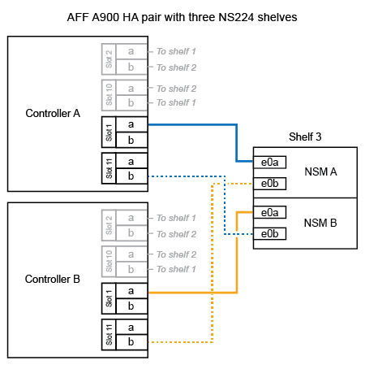

= 將 NS224 機架連接到您的 AFF A900 系統
:allow-uri-read: 
:icons: font
:imagesdir: ../media/

[role="lead"]
將 NS224 機架連接到 AFF A900 系統，使每個機架與 HA 配對中的每個控制器都有兩個連線。

.關於這項工作
* 此程序假設您的HA配對至少有一個現有的NS224磁碟櫃、而且您要熱新增最多三個額外的磁碟櫃。
* 如果您的HA配對只有一個現有的NS224磁碟櫃、則此程序假設磁碟櫃已連接至每個控制器上兩個具有RoCE功能的100GbE I/O模組。

.步驟
. 如果您要熱新增的NS224磁碟櫃是HA配對中的第二個NS224磁碟櫃、請完成下列子步驟。
+
否則、請前往下一步。

+
.. 纜線櫃NSM A連接埠e0a、用於控制器A插槽10連接埠A（E10A）。
.. 纜線櫃NSM A連接埠e0b至控制器B插槽2連接埠b（e2b）。
.. 纜線櫃NSM B連接埠e0A至控制器B插槽10連接埠A（E10A）。
.. 纜線櫃NSM B連接埠e0b至控制器A插槽2連接埠b（e2b）。
+
下圖顯示第二個機櫃纜線（和第一個機櫃）。

+
image::../media/drw_ns224_a900_2shelves.png[配備兩個 NS224 機櫃和兩個 IO 模組的 AFF / ASA A900 纜線]

. 如果您要熱新增的NS224磁碟櫃是HA配對中的第三個NS224磁碟櫃、請完成下列子步驟。
+
否則、請前往下一步。

+
.. 纜線櫃NSM A連接埠e0a、用於控制器A插槽1連接埠A（e1a）。
.. 纜線櫃NSM A連接埠e0b至控制器B插槽11連接埠b（e11b）。
.. 纜線櫃NSM B連接埠e0A至控制器B插槽1連接埠A（e1a）。
.. 纜線櫃NSM B連接埠e0b至控制器A插槽11連接埠b（e11b）。
+
下圖顯示第三個機櫃的纜線。

+

. 如果您要熱新增的NS224磁碟櫃是HA配對中的第四個NS224磁碟櫃、請完成下列子步驟。
+
否則、請前往下一步。

+
.. 纜線櫃NSM A連接埠e0a、用於控制器A插槽11連接埠A（e11a）。
.. 纜線櫃NSM A連接埠e0b至控制器B插槽1連接埠b（e1b）。
.. 纜線櫃NSM B連接埠e0A至控制器B插槽11連接埠A（e11a）。
.. 纜線櫃NSM B連接埠e0b連接至控制器A插槽1連接埠b（e1b）。
+
下圖顯示第四個磁碟櫃的纜線。

+
image::../media/drw_ns224_a900_4shelves.png[四個 NS224 機櫃和四個 IO 模組的 AFF / ASA A900 纜線]

. 使用驗證熱添加的機櫃是否已正確連接 https://mysupport.netapp.com/site/tools/tool-eula/activeiq-configadvisor["Active IQ Config Advisor"^]。
+
如果產生任何纜線錯誤、請遵循所提供的修正行動。

.下一步
如果您在準備此程序時停用了自動磁碟機指派，則需要手動指派磁碟機所有權，然後根據需要重新啟用自動磁碟機指派。請前往 link:hot-add-aff-complete.html["完成熱新增"]。

否則、您就會完成熱新增機櫃程序。
