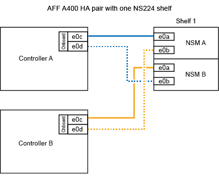
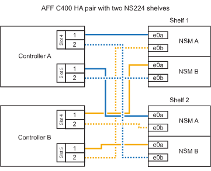

= 將 NS224 機架連接到您的 ASA A400 或 ASA C400 系統
:allow-uri-read: 
:icons: font
:imagesdir: ../media/

[role="lead"]
將 NS224 機架透過電纜連接到 ASA A400 或 ASA C400 系統，以便每個機架與 HA 配對中的每個控制器都有兩個連接。

== 將纜線機櫃連接至 AFF A400 HA 配對

對於 AFF A400 HA 配對，您可以熱新增最多兩個磁碟櫃，並視需要使用內建連接埠 e0c/e0d 和插槽 5 中的連接埠。

.步驟
. 如果您要在每個控制器上使用一組具備切換功能的連接埠（內建具備切換功能的連接埠）來熱新增一個機櫃、而且這是 HA 配對中唯一的 NS224 機櫃、請完成下列子步驟。
+
否則、請前往下一步。

+
.. 纜線櫃NSM A連接埠e0a至控制器A連接埠e0c。
.. 纜線櫃NSM A連接埠e0b至控制器B連接埠e0d。
.. 纜線櫃NSM B連接埠e0A至控制器B連接埠e0c。
.. 纜線櫃NSM B連接埠e0b連接至控制器A連接埠e0d。
+
下圖顯示使用每個控制器上一組具備磁碟功能的連接埠、為一個熱新增機櫃進行纜線連接的情況：

+

. 如果您要在每個控制器上使用兩組具備切換功能的連接埠（主機板內建連接埠和具備 PCIe 卡切換功能的連接埠）來熱新增一個或兩個機櫃、請完成下列子步驟。
+
[cols="1,3"]
|===
| 磁碟櫃 | 纜線 

 a| 
機櫃1.
 a| 
.. 將NSM A連接埠e0a連接至控制器A連接埠e0c。
.. 將NSM A連接埠e0b纜線連接至控制器B插槽5連接埠2（e5b）。
.. 將NSM B連接埠e0A纜線連接至控制器B連接埠e0c。
.. 將NSM B連接埠e0b纜線連接至控制器A插槽5連接埠2（e5b）。
.. 如果您要快速新增第二個擱板，請完成「`擱板 2`」子步驟；否則，請前往下一步。

 a| 
機櫃2.
 a| 
.. 將NSM A連接埠e0a纜線連接至控制器A插槽5連接埠1（e5a）。
.. 將NSM A連接埠e0b纜線連接至控制器B連接埠e0d。
.. 將NSM B連接埠e0A纜線連接至控制器B插槽5連接埠1（e5a）。
.. 將NSM B連接埠e0b纜線連接至控制器A連接埠e0d。
.. 前往下一步。

|===
+
下圖顯示兩個熱新增磁碟櫃的纜線佈線：

+
image::../media/drw_ns224_a400_2shelves_IEOPS-983.svg[使用兩個 NS224 機櫃，一組內建連接埠和一組 PCIe 卡連接埠的 ASA A400 纜線]

. 使用驗證熱添加的機櫃是否已正確連接 https://mysupport.netapp.com/site/tools/tool-eula/activeiq-configadvisor["Active IQ Config Advisor"^]。
+
如果產生任何纜線錯誤、請遵循所提供的修正行動。

== 將磁碟櫃連接至 AFF C400 HA 配對

對於 AFF C400 HA 配對，您可以熱新增最多兩個磁碟櫃，並視需要使用插槽 4 和 5 中的連接埠。

.步驟
. 如果您要在每個控制器上使用一組具備切換功能的連接埠來熱新增一個機櫃、而且這是 HA 配對中唯一的 NS224 機櫃、請完成下列子步驟。
+
否則、請前往下一步。

+
.. 纜線櫃NSM A連接埠e0a、用於控制器A插槽4連接埠1（E4A）。
.. 纜線櫃NSM A連接埠e0b至控制器B插槽4連接埠2（e4b）。
.. 纜線櫃NSM B連接埠e0A至控制器B插槽4連接埠1（E4A）。
.. 纜線櫃NSM B連接埠e0b連接至控制器A插槽4連接埠2（e4b）。
+
下圖顯示使用每個控制器上一組具備磁碟功能的連接埠、為一個熱新增機櫃進行纜線連接的情況：

+
image::../media/drw_ns224_c400_1shelf_IEOPS-985.svg[使用一個 NS224 機櫃和一組 PCIe 卡連接埠的 AFF / ASA C400 纜線]

. 如果您要在每個控制器上使用兩組具備 ROCE 功能的連接埠來熱新增一個或兩個機櫃、請完成下列子步驟。
+
[cols="1,3"]
|===
| 磁碟櫃 | 纜線 

 a| 
機櫃1.
 a| 
.. 將NSM A連接埠e0a纜線連接至控制器A插槽4連接埠1（E4A）。
.. 將NSM A連接埠e0b纜線連接至控制器B插槽5連接埠2（e5b）。
.. 將NSM B連接埠e0A纜線連接至控制器B連接埠插槽4連接埠1（E4A）。
.. 將NSM B連接埠e0b纜線連接至控制器A插槽5連接埠2（e5b）。
.. 如果您要快速新增第二個擱板，請完成「`擱板 2`」子步驟；否則，請前往下一步。

 a| 
機櫃2.
 a| 
.. 將NSM A連接埠e0a纜線連接至控制器A插槽5連接埠1（e5a）。
.. 將NSM A連接埠e0b纜線連接至控制器B插槽4連接埠2（e4b）。
.. 將NSM B連接埠e0A纜線連接至控制器B插槽5連接埠1（e5a）。
.. 將NSM B連接埠e0b纜線連接至控制器A插槽4連接埠2（e4b）。
.. 前往下一步。

|===
+
下圖顯示兩個熱新增磁碟櫃的纜線佈線：

+

. 使用驗證熱添加的機櫃是否已正確連接 https://mysupport.netapp.com/site/tools/tool-eula/activeiq-configadvisor["Active IQ Config Advisor"^]。
+
如果產生任何纜線錯誤、請遵循所提供的修正行動。

.下一步
如果您在準備此程序時停用了自動磁碟機指派，則需要手動指派磁碟機所有權，然後根據需要重新啟用自動磁碟機指派。請前往link:hot-add-asa-complete.html["完成熱新增"]。

否則、您就會完成熱新增機櫃程序。
