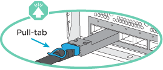

= 熱新增機櫃- NS224機櫃
:allow-uri-read: 
:icons: font
:imagesdir: ../media/

[role="lead"]
當HA配對符合特定需求、且已完成適用於HA配對的準備工作之後、您可以熱新增NS224磁碟機櫃。

== 熱新增需求

在熱新增NS224磁碟機櫃之前、HA配對必須符合特定需求。

* 您的平台模式和ONTAP 版本的支援必須支援NS224機櫃和熱新增的磁碟機。
+
https://hwu.netapp.com["NetApp Hardware Universe"^]

* 您必須擁有正確的纜線數量和類型、才能連接機櫃。
+
https://hwu.netapp.com["NetApp Hardware Universe"^]

* 您的 HA 配對必須有足夠的可用 Roce 功能乙太網路連接埠、才能支援您要熱新增的機櫃數量。
+
對於您要熱新增的每個機櫃、每個控制器上都需要兩個具備切換功能的連接埠。這些連接埠可在控制器上、具備RoCE功能的PCIe卡上、兩者的組合、或是具備RoCE功能的I/O模組上、如您的平台機型所支援。

+
如果您的HA配對沒有足夠可用的RoCE連接埠、而且您的平台機型支援使用具備RoCE功能的PCIe卡或I/O模組、則您必須將額外的卡或I/O模組安裝到正確的控制器插槽中、如同您的平台機型所支援。

+
** 識別適用於您平台機型的正確控制器插槽。
+
https://hwu.netapp.com["NetApp Hardware Universe"^]

** 請參閱您的平台機型文件、瞭解 PCIe 卡或 I/O 模組安裝說明。
+
https://docs.netapp.com/us-en/ontap-systems/index.html["ONTAP 硬體系統文件"]

+
[NOTE]
====
非專屬的具備RoCE功能的連接埠必須設定為供儲存使用（非網路使用）。

<<Prepare non-dedicated RoCE-capable ports for a hot-add>>

====

* 如果您有AFF 一對EzeA700 HA配對、而且要熱新增初始NS224磁碟機櫃（HA配對中沒有NS224磁碟機櫃）、則必須在每個控制器中安裝核心傾印模組（X9170A、NVMe 1TB SSD）、才能支援核心傾印（儲存核心檔案）。
+
link:../fas9000/caching-module-and-core-dump-module-replace.html["更換快取模組、或新增/更換核心傾印模組（AFF 即：VA700和FAS9000）"^]

* 您的HA配對必須少於支援的最大磁碟櫃數、至少要少於您計畫要熱新增的磁碟櫃數。
+
在熱新增磁碟櫃之後、您無法超過HA配對所支援的磁碟櫃數量上限。

+
https://hwu.netapp.com["NetApp Hardware Universe"^]

* 如果要將機櫃熱新增至已有NS224機櫃的HA配對、HA配對就不會出現任何儲存設備纜線錯誤訊息、而且必須以多重路徑HA的纜線連接。
+
您可以執行Active IQ Config Advisor 功能不全、以檢視任何儲存設備佈線錯誤訊息、以及您應採取的修正行動。

+
https://mysupport.netapp.com/site/tools/tool-eula/activeiq-configadvisor["NetApp下載Config Advisor"^]

* 您需要一側拉直的迴紋針或一支細尖端的圓球筆。
+
若要變更機櫃ID、請使用回形針或圓筆來存取操作員顯示面板（ODP）後面的機櫃ID按鈕。

== 熱新增的考量事項

在熱新增NS224磁碟機櫃之前、您應該先熟悉此程序的最佳實務做法和相關事項。

* 如果您有ASA 支援NS224磁碟櫃的SHA配對、可以使用此程序。
* *最佳實務做法：*最佳實務做法是在熱新增機櫃之前、先安裝目前版本的磁碟認證套件（DQP）。
+
安裝最新版的DQP可讓您的系統辨識及使用新的合格磁碟機。如此可避免系統事件訊息、因為無法辨識磁碟機、因此無法取得非最新的磁碟機資訊並防止磁碟分割。此外、DQP也會通知您非最新的磁碟機韌體。

+
https://mysupport.netapp.com/site/downloads/firmware/disk-drive-firmware/download/DISKQUAL/ALL/qual_devices.zip["NetApp下載：磁碟認證套件"^]

* *最佳實務做法：*最佳實務做法是Active IQ Config Advisor 在熱新增機櫃之前和之後執行
+
在Active IQ Config Advisor 熱新增機櫃之前執行支援功能可提供現有機櫃乙太網路（ENET）連線的快照、驗證NVMe機櫃模組（NSM）韌體版本、並可讓您驗證HA配對中已使用的機櫃ID。在熱新增機櫃之後執行Active IQ Config Advisor 功能、可讓您驗證機櫃的纜線是否正確、以及HA配對內的機櫃ID是否獨特。

+
https://mysupport.netapp.com/site/tools/tool-eula/activeiq-configadvisor["NetApp下載Config Advisor"^]

* *最佳實務做法：*最佳實務做法是在新增磁碟櫃之前、先在系統上安裝最新版本的NVMe機櫃模組（NSM）韌體和磁碟機韌體。
+
https://mysupport.netapp.com/site/downloads/firmware/disk-shelf-firmware["NetApp下載：磁碟櫃韌體"^]

+
https://mysupport.netapp.com/site/downloads/firmware/disk-drive-firmware["NetApp下載：磁碟機韌體"^]

+

NOTE: 請勿將韌體還原至不支援機櫃及其元件的版本。

* 連接好熱新增的機櫃之後ONTAP 、即可識別出機櫃：
+
** 如果啟用自動磁碟機指派、則會指派磁碟機所有權。
** 如有需要、應自動更新NSM機櫃韌體和磁碟機韌體。
+

NOTE: 韌體更新最多可能需要30分鐘。

== 準備熱新增

在熱新增NS224磁碟機櫃之前、您必須先完成適用於HA配對的準備工作。

=== 準備非專屬的具備 ROCE 功能的乙太網路連接埠以進行熱新增

如果您的 HA 配對具有非專屬的具備 ROCE 功能的乙太網路連接埠、而您使用這些連接埠來熱新增 NS224 磁碟機櫃、則必須確定連接埠已設定為用於儲存設備（而非用於網路）。

.開始之前
您必須符合儲存系統需求、包括在每個控制器中安裝任何其他具備 Roce 功能的 I/O 模組 PCIe 卡。

<<熱新增需求>>

.關於這項工作
* 對於某些平台機型、當控制器的支援插槽中安裝具備RoCE功能的PCIe卡或I/O模組時、連接埠會自動預設為使用儲存設備（而非網路）；不過、建議您完成此程序、以驗證具備RoCE功能的連接埠是否已設定為用於儲存設備。
* 如果您確定HA配對中的非專用的RoCE連接埠未設定為供儲存使用、則設定這些連接埠是不中斷營運的程序。
+

NOTE: 如果HA配對執行ONTAP 的是版本的32位版本、您必須一次重新啟動一個控制器。

+

NOTE: 如果HA配對執行ONTAP 的是NetApp 9.7或更新版本、則不需要重新啟動控制器、除非其中一個或兩個控制器都處於維護模式。此程序假設兩個控制器都未處於維護模式。

+

NOTE: 若要將連接埠從儲存設備用途變更為網路用途、請輸入命令、 `storage port modify -node _node_name_ -port _port_name_ -mode network`。

.步驟
. 使用 SSH 或序列主控台連接埠登入叢集。
. 驗證HA配對中的非專屬連接埠是否已設定用於儲存用途：「儲存連接埠顯示」
+
如果HA配對執行ONTAP 的是NetApp 9.8或更新版本、則非專屬連接埠會在「模式」欄中顯示「儲存」。

+
如果您的HA配對執行ONTAP 的是32或9.6、則非專用連接埠在「專用」中顯示「假」 欄位、也會在「tate」欄位中顯示「啟用」。

. 如果將非專屬連接埠設定為供儲存使用、則您必須完成此程序。
+
否則、您必須完成步驟4到7來設定連接埠。

+
[NOTE]
====
如果未將非專屬連接埠設定為供儲存使用、命令輸出會顯示下列項目：

如果HA配對執行ONTAP 的是NetApp 9.8或更新版本、非專屬連接埠會在「模式」欄位中顯示「network」（網路）。

如果您的HA配對執行ONTAP 的是NetApp的支援、則非專用連接埠在「專用」中顯示「假」 欄位、也會在「tate」欄位中顯示「停用」。

====
. 在其中一個控制器模組上設定非專用連接埠以供儲存使用：
+
您必須針對所設定的每個連接埠重複執行適用的命令。

+
[cols="1,3"]
|===
| 如果HA配對正在執行... | 然後... 

 a| 
部分9.8或更新版本ONTAP
 a| 
`storage port modify -node _node_name_ -port _port_name_ -mode storage`

 a| 
資訊提供ONTAP
 a| 
`storage port enable -node _node_name_ -port _port_name_`

|===
. 如果 HA 配對執行 ONTAP 9.6 、請重新啟動控制器模組、使連接埠變更生效： `system node reboot -node _node_name_ -reason _reason_for_the_reboot_`。
+
否則、請前往下一步。

+

NOTE: 重新開機最多可能需要15分鐘。

. 對第二個控制器模組重複步驟：
+
[cols="1,3"]
|===
| 如果HA配對正在執行... | 然後... 

 a| 
更新版本ONTAP
 a| 
.. 重複步驟4。
.. 移至步驟7。

 a| 
部分9.6 ONTAP
 a| 
.. 重複步驟 4 和 5 。
+

NOTE: 第一個控制器必須已完成重新開機。

.. 移至步驟7。

|===
. 確認兩個控制器模組上的非專屬連接埠均已設定為儲存用途：「儲存連接埠顯示」
+
您可以在任一控制器模組上輸入命令。

+
如果HA配對執行ONTAP 的是NetApp 9.8或更新版本、則非專屬連接埠會在「模式」欄中顯示「儲存」。

+
如果您的HA配對執行ONTAP 的是32或9.6、則非專用連接埠在「專用」中顯示「假」 欄位、也會在「tate」欄位中顯示「啟用」。

=== 在熱新增額外的機櫃之前、請先準備好現有的機櫃連線能力

根據您的平台機型而定、在熱新增額外的機櫃之前、您可能需要在不同插槽中的兩組連接埠之間重新配置現有的機櫃（在安裝額外的具備 ROCE 功能的 PCIe 卡或 I/O 模組之後）、以避免插槽故障。

.開始之前
* 您必須符合系統需求、包括在每個控制器中安裝任何其他具備 RoCE 功能的 PCIe 卡或 I/O 模組。
+
<<熱新增需求>>

* 您必須已驗證您所安裝的具備切換功能的 PCIe 卡或 I/O 模組上的非專屬連接埠是否已設定供儲存使用。
+
<<Prepare non-dedicated RoCE-capable ports for a hot-add>>

.關於這項工作
* 如果您的機櫃具有多重路徑HA連線功能、則重新啟用連接埠連線是不中斷營運的程序。
* 在本程序中、您一次移動一條纜線、以永遠保持與機櫃的連線。
+

NOTE: 移動纜線時、從一個連接埠拔下纜線、然後將纜線插入另一個連接埠、不需要任何等待時間。

* 如果您有 AFF A1K HA 配對、而且您正在熱新增第三個機櫃、並在每個控制器中安裝第三個或第四個具備 ROCE 功能的 I/O 模組、則第三個機櫃只能連接到第三個或第三個 I/O 模組。您不需要重新配置任何現有的機櫃。

.步驟
. 可將現有機櫃的連線重新連接至不同插槽中的兩組具備切換功能的連接埠、以適用於您的平台機型。
+
[cols="1,3"]
|===
| 如果您有... | 然後... 

 a| 
AFF A70 或 AFF A90 HA 配對、您正在熱新增第二個機櫃
 a| 
可在兩個具備 ROCE 功能的 I/O 模組中重新放置第一個機櫃：

NOTE: 子步驟假設現有機櫃已連接至每個控制器上插槽 11 中具有切入功能的 I/O 模組。

.. 在控制器A上、將纜線從插槽11連接埠b（e11b）移至插槽8連接埠b（e8b）。
.. 在控制器B上重複相同的纜線移動
+
[NOTE]
====
如有需要、您可以參考兩層架配置中顯示現有單一機櫃和有線機櫃的纜線圖示。

<<為 AFF A70 或 AFF A90 HA 配對連接熱新增機櫃>>

====

 a| 
AFF A1K HA 配對、並熱新增第二個機櫃
 a| 
可在兩個具備 ROCE 功能的 I/O 模組中重新放置第一個機櫃：

NOTE: 子步驟假設現有機櫃已連接至每個控制器上插槽 11 中具有切入功能的 I/O 模組。

.. 在控制器A上、將纜線從插槽11連接埠b（e11b）移至插槽10連接埠b（e10b）。
.. 在控制器B上重複相同的纜線移動
+
[NOTE]
====
如有需要、您可以參考兩層架配置中顯示現有單一機櫃和有線機櫃的纜線圖示。

<<連接熱新增機櫃、以供AFF 搭配使用以進行功能不全的叢集式A1K HA配對>>

====

 a| 
AFF A1K HA 配對、您正在熱添加 Forth 機櫃
 a| 
可在每個控制器的插槽 9 中、將具有 R0CE 功能的 I/O 模組上的第三個機櫃重新放置：

.. 在控制器A上、將纜線從插槽9連接埠b（e9b）移至插槽8連接埠b（e8b）。
.. 在控制器B上重複相同的纜線移動
+
[NOTE]
====
如有需要、您可以參考兩層架配置中顯示現有單一機櫃和有線機櫃的纜線圖示。

<<連接熱新增機櫃、以供AFF 搭配使用以進行功能不全的叢集式A1K HA配對>>

====

 a| 
AFF C400 HA 配對、您正在熱新增第二個機櫃
 a| 
可在每個控制器上的兩組具備 ROCE 功能的連接埠上重新放置第一個機櫃：

.. 在控制器A上、將纜線從插槽4連接埠A（E4A）移至插槽5連接埠b（e5b）。
.. 在控制器B上重複相同的纜線移動
+
[NOTE]
====
如有需要、您可以參考兩個機櫃組態中現有單一機櫃和標註機櫃的佈線圖例。

<<連接熱新增機櫃、以供AFF 搭配使用以進行功能不全的叢集式C400 HA配對>>

====

 a| 
AFF A800 或 AFF C800 HA 配對、您正在熱新增第二個機櫃
 a| 
可在每個控制器上的兩組具備 ROCE 功能的連接埠上重新放置第一個機櫃：

NOTE: 以下步驟假設現有的機櫃已連接至每個控制器插槽5中的可操作PCIe卡。

.. 在控制器A上、將纜線從插槽5連接埠b（e5b）移至插槽3連接埠b（e3b）。
.. 在控制器B上重複相同的纜線移動
+
[NOTE]
====
如有需要、您可以參考兩個機櫃組態中現有單一機櫃和標註機櫃的佈線圖例。

<<連接熱新增機櫃、以利AFF 執行供應鏈以利實現供應鏈A800或AFF 是鏈接至鏈接鏈接>>

====

 a| 
AFF A400 HA 配對、您正在熱新增第二個機櫃
 a| 
可在每個控制器上的兩組具備 ROCE 功能的連接埠上重新放置第一個機櫃：

.. 在控制器A上、將纜線從連接埠e0d移至插槽5連接埠b（e5b）。
.. 在控制器B上重複相同的纜線移動
+
[NOTE]
====
如有需要、您可以參考兩個機櫃組態中現有單一機櫃和標註機櫃的佈線圖例。

<<將熱新增機櫃連接至AFF 線纜、以供搭配使用>>

====

 a| 
AFF A700 HA 配對、您正在熱新增第二個機櫃
 a| 
可在每個控制器上的兩組具備 ROCE 功能的連接埠上重新放置第一個機櫃：

NOTE: 這些子步驟假設現有機櫃已連接至每個控制器插槽3中具有資源相容的I/O模組。

.. 在控制器A上、將纜線從插槽3連接埠b（e3b）移至插槽7連接埠b（e7b）。
.. 在控制器B上重複相同的纜線移動
+
[NOTE]
====
如有需要、您可以參考兩個機櫃組態中現有單一機櫃和標註機櫃的佈線圖例。

<<連接熱新增機櫃、以利AFF 進行AreA700 HA配對>>

====

|===
. 確認已正確連接的機櫃纜線。
+
如果產生任何纜線錯誤、請遵循所提供的修正行動。

+
https://mysupport.netapp.com/site/tools/tool-eula/activeiq-configadvisor["NetApp下載Config Advisor"^]

=== 準備為熱新增手動指派磁碟機擁有權

如果您要手動指派熱新增NS224磁碟機櫃的磁碟機擁有權、則必須停用已啟用的自動磁碟機指派功能。

.開始之前
您必須符合系統需求。

<<熱新增需求>>

.關於這項工作
如果您不確定應手動指派磁碟機擁有權、或想要瞭解儲存系統的磁碟機擁有權原則自動指派、請參閱 https://docs.netapp.com/us-en/ontap/disks-aggregates/disk-autoassignment-policy-concept.html["關於自動指派磁碟擁有權"^]

.步驟
. 驗證是否已啟用自動磁碟指派：「torage disk option show」
+
您可以在任一節點上輸入命令。

+
如果啟用自動磁碟機指派、則輸出會顯示在 `on` 欄中 `Auto Assign` （針對每個節點）。

. 如果已啟用自動磁碟指派、請停用此功能：「torage disk option modify -node_node_name_-autodassign Off」（磁碟選項修改-node_node_name_-autodassign Off）
+
您必須停用兩個節點上的自動磁碟機指派。

== 安裝用於熱新增的機櫃

安裝新的 NS224 機櫃包括將機櫃安裝到機架或機櫃、連接電源線（會自動開啟機櫃電源）、然後設定機櫃 ID 。

.開始之前
* 請確定您的有一個迴紋針、一邊拉直、或是一支窄尖的圓珠筆。
+
在變更機櫃 ID 步驟中、您可以使用迴紋針或圓珠筆存取操作員顯示面板（ ODP ）後方的機櫃 ID 按鈕。

.步驟
. 使用套件包裝箱隨附的安裝傳單、安裝機櫃隨附的軌道安裝套件。
+

NOTE: 請勿將機櫃裝在法蘭上。

. 使用安裝說明將機櫃安裝並固定在支撐托架、機架或機櫃上。
+

NOTE: 滿載的NS224機櫃可重達66、78磅（30、29公斤）、需要兩個人才能舉升或使用液壓起重裝置。避免移除機櫃元件（從機櫃正面或背面）、以降低機櫃重量、因為機櫃重量會不平衡。

. 將電源線連接至機櫃、如果是AC電源供應器、請使用電源線固定器將電源線固定到位、如果是DC電源供應器、請使用兩個指旋螺絲固定、然後將電源線連接至不同的電源供應器、以獲得恢復能力。
+
機櫃連接電源時會啟動、但沒有電源開關。當電源供應器正常運作時、雙色LED會亮起綠燈。

. 將機櫃ID設為HA配對內的唯一編號：
+
如需更詳細的指示、請參閱：

+
link:change-shelf-id.html["變更機櫃ID - NS224機櫃"^]

+
.. 取下左端蓋、找到LED右側的小孔。
.. 將回形針或類似工具的一端插入小孔、以觸及機櫃ID按鈕。
.. 按住按鈕（長達15秒）、直到數位顯示器上的第一個數字開始閃爍、然後釋放按鈕。
+

NOTE: 如果ID需要15秒以上的時間才能開始閃燈、請再次按住按鈕、確定一定要完全按下。

.. 按下並釋放按鈕、將號碼往前移、直到達到所需的0到9。
.. 重複子步驟4c和4d、設定機櫃ID的第二個編號。
+
最多可能需要三秒（而非15秒）、才能讓號碼開始閃燈。

.. 按住按鈕、直到第二個數字停止閃爍。
+
約五秒鐘後、兩個數字都會開始閃爍、ODP上的黃色LED會亮起。

.. 重新啟動機櫃、使機櫃ID生效。
+
您必須從機櫃拔下兩根電源線、等待10秒鐘、然後重新插回。

+
電源恢復供電時、二色LED會亮起綠色。

== 為熱新增的機櫃佈線

每個要熱新增的 NS224 機櫃都要連接纜線、以便每個機櫃都有兩個連線至 HA 配對中的每個控制器。

=== 熱新增的纜線配置考量

熟悉正確的纜線連接器方向、而 NS224 NSM 機櫃模組上的連接埠位置和標籤在連接熱插拔機櫃之前、可能會很有幫助。

* 插入纜線時、連接器拉片朝上。
+
正確插入纜線時、會卡入定位。

+
連接纜線兩端之後、機櫃和控制器連接埠LK（綠色）LED會亮起。如果連接埠LNO LED未亮起、請重新拔插纜線。

+

* 您可以使用下圖來協助實體識別機櫃 NSM100 連接埠、 e0a 和 e0b 。
+
NS224 機櫃包含兩個 NSM100 模組。頂部模組插入插槽 A （ NSM A ）、底部模組則插入插槽 B （ NSM B ）。

+
每個 NSM100 模組包含 2 個 100GbE QSFP28 連接埠： e0a 和 e0b 。

+
image::../media/drw_ns224_back_ports.png[NS224 NSM100 模組連接埠 e0a 和 e0b]

=== 為 AFF A70 或 AFF A90 HA 配對連接熱新增機櫃

當需要額外儲存（至內部機櫃）時、您最多可以將兩個 NS224 機櫃熱新增至 AFF A70 或 AFF A90 HA 配對。

.開始之前
* 您必須符合儲存系統需求。

<<熱新增需求>>

* 您必須已完成適用的準備程序。

<<準備熱新增>>

* 您必須安裝磁碟櫃、開啟磁碟櫃電源、然後設定磁碟櫃ID。

<<安裝用於熱新增的機櫃>>

.關於這項工作
* 本程序假設您的 HA 配對只有內部儲存設備（無外部機櫃）、而且每個控制器中最多可熱新增兩個額外機櫃和兩個具備切換功能的 I/O 模組。
* 此程序可解決下列熱新增案例：
+
** 將第一個機櫃熱新增至 HA 配對、並在每個控制器中使用一個具備切換功能的 I/O 模組。
** 將第一個機櫃熱新增至 HA 配對、每個控制器都有兩個具備切換功能的 I/O 模組。
** 熱 - 將第二個機櫃新增至 HA 配對、每個控制器都有兩個具備切換功能的 I/O 模組。

.步驟
. 如果您要在每個控制器模組中使用一組具備切換功能的連接埠（一個具備切換功能的 I/O 模組）來熱新增一個機櫃、而且這是 HA 配對中唯一的 NS224 機櫃、請完成下列子步驟。
+
否則、請前往下一步。

+

NOTE: 此步驟假設您已在插槽 11 中安裝具備 ROCE 功能的 I/O 模組。

+
.. 纜線櫃NSM A連接埠e0a、用於控制器A插槽11連接埠A（e11a）。
.. 纜線櫃NSM A連接埠e0b至控制器B插槽11連接埠b（e11b）。
.. 纜線櫃NSM B連接埠e0A至控制器B插槽11連接埠A（e11a）。
.. 纜線櫃NSM B連接埠e0b至控制器A插槽11連接埠b（e11b）。
+
下圖顯示使用每個控制器模組中一個具備RoCE功能的I/O模組、連接一個熱新增機櫃的纜線：

+
image::../media/drw_ns224_vino_i_1shelf_1card_ieops-1639.svg[AFF A70 或 A90 的纜線、含一個機櫃和一個 IO 模組]

. 如果您在每個控制器模組中使用兩組具備RoCE功能的連接埠（兩個具備RoCE功能的I/O模組）熱新增一或兩個磁碟櫃、請完成適用的子步驟。
+

NOTE: 此步驟假設您已在插槽 11 和 8 中安裝具備 ROCE 功能的 I/O 模組。

+
[cols="1,3"]
|===
| 磁碟櫃 | 纜線 

 a| 
機櫃1.
 a| 
.. 將NSM A連接埠e0a纜線連接至控制器A插槽11連接埠A（e11a）。
.. 將NSM A連接埠e0b纜線連接至控制器B插槽8連接埠b（e8b）。
.. 將NSM B連接埠e0A纜線連接至控制器B插槽11連接埠A（e11a）。
.. 將NSM B連接埠e0b纜線連接至控制器A插槽8連接埠b（e8b）。
.. 如果您要熱新增第二個機櫃、請完成「'helf 2'」子步驟；否則、請前往步驟3。

下圖顯示每個控制器模組中使用兩個具備切換功能的 I/O 模組、為一個熱新增機櫃佈線的情況：

image::../media/drw_ns224_vino_i_1shelf_2cards_ieops-1640.svg[AFF A70 或 A90 的纜線、含一個機櫃和兩個 IO 模組]

 a| 
機櫃2.
 a| 
.. 將NSM A連接埠e0a纜線連接至控制器A插槽8連接埠A（e8a）。
.. 將NSM A連接埠e0b纜線連接至控制器B插槽11連接埠b（e11b）。
.. 將NSM B連接埠e0A纜線連接至控制器B插槽8連接埠A（e8a）。
.. 將NSM B連接埠e0b纜線連接至控制器A插槽11連接埠b（e11b）。
.. 前往步驟3。

下圖顯示使用每個控制器模組中兩個具備 CE 功能的 I/O 模組、為兩個熱新增機櫃進行纜線連接：

image::../media/drw_ns224_vino_i_2shelves_2cards_ieops-1641.svg[AFF A70 或 A90 的纜線、含兩個機櫃和兩個 IO 模組]

|===
. 確認熱新增的磁碟櫃纜線正確。
+
如果產生任何纜線錯誤、請遵循所提供的修正行動。

+
https://mysupport.netapp.com/site/tools/tool-eula/activeiq-configadvisor["NetApp下載Config Advisor"^]

. 如果您在準備此程序時停用了自動磁碟機指派、則需要手動指派磁碟機所有權、然後視需要重新啟用自動磁碟機指派。
+
否則、您將完成此程序。

+
<<完成熱新增>>

=== 連接熱新增機櫃、以供AFF 搭配使用以進行功能不全的叢集式A1K HA配對

您可以將最多三個額外的 NS224 機櫃（總共四個機櫃）熱新增至 AFF A1K HA 配對。

.開始之前
* 您必須符合儲存系統需求。

<<熱新增需求>>

* 您必須已完成適用的準備程序。

<<準備熱新增>>

* 您必須安裝磁碟櫃、開啟磁碟櫃電源、然後設定磁碟櫃ID。

<<安裝用於熱新增的機櫃>>

.關於這項工作
* 本程序假設您的 HA 配對至少有一個現有的 NS224 機櫃。
* 此程序可解決下列熱新增案例：
+
** 在 HA 配對中熱新增第二個機櫃、每個控制器都有兩個具備切換功能的 I/O 模組。（您已安裝第二個 I/O 模組、並將第一個機櫃重新連接至兩個 I/O 模組、或是已將第一個機櫃連接至兩個 I/O 模組。將第二個機櫃連接至兩個 I/O 模組）。
** 在 HA 配對中熱新增第三個機櫃、每個控制器都有三個具備切換功能的 I/O 模組。（您已安裝第三個 I/O 模組、並將第三個機櫃連接至第三個 I/O 模組）。
** 在 HA 配對中熱新增第三個機櫃、每個控制器都有四個具備切換功能的 I/O 模組。（您已安裝第三和第四個 I/O 模組、並將第三個機櫃連接至第三和第四個 I/O 模組）。
** 在 HA 配對中熱新增第四個機櫃、每個控制器都有四個具備切換功能的 I/O 模組。（您已安裝第四個 I/O 模組、並將第三個機櫃重新連接至第三個和第四個 I/O 模組、或已將第三個機櫃連接至第三個和第四個 I/O 模組。將第四個機櫃連接至第三個和第四個 I/O 模組）。

.步驟
. 如果您要熱新增的NS224磁碟櫃是HA配對中的第二個NS224磁碟櫃、請完成下列子步驟。
+
否則、請前往下一步。

+
.. 纜線櫃NSM A連接埠e0a、用於控制器A插槽10連接埠A（E10A）。
.. 纜線櫃NSM A連接埠e0b至控制器B插槽11連接埠b（e11b）。
.. 纜線櫃NSM B連接埠e0A至控制器B插槽10連接埠A（E10A）。
.. 纜線櫃NSM B連接埠e0b至控制器A插槽11連接埠b（e11b）。
+
下圖重點說明 HA 配對中第二個機櫃的纜線、每個控制器中有兩個具備切換功能的 I/O 模組：

+
image::../media/drw_ns224_vino_m_2shelves_2cards_ieops-1642.svg[AFF A1K 纜線、含兩個機櫃和兩個 IO 模組]

. 如果您要熱新增的 NS224 機櫃是 HA 配對中的第三個 NS224 機櫃、每個控制器中有三個具備切換功能的 I/O 模組、請完成下列子步驟。否則、請前往下一步。
+
.. 纜線架 NSM A 連接埠 e0a 至控制器插槽 9 連接埠 A （ e9a ）。
.. 纜線櫃NSM A連接埠e0b至控制器B插槽9連接埠b（e9b）。
.. 纜線架 NSM B 連接埠 e0A 至控制器 B 插槽 9 連接埠 A （ e9a ）。
.. 纜線櫃NSM B連接埠e0b至控制器A插槽9連接埠b（e9b）。
+
下圖重點說明 HA 配對中第三個機櫃的纜線、每個控制器中有三個具備切入功能的 I/O 模組：

+
image::../media/drw_ns224_vino_m_3shelves_3cards_ieops-1643.svg[AFF A1K 纜線、含三個機櫃和三個 IO 模組]

. 如果您要熱新增的 NS224 機櫃是 HA 配對中的第三個 NS224 機櫃、每個控制器中有四個具備切換功能的 I/O 模組、請完成下列子步驟。否則、請前往下一步。
+
.. 纜線架 NSM A 連接埠 e0a 至控制器插槽 9 連接埠 A （ e9a ）。
.. 纜線櫃NSM A連接埠e0b至控制器B插槽8連接埠b（e8b）。
.. 纜線架 NSM B 連接埠 e0A 至控制器 B 插槽 9 連接埠 A （ e9a ）。
.. 纜線櫃NSM B連接埠e0b至控制器A插槽8連接埠b（e8b）。
+
下圖重點說明 HA 配對中第三個機櫃的纜線、每個控制器中有四個具備切入功能的 I/O 模組：

+
image::../media/drw_ns224_vino_m_3shelves_4cards_ieops-1644.svg[AFF A1K 纜線、含三個機櫃和四個 IO 模組]

. 如果您要熱新增的 NS224 機櫃是 HA 配對中的第四個 NS224 機櫃、每個控制器中有四個具備切換功能的 I/O 模組、請完成下列子步驟。
+
.. 纜線架 NSM A 連接埠 e0a 至控制器插槽 8 連接埠 A （ e8a ）。
.. 纜線櫃NSM A連接埠e0b至控制器B插槽9連接埠b（e9b）。
.. 纜線架 NSM B 連接埠 e0A 至控制器 B 插槽 8 連接埠 A （ e8a ）。
.. 纜線櫃NSM B連接埠e0b至控制器A插槽9連接埠b（e9b）。
+
下圖重點說明 HA 配對中第四個機櫃的纜線、每個控制器中有四個具備切入功能的 I/O 模組：

+
image::../media/drw_ns224_vino_m_4shelves_4cards_ieops-1645.svg[AFF A1K 纜線、含四個機櫃和四個 IO 模組]

. 確認熱新增的磁碟櫃纜線正確。
+
如果產生任何纜線錯誤、請遵循所提供的修正行動。

+
https://mysupport.netapp.com/site/tools/tool-eula/activeiq-configadvisor["NetApp下載Config Advisor"^]

. 如果您在準備此程序時停用了自動磁碟機指派、則需要手動指派磁碟機所有權、然後視需要重新啟用自動磁碟機指派。
+
否則、您將完成此程序。

+
<<完成熱新增>>

=== 連接熱新增機櫃、以利AFF 進行AreA900 HA配對

如果需要額外的儲存空間、您可以將最多三個額外的NS224磁碟機櫃（總共四個磁碟櫃）熱新增至AFF 一對《非洲》HA配對。

.開始之前
* 您必須符合系統需求。
+
<<熱新增需求>>

* 您必須已完成適用的準備程序。
+
<<準備熱新增>>

* 您必須安裝磁碟櫃、開啟磁碟櫃電源、然後設定磁碟櫃ID。
+
<<Install a drive shelf for a hot-add>>

.關於這項工作
* 此程序假設您的HA配對至少有一個現有的NS224磁碟櫃、而且您要熱新增最多三個額外的磁碟櫃。
* 如果您的HA配對只有一個現有的NS224磁碟櫃、則此程序假設磁碟櫃已連接至每個控制器上兩個具有RoCE功能的100GbE I/O模組。

.步驟
. 如果您要熱新增的NS224磁碟櫃是HA配對中的第二個NS224磁碟櫃、請完成下列子步驟。
+
否則、請前往下一步。

+
.. 纜線櫃NSM A連接埠e0a、用於控制器A插槽10連接埠A（E10A）。
.. 纜線櫃NSM A連接埠e0b至控制器B插槽2連接埠b（e2b）。
.. 纜線櫃NSM B連接埠e0A至控制器B插槽10連接埠A（E10A）。
.. 纜線櫃NSM B連接埠e0b至控制器A插槽2連接埠b（e2b）。

+
下圖顯示第二個機櫃纜線（和第一個機櫃）。

+
image::../media/drw_ns224_a900_2shelves.png[DRw n224 a900 2個機櫃]

. 如果您要熱新增的NS224磁碟櫃是HA配對中的第三個NS224磁碟櫃、請完成下列子步驟。
+
否則、請前往下一步。

+
.. 纜線櫃NSM A連接埠e0a、用於控制器A插槽1連接埠A（e1a）。
.. 纜線櫃NSM A連接埠e0b至控制器B插槽11連接埠b（e11b）。
.. 纜線櫃NSM B連接埠e0A至控制器B插槽1連接埠A（e1a）。
.. 纜線櫃NSM B連接埠e0b至控制器A插槽11連接埠b（e11b）。
+
下圖顯示第三個機櫃的纜線。

+
image::../media/drw_ns224_a900_3shelves.png[DRw n224 a900 3個機櫃]

. 如果您要熱新增的NS224磁碟櫃是HA配對中的第四個NS224磁碟櫃、請完成下列子步驟。
+
否則、請前往下一步。

+
.. 纜線櫃NSM A連接埠e0a、用於控制器A插槽11連接埠A（e11a）。
.. 纜線櫃NSM A連接埠e0b至控制器B插槽1連接埠b（e1b）。
.. 纜線櫃NSM B連接埠e0A至控制器B插槽11連接埠A（e11a）。
.. 纜線櫃NSM B連接埠e0b連接至控制器A插槽1連接埠b（e1b）。
+
下圖顯示第四個磁碟櫃的纜線。

+
image::../media/drw_ns224_a900_4shelves.png[DRw n224 a900 4個機櫃]

. 確認熱新增的磁碟櫃纜線正確。
+
如果產生任何纜線錯誤、請遵循所提供的修正行動。

+
https://mysupport.netapp.com/site/tools/tool-eula/activeiq-configadvisor["NetApp下載Config Advisor"]

. 如果您在準備此程序時停用了自動磁碟機指派、則需要手動指派磁碟機所有權、然後視需要重新啟用自動磁碟機指派。
+
否則、您將完成此程序。

+
<<完成熱新增>>

=== 將熱新增機櫃纜線連接AFF 至適用於不支援的A250、AFF 不支援的C250或FAS500f HA配對

如果需要額外的儲存空間、您可以將NS224磁碟機櫃熱新增至FAS500f或AFF S4A250 HA配對。

.開始之前
* 您必須符合系統需求。
+
<<熱新增需求>>

* 您必須已完成適用的準備程序。
+
<<準備熱新增>>

* 您必須安裝磁碟櫃、開啟磁碟櫃電源、然後設定磁碟櫃ID。
+
<<Install a drive shelf for a hot-add>>

.關於這項工作
從平台機箱背面看、左側的RoCE卡連接埠為連接埠「a」（e1a）、右側連接埠為連接埠「b」（e1b）。

.步驟
. 纜線連接機櫃：
+
.. 纜線櫃NSM A連接埠e0a、用於控制器A插槽1連接埠A（e1a）。
.. 纜線櫃NSM A連接埠e0b至控制器B插槽1連接埠b（e1b）。
.. 纜線櫃NSM B連接埠e0A至控制器B插槽1連接埠A（e1a）。
.. 纜線櫃NSM B連接埠e0b連接至控制器A插槽1連接埠b（e1b）。+下圖顯示機櫃佈線完成後的情形。
+
image::../media/drw_ns224_a250_c250_f500f_1shelf_IEOPS-963.svg[網路瀏覽器：網路瀏覽器：網路瀏覽器：網路瀏覽器：網路瀏覽器：網路瀏覽器：網路瀏覽器：網路瀏覽器：網路]

. 確認熱新增的磁碟櫃纜線正確。
+
如果產生任何纜線錯誤、請遵循所提供的修正行動。

+
https://mysupport.netapp.com/site/tools/tool-eula/activeiq-configadvisor["NetApp下載Config Advisor"^]

. 如果您在準備此程序時停用了自動磁碟機指派、則需要手動指派磁碟機所有權、然後視需要重新啟用自動磁碟機指派。
+
否則、您將完成此程序。

+
<<完成熱新增>>

=== 連接熱新增機櫃、以利AFF 進行AreA700 HA配對

如何在AFF 一對SzeA700 HA磁碟機櫃中連接纜線、取決於您要熱新增的磁碟櫃數量、以及您在控制器模組上使用的具有Roce功能的連接埠集（一或兩個）數量。

.開始之前
* 您必須符合系統需求。
+
<<熱新增需求>>

* 您必須已完成適用的準備程序。
+
<<準備熱新增>>

* 您必須安裝磁碟櫃、開啟磁碟櫃電源、然後設定磁碟櫃ID。
+
<<Install a drive shelf for a hot-add>>

.步驟
. 如果您在每個控制器模組上使用一組具備RoCE功能的連接埠（一個具備RoCE功能的I/O模組）熱新增一個機櫃、而且這是HA配對中唯一的NS224機櫃、請完成下列子步驟。
+
否則、請前往下一步。

+

NOTE: 本步驟假設您已在每個控制器模組的插槽3（而非插槽7）中安裝具備RoCE功能的I/O模組。

+
.. 纜線櫃NSM A連接埠e0a、用於控制插槽3連接埠a
.. 纜線櫃NSM A連接埠e0b至控制器B插槽3連接埠b.
.. 纜線櫃NSM B連接埠e0A至控制器B插槽3連接埠a
.. 纜線櫃NSM B連接埠e0b連接至控制器A插槽3連接埠b.
+
下圖顯示使用每個控制器模組中一個具備RoCE功能的I/O模組、連接一個熱新增機櫃的纜線：

+
image::../media/drw_ns224_a700_1shelf.png[將 HA 配對纜線連接至單一磁碟機櫃]

. 如果您在每個控制器模組中使用兩組具備RoCE功能的連接埠（兩個具備RoCE功能的I/O模組）熱新增一或兩個磁碟櫃、請完成適用的子步驟。
+
[cols="1,3"]
|===
| 磁碟櫃 | 纜線 

 a| 
機櫃1.
 a| 

NOTE: 這些子步驟假設您是從機櫃連接埠e0a佈線至插槽3中具有RoCE功能的I/O模組、而非插槽7開始佈線。

.. 將NSM A連接埠e0a纜線連接至控制器A插槽3連接埠a
.. 將NSM A連接埠e0b纜線連接至控制器B插槽7連接埠b.
.. 將NSM B連接埠e0A纜線連接至控制器B插槽3連接埠a
.. 將NSM B連接埠e0b纜線連接至控制器A插槽7連接埠b.
.. 如果您要熱新增第二個機櫃、請完成「'helf 2'」子步驟；否則、請前往步驟3。

 a| 
機櫃2.
 a| 

NOTE: 這些子步驟假設您是從機櫃連接埠e0a佈線至插槽7中具備RoCE功能的I/O模組、而非插槽3（與機櫃1的佈線子步驟相關）開始佈線。

.. 將NSM A連接埠e0a纜線連接至控制器A插槽7連接埠a
.. 將NSM A連接埠e0b纜線連接至控制器B插槽3連接埠b.
.. 將NSM B連接埠e0A纜線連接至控制器B插槽7連接埠a
.. 將NSM B連接埠e0b纜線連接至控制器A插槽3連接埠b.
.. 前往步驟3。

|===
+
下圖顯示第一個和第二個熱新增磁碟櫃的纜線佈線：

+
image::../media/drw_ns224_a700_2shelves.png[將 HA 配對連接至兩個磁碟機櫃]

. 確認熱新增的磁碟櫃纜線正確。
+
如果產生任何纜線錯誤、請遵循所提供的修正行動。

+
https://mysupport.netapp.com/site/tools/tool-eula/activeiq-configadvisor["NetApp下載Config Advisor"^]

. 如果您在準備此程序時停用了自動磁碟機指派、則需要手動指派磁碟機所有權、然後視需要重新啟用自動磁碟機指派。
+
否則、您將完成此程序。

+
<<完成熱新增>>

=== 連接熱新增機櫃、以利AFF 執行供應鏈以利實現供應鏈A800或AFF 是鏈接至鏈接鏈接

如何在AFF SzeA800或AFF SzeC800 HA配對中連接NS224磁碟機櫃的纜線、取決於您要熱新增的磁碟櫃數量、以及您在控制器模組上使用的具有Roce-Capable連接埠集（一或兩個）數量。

.開始之前
* 您必須符合系統需求。
+
<<熱新增需求>>

* 您必須已完成適用的準備程序。
+
<<準備熱新增>>

* 您必須安裝磁碟櫃、開啟磁碟櫃電源、然後設定磁碟櫃ID。
+
<<Install a drive shelf for a hot-add>>

.步驟
. 如果您在每個控制器模組上使用一組具備RoCE功能的連接埠（一個具備RoCE功能的PCIe卡）熱新增一個機櫃、而且這是HA配對中唯一的NS224機櫃、請完成下列子步驟。
+
否則、請前往下一步。

+

NOTE: 此步驟假設您已在插槽5中安裝具備RoCE功能的PCIe卡。

+
.. 纜線櫃NSM A連接埠e0a、用於控制器A插槽5連接埠A（e5a）。
.. 纜線櫃NSM A連接埠e0b至控制器B插槽5連接埠b（e5b）。
.. 纜線櫃NSM B連接埠e0A至控制器B插槽5連接埠A（e5a）。
.. 纜線櫃NSM B連接埠e0b連接至控制器A插槽5連接埠b（e5b）。
+
下圖顯示每個控制器模組上使用一個具備RoCE功能的PCIe卡、連接一個熱新增機櫃的纜線：

+
image::../media/drw_ns224_a800_c800_1shelf_IEOPS-964.svg[新增至24 a800 c800 1機櫃的IEOPS 9664]

. 如果您在每個控制器模組上使用兩組具備RoCE功能的連接埠（兩個具備RoCE功能的PCIe卡）熱新增一或兩個磁碟櫃、請完成適用的子步驟。
+

NOTE: 此步驟假設您已在插槽5和插槽3中安裝具備RoCE功能的PCIe卡。

+
[cols="1,3"]
|===
| 磁碟櫃 | 纜線 

 a| 
機櫃1.
 a| 

NOTE: 這些子步驟假設您是從機櫃連接埠e0a佈線至插槽5中具有RoCE功能的PCIe卡、而非插槽3開始佈線。

.. 將NSM A連接埠e0a纜線連接至控制器A插槽5連接埠A（e5a）。
.. 將NSM A連接埠e0b纜線連接至控制器B插槽3連接埠b（e3b）。
.. 將NSM B連接埠e0A纜線連接至控制器B插槽5連接埠A（e5a）。
.. 將NSM B連接埠e0b纜線連接至控制器A插槽3連接埠b（e3b）。
.. 如果您要熱新增第二個機櫃、請完成「'helf 2'」子步驟；否則、請前往步驟3。

 a| 
機櫃2.
 a| 

NOTE: 這些子步驟假設您是從機櫃連接埠e0a佈線至插槽3中具有RoCE功能的PCIe卡、而非插槽5（與機櫃1的佈線子步驟相關）開始佈線。

.. 將NSM A連接埠e0a纜線連接至控制器A插槽3連接埠A（e3a）。
.. 將NSM A連接埠e0b纜線連接至控制器B插槽5連接埠b（e5b）。
.. 將NSM B連接埠e0A纜線連接至控制器B插槽3連接埠A（e3a）。
.. 將NSM B連接埠e0b纜線連接至控制器A插槽5連接埠b（e5b）。
.. 前往步驟3。

|===
+
下圖顯示兩個熱新增磁碟櫃的纜線佈線：

+
image::../media/drw_ns224_a800_c800_2shelves_IEOPS-966.svg[新南威爾斯224 a800 c800 2個機櫃IEOPS 9666]

. 確認熱新增的磁碟櫃纜線正確。
+
如果產生任何纜線錯誤、請遵循所提供的修正行動。

+
https://mysupport.netapp.com/site/tools/tool-eula/activeiq-configadvisor["NetApp下載Config Advisor"^]

. 如果您在準備此程序時停用了自動磁碟機指派、則需要手動指派磁碟機所有權、然後視需要重新啟用自動磁碟機指派。
+
否則、您將完成此程序。

+
<<完成熱新增>>

=== 將熱新增機櫃連接至AFF 線纜、以供搭配使用

如何在AFF 一個SzeA400 HA配對中連接NS224磁碟機櫃的纜線、取決於您要熱新增的磁碟櫃數量、以及您在控制器模組上使用的具有RoCE功能的連接埠集（一或兩個）數量。

.開始之前
* 您必須符合系統需求。
+
<<熱新增需求>>

* 您必須已完成適用的準備程序。
+
<<準備熱新增>>

* 您必須安裝磁碟櫃、開啟磁碟櫃電源、然後設定磁碟櫃ID。
+
<<Install a drive shelf for a hot-add>>

.步驟
. 如果您在每個控制器模組上使用一組具備RoCE功能的連接埠（內建具備RoCE功能的連接埠）熱新增一個機櫃、而且這是HA配對中唯一的NS224機櫃、請完成下列子步驟。
+
否則、請前往下一步。

+
.. 纜線櫃NSM A連接埠e0a至控制器A連接埠e0c。
.. 纜線櫃NSM A連接埠e0b至控制器B連接埠e0d。
.. 纜線櫃NSM B連接埠e0A至控制器B連接埠e0c。
.. 纜線櫃NSM B連接埠e0b連接至控制器A連接埠e0d。
+
下圖顯示如何使用每個控制器模組上一組具備RoCE功能的連接埠來連接一個熱新增機櫃的纜線：

+
image::../media/drw_ns224_a400_1shelf.png[DRw N224 A400 1機櫃]

. 如果您要在每個控制器模組上使用兩組具備RoCE功能的連接埠（主機板內建和PCIe卡具備RoCE功能的連接埠）熱新增一或兩個磁碟櫃、請完成下列子步驟。
+
[cols="1,3"]
|===
| 磁碟櫃 | 纜線 

 a| 
機櫃1.
 a| 
.. 將NSM A連接埠e0a連接至控制器A連接埠e0c。
.. 將NSM A連接埠e0b纜線連接至控制器B插槽5連接埠2（e5b）。
.. 將NSM B連接埠e0A纜線連接至控制器B連接埠e0c。
.. 將NSM B連接埠e0b纜線連接至控制器A插槽5連接埠2（e5b）。
.. 如果您要熱新增第二個機櫃、請完成「'helf 2'」子步驟；否則、請前往步驟3。

 a| 
機櫃2.
 a| 
.. 將NSM A連接埠e0a纜線連接至控制器A插槽5連接埠1（e5a）。
.. 將NSM A連接埠e0b纜線連接至控制器B連接埠e0d。
.. 將NSM B連接埠e0A纜線連接至控制器B插槽5連接埠1（e5a）。
.. 將NSM B連接埠e0b纜線連接至控制器A連接埠e0d。
.. 前往步驟3。

|===
+
下圖顯示兩個熱新增磁碟櫃的纜線佈線：

+
image::../media/drw_ns224_a400_2shelves_IEOPS-983.svg[DRw n224 a400 2個機櫃IEOPS 983]

. 確認熱新增的磁碟櫃纜線正確。
+
如果產生任何纜線錯誤、請遵循所提供的修正行動。

+
https://mysupport.netapp.com/site/tools/tool-eula/activeiq-configadvisor["NetApp下載Config Advisor"^]

. 如果您在準備此程序時停用了自動磁碟機指派、則需要手動指派磁碟機所有權、然後視需要重新啟用自動磁碟機指派。
+
否則、您將完成此程序。

+
<<完成熱新增>>

=== 連接熱新增機櫃、以供AFF 搭配使用以進行功能不全的叢集式C400 HA配對

如何在AFF 一套SzeC400 HA配對中連接NS224磁碟機櫃的纜線、取決於您要熱新增的磁碟櫃數量、以及您在控制器模組上使用的具有RoCE功能的連接埠集（一或兩個）數量。

.開始之前
* 您必須符合系統需求。
+
<<熱新增需求>>

* 您必須已完成適用的準備程序。
+
<<準備熱新增>>

* 您必須安裝磁碟櫃、開啟磁碟櫃電源、然後設定磁碟櫃ID。
+
<<Install a drive shelf for a hot-add>>

.步驟
. 如果您在每個控制器模組上使用一組具備RoCE功能的連接埠熱新增一個機櫃、而且這是HA配對中唯一的NS224機櫃、請完成下列子步驟。
+
否則、請前往下一步。

+
.. 纜線櫃NSM A連接埠e0a、用於控制器A插槽4連接埠1（E4A）。
.. 纜線櫃NSM A連接埠e0b至控制器B插槽4連接埠2（e4b）。
.. 纜線櫃NSM B連接埠e0A至控制器B插槽4連接埠1（E4A）。
.. 纜線櫃NSM B連接埠e0b連接至控制器A插槽4連接埠2（e4b）。
+
下圖顯示如何使用每個控制器模組上一組具備RoCE功能的連接埠來連接一個熱新增機櫃的纜線：

+
image::../media/drw_ns224_c400_1shelf_IEOPS-985.svg[新增的DRw 224 C400 1機櫃IOPS 985]

. 如果您在每個控制器模組上使用兩組具備RoCE功能的連接埠熱新增一或兩個磁碟櫃、請完成下列子步驟。
+
[cols="1,3"]
|===
| 磁碟櫃 | 纜線 

 a| 
機櫃1.
 a| 
.. 將NSM A連接埠e0a纜線連接至控制器A插槽4連接埠1（E4A）。
.. 將NSM A連接埠e0b纜線連接至控制器B插槽5連接埠2（e5b）。
.. 將NSM B連接埠e0A纜線連接至控制器B連接埠插槽4連接埠1（E4A）。
.. 將NSM B連接埠e0b纜線連接至控制器A插槽5連接埠2（e5b）。
.. 如果您要熱新增第二個機櫃、請完成「'helf 2'」子步驟；否則、請前往步驟3。

 a| 
機櫃2.
 a| 
.. 將NSM A連接埠e0a纜線連接至控制器A插槽5連接埠1（e5a）。
.. 將NSM A連接埠e0b纜線連接至控制器B插槽4連接埠2（e4b）。
.. 將NSM B連接埠e0A纜線連接至控制器B插槽5連接埠1（e5a）。
.. 將NSM B連接埠e0b纜線連接至控制器A插槽4連接埠2（e4b）。
.. 前往步驟3。

|===
+
下圖顯示兩個熱新增磁碟櫃的纜線佈線：

+
image::../media/drw_ns224_c400_2shelves_IEOPS-984.svg[DRw n224 c400 2個機櫃IEOPS 984]

. 確認熱新增的磁碟櫃纜線正確。
+
如果產生任何纜線錯誤、請遵循所提供的修正行動。

+
https://mysupport.netapp.com/site/tools/tool-eula/activeiq-configadvisor["NetApp下載Config Advisor"^]

. 如果您在準備此程序時停用了自動磁碟機指派、則需要手動指派磁碟機所有權、然後視需要重新啟用自動磁碟機指派。
+
否則、您將完成此程序。

+
<<完成熱新增>>

=== 將熱新增機櫃連接至AFF 線纜、以供搭配使用

需要額外儲存時、您可以將第二個NS224磁碟機櫃纜線連接至現有的HA配對。

.開始之前
* 您必須符合系統需求。
+
<<熱新增需求>>

* 您必須已完成適用的準備程序。
+
<<準備熱新增>>

* 您必須安裝磁碟櫃、開啟磁碟櫃電源、然後設定磁碟櫃ID。
+
<<Install a drive shelf for a hot-add>>

.關於這項工作
本程序假設AFF 您的S3220 HA配對已有NS224機櫃、而且您正在熱新增第二個機櫃。

.步驟
. 將機櫃連接至控制器模組。
+
.. 將NSM A連接埠e0a連接至控制器A連接埠e0e。
.. 將NSM A連接埠e0b纜線連接至控制器B連接埠e0b。
.. 將NSM B連接埠e0A纜線連接至控制器B連接埠e0e。
.. 將NSM B連接埠e0b纜線連接至控制器A連接埠e0b。+下圖顯示熱新增機櫃（機櫃2）的佈線：
+
image::../media/drw_ns224_a320_2shelves_direct_attached.png[直接附加於DRw n224 A320 2磁碟櫃]

. 確認熱新增的磁碟櫃纜線正確。
+
如果產生任何纜線錯誤、請遵循所提供的修正行動。

+
https://mysupport.netapp.com/site/tools/tool-eula/activeiq-configadvisor["NetApp下載Config Advisor"^]

. 如果您在準備此程序時停用了自動磁碟機指派、則需要手動指派磁碟機所有權、然後視需要重新啟用自動磁碟機指派。
+
否則、您將完成此程序。

+
<<完成熱新增>>

== 完成熱新增

如果您在準備NS224磁碟機櫃熱新增時停用了自動磁碟機指派、則需要手動指派磁碟機擁有權、然後視需要重新啟用自動磁碟機指派。

.開始之前
您必須已依照HA配對的指示、將機櫃連接好纜線。

<<Cable a drive shelf for a hot-add>>

.步驟
. 顯示所有未擁有的磁碟機：「torage disk show -conter-type unallected」
+
您可以在任一控制器模組上輸入命令。

. 指派每個磁碟機：「torage disk assign -disk disk_name -Owner_name」
+
您可以在任一控制器模組上輸入命令。

+
您可以使用萬用字元一次指派多個磁碟機。

. 如有需要、請重新啟用自動磁碟指派：「儲存磁碟選項modify -node_name -autodassign on」
+
您必須在兩個控制器模組上重新啟用自動磁碟機指派。

