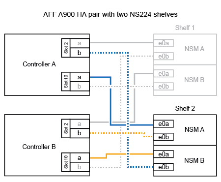
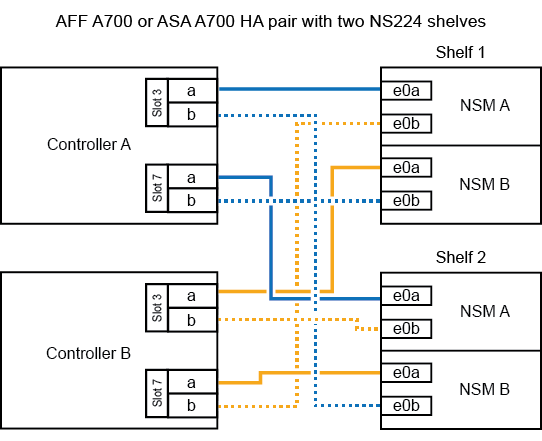

= 熱新增機櫃- NS224機櫃
:allow-uri-read: 
:icons: font
:imagesdir: ../media/

[role="lead"]
當HA配對符合特定需求、且已完成適用於HA配對的準備工作之後、您可以熱新增NS224磁碟機櫃。

== 熱新增需求

[role="lead"]
在熱新增NS224磁碟機櫃之前、HA配對必須符合特定需求。

* 您的平台模式和ONTAP 版本的支援必須支援NS224機櫃和熱新增的磁碟機。
+
https://hwu.netapp.com["NetApp Hardware Universe"^]

* 您必須擁有正確的纜線數量和類型、才能連接機櫃。
+
https://hwu.netapp.com["NetApp Hardware Universe"^]

* 您的HA配對必須有足夠的可用具備RoCE功能的連接埠、才能支援熱新增的磁碟櫃數量。
+
對於您要熱新增的每個機櫃、每個控制器至少需要兩個具備RoCE功能的連接埠。這些連接埠可在控制器上、具備RoCE功能的PCIe卡上、兩者的組合、或是具備RoCE功能的I/O模組上、如您的平台機型所支援。

+
如果您的HA配對沒有足夠可用的RoCE連接埠、而且您的平台機型支援使用具備RoCE功能的PCIe卡或I/O模組、則您必須將額外的卡或I/O模組安裝到正確的控制器插槽中、如同您的平台機型所支援。

+
https://hwu.netapp.com["NetApp Hardware Universe"^]

+
[NOTE]
====
非專屬的具備RoCE功能的連接埠必須設定為供儲存使用（非網路使用）。

<<準備非專屬且具備RoCE功能的連接埠以進行熱新增>>

====
* 如果您有AFF 一對EzeA700 HA配對、而且要熱新增初始NS224磁碟機櫃（HA配對中沒有NS224磁碟機櫃）、則必須在每個控制器中安裝核心傾印模組（X9170A、NVMe 1TB SSD）、才能支援核心傾印（儲存核心檔案）。
+
link:../fas9000/caching-module-and-core-dump-module-replace.html["更換快取模組、或新增/更換核心傾印模組（AFF 即：VA700和FAS9000）"^]

* 您的HA配對必須少於支援的最大磁碟櫃數、至少要少於您計畫要熱新增的磁碟櫃數。
+
在熱新增磁碟櫃之後、您無法超過HA配對所支援的磁碟櫃數量上限。

+
https://hwu.netapp.com["NetApp Hardware Universe"^]

* 如果要將機櫃熱新增至已有NS224機櫃的HA配對、HA配對就不會出現任何儲存設備纜線錯誤訊息、而且必須以多重路徑HA的纜線連接。
+
您可以執行Active IQ Config Advisor 功能不全、以檢視任何儲存設備佈線錯誤訊息、以及您應採取的修正行動。

+
https://mysupport.netapp.com/site/tools/tool-eula/activeiq-configadvisor["NetApp下載Config Advisor"^]

* 您需要一側拉直的迴紋針或一支細尖端的圓球筆。
+
若要變更機櫃ID、請使用回形針或圓筆來存取操作員顯示面板（ODP）後面的機櫃ID按鈕。

== 熱新增的考量事項

[role="lead"]
在熱新增NS224磁碟機櫃之前、您應該先熟悉此程序的最佳實務做法和相關事項。

* 如果您有ASA 支援NS224磁碟櫃的SHA配對、可以使用此程序。
* *最佳實務做法：*最佳實務做法是在熱新增機櫃之前、先安裝目前版本的磁碟認證套件（DQP）。
+
安裝最新版的DQP可讓您的系統辨識及使用新的合格磁碟機。如此可避免系統事件訊息、因為無法辨識磁碟機、因此無法取得非最新的磁碟機資訊並防止磁碟分割。此外、DQP也會通知您非最新的磁碟機韌體。

+
https://mysupport.netapp.com/site/downloads/firmware/disk-drive-firmware/download/DISKQUAL/ALL/qual_devices.zip["NetApp下載：磁碟認證套件"^]

* *最佳實務做法：*最佳實務做法是Active IQ Config Advisor 在熱新增機櫃之前和之後執行
+
在Active IQ Config Advisor 熱新增機櫃之前執行支援功能可提供現有機櫃乙太網路（ENET）連線的快照、驗證NVMe機櫃模組（NSM）韌體版本、並可讓您驗證HA配對中已使用的機櫃ID。在熱新增機櫃之後執行Active IQ Config Advisor 功能、可讓您驗證機櫃的纜線是否正確、以及HA配對內的機櫃ID是否獨特。

+
https://mysupport.netapp.com/site/tools/tool-eula/activeiq-configadvisor["NetApp下載Config Advisor"^]

* *最佳實務做法：*最佳實務做法是在新增磁碟櫃之前、先在系統上安裝最新版本的NVMe機櫃模組（NSM）韌體和磁碟機韌體。
+
https://mysupport.netapp.com/site/downloads/firmware/disk-shelf-firmware["NetApp下載：磁碟櫃韌體"^]

+
https://mysupport.netapp.com/site/downloads/firmware/disk-drive-firmware["NetApp下載：磁碟機韌體"^]

+

NOTE: 請勿將韌體還原至不支援機櫃及其元件的版本。

* 連接好熱新增的機櫃之後ONTAP 、即可識別出機櫃：
+
** 如果啟用自動磁碟機指派、則會指派磁碟機所有權。
** 如有需要、應自動更新NSM機櫃韌體和磁碟機韌體。
+

NOTE: 韌體更新最多可能需要30分鐘。

== 準備熱新增

[role="lead"]
在熱新增NS224磁碟機櫃之前、您必須先完成適用於HA配對的準備工作。

=== 準備非專屬且具備RoCE功能的連接埠以進行熱新增

如果您的HA配對具有非專屬的RoCE連接埠、而您使用這些連接埠來熱新增NS224磁碟機櫃、則必須確定連接埠已設定為供儲存設備使用（非網路使用）。視您的平台機型而定、控制器、具備RoCE功能的PCIe卡、兩者的組合、或是具備RoCE功能的I/O模組、都有具備RoCE功能的連接埠。

.開始之前
您必須符合系統需求。

<<熱新增需求>>

.關於這項工作
* 對於某些平台機型、當控制器的支援插槽中安裝具備RoCE功能的PCIe卡或I/O模組時、連接埠會自動預設為使用儲存設備（而非網路）；不過、建議您完成此程序、以驗證具備RoCE功能的連接埠是否已設定為用於儲存設備。
* 如果您確定HA配對中的非專用的RoCE連接埠未設定為供儲存使用、則設定這些連接埠是不中斷營運的程序。
+

NOTE: 如果HA配對執行ONTAP 的是版本的32位版本、您必須一次重新啟動一個控制器。

+

NOTE: 如果HA配對執行ONTAP 的是NetApp 9.7或更新版本、則不需要重新啟動控制器、除非其中一個或兩個控制器都處於維護模式。此程序假設兩個控制器都未處於維護模式。

.步驟
. 驗證HA配對中的非專屬連接埠是否已設定用於儲存用途：「儲存連接埠顯示」
+
您可以在任一控制器模組上輸入命令。

+
如果HA配對執行ONTAP 的是NetApp 9.8或更新版本、則非專屬連接埠會在「模式」欄中顯示「儲存」。

+
如果您的HA配對執行ONTAP 的是32或9.6、則非專用連接埠在「專用」中顯示「假」 欄位、也會在「tate」欄位中顯示「啟用」。

. 如果將非專屬連接埠設定為供儲存使用、則您必須完成此程序。
+
否則、您必須完成步驟3到6來設定連接埠。

+
[NOTE]
====
如果未將非專屬連接埠設定為供儲存使用、命令輸出會顯示下列項目：

如果HA配對執行ONTAP 的是NetApp 9.8或更新版本、非專屬連接埠會在「模式」欄位中顯示「network」（網路）。

如果您的HA配對執行ONTAP 的是NetApp的支援、則非專用連接埠在「專用」中顯示「假」 欄位、也會在「tate」欄位中顯示「停用」。

====
. 在其中一個控制器模組上設定非專用連接埠以供儲存使用：
+
您必須針對所設定的每個連接埠重複執行適用的命令。

+
[cols="1,3"]
|===
| 如果HA配對正在執行... | 然後... 

 a| 
部分9.8或更新版本ONTAP
 a| 
"torage port modify -nodE nodE name -port port name -mode storage（更改端口名稱-mode storage）"

 a| 
資訊提供ONTAP
 a| 
「torage連接埠啟用節點節點名稱-連接埠名稱」

|===
. 如果HA配對執行ONTAP 的是32個9.6、請重新啟動控制器模組、使連接埠變更生效：「System Node reboot-nodeNode name - rebooting rebooting」（系統節點重新開機-節點節點名稱-重新開機原因）
+
否則、請前往下一步。

+

NOTE: 重新開機最多可能需要15分鐘。

. 對第二個控制器模組重複步驟：
+
[cols="1,3"]
|===
| 如果HA配對正在執行... | 然後... 

 a| 
更新版本ONTAP
 a| 
.. 重複步驟3。
.. 前往步驟6。

 a| 
部分9.6 ONTAP
 a| 
.. 重複步驟3和4。
+

NOTE: 第一個控制器必須已完成重新開機。

.. 前往步驟6。

|===
. 確認兩個控制器模組上的非專屬連接埠均已設定為儲存用途：「儲存連接埠顯示」
+
您可以在任一控制器模組上輸入命令。

+
如果HA配對執行ONTAP 的是NetApp 9.8或更新版本、則非專屬連接埠會在「模式」欄中顯示「儲存」。

+
如果您的HA配對執行ONTAP 的是32或9.6、則非專用連接埠在「專用」中顯示「假」 欄位、也會在「tate」欄位中顯示「啟用」。

=== 準備AFF 一AFF 對用AFF 作熱新增第二個機櫃的功能、即用作供應器的功能

如果您有AFF 一個搭配AFF NS224磁碟機櫃的ESDESA700、ESDEA800或AFF ESDA400 HA配對、且該磁碟櫃已連接至每個控制器上一組具備RoCE功能的連接埠、則必須重新裝上磁碟櫃（安裝額外的具備RoCE功能的PCIe卡或I/O模組之後）。 在熱新增第二個機櫃之前、請先跨越每個控制器上的兩組連接埠。

.開始之前
* 您必須符合系統需求。
+
<<熱新增需求>>

* 您必須啟用所安裝之具備RoCE功能的PCIe卡或I/O模組上的連接埠。
+
<<準備非專屬且具備RoCE功能的連接埠以進行熱新增>>

.關於這項工作
* 如果您的機櫃具有多重路徑HA連線功能、則重新啟用連接埠連線是不中斷營運的程序。
+
您可以在每個控制器上的兩個連接埠集合中重新放置第一個機櫃、以便在熱新增第二個機櫃時、兩個機櫃都有更強的彈性連線能力。

* 在此程序期間、您一次移動一條纜線、以隨時維持與機櫃的連線。

.步驟
. 根據您的平台模式、可在每個控制器上的兩組連接埠之間重新連接現有機櫃的連線。
+

NOTE: 移動纜線時、從一個連接埠拔下纜線、然後將纜線插入另一個連接埠、不需要任何等待時間。

+
[cols="1,3"]
|===
| 如果您有... | 然後... 

 a| 
部分A700 HA配對AFF
 a| 

NOTE: 這些子步驟假設現有機櫃已連接至每個控制器插槽3中具有資源相容的I/O模組。

[NOTE]
====
如有需要、您可以參考兩個機櫃組態中現有單一機櫃和標註機櫃的佈線圖例。

<<連接熱新增機櫃、以利AFF 進行AreA700 HA配對>>

====
.. 在控制器A上、將纜線從插槽3連接埠b（e3b）移至插槽7連接埠b（e7b）。
.. 在控制器B上重複相同的纜線移動

 a| 
VA800 HA配對AFF
 a| 

NOTE: 以下步驟假設現有的機櫃已連接至每個控制器插槽5中的可操作PCIe卡。

[NOTE]
====
如有需要、您可以參考兩個機櫃組態中現有單一機櫃和標註機櫃的佈線圖例。

<<將熱新增機櫃連接至AFF 線纜、以供搭配使用>>

====
.. 在控制器A上、將纜線從插槽5連接埠b（e5b）移至插槽3連接埠b（e3b）。
.. 在控制器B上重複相同的纜線移動

 a| 
VA400 HA配對AFF
 a| 
[NOTE]
====
如有需要、您可以參考兩個機櫃組態中現有單一機櫃和標註機櫃的佈線圖例。

<<將熱新增機櫃連接至AFF 線纜、以供搭配使用>>

====
.. 在控制器A上、將纜線從連接埠e0d移至插槽5連接埠b（e5b）。
.. 在控制器B上重複相同的纜線移動

|===
. 確認已正確連接的機櫃纜線。
+
如果產生任何纜線錯誤、請遵循所提供的修正行動。

+
https://mysupport.netapp.com/site/tools/tool-eula/activeiq-configadvisor["NetApp下載Config Advisor"^]

=== 準備為熱新增手動指派磁碟機擁有權

如果您要手動指派熱新增NS224磁碟機櫃的磁碟機擁有權、則必須停用已啟用的自動磁碟機指派功能。

.開始之前
您必須符合系統需求。

<<熱新增需求>>

.關於這項工作
如果磁碟櫃中的磁碟機將由HA配對中的兩個控制器模組擁有、則您需要手動指派磁碟機擁有權。

.步驟
. 驗證是否已啟用自動磁碟指派：「torage disk option show」
+
您可以在任一控制器模組上輸入命令。

+
如果啟用自動磁碟指派、輸出會在「Auto assign」（自動指派）欄中顯示「On」（開啟）（針對每個控制器模組）。

. 如果已啟用自動磁碟指派、請停用此功能：「torage disk option modify -node_name -autodassign Off」（磁碟選項修改-node_name -autodassign Off）
+
您必須停用兩個控制器模組上的自動磁碟機指派。

== 安裝熱新增磁碟機櫃

[role="lead"]
安裝新的NS224磁碟機櫃時、需要將磁碟櫃安裝到機架或機櫃、連接電源線（自動開啟磁碟櫃電源）、然後設定磁碟櫃ID。

.開始之前
* 您必須符合系統需求。
+
<<熱新增需求>>

* 您必須已完成適用的準備程序。
+
<<準備熱新增>>

.步驟
. 使用套件包裝箱隨附的安裝傳單、安裝機櫃隨附的軌道安裝套件。
+

NOTE: 請勿將機櫃裝在法蘭上。

. 使用安裝說明將機櫃安裝並固定在支撐托架、機架或機櫃上。
+

NOTE: 滿載的NS224機櫃可重達66、78磅（30、29公斤）、需要兩個人才能舉升或使用液壓起重裝置。避免移除機櫃元件（從機櫃正面或背面）、以降低機櫃重量、因為機櫃重量會不平衡。

. 將電源線連接至機櫃、以電源線固定器固定電源線、然後將電源線連接至不同的電源供應器、以獲得恢復能力。
+
機櫃連接電源時會啟動、但沒有電源開關。當電源供應器正常運作時、雙色LED會亮起綠燈。

. 將機櫃ID設為HA配對內的唯一編號：
+
如需更詳細的指示、請參閱：

+
link:change-shelf-id.html["變更機櫃ID - NS224機櫃"^]

+
.. 取下左端蓋、找到LED右側的小孔。
.. 將回形針或類似工具的一端插入小孔、以觸及機櫃ID按鈕。
.. 按住按鈕（長達15秒）、直到數位顯示器上的第一個數字開始閃爍、然後釋放按鈕。
+

NOTE: 如果ID需要15秒以上的時間才能開始閃燈、請再次按住按鈕、確定一定要完全按下。

.. 按下並釋放按鈕、將號碼往前移、直到達到所需的0到9。
.. 重複子步驟4c和4d、設定機櫃ID的第二個編號。
+
最多可能需要三秒（而非15秒）、才能讓號碼開始閃燈。

.. 按住按鈕、直到第二個數字停止閃爍。
+
約五秒鐘後、兩個數字都會開始閃爍、ODP上的黃色LED會亮起。

.. 重新啟動機櫃、使機櫃ID生效。
+
您必須從機櫃拔下兩根電源線、等待10秒鐘、然後重新插回。

+
電源恢復供電時、二色LED會亮起綠色。

== 纜線連接磁碟機櫃以進行熱新增

[role="lead"]
您可以將每個熱新增的NS224磁碟機櫃纜線、以便每個機櫃都有兩個連線連接到HA配對中的每個控制器模組。視您要熱新增的磁碟櫃數量和平台機型而定、您可以在控制器、具備RoCE功能的PCIe卡、兩者的組合、或是具備RoCE功能的I/O模組上使用具備RoCE功能的連接埠。

=== 熱新增的纜線配置考量

熟悉正確的纜線連接器方向、以及NS224 NSM磁碟機櫃模組上連接埠的位置和標籤、有助於在熱新增的磁碟櫃佈線之前先行使用。

* 插入纜線時、連接器拉片朝上。
+
正確插入纜線時、會卡入定位。

+
連接纜線兩端之後、機櫃和控制器連接埠LK（綠色）LED會亮起。如果連接埠LNO LED未亮起、請重新拔插纜線。

+
image::../media/oie_cable_pull_tab_up.png[OIE纜線拉片向上]

* 您可以使用下列圖例來協助實際識別機櫃NSM連接埠e0a和e0b：
+
image::../media/drw_ns224_back_ports.png[DRW n224個後端連接埠]

=== 連接熱新增機櫃、以利AFF 進行AreA900 HA配對

如果需要額外的儲存空間、您可以將最多三個額外的NS224磁碟機櫃（總共四個磁碟櫃）熱新增至AFF 一對《非洲》HA配對。

.開始之前
* 您必須符合系統需求。
+
<<熱新增需求>>

* 您必須已完成適用的準備程序。
+
<<準備熱新增>>

* 您必須安裝磁碟櫃、開啟磁碟櫃電源、然後設定磁碟櫃ID。
+
<<安裝熱新增磁碟機櫃>>

.關於這項工作
* 此程序假設您的HA配對至少有一個現有的NS224磁碟櫃、而且您要熱新增最多三個額外的磁碟櫃。
* 如果您的HA配對只有一個現有的NS224磁碟櫃、則此程序假設磁碟櫃已連接至每個控制器上兩個具有RoCE功能的100GbE I/O模組。

.步驟
. 如果您要熱新增的NS224磁碟櫃是HA配對中的第二個NS224磁碟櫃、請完成下列子步驟。
+
否則、請前往下一步。

+
.. 纜線櫃NSM A連接埠e0a、用於控制器A插槽10連接埠A（E10A）。
.. 纜線櫃NSM A連接埠e0b至控制器B插槽2連接埠b（e2b）。
.. 纜線櫃NSM B連接埠e0A至控制器B插槽10連接埠A（E10A）。
.. 纜線櫃NSM B連接埠e0b至控制器A插槽2連接埠b（e2b）。

+
下圖顯示第二個機櫃纜線（和第一個機櫃）。

+

. 如果您要熱新增的NS224磁碟櫃是HA配對中的第三個NS224磁碟櫃、請完成下列子步驟。
+
否則、請前往下一步。

+
.. 纜線櫃NSM A連接埠e0a、用於控制器A插槽1連接埠A（e1a）。
.. 纜線櫃NSM A連接埠e0b至控制器B插槽11連接埠b（e11b）。
.. 纜線櫃NSM B連接埠e0A至控制器B插槽1連接埠A（e1a）。
.. 纜線櫃NSM B連接埠e0b至控制器A插槽11連接埠b（e11b）。
+
下圖顯示第三個機櫃的纜線。

+
image::../media/drw_ns224_a900_3shelves.png[DRw n224 a900 3個機櫃]

. 如果您要熱新增的NS224磁碟櫃是HA配對中的第四個NS224磁碟櫃、請完成下列子步驟。
+
否則、請前往下一步。

+
.. 纜線櫃NSM A連接埠e0a、用於控制器A插槽11連接埠A（e11a）。
.. 纜線櫃NSM A連接埠e0b至控制器B插槽1連接埠b（e1b）。
.. 纜線櫃NSM B連接埠e0A至控制器B插槽11連接埠A（e11a）。
.. 纜線櫃NSM B連接埠e0b連接至控制器A插槽1連接埠b（e1b）。
+
下圖顯示第四個磁碟櫃的纜線。

+
image::../media/drw_ns224_a900_4shelves.png[DRw n224 a900 4個機櫃]

. 確認熱新增的磁碟櫃纜線正確。
+
如果產生任何纜線錯誤、請遵循所提供的修正行動。

+
https://mysupport.netapp.com/site/tools/tool-eula/activeiq-configadvisor["NetApp下載Config Advisor"]

. 如果您在準備此程序時停用了自動磁碟機指派、則需要手動指派磁碟機所有權、然後視需要重新啟用自動磁碟機指派。
+
否則、您將完成此程序。

+
<<完成熱新增>>

=== 將FAS500f或AFF FASA250 HA配對的熱新增機櫃連接起來

[role="lead"]
如果需要額外的儲存空間、您可以將NS224磁碟機櫃熱新增至FAS500f或AFF S4A250 HA配對。

.開始之前
* 您必須符合系統需求。
+
<<熱新增需求>>

* 您必須已完成適用的準備程序。
+
<<準備熱新增>>

* 您必須安裝磁碟櫃、開啟磁碟櫃電源、然後設定磁碟櫃ID。
+
<<安裝熱新增磁碟機櫃>>

.關於這項工作
從平台機箱背面看、左側的RoCE卡連接埠為連接埠「a」（e1a）、右側連接埠為連接埠「b」（e1b）。

.步驟
. 纜線連接機櫃：
+
.. 纜線櫃NSM A連接埠e0a、用於控制器A插槽1連接埠A（e1a）。
.. 纜線櫃NSM A連接埠e0b至控制器B插槽1連接埠b（e1b）。
.. 纜線櫃NSM B連接埠e0A至控制器B插槽1連接埠A（e1a）。
.. 纜線櫃NSM B連接埠e0b連接至控制器A插槽1連接埠b（e1b）。+下圖顯示機櫃佈線完成後的情形。
+
image::../media/drw_ns224_aff250_fas500f_1shelf.png[DRW n224 fas250 fas500f 1機櫃]

. 確認熱新增的磁碟櫃纜線正確。
+
如果產生任何纜線錯誤、請遵循所提供的修正行動。

+
https://mysupport.netapp.com/site/tools/tool-eula/activeiq-configadvisor["NetApp下載Config Advisor"^]

. 如果您在準備此程序時停用了自動磁碟機指派、則需要手動指派磁碟機所有權、然後視需要重新啟用自動磁碟機指派。
+
否則、您將完成此程序。

+
<<完成熱新增>>

=== 連接熱新增機櫃、以利AFF 進行AreA700 HA配對

如何在AFF 一對SzeA700 HA磁碟機櫃中連接纜線、取決於您要熱新增的磁碟櫃數量、以及控制器模組上使用的具有RoCE功能的連接埠集（一或兩個）數量。

.開始之前
* 您必須符合系統需求。
+
<<熱新增需求>>

* 您必須已完成適用的準備程序。
+
<<準備熱新增>>

* 您必須安裝磁碟櫃、開啟磁碟櫃電源、然後設定磁碟櫃ID。
+
<<安裝熱新增磁碟機櫃>>

.步驟
. 如果您在每個控制器模組上使用一組具備RoCE功能的連接埠（一個具備RoCE功能的I/O模組）熱新增一個機櫃、而且這是HA配對中唯一的NS224機櫃、請完成下列子步驟。
+
否則、請前往下一步。

+

NOTE: 本步驟假設您已在每個控制器模組的插槽3（而非插槽7）中安裝具備RoCE功能的I/O模組。

+
.. 纜線櫃NSM A連接埠e0a、用於控制插槽3連接埠a
.. 纜線櫃NSM A連接埠e0b至控制器B插槽3連接埠b.
.. 纜線櫃NSM B連接埠e0A至控制器B插槽3連接埠a
.. 纜線櫃NSM B連接埠e0b連接至控制器A插槽3連接埠b.
+
下圖顯示使用每個控制器模組中一個具備RoCE功能的I/O模組、連接一個熱新增機櫃的纜線：

+
image::../media/drw_ns224_a700_1shelf.png[DRw n224 a700 1個機櫃]

. 如果您在每個控制器模組中使用兩組具備RoCE功能的連接埠（兩個具備RoCE功能的I/O模組）熱新增一或兩個磁碟櫃、請完成適用的子步驟。
+
[cols="1,3"]
|===
| 磁碟櫃 | 纜線 

 a| 
機櫃1.
 a| 

NOTE: 這些子步驟假設您是從機櫃連接埠e0a佈線至插槽3中具有RoCE功能的I/O模組、而非插槽7開始佈線。

.. 將NSM A連接埠e0a纜線連接至控制器A插槽3連接埠a
.. 將NSM A連接埠e0b纜線連接至控制器B插槽7連接埠b.
.. 將NSM B連接埠e0A纜線連接至控制器B插槽3連接埠a
.. 將NSM B連接埠e0b纜線連接至控制器A插槽7連接埠b.
.. 如果您要熱新增第二個機櫃、請完成「'helf 2'」子步驟；否則、請前往步驟3。

 a| 
機櫃2.
 a| 

NOTE: 這些子步驟假設您是從機櫃連接埠e0a佈線至插槽7中具備RoCE功能的I/O模組、而非插槽3（與機櫃1的佈線子步驟相關）開始佈線。

.. 將NSM A連接埠e0a纜線連接至控制器A插槽7連接埠a
.. 將NSM A連接埠e0b纜線連接至控制器B插槽3連接埠b.
.. 將NSM B連接埠e0A纜線連接至控制器B插槽7連接埠a
.. 將NSM B連接埠e0b纜線連接至控制器A插槽3連接埠b.
.. 前往步驟3。

|===
+
下圖顯示第一個和第二個熱新增磁碟櫃的纜線佈線：

+

. 確認熱新增的磁碟櫃纜線正確。
+
如果產生任何纜線錯誤、請遵循所提供的修正行動。

+
https://mysupport.netapp.com/site/tools/tool-eula/activeiq-configadvisor["NetApp下載Config Advisor"^]

. 如果您在準備此程序時停用了自動磁碟機指派、則需要手動指派磁碟機所有權、然後視需要重新啟用自動磁碟機指派。
+
否則、您將完成此程序。

+
<<完成熱新增>>

=== 將熱新增機櫃連接至AFF 線纜、以供搭配使用

如何在AFF 一個SzeA800 HA配對中連接NS224磁碟機櫃的纜線、取決於您要熱新增的磁碟櫃數量、以及您在控制器模組上使用的具有RoCE功能的連接埠集（一或兩個）數量。

.開始之前
* 您必須符合系統需求。
+
<<熱新增需求>>

* 您必須已完成適用的準備程序。
+
<<準備熱新增>>

* 您必須安裝磁碟櫃、開啟磁碟櫃電源、然後設定磁碟櫃ID。
+
<<安裝熱新增磁碟機櫃>>

.步驟
. 如果您在每個控制器模組上使用一組具備RoCE功能的連接埠（一個具備RoCE功能的PCIe卡）熱新增一個機櫃、而且這是HA配對中唯一的NS224機櫃、請完成下列子步驟。
+
否則、請前往下一步。

+

NOTE: 此步驟假設您已在插槽5中安裝具備RoCE功能的PCIe卡。

+
.. 纜線櫃NSM A連接埠e0a、用於控制器A插槽5連接埠a
.. 纜線櫃NSM A連接埠e0b至控制器B插槽5連接埠b.
.. 纜線櫃NSM B連接埠e0A至控制器B插槽5連接埠a
.. 纜線櫃NSM B連接埠e0b連接至控制器A插槽5連接埠b.
+
下圖顯示每個控制器模組上使用一個具備RoCE功能的PCIe卡、連接一個熱新增機櫃的纜線：

+
image::../media/drw_ns224_a800_1shelf.png[DRw n224 a800 1機櫃]

. 如果您在每個控制器模組上使用兩組具備RoCE功能的連接埠（兩個具備RoCE功能的PCIe卡）熱新增一或兩個磁碟櫃、請完成適用的子步驟。
+

NOTE: 此步驟假設您已在插槽5和插槽3中安裝具備RoCE功能的PCIe卡。

+
[cols="1,3"]
|===
| 磁碟櫃 | 纜線 

 a| 
機櫃1.
 a| 

NOTE: 這些子步驟假設您是從機櫃連接埠e0a佈線至插槽5中具有RoCE功能的PCIe卡、而非插槽3開始佈線。

.. 將NSM A連接埠e0a纜線連接至控制器A插槽5連接埠a
.. 將NSM A連接埠e0b纜線連接至控制器B插槽3連接埠b.
.. 將NSM B連接埠e0A纜線連接至控制器B插槽5連接埠a
.. 將NSM B連接埠e0b纜線連接至控制器A插槽3連接埠b.
.. 如果您要熱新增第二個機櫃、請完成「'helf 2'」子步驟；否則、請前往步驟3。

 a| 
機櫃2.
 a| 

NOTE: 這些子步驟假設您是從機櫃連接埠e0a佈線至插槽3中具有RoCE功能的PCIe卡、而非插槽5（與機櫃1的佈線子步驟相關）開始佈線。

.. 將NSM A連接埠e0a纜線連接至控制器A插槽3連接埠a
.. 將NSM A連接埠e0b纜線連接至控制器B插槽5連接埠b.
.. 將NSM B連接埠e0A纜線連接至控制器B插槽3連接埠a
.. 將NSM B連接埠e0b纜線連接至控制器A插槽5連接埠b.
.. 前往步驟3。

|===
+
下圖顯示兩個熱新增磁碟櫃的纜線佈線：

+
image::../media/drw_ns224_a800_2shelves.png[DRw n224 a800 2個機櫃]

. 確認熱新增的磁碟櫃纜線正確。
+
如果產生任何纜線錯誤、請遵循所提供的修正行動。

+
https://mysupport.netapp.com/site/tools/tool-eula/activeiq-configadvisor["NetApp下載Config Advisor"^]

. 如果您在準備此程序時停用了自動磁碟機指派、則需要手動指派磁碟機所有權、然後視需要重新啟用自動磁碟機指派。
+
否則、您將完成此程序。

+
<<完成熱新增>>

=== 將熱新增機櫃連接至AFF 線纜、以供搭配使用

如何在AFF 一個SzeA400 HA配對中連接NS224磁碟機櫃的纜線、取決於您要熱新增的磁碟櫃數量、以及您在控制器模組上使用的具有RoCE功能的連接埠集（一或兩個）數量。

.開始之前
* 您必須符合系統需求。
+
<<熱新增需求>>

* 您必須已完成適用的準備程序。
+
<<準備熱新增>>

* 您必須安裝磁碟櫃、開啟磁碟櫃電源、然後設定磁碟櫃ID。
+
<<安裝熱新增磁碟機櫃>>

.步驟
. 如果您在每個控制器模組上使用一組具備RoCE功能的連接埠（內建具備RoCE功能的連接埠）熱新增一個機櫃、而且這是HA配對中唯一的NS224機櫃、請完成下列子步驟。
+
否則、請前往下一步。

+
.. 纜線櫃NSM A連接埠e0a至控制器A連接埠e0c。
.. 纜線櫃NSM A連接埠e0b至控制器B連接埠e0d。
.. 纜線櫃NSM B連接埠e0A至控制器B連接埠e0c。
.. 纜線櫃NSM B連接埠e0b連接至控制器A連接埠e0d。
+
下圖顯示如何使用每個控制器模組上一組具備RoCE功能的連接埠來連接一個熱新增機櫃的纜線：

+
image::../media/drw_ns224_a400_1shelf.png[DRw N224 A400 1機櫃]

. 如果您要在每個控制器模組上使用兩組具備RoCE功能的連接埠（主機板內建和PCIe卡具備RoCE功能的連接埠）熱新增一或兩個磁碟櫃、請完成下列子步驟。
+
[cols="1,3"]
|===
| 磁碟櫃 | 纜線 

 a| 
機櫃1.
 a| 
.. 將NSM A連接埠e0a連接至控制器A連接埠e0c。
.. 將NSM A連接埠e0b纜線連接至控制器B插槽5連接埠b.
.. 將NSM B連接埠e0A纜線連接至控制器B連接埠e0c。
.. 將NSM B連接埠e0b纜線連接至控制器A插槽5連接埠b.
.. 如果您要熱新增第二個機櫃、請完成「'helf 2'」子步驟；否則、請前往步驟3。

 a| 
機櫃2.
 a| 
.. 將NSM A連接埠e0a纜線連接至控制器A插槽5連接埠a
.. 將NSM A連接埠e0b纜線連接至控制器B連接埠e0d。
.. 將NSM B連接埠e0A纜線連接至控制器B插槽5連接埠a
.. 將NSM B連接埠e0b纜線連接至控制器A連接埠e0d。
.. 前往步驟3。

|===
+
下圖顯示兩個熱新增磁碟櫃的纜線佈線：

+
image::../media/drw_ns224_a400_2shelves.png[DRw n224 A400 2個機櫃]

. 確認熱新增的磁碟櫃纜線正確。
+
如果產生任何纜線錯誤、請遵循所提供的修正行動。

+
https://mysupport.netapp.com/site/tools/tool-eula/activeiq-configadvisor["NetApp下載Config Advisor"^]

. 如果您在準備此程序時停用了自動磁碟機指派、則需要手動指派磁碟機所有權、然後視需要重新啟用自動磁碟機指派。
+
否則、您將完成此程序。

+
<<完成熱新增>>

=== 將熱新增機櫃連接至AFF 線纜、以供搭配使用

需要額外儲存時、您可以將第二個NS224磁碟機櫃纜線連接至現有的HA配對。

.開始之前
* 您必須符合系統需求。
+
<<熱新增需求>>

* 您必須已完成適用的準備程序。
+
<<準備熱新增>>

* 您必須安裝磁碟櫃、開啟磁碟櫃電源、然後設定磁碟櫃ID。
+
<<安裝熱新增磁碟機櫃>>

.關於這項工作
本程序假設AFF 您的S3220 HA配對已有NS224機櫃、而且您正在熱新增第二個機櫃。

.步驟
. 將機櫃連接至控制器模組。
+
.. 將NSM A連接埠e0a連接至控制器A連接埠e0e。
.. 將NSM A連接埠e0b纜線連接至控制器B連接埠e0b。
.. 將NSM B連接埠e0A纜線連接至控制器B連接埠e0e。
.. 將NSM B連接埠e0b纜線連接至控制器A連接埠e0b。+下圖顯示熱新增機櫃（機櫃2）的佈線：
+
image::../media/drw_ns224_a320_2shelves_direct_attached.png[直接附加於DRw n224 A320 2磁碟櫃]

. 確認熱新增的磁碟櫃纜線正確。
+
如果產生任何纜線錯誤、請遵循所提供的修正行動。

+
https://mysupport.netapp.com/site/tools/tool-eula/activeiq-configadvisor["NetApp下載Config Advisor"^]

. 如果您在準備此程序時停用了自動磁碟機指派、則需要手動指派磁碟機所有權、然後視需要重新啟用自動磁碟機指派。
+
否則、您將完成此程序。

+
<<完成熱新增>>

== 完成熱新增

[role="lead"]
如果您在準備NS224磁碟機櫃熱新增時停用了自動磁碟機指派、則需要手動指派磁碟機擁有權、然後視需要重新啟用自動磁碟機指派。

.開始之前
您必須已依照HA配對的指示、將機櫃連接好纜線。

<<纜線連接磁碟機櫃以進行熱新增>>

.步驟
. 顯示所有未擁有的磁碟機：「torage disk show -conter-type unallected」
+
您可以在任一控制器模組上輸入命令。

. 指派每個磁碟機：「torage disk assign -disk disk_name -Owner_name」
+
您可以在任一控制器模組上輸入命令。

+
您可以使用萬用字元一次指派多個磁碟機。

. 如有需要、請重新啟用自動磁碟指派：「儲存磁碟選項modify -node_name -autodassign on」
+
您必須在兩個控制器模組上重新啟用自動磁碟機指派。

