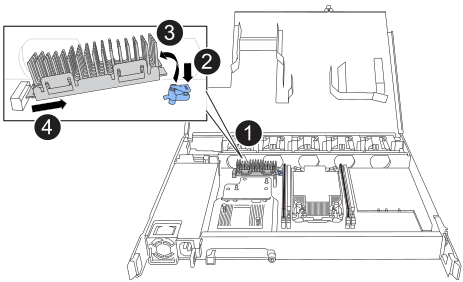

= 更換開機媒體- NS224磁碟櫃
:allow-uri-read: 
:icons: font
:imagesdir: ../media/

[role="lead"]
您可以在 NS224 機櫃中更換故障的開機媒體。更換開機媒體時、磁碟機櫃電源開啟且I/O正在進行中、無需中斷營運即可完成。

.開始之前
* *NS224 僅含 NSM100 模組 * ：您的 HA 配對必須已執行 ONTAP 9.7 或更新版本，且最低支援版本為 NSM 韌體。
+
您可以在任一控制器的主控台輸入「儲存櫃show -module'命令、以驗證機櫃上的NSM韌體版本。

+
[NOTE]
====
如果您的機櫃未執行 NSM 韌體版本 0111 或更新版本，您將無法更換開機媒體，您必須更換 NSM 。

link:service-replace-nsm100.html["更換 NSM - NS224 機櫃"^]

====
* *NS224 僅含 NSM100 模組 * ：您需要一把十字螺絲起子。
+
用於將開機媒體固定至主機板的螺絲需要使用一號十字螺絲起子；使用不同類型的螺絲起子可能會使螺絲脫開。

* 機櫃的合作夥伴 NSM 必須正常運作，並正確連接纜線，以便在移除故障 FRU 的 NSM （目標 NSM ）時，機櫃可維持連線。
+
https://mysupport.netapp.com/site/tools/tool-eula/activeiq-configadvisor["NetApp下載Config Advisor"^]

* 系統中的所有其他元件必須正常運作。

.關於這項工作
* 更換開機媒體之後，機櫃合作夥伴 NSM 的開機映像會自動複製到更換的開機媒體。
+
這可能需要五分鐘的時間。

* 在移除和安裝NVMe機櫃模組（NSM）之間、請至少等待70秒。
+
這讓ONTAP 我們有足夠的時間來處理NSM移除事件。

* 如有需要、您可以開啟機櫃的位置（藍色）LED、以協助實際找出受影響的機櫃：「儲存櫃位置導向的修改-機櫃名稱_bidle_name_-leide-Status on」
+
如果您不知道受影響的機櫃的「_shider_name_」、請執行「shorage sh儲存 櫃show」命令。

+
機櫃有三個位置 LED ：一個在操作員顯示面板上，一個在每個 NSM 上。位置LED會持續亮起30分鐘。您可以輸入相同的命令，但使用選項將其關閉 `off`。

* 更換開機媒體之後、您可以依照套件隨附的RMA指示、將故障零件退回NetApp。
+
如果您需要RMA號碼或更換程序的其他協助、請聯絡技術支援部門： https://mysupport.netapp.com/site/global/dashboard["NetApp支援"^]電話：888-463-8277（北美）、00-800-44-638277（歐洲）或+800-800-80-800（亞太地區）。

[role="tabbed-block"]
====
.NSM100 模組
--
您可以使用下列動畫或書面步驟來取代開機媒體。

.更換 NS224 機櫃開機媒體
video::20ed85f9-1f80-4e0e-9219-ab4600070d8a[panopto]
.步驟
. 確定機櫃中的兩個 NSM 都執行相同版本的韌體：版本 0200 或更新版本。
. 請妥善接地。
. 從包含您要更換的 FRU 的 NSM 拔下纜線：
+
.. 如果電源線是AC電源供應器、請打開電源線固定器、將電源線從電源供應器拔下；如果是DC電源供應器、請打開兩個指旋螺絲、然後從電源供應器拔下電源線。
+
電源供應器沒有電源開關。

.. 從 NSM 連接埠拔下儲存纜線。
+
記下每條纜線所連接的 NSM 連接埠。重新插入 NSM 時，請將纜線重新連接至相同的連接埠，稍後將在本程序中進行。

. 從機櫃取下 NSM ：
+
.. 將食指繞過 NSM 兩側鎖定機制的指孔。
+

NOTE: 如果您要移除底部的 NSM ，且底部的軌道阻礙了對鎖定機制的存取，請將食指從內部的指孔中穿過（橫過手臂）。

.. 用您的拇指按住鎖定機制頂端的橘色彈片。
+
鎖定機制會舉起、清除機櫃上的鎖定銷。

.. 輕輕拉動，直到 NSM 離開機櫃約三分之一，用雙手抓住 NSM 兩側以支撐其重量，然後將其放在平坦穩固的表面上。
+
當您開始拉動時，閉鎖機械臂會從 NSM 伸出，並鎖定其完全展開的位置。

. 鬆開 NSM 護蓋拇指螺絲，然後打開護蓋。
. 實際找到故障的開機媒體。
+
開機媒體位於與電源供應器相對的機櫃機箱牆上。

. 更換開機媒體：
+
.. 使用1號十字螺絲起子、小心地移除將開機媒體底部（有缺口）端固定至主機板的螺絲。
.. 將開機媒體稍微向上旋轉、然後朝自己的方向輕拉、直到其從插槽中釋放、即可將其取出。
+
您可以將姆指和手指放在側邊邊緣的缺口末端、以容納開機媒體

.. 從防靜電袋中打開開機媒體的包裝。
.. 將替換的開機媒體輕推入插槽、直到它完全和正面地插入插槽。
+
您可以將姆指和手指放在側邊邊緣的缺口末端、以容納開機媒體請確定散熱片的一側朝上。

+
當正確就位、當您離開開機媒體時、開機媒體的缺口端會向上調整、使其遠離主機板、因為它尚未使用螺絲固定。

.. 插入開機媒體時、請輕壓開機媒體的缺口端、然後使用螺絲起子鎖緊螺絲、將開機媒體固定到位。
+

NOTE: 將螺絲鎖緊至足以將開機媒體牢牢固定到位的程度、但請勿過度鎖緊。

. 合上 NSM 護蓋，然後旋緊指旋螺絲。
. 將 NSM 重新插入機櫃：
+
.. 確定鎖定機制臂鎖定在完全延伸位置。
.. 用雙手將 NSM 輕輕滑入機櫃，直到機櫃完全支撐 NSM 的重量為止。
.. 將 NSM 推入機櫃，直到停住為止（距離機櫃背面約半英吋）。
+
您可以將拇指放在每個手指迴圈（鎖定機械臂）正面的橘色彈片上，以推入 NSM 。

.. 將食指繞過 NSM 兩側鎖定機制的指孔。
+

NOTE: 如果您要插入底部的 NSM ，而且底部的軌道阻礙了對鎖定機制的存取，請將食指從內部穿過指孔（橫過手臂）。

.. 用您的拇指按住鎖定機制頂端的橘色彈片。
.. 向前輕推、將栓鎖移到停止點上方。
.. 從鎖定機制頂端釋放您的指稱、然後繼續推動、直到鎖定機制卡入定位為止。
+
NSM 應完全插入機櫃，並與機櫃邊緣齊平。

. 重新連接 NSM 的纜線：
+
.. 將儲存設備纜線重新連接至相同的兩個 NSM 連接埠。
+
插入纜線時、連接器拉片朝上。正確插入纜線時、會卡入定位。

.. 將電源線重新連接至電源供應器、如果是AC電源供應器、請將電源線與電源線固定器固定、如果是DC電源供應器、請將兩顆指旋螺絲鎖緊。
+
當電源供應器正常運作時、雙色LED會亮起綠燈。

+
此外，兩個 NSM 連接埠 LNK （綠色） LED 都會亮起。如果LNO LED未亮起、請重新拔插纜線。

. 驗證包含故障開機媒體的 NSM 上的警示（琥珀色） LED 和機櫃操作員顯示面板是否不再亮起。
+
注意LED可能需要5到10分鐘的時間才能關閉。這是 NSM 重新開機和開機媒體映像複本完成所需的時間量。

+
如果故障LED持續亮起、表示開機媒體可能未正確就位、或是有其他問題、您應聯絡技術支援部門以尋求協助。

. 執行 Active IQ Config Advisor ，確認 NSM 纜線正確無誤。
+
如果產生任何纜線錯誤、請遵循所提供的修正行動。

+
https://mysupport.netapp.com/site/tools/tool-eula/activeiq-configadvisor["NetApp下載Config Advisor"^]

--
.NSM100B 模組
--
您可以使用下列步驟來更換故障的開機媒體。

.步驟
. 請妥善接地。
. 從包含您要更換的 FRU 的 NSM 拔下纜線：
+
.. 如果電源線是AC電源供應器、請打開電源線固定器、將電源線從電源供應器拔下；如果是DC電源供應器、請打開兩個指旋螺絲、然後從電源供應器拔下電源線。
+
電源供應器沒有電源開關。

.. 從 NSM 連接埠拔下儲存纜線。
+
記下每條纜線所連接的 NSM 連接埠。重新插入 NSM 時，請將纜線重新連接至相同的連接埠，稍後將在本程序中進行。

. 移除 NSM ：
+
image::../media/drw_g_and_t_handles_remove_ieops-1837.svg[移除 NSM 。]

+
[cols="1,4"]
|===

 a| 
image::../media/icon_round_1.png[編號 1]
 a| 
在 NSM 的兩端，將垂直鎖定彈片向外推，以鬆開把手。

 a| 
image::../media/icon_round_2.png[編號 2]
 a| 
** 朝自己的方向拉動把手，將 NSM 從中間背板上取下。
+
拉起時，把手會從機櫃伸出。當您感覺到阻力時，請繼續拉動。

** 將 NSM 滑出機櫃，放在平坦穩定的表面上。
+
將 NSM 滑出機櫃時，請務必支撐其底部。

 a| 
image::../media/icon_round_3.png[編號 3]
 a| 
將把手垂直轉動（在彈片旁邊），將其移出。

|===
. 逆時針轉動指旋螺絲以鬆開 NSM 護蓋，然後打開護蓋。
. 實際找到故障的開機媒體。
. 移除開機媒體：
+

+
[cols="1,4"]
|===

 a| 
image::../media/icon_round_1.png[編號 1]
 a| 
開機媒體位置

 a| 
image::../media/icon_round_2.png[編號 2]
 a| 
按下藍色標籤以釋放開機媒體的右端。

 a| 
image::../media/icon_round_3.png[編號 3]
 a| 
以小角度提起開機媒體的右端，以便在開機媒體的兩側獲得良好的抓握力。

 a| 
image::../media/icon_round_4.png[編號 4.]
 a| 
將開機媒體的左端輕輕拉出插槽。

|===
. 安裝替換開機媒體：
+
.. 將開機媒體的邊緣對齊插槽外殼、然後將其輕推入插槽。
.. 朝鎖定按鈕方向向下旋轉開機媒體。
.. 按下鎖定按鈕，將開機媒體完全向下旋轉，然後放開鎖定按鈕。

. 合上 NSM 護蓋，然後旋緊指旋螺絲。
. 將 NSM 插入機櫃：
+
image::../media/drw_g_and_t_handles_reinstall_ieops-1838.svg[更換 NSM 。]

+
[cols="1,4"]
|===

 a| 
image::../media/icon_round_1.png[編號 1]
 a| 
如果您在維修 NSM 時將 NSM 把手直立（在標籤旁邊）往外移動，請將它們向下旋轉至水平位置。

 a| 
image::../media/icon_round_2.png[編號 2]
 a| 
將 NSM 背面對準機櫃中的開口，然後使用把手輕推 NSM ，直到完全就位。

 a| 
image::../media/icon_round_3.png[編號 3]
 a| 
將把手旋轉至直立位置，並使用彈片鎖定到位。

|===
. 重新連接 NSM 的纜線：
+
.. 將儲存設備纜線重新連接至相同的兩個 NSM 連接埠。
+
插入纜線時、連接器拉片朝上。正確插入纜線時、會卡入定位。

.. 將電源線重新連接至電源供應器、如果是AC電源供應器、請將電源線與電源線固定器固定、如果是DC電源供應器、請將兩顆指旋螺絲鎖緊。
+
當電源供應器正常運作時、雙色LED會亮起綠燈。

+
此外，兩個 NSM 連接埠 LNK （綠色） LED 都會亮起。如果LNO LED未亮起、請重新拔插纜線。

. 驗證包含故障開機媒體的 NSM 上的警示（琥珀色） LED 和機櫃操作員顯示面板是否不再亮起。
+
注意LED可能需要5到10分鐘的時間才能關閉。這是 NSM 重新開機和開機媒體映像複本完成所需的時間量。

+
如果故障LED持續亮起、表示開機媒體可能未正確就位、或是有其他問題、您應聯絡技術支援部門以尋求協助。

. 執行 Active IQ Config Advisor ，確認 NSM 纜線正確無誤。
+
如果產生任何纜線錯誤、請遵循所提供的修正行動。

+
https://mysupport.netapp.com/site/tools/tool-eula/activeiq-configadvisor["NetApp下載Config Advisor"^]

--
====