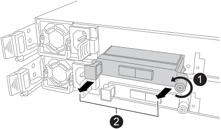

= 將乙太網路 I/O 模組 - NS224 機櫃更換為 NSM100B 模組
:allow-uri-read: 
:icons: font
:imagesdir: ../media/

[role="lead"]
您可以在開啟電源的 NS224 磁碟機櫃中，以及在 I/O 進行中，以不中斷營運的方式更換故障的乙太網路 I/O 模組。此程序僅適用於配備 NSM100B 模組的 NS224 機櫃。

.開始之前
* 機櫃的合作夥伴 NSM 必須正常運作，並正確連接纜線，以便在移除故障的 NSM 時保持連線狀態。
+
https://mysupport.netapp.com/site/tools/tool-eula/activeiq-configadvisor["NetApp下載Config Advisor"^]

* 系統中的所有其他元件必須正常運作。

.關於這項工作
* 在移除和安裝NVMe機櫃模組（NSM）之間、請至少等待70秒。
+
這讓ONTAP 我們有足夠的時間來處理NSM移除事件。

* *最佳實務做法：*最佳實務做法是在更換FRU元件之前、先在系統上安裝最新版本的NVMe機櫃模組（NSM）韌體和磁碟機韌體。
+
https://mysupport.netapp.com/site/downloads/firmware/disk-shelf-firmware["NetApp下載：磁碟櫃韌體"^]

+
https://mysupport.netapp.com/site/downloads/firmware/disk-drive-firmware["NetApp下載：磁碟機韌體"^]

+
[NOTE]
====
請勿將韌體還原至不支援機櫃及其元件的版本。

====
* 在具有非最新韌體版本的新 NSM 上，機櫃（ NSM ）韌體會自動更新（不中斷營運）。
+
NSM 韌體檢查每 10 分鐘進行一次。NSM韌體更新最多可能需要30分鐘。

* 如有需要、您可以開啟機櫃的位置（藍色）LED、以協助實際找出受影響的機櫃：「儲存櫃位置導向的修改-機櫃名稱_bidle_name_-leide-Status on」
+
如果您不知道受影響機櫃的「shelf_name」、請執行「shorage shelage show」命令。

+
機櫃有三個位置 LED ：一個在操作員顯示面板上，一個在每個 NSM 上。位置LED會持續亮起30分鐘。您可以輸入相同的命令，但使用選項將其關閉 `off`。

* 當您打開更換的NSM的包裝時、請保留所有包裝材料、以便在退回故障的NSM時使用。
+
如果您需要RMA號碼或更換程序的其他協助、請聯絡技術支援部門： https://mysupport.netapp.com/site/global/dashboard["NetApp支援"^]電話：888-463-8277（北美）、00-800-44-638277（歐洲）或+800-800-80-800（亞太地區）。

.步驟
. 請妥善接地。
. 從包含您要更換的 FRU 的 NSM 拔下纜線：
+
.. 如果電源線是AC電源供應器、請打開電源線固定器、將電源線從電源供應器拔下；如果是DC電源供應器、請打開兩個指旋螺絲、然後從電源供應器拔下電源線。
+
電源供應器沒有電源開關。

.. 從 NSM 連接埠拔下儲存纜線。
+
記下每條纜線所連接的 NSM 連接埠。重新插入 NSM 時，請將纜線重新連接至相同的連接埠，稍後將在本程序中進行。

. 移除 NSM ：
+
image::../media/drw_g_and_t_handles_remove_ieops-1837.svg[移除 NSM 。]

+
[cols="1,4"]
|===

 a| 
image::../media/icon_round_1.png[編號 1]
 a| 
在 NSM 的兩端，將垂直鎖定彈片向外推，以鬆開把手。

 a| 
image::../media/icon_round_2.png[編號 2]
 a| 
** 朝自己的方向拉動把手，將 NSM 從中間背板上取下。
+
拉起時，把手會從機櫃伸出。當您感覺到阻力時，請繼續拉動。

** 將 NSM 滑出機櫃，放在平坦穩定的表面上。
+
將 NSM 滑出機櫃時，請務必支撐其底部。

 a| 
image::../media/icon_round_3.png[編號 3]
 a| 
將把手垂直轉動（在彈片旁邊），將其移出。

|===
. 從 NSM 移除故障 I/O 模組：
+

+
[cols="1,4"]
|===

 a| 
image::../media/icon_round_1.png[編號 1]
 a| 
逆時針旋轉 I/O 模組指旋螺絲以鬆開。

 a| 
image::../media/icon_round_2.png[編號 2]
 a| 
使用左側的連接埠標籤和指旋螺絲，將 I/O 模組從 NSM 中拉出。

|===
. 將替換 I/O 模組安裝至目標插槽：
+
.. 將I/O模組與插槽邊緣對齊。
.. 輕輕地將 I/O 模組完全推入插槽，確保將模組正確插入連接器。
+
您可以使用左側的標籤和指旋螺絲推入 I/O 模組。

.. 順時針旋轉指旋螺絲以旋緊。

. 將 NSM 插入機櫃：
+
image::../media/drw_g_and_t_handles_reinstall_ieops-1838.svg[更換 NSM 。]

+
[cols="1,4"]
|===

 a| 
image::../media/icon_round_1.png[編號 1]
 a| 
如果您在維修 NSM 時將 NSM 把手直立（在標籤旁邊）往外移動，請將它們向下旋轉至水平位置。

 a| 
image::../media/icon_round_2.png[編號 2]
 a| 
將 NSM 背面對準機櫃中的開口，然後使用把手輕推 NSM ，直到完全就位。

 a| 
image::../media/icon_round_3.png[編號 3]
 a| 
將把手旋轉至直立位置，並使用彈片鎖定到位。

|===
. 可重新安裝 NSM 。
+
.. 將儲存設備纜線重新連接至相同的兩個 NSM 連接埠。
+
插入纜線時、連接器拉片朝上。正確插入纜線時、會卡入定位。

.. 將電源線重新連接至電源供應器、如果是AC電源供應器、請將電源線與電源線固定器固定、如果是DC電源供應器、請鎖緊兩個指旋螺絲、然後從電源供應器拔下電源線。
+
當電源供應器正常運作時、雙色LED會亮起綠燈。

+
此外，兩個 NSM 連接埠 LNK （綠色） LED 都會亮起。如果LNO LED未亮起、請重新拔插纜線。

. 確認包含故障 I/O 模組的 NSM 上的警示（琥珀色） LED 和機櫃操作員顯示面板不再亮起
+
NSM 注意 LED 會在 NSM 重新開機後熄滅，而不再偵測 I/O 模組問題。這可能需要三到五分鐘的時間。

. 執行 Active IQ Config Advisor ，確認 NSM 纜線正確無誤。
+
如果產生任何纜線錯誤、請遵循所提供的修正行動。

+
https://mysupport.netapp.com/site/tools/tool-eula/activeiq-configadvisor["NetApp下載Config Advisor"^]

