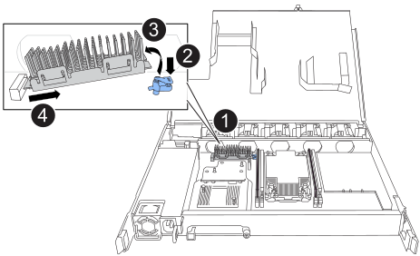

= 更換 NSM - NS224 機櫃
:allow-uri-read: 
:icons: font
:imagesdir: ../media/

[role="lead"]
您可以在開啟電源的NS224磁碟機櫃中、在不中斷營運的情況下、在I/O進行中、更換功能受損的NVMe磁碟櫃模組（NSM）。

.開始之前
* 機櫃的合作夥伴 NSM 必須正常運作，並正確連接纜線，以便在移除故障的 NSM 時保持連線狀態。
+
https://mysupport.netapp.com/site/tools/tool-eula/activeiq-configadvisor["NetApp下載Config Advisor"^]

* 系統中的所有其他元件必須正常運作。

.關於這項工作
* 更換 NSM 涉及下列事項：
+
** *NSM100 模組 * ：從故障的 NSM 到更換的 NSM 的 DIMM ，風扇和電源供應器。
** *NSM100B 模組 * ：由故障 NSM 提供的 DIMM ，風扇，開機媒體， I/O 模組和電源供應器，可更換 NSM 。
+
您不會移動即時時鐘（ RTC ）電池。它們會預先安裝在替換的 NSM 中。

* 在移除和安裝NVMe機櫃模組（NSM）之間、請至少等待70秒。
+
這讓ONTAP 我們有足夠的時間來處理NSM移除事件。

* *最佳實務做法：*最佳實務做法是在更換FRU元件之前、先在系統上安裝最新版本的NVMe機櫃模組（NSM）韌體和磁碟機韌體。
+
https://mysupport.netapp.com/site/downloads/firmware/disk-shelf-firmware["NetApp下載：磁碟櫃韌體"^]

+
https://mysupport.netapp.com/site/downloads/firmware/disk-drive-firmware["NetApp下載：磁碟機韌體"^]

+
[NOTE]
====
請勿將韌體還原至不支援機櫃及其元件的版本。

====
* 在具有非最新韌體版本的新 NSM 上，機櫃（ NSM ）韌體會自動更新（不中斷營運）。
+
NSM 韌體檢查每 10 分鐘進行一次。NSM韌體更新最多可能需要30分鐘。

* 如有需要、您可以開啟機櫃的位置（藍色）LED、以協助實際找出受影響的機櫃：「儲存櫃位置導向的修改-機櫃名稱_bidle_name_-leide-Status on」
+
如果您不知道受影響機櫃的「shelf_name」、請執行「shorage shelage show」命令。

+
機櫃有三個位置 LED ：一個在操作員顯示面板上，一個在每個 NSM 上。位置LED會持續亮起30分鐘。您可以輸入相同的命令，但使用選項將其關閉 `off`。

* 當您打開更換的NSM的包裝時、請保留所有包裝材料、以便在退回故障的NSM時使用。
+
如果您需要RMA號碼或更換程序的其他協助、請聯絡技術支援部門： https://mysupport.netapp.com/site/global/dashboard["NetApp支援"^]電話：888-463-8277（北美）、00-800-44-638277（歐洲）或+800-800-80-800（亞太地區）。

[role="tabbed-block"]
====
.NSM100 模組
--
您可以使用下列動畫或書面步驟來取代 NSM 。

.更換 NS224 機櫃中的 NSM
video::f57693b3-b164-4014-a827-aa86002f4b34[panopto]
.步驟
. 請妥善接地。
. 實體識別受損的 NSM 。
+
系統會將警告訊息記錄到系統主控台、指出哪個模組受損。此外、磁碟機櫃操作員顯示面板和受損模組上的警示（黃色）LED會亮起。

. 從受損的 NSM 拔下纜線：
+
.. 如果電源線是AC電源供應器、請打開電源線固定器、將電源線從電源供應器拔下；如果是DC電源供應器、請打開兩個螺絲、然後從電源供應器拔下電源線。
+
電源供應器沒有電源開關。

.. 從 NSM 連接埠拔下儲存纜線。
+
記下每條纜線所連接的 NSM 連接埠。您可以將纜線重新連接至替換 NSM 上的相同連接埠，稍後將在本程序中進行。

. 從機櫃取下 NSM ：
+
.. 將食指繞過 NSM 兩側鎖定機制的指孔。
+

NOTE: 如果您要移除底部的 NSM ，且底部的軌道阻礙了對鎖定機制的存取，請將食指從內部的指孔中穿過（橫過手臂）。

.. 用您的拇指按住鎖定機制頂端的橘色彈片。
+
鎖定機制會舉起、清除機櫃上的鎖定銷。

.. 輕輕拉動，直到 NSM 離開機櫃約三分之一，用雙手抓住 NSM 兩側以支撐其重量，然後將其放在平坦穩固的表面上。
+
當您開始拉動時，閉鎖機械臂會從 NSM 伸出，並鎖定其完全展開的位置。

. 拆開備用 NSM 的包裝，並將其放在減損 NSM 附近的平坦表面上。
. 鬆開每個護蓋上的指旋螺絲，打開受損 NSM 和更換 NSM 的護蓋。
+

NOTE: NSM 護蓋上的 FRU 標籤會顯示 DIMM 和風扇的位置。

. 將 DIMM 從功能受損的 NSM 移至替換的 NSM ：
+
.. 請注意插槽中 DIMM 的方向，以便您可以使用相同的方向將 DIMM 插入替換的 NSM 。
.. 緩慢地將DIMM插槽兩端的彈出彈出彈片分開、然後將DIMM從插槽中取出。
+

NOTE: 小心拿住DIMM的邊角或邊緣、避免對DIMM電路板元件造成壓力。推出式彈片仍保持在開啟位置。

.. 握住 DIMM 的邊角，然後將 DIMM 平直插入替換 NSM 的插槽。
+
DIMM底部插針之間的槽口應與插槽中的卡舌對齊。

+
正確插入時、DIMM應可輕鬆插入、但應緊密插入插槽中。如果沒有、請重新插入DIMM。

.. 小心地向下推DIMM頂端邊緣、但穩固地推入、直到彈出彈片卡入DIMM兩端的槽口為止。
.. 對其餘的DIMM重複執行步驟7a到7d。

. 將風扇從減損的 NSM 移至更換的 NSM ：
+
.. 從藍色接觸點所在的側邊牢牢抓住風扇、然後垂直提起風扇、將其從插槽拔下。
+
您可能需要前後輕搖風扇、才能將其拔除、然後再將其取出。

.. 將風扇對準更換 NSM 中的導軌，然後向下推，直到風扇模組連接器完全插入插槽為止。
.. 對其餘風扇重複執行步驟8a和8b。

. 合上每個 NSM 的機箱蓋，然後鎖緊每個指旋螺絲。
. 將電源供應器從損壞的 NSM 移至更換的 NSM ：
+
.. 將握把向上旋轉至水平位置、然後加以抓住。
.. 用您的姆指按下藍色彈片以釋放鎖定機制。
.. 將電源供應器從 NSM 中拉出，同時用另一隻手支撐其重量。
.. 用雙手支撐電源供應器的邊緣，並將其與替換 NSM 的開口對齊。
.. 將電源供應器輕輕推入 NSM ，直到鎖定機制卡入定位。
+

NOTE: 請勿過度施力、否則可能會損壞內部接頭。

.. 向下轉動握把、使其遠離正常作業。

. 將替換的 NSM 插入機櫃：
+
.. 確定鎖定機制臂鎖定在完全延伸位置。
.. 用雙手將 NSM 輕輕滑入機櫃，直到機櫃完全支撐 NSM 的重量為止。
.. 將 NSM 推入機櫃，直到停住為止（距離機櫃背面約半英吋）。
+
您可以將拇指放在每個手指迴圈（鎖定機械臂）正面的橘色彈片上，以推入 NSM 。

.. 將食指繞過 NSM 兩側鎖定機制的指孔。
+

NOTE: 如果您要插入底部的 NSM ，而且底部的軌道阻礙了對鎖定機制的存取，請將食指從內部穿過指孔（橫過手臂）。

.. 用您的拇指按住鎖定機制頂端的橘色彈片。
.. 向前輕推、將栓鎖移到停止點上方。
.. 從鎖定機制頂端釋放您的指稱、然後繼續推動、直到鎖定機制卡入定位為止。
+
NSM 應完全插入機櫃，並與機櫃邊緣齊平。

. 重新連接 NSM 的纜線：
+
.. 將儲存設備纜線重新連接至相同的兩個 NSM 連接埠。
+
插入纜線時、連接器拉片朝上。正確插入纜線時、會卡入定位。

.. 將電源線重新連接至電源供應器、如果是AC電源供應器、請將電源線與電源線固定器固定、如果是DC電源供應器、請將兩顆指旋螺絲鎖緊。
+
當電源供應器正常運作時、雙色LED會亮起綠燈。

+
此外，兩個 NSM 連接埠 LNK （綠色） LED 都會亮起。如果LNO LED未亮起、請重新拔插纜線。

. 確認機櫃操作員顯示面板上的警示（黃色）LED不再亮起。
+
NSM 重新開機後，操作員顯示面板注意 LED 會熄滅。這可能需要三到五分鐘的時間。

. 執行 Active IQ Config Advisor ，確認 NSM 纜線正確無誤。
+
如果產生任何纜線錯誤、請遵循所提供的修正行動。

+
https://mysupport.netapp.com/site/tools/tool-eula/activeiq-configadvisor["NetApp下載Config Advisor"^]

. 確定機櫃中的兩個 NSM 都執行相同版本的韌體：版本 0200 或更新版本。

--
.NSM100B 模組
--
.步驟
. 請妥善接地。
. 實體識別受損的 NSM 。
+
系統會將警告訊息記錄到系統主控台、指出哪個模組受損。此外、磁碟機櫃操作員顯示面板和受損模組上的警示（黃色）LED會亮起。

. 從受損的 NSM 拔下纜線：
+
.. 如果電源線是AC電源供應器、請打開電源線固定器、將電源線從電源供應器拔下；如果是DC電源供應器、請打開兩個螺絲、然後從電源供應器拔下電源線。
+
電源供應器沒有電源開關。

.. 從 NSM 連接埠拔下儲存纜線。
+
記下每條纜線所連接的 NSM 連接埠。您可以將纜線重新連接至替換 NSM 上的相同連接埠，稍後將在本程序中進行。

. 移除 NSM ：
+
image::../media/drw_g_and_t_handles_remove_ieops-1837.svg[移除 NSM 。]

+
[cols="1,4"]
|===

 a| 
image::../media/icon_round_1.png[編號 1]
 a| 
在 NSM 的兩端，將垂直鎖定彈片向外推，以鬆開把手。

 a| 
image::../media/icon_round_2.png[編號 2]
 a| 
** 朝自己的方向拉動把手，將 NSM 從中間背板上取下。
+
拉起時，把手會從機櫃伸出。當您感覺到阻力時，請繼續拉動。

** 將 NSM 滑出機櫃，放在平坦穩定的表面上。
+
將 NSM 滑出機櫃時，請務必支撐其底部。

 a| 
image::../media/icon_round_3.png[編號 3]
 a| 
將把手垂直轉動（在彈片旁邊），將其移出。

|===
. 拆開備用 NSM 的包裝，並將其放在減損 NSM 附近的平坦表面上。
. 鬆開每個護蓋上的指旋螺絲，打開兩個 NSM 的護蓋。
. 將 DIMM 從功能受損的 NSM 移至更換的 NSM ：
+
.. 從損壞的 NSM 中移除 DIMM ：
+
image::../media/drw_t_dimm_ieops-1978.svg[移除 DIMM 。]

+
[cols="1,4"]
|===

 a| 
image::../media/icon_round_1.png[編號 1]
 a| 
DIMM 插槽編號和位置。

NSM 在插槽 1 和 3 中包含 DIMM ，在插槽 2 和 4 中包含 DIMM 空白。

 a| 
image::../media/icon_round_2.png[編號 2]
 a| 
*** 請注意插槽中 DIMM 的方向，以便您使用相同的方向將其插入替換 DIMM 。
*** 緩慢地推開 DIMM 插槽兩端的兩個 DIMM 彈出卡舌，以退出故障 DIMM 。

IMPORTANT: 小心拿住DIMM的邊角或邊緣、避免對DIMM電路板元件造成壓力。

 a| 
image::../media/icon_round_3.png[編號 3]
 a| 
將 DIMM 從插槽中取出。

推出式彈片仍保持在開啟位置。

|===
.. 在替換的 NSM 中安裝 DIMM ：
+
... 拿住DIMM的邊角、然後將DIMM正面插入插槽。
+
DIMM底部插針之間的槽口應與插槽中的卡舌對齊。

+
正確插入時、DIMM應可輕鬆插入、但應緊密插入插槽中。如果沒有、請重新插入DIMM。

... 小心地向下推DIMM頂端邊緣、但穩固地推入、直到彈出彈片卡入DIMM兩端的槽口為止。
... 對其他 DIMM 重複此步驟。

. 將所有風扇從減損的 NSM 移至更換的 NSM ：
+
image::../media/drw_t_fan_replace_ieops-1979.svg[移除故障風扇。]

+
[cols="1,4"]
|===

 a| 
image::../media/icon_round_1.png[編號 1]
 a| 
抓住藍色接觸點所在的側邊，然後將故障風扇垂直拉出插槽，以取下風扇。

 a| 
image::../media/icon_round_1.png[編號 2]
 a| 
將更換的風扇對準導軌，然後向下推，直到風扇接頭完全插入插槽。

|===
. 將開機媒體移至替換的 NSM ：
+
.. 從功能受損的 NSM 移除開機媒體：
+

+
[cols="1,4"]
|===

 a| 
image::../media/icon_round_1.png[編號 1]
 a| 
開機媒體位置

 a| 
image::../media/icon_round_2.png[編號 2]
 a| 
按下藍色標籤以釋放開機媒體的右端。

 a| 
image::../media/icon_round_3.png[編號 3]
 a| 
以小角度提起開機媒體的右端，以便在開機媒體的兩側獲得良好的抓握力。

 a| 
image::../media/icon_round_4.png[編號 4.]
 a| 
將開機媒體的左端輕輕拉出插槽。

|===
.. 在替換的 NSM 中安裝開機媒體：
+
... 將開機媒體的邊緣對準更換 NSM 的插槽外殼，然後將其輕輕地平推入插槽。
... 朝鎖定按鈕方向向下旋轉開機媒體。
... 按下鎖定按鈕，將開機媒體完全向下旋轉，然後放開鎖定按鈕。

. 將 I/O 模組從減損的 NSM 移至更換的 NSM 。
+
.. 從減損的 NSM 移除 I/O 模組：
+
image::../media/drw_t_io_module_replace_ieops-1980.svg[更換 I/O 模組。]

+
[cols="1,4"]
|===

 a| 
image::../media/icon_round_1.png[編號 1]
 a| 
逆時針旋轉 I/O 模組指旋螺絲以鬆開。

 a| 
image::../media/icon_round_2.png[編號 2]
 a| 
使用左側的連接埠標籤和指旋螺絲，將 I/O 模組從 NSM 中拉出。

|===
.. 在替換的 NSM 中安裝 I/O 模組：
+
... 將 I/O 模組與替換 NSM 中插槽的邊緣對齊。
... 輕輕地將 I/O 模組完全推入插槽，確保將模組正確插入連接器。
+
您可以使用左側的標籤和指旋螺絲推入 I/O 模組。

. 合上每個 NSM 的機箱蓋，然後鎖緊每個指旋螺絲。
. 將電源供應器從損壞的 NSM 移至更換的 NSM ：
+
.. 將握把向上旋轉至水平位置、然後加以抓住。
.. 用拇指按下藍色彈片（ AC PSU ）或赤陶片（ DC PSU ）以鬆開鎖定機制。
.. 將電源供應器從 NSM 中拉出，同時用另一隻手支撐其重量。
.. 用雙手支撐電源供應器的邊緣，並將其與替換 NSM 的開口對齊。
.. 將電源供應器輕輕推入 NSM ，直到鎖定機制卡入定位。
+

NOTE: 請勿過度施力、否則可能會損壞內部接頭。

.. 向下轉動握把、使其遠離正常作業。

. 將 NSM 插入機櫃：
+
image::../media/drw_g_and_t_handles_reinstall_ieops-1838.svg[更換 NSM 。]

+
[cols="1,4"]
|===

 a| 
image::../media/icon_round_1.png[編號 1]
 a| 
如果您在維修 NSM 時將 NSM 把手直立（在標籤旁邊）往外移動，請將它們向下旋轉至水平位置。

 a| 
image::../media/icon_round_2.png[編號 2]
 a| 
將 NSM 背面對準機櫃中的開口，然後使用把手輕推 NSM ，直到完全就位。

 a| 
image::../media/icon_round_3.png[編號 3]
 a| 
將把手旋轉至直立位置，並使用彈片鎖定到位。

|===
. 重新連接 NSM 的纜線：
+
.. 將儲存設備纜線重新連接至相同的兩個 NSM 連接埠。
+
插入纜線時、連接器拉片朝上。正確插入纜線時、會卡入定位。

.. 將電源線重新連接至電源供應器、如果是AC電源供應器、請將電源線與電源線固定器固定、如果是DC電源供應器、請將兩顆指旋螺絲鎖緊。
+
當電源供應器正常運作時、雙色LED會亮起綠燈。

+
此外，兩個 NSM 連接埠 LNK （綠色） LED 都會亮起。如果LNO LED未亮起、請重新拔插纜線。

. 確認機櫃操作員顯示面板上的警示（黃色）LED不再亮起。
+
NSM 重新開機後，操作員顯示面板注意 LED 會熄滅。這可能需要三到五分鐘的時間。

. 執行 Active IQ Config Advisor ，確認 NSM 纜線正確無誤。
+
如果產生任何纜線錯誤、請遵循所提供的修正行動。

+
https://mysupport.netapp.com/site/tools/tool-eula/activeiq-configadvisor["NetApp下載Config Advisor"^]

. 確定機櫃中的兩個 NSM 都執行相同版本的韌體：版本 0300 或更新版本。

--
====