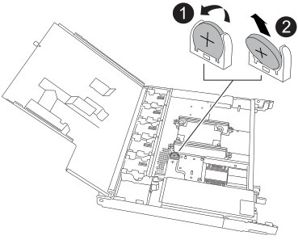

= 更換即時時鐘電池- NS224磁碟櫃
:allow-uri-read: 
:icons: font
:imagesdir: ../media/

[role="lead"]
您可以在開啟電源的NS224磁碟機櫃中、以及I/O進行中、不中斷地更換故障的即時時鐘（RTC）電池。

.開始之前
* 機櫃的合作夥伴 NSM 必須正常運作，並正確連接纜線，以便在移除故障 FRU 的 NSM （目標 NSM ）時，機櫃可維持連線。
+
https://mysupport.netapp.com/site/tools/tool-eula/activeiq-configadvisor["NetApp下載Config Advisor"^]

* 系統中的所有其他元件必須正常運作。

.關於這項工作
* 在移除和安裝NVMe機櫃模組（NSM）之間、請至少等待70秒。
+
這讓ONTAP 我們有足夠的時間來處理NSM移除事件。

* 更換 RTC 電池，重新安裝 NSM ，然後模組開機後， ONTAP 會更新即時時鐘時間。
* *最佳實務做法：*最佳實務做法是在更換FRU元件之前、先在系統上安裝最新版本的NVMe機櫃模組（NSM）韌體和磁碟機韌體。
+
https://mysupport.netapp.com/site/downloads/firmware/disk-shelf-firmware["NetApp下載：磁碟櫃韌體"^]

+
https://mysupport.netapp.com/site/downloads/firmware/disk-drive-firmware["NetApp下載：磁碟機韌體"^]

+
[NOTE]
====
請勿將韌體還原至不支援機櫃及其元件的版本。

====
* 如有需要、您可以開啟機櫃的位置（藍色）LED、以協助實際找出受影響的機櫃：「儲存櫃位置導向的修改-機櫃名稱_bidle_name_-leide-Status on」
+
如果您不知道受影響機櫃的「shelf_name」、請執行「shorage shelage show」命令。

+
機櫃有三個位置 LED ：一個在操作員顯示面板上，一個在每個 NSM 上。位置LED會持續亮起30分鐘。您可以輸入相同的命令，但使用選項將其關閉 `off`。

* 當您打開更換的RTC電池時、請保留所有包裝材料、以便在退回故障的RTC電池時使用。
+
如果您需要RMA號碼或更換程序的其他協助、請聯絡技術支援部門： https://mysupport.netapp.com/site/global/dashboard["NetApp支援"^]電話：888-463-8277（北美）、00-800-44-638277（歐洲）或+800-800-80-800（亞太地區）。

[role="tabbed-block"]
====
.NSM100 模組
--
對於 NSM100 模組，您可以使用下列動畫或書面步驟來更換 RTC 電池。

.更換 NS224 機櫃中的 RTC 電池
video::df7a12f4-8554-4448-a3df-aa86002f2de8[panopto]
.步驟
. 請妥善接地。
. 從包含您要更換的 FRU 的 NSM 拔下纜線：
+
.. 如果電源線是AC電源供應器、請打開電源線固定器、將電源線從電源供應器拔下；如果是DC電源供應器、請打開兩個指旋螺絲、然後從電源供應器拔下電源線。
+
電源供應器沒有電源開關。

.. 從 NSM 連接埠拔下儲存纜線。
+
記下每條纜線所連接的 NSM 連接埠。重新插入 NSM 時，請將纜線重新連接至相同的連接埠，稍後將在本程序中進行。

. 從機櫃取下 NSM ：
+
.. 將食指繞過 NSM 兩側鎖定機制的指孔。
+

NOTE: 如果您要移除底部的 NSM ，且底部的軌道阻礙了對鎖定機制的存取，請將食指從內部的指孔中穿過（橫過手臂）。

.. 用您的拇指按住鎖定機制頂端的橘色彈片。
+
鎖定機制會舉起、清除機櫃上的鎖定銷。

.. 輕輕拉動，直到 NSM 離開機櫃約三分之一，用雙手抓住 NSM 兩側以支撐其重量，然後將其放在平坦穩固的表面上。
+
當您開始拉動時，閉鎖機械臂會從 NSM 伸出，並鎖定其完全展開的位置。

. 鬆開 NSM 護蓋拇指螺絲，然後打開護蓋。
+
NSM 護蓋上的 FRU 標籤會顯示 RTC 電池的位置，靠近 NSM 正面和電源供應器右側。

. 實體識別故障的RTC電池。
. 更換RTC電池：
+
.. 從電池座中輕推電池、直到電池呈斜角（從電池座上斜放）、然後將其從電池座中取出。
.. 將替換電池以斜角（從電池座向外傾斜）插入電池座、將電池推入直立位置、然後將電池穩固地壓入連接器、直到電池完全就位。
+

NOTE: 電池正面標示有加號，朝向外側（遠離電池座），對應於 NSM 板上標示的加號。

. 合上 NSM 護蓋，然後旋緊指旋螺絲。
. 確定鎖定機制臂鎖定在完全延伸位置。
. 用雙手將 NSM 輕輕滑入機櫃，直到機櫃完全支撐 NSM 的重量為止。
. 將 NSM 推入機櫃，直到停住為止（距離機櫃背面約半英吋）。
+
您可以將拇指放在每個手指迴圈（鎖定機械臂）正面的橘色彈片上，以推入 NSM 。

. 將食指繞過 NSM 兩側鎖定機制的指孔。
+

NOTE: 如果您要插入底部的 NSM ，而且底部的軌道阻礙了對鎖定機制的存取，請將食指從內部穿過指孔（橫過手臂）。

. 用您的拇指按住鎖定機制頂端的橘色彈片。
. 向前輕推、將栓鎖移到停止點上方。
. 從鎖定機制頂端釋放您的指稱、然後繼續推動、直到鎖定機制卡入定位為止。
+
NSM 應完全插入機櫃，並與機櫃邊緣齊平。

. 重新連接 NSM 的纜線：
+
.. 將儲存設備纜線重新連接至相同的兩個 NSM 連接埠。
+
插入纜線時、連接器拉片朝上。正確插入纜線時、會卡入定位。

.. 將電源線重新連接至電源供應器、如果是AC電源供應器、請將電源線與電源線固定器固定、如果是DC電源供應器、請鎖緊兩個指旋螺絲、然後從電源供應器拔下電源線。
+
當電源供應器正常運作時、雙色LED會亮起綠燈。

+
此外，兩個 NSM 連接埠 LNK （綠色） LED 都會亮起。如果LNO LED未亮起、請重新拔插纜線。

. 確認包含故障 RTC 電池的 NSM 上的警示（琥珀色） LED 和機櫃操作員顯示面板不再亮起
+
NSM 注意 LED 會在 NSM 重新開機後關閉，而不再偵測到 RTC 電池問題。這可能需要三到五分鐘的時間。

. 執行 Active IQ Config Advisor ，確認 NSM 纜線正確無誤。
+
如果產生任何纜線錯誤、請遵循所提供的修正行動。

+
https://mysupport.netapp.com/site/tools/tool-eula/activeiq-configadvisor["NetApp下載Config Advisor"^]

--
.NSM100B 模組
--
.步驟
. 請妥善接地。
. 從包含您要更換的 FRU 的 NSM 拔下纜線：
+
.. 如果電源線是AC電源供應器、請打開電源線固定器、將電源線從電源供應器拔下；如果是DC電源供應器、請打開兩個指旋螺絲、然後從電源供應器拔下電源線。
+
電源供應器沒有電源開關。

.. 從 NSM 連接埠拔下儲存纜線。
+
記下每條纜線所連接的 NSM 連接埠。重新插入 NSM 時，請將纜線重新連接至相同的連接埠，稍後將在本程序中進行。

. 移除 NSM ：
+
image::../media/drw_g_and_t_handles_remove_ieops-1837.svg[移除 NSM 。]

+
[cols="1,4"]
|===

 a| 
image::../media/icon_round_1.png[編號 1]
 a| 
在 NSM 的兩端，將垂直鎖定彈片向外推，以鬆開把手。

 a| 
image::../media/icon_round_2.png[編號 2]
 a| 
** 朝自己的方向拉動把手，將 NSM 從中間背板上取下。
+
拉起時，把手會從機櫃伸出。當您感覺到阻力時，請繼續拉動。

** 將 NSM 滑出機櫃，放在平坦穩定的表面上。
+
將 NSM 滑出機櫃時，請務必支撐其底部。

 a| 
image::../media/icon_round_3.png[編號 3]
 a| 
將把手垂直轉動（在彈片旁邊），將其移出。

|===
. 逆時針轉動指旋螺絲以鬆開模組護蓋，然後打開護蓋。
. 找到並更換 RTC 電池。
+
.. 取出故障電池：
+

+
[cols="1,4"]
|===

 a| 
image::../media/icon_round_1.png[編號 1]
 a| 
輕輕旋轉 RTC 電池，使其與固定座成一定的角度。

 a| 
image::../media/icon_round_2.png[編號 2]
 a| 
將 RTC 電池從其固定座中取出。

|===
.. 從防靜電包裝袋中取出替換電池。
.. 記下RTC電池的極性、然後以一定角度向下推電池、將其插入電池座。
+

NOTE: 您必須確定電池上的加號與主機板上的加號相符。

.. 目視檢查電池、確定電池已完全裝入電池座、且極性正確。

. 合上 NSM 護蓋，然後順時針旋轉指旋螺絲，直到旋緊為止。
. 將 NSM 插入機櫃：
+
image::../media/drw_g_and_t_handles_reinstall_ieops-1838.svg[更換 NSM 。]

+
[cols="1,4"]
|===

 a| 
image::../media/icon_round_1.png[編號 1]
 a| 
如果您在維修 NSM 時將 NSM 把手直立（在標籤旁邊）往外移動，請將它們向下旋轉至水平位置。

 a| 
image::../media/icon_round_2.png[編號 2]
 a| 
將 NSM 背面對準機櫃中的開口，然後使用把手輕推 NSM ，直到完全就位。

 a| 
image::../media/icon_round_3.png[編號 3]
 a| 
將把手旋轉至直立位置，並使用彈片鎖定到位。

|===
. 可重新安裝 NSM 。
+
.. 將儲存設備纜線重新連接至相同的兩個 NSM 連接埠。
+
插入纜線時、連接器拉片朝上。正確插入纜線時、會卡入定位。

.. 將電源線重新連接至電源供應器、如果是AC電源供應器、請將電源線與電源線固定器固定、如果是DC電源供應器、請鎖緊兩個指旋螺絲、然後從電源供應器拔下電源線。
+
當電源供應器正常運作時、雙色LED會亮起綠燈。

+
此外，兩個 NSM 連接埠 LNK （綠色） LED 都會亮起。如果LNO LED未亮起、請重新拔插纜線。

. 確認包含故障 RTC 電池的 NSM 上的警示（琥珀色） LED 和機櫃操作員顯示面板不再亮起
+
NSM 注意 LED 會在 NSM 重新開機後關閉，而不再偵測到 RTC 電池問題。這可能需要三到五分鐘的時間。

. 執行 Active IQ Config Advisor ，確認 NSM 纜線正確無誤。
+
如果產生任何纜線錯誤、請遵循所提供的修正行動。

+
https://mysupport.netapp.com/site/tools/tool-eula/activeiq-configadvisor["NetApp下載Config Advisor"^]

--
====