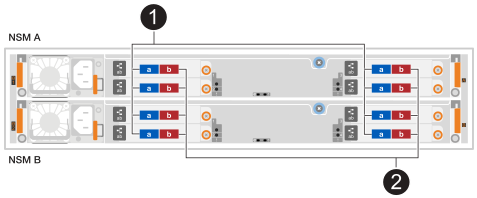
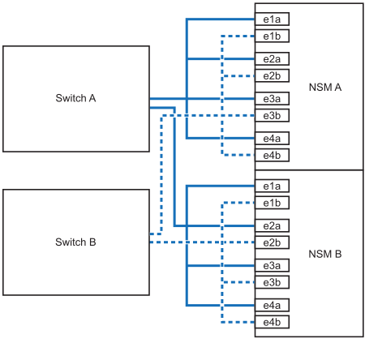

= 熱添加架子 - NX224 架子
:allow-uri-read: 
:icons: font
:imagesdir: ../media/

[role="lead"]
您可以透過將 NX224 架熱添加到現有的 AFX 叢集配置來擴充儲存功能。

.關於這項工作
* 為熱添加的架子佈線後， ONTAP會識別該架子。如果需要，NSM 架子韌體和驅動器韌體應該會自動更新。
+

NOTE: 韌體更新最多可能需要30分鐘。

.開始之前
* 在熱添加架子之前，請確保您已：
+
** 一端拉直的迴紋針或尖頭原子筆。
+
若要變更機櫃 ID 、您可以使用迴紋針或圓珠筆來存取「操作員顯示面板」（ ODP ）後面的機櫃 ID 按鈕、以進行變更機櫃 ID 步驟。

** 連接架子的電纜數量和類型正確。看 https://hwu.netapp.com["NetApp Hardware Universe"^]。

* 了解滿載的 NX224 架子平均重量為 56.8 磅（25.8 公斤），需要兩個人才能抬起或使用液壓升降機。避免拆除貨架組件（從貨架前部或後部）以減輕貨架重量，因為貨架重量會變得不平衡。
* NX224 架包含兩個 NSM140 模組。頂部模組插入插槽 A（NSM A），底部模組插入插槽 B（NSM B）。
* 您的平台型號和ONTAP版本必須支援您正在熱添加的 NX224 架和驅動器。看 https://hwu.netapp.com["NetApp Hardware Universe"^]
* 您的 AFX 集群所支援的機架數量必須至少比您計劃加熱添加的機架數量少。
+
熱添加機架後，您不能超過 AFX 集群支援的最大機架數量。看 https://hwu.netapp.com["NetApp Hardware Universe"^]。

* *最佳實務：*確保您擁有最新版本的 https://mysupport.netapp.com/site/downloads/firmware/disk-drive-firmware/download/DISKQUAL/ALL/qual_devices.zip["磁碟資格審查套件"^]在熱添加架子之前安裝。
+
安裝最新版的DQP可讓您的系統辨識及使用新的合格磁碟機。如此可避免系統事件訊息、因為無法辨識磁碟機、因此無法取得非最新的磁碟機資訊並防止磁碟分割。此外、DQP也會通知您非最新的磁碟機韌體。

* *最佳實務*：運行 https://mysupport.netapp.com/site/tools/tool-eula/activeiq-configadvisor["Active IQ Config Advisor"^]在熱添加架子之前和之後查看任何存儲佈線錯誤訊息以及應採取的糾正措施。
+
在熱添加機架之前執行Active IQ Config Advisor可提供現有機架乙太網路 (ENET) 連接的快照，驗證 NVMe 機架模組 (NSM) 韌體版本，並讓您驗證 AFX 叢集中已使用的機架 ID。

+
熱添加機架後運行Active IQ Config Advisor可讓您驗證機架是否正確佈線以及機架 ID 在 AFX 叢集內是否唯一。

* *最佳實務：*確保您擁有最新版本的 https://mysupport.netapp.com/site/downloads/firmware/disk-shelf-firmware["NVMe 儲存模組（ NSM ）韌體"^]和 https://mysupport.netapp.com/site/downloads/firmware/disk-drive-firmware["磁碟機韌體"^]在新增架子之前，先在儲存系統上進行操作。
+

NOTE: 請勿將韌體還原至不支援機櫃及其元件的版本。

== 步驟 1：安裝用於熱添加的架子

您需要在機櫃或電信機架安裝 NX224 機架，連接電源線（自動開啟機架電源），並設定機架 ID。

.步驟
. 根據需要、使用套件隨附的說明、安裝機架的軌道套件。
+

NOTE: 請務必使用適當的滑軌套件，將機櫃安裝在機架或機櫃中。

. 安裝機櫃：
+
.. 將機架背面放在軌道上、然後從底部支撐機架、並將其滑入機櫃或電信機架。
+
建議將所有架子都安裝在同一機架中靠近交換器的位置。

.. 使用套件隨附的安裝螺絲、將機櫃固定在機櫃或電信機架上。

. 連接電源：
+
.. 將電源線連接到架子上，並用電源線固定器將其固定到位。
.. 將電源線連接至不同的電源、以獲得恢復能力。
+
機櫃連接電源時會啟動、但沒有電源開關。當電源供應器正常運作時、雙色LED會亮起綠燈。

. 將架子 ID 設定為 AFX 叢集內唯一的數字：
+
有關更詳細的說明，請參閱link:change-shelf-id.html["更改貨架 ID - NX224 貨架"^]。

+
image::../media/drw_tp_change_shelf_id_ieops-2381.svg[更改NX224貨架ID]

+
[cols="20%,80%"]
|===

 a| 
image::../media/icon_round_1.png[編號 1]
 a| 
機櫃端蓋

 a| 
image::../media/icon_round_2.png[[ 請撥號碼 2]
 a| 
機櫃面板

 a| 
image::../media/icon_round_3.png[[ 請撥號碼 3]
 a| 
機櫃 ID 號碼

 a| 
image::../media/icon_round_4.png[[ 請撥號碼 4]
 a| 
貨架ID按鈕訪問

|===
+
.. 取下左端蓋、找到LED右側的小孔。
.. 將回形針或類似工具的一端插入小孔、以觸及機櫃ID按鈕。
.. 按住按鈕（長達15秒）、直到數位顯示器上的第一個數字開始閃爍、然後釋放按鈕。
+
如果ID需要15秒以上的時間才能開始閃燈、請再次按住按鈕、確定一定要完全按下。

.. 按下並釋放按鈕、將號碼往前移、直到達到所需的0到9。
.. 重複子步驟4c和4d、設定機櫃ID的第二個編號。
+
最多可能需要三秒（而非15秒）、才能讓號碼開始閃燈。

.. 按住按鈕、直到第二個數字停止閃爍。
+
約五秒鐘後、兩個數字都會開始閃爍、ODP上的黃色LED會亮起。

.. 重新啟動機櫃、使機櫃ID生效。
+
您必須從機櫃拔下兩根電源線、等待10秒鐘、然後重新插回。

+
電源恢復供電時、二色LED會亮起綠色。

== 步驟 2：熱添加電纜架

將要熱添加的每個 NX224 架進行佈線，以便每個架與每個交換器有八個連接。

.開始之前
* 熟悉正確的電纜連接器方向以及 NX224 NSM140 架模組上連接埠的位置和標籤。
+
** 插入纜線時、連接器拉片朝上。
+
正確插入纜線時、會卡入定位。

+
連接纜線兩端之後、機櫃和控制器連接埠LK（綠色）LED會亮起。如果連接埠LNO LED未亮起、請重新拔插纜線。

+
image::../media/oie_cable_pull_tab_up.png[插入纜線時、接頭拉片朝上]

** 每個 NSM140 模組包括 4 x 100GbE CX7 Path_A 連接埠（e1a、e2a、e3a 和 e4a）和 4 x 100GbE CX7 Path_B 連接埠（e1b、e2b、e3b 和 e4b）。
+

NOTE: 每個 NSM140 模組上的 Path_A 和 Path_B 連接埠都需要單獨的分支電纜，每個機架總共需要四條分支電纜。

+
下圖突出顯示了 NSM140 模組上的 Path_A 和 Path_B 連接埠：

+

+
[cols="1,4"]
|===

 a| 
image::../media/icon_round_1.png[編號 1]
 a| 
Path_A 連接埠（藍色連接埠）

 a| 
image::../media/icon_round_2.png[編號 2]
 a| 
Path_B 連接埠（紅色連接埠）

|===

.步驟
. 使用電纜將架 NSM A 和 NSM B Path_A 連接埠 e1a、e2a、e3a 和 e4a 連接至交換器 A 上的任意連接埠。
. 使用電纜將架 NSM A 和 NSM B Path_B 連接埠 e1b、e2b、e3b 和 e4b 連接至交換器 B 上的任意連接埠。
+
下圖突顯了向交換器配置熱添加附加架的佈線。要添加額外的架子，請遵循相同的基於交換器的佈線方法。

+

. 使用驗證熱添加的機櫃是否已正確連接 https://mysupport.netapp.com/site/tools/tool-eula/activeiq-configadvisor["Active IQ Config Advisor"^]。
+
如果產生任何纜線錯誤、請遵循所提供的修正行動。

