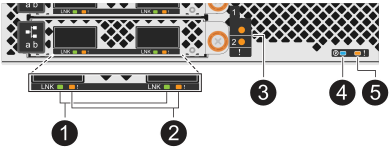
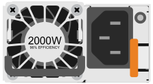

= 監控驅動器架 LED - NX224 架
:allow-uri-read: 
:icons: font
:imagesdir: ../media/

[role="lead"]
您可以透過了解驅動器架組件上 LED 的位置和狀態條件來監控架子的健康狀況。

* 可啟動機架操作員顯示面板 (ODP) 和兩個 NVMe 機架模組 (NSM) 上的位置 (藍色) LED，以協助實體定位需要維修的機架： `storage shelf location-led modify -shelf-name _shelf_name_ -led-status on`
+
如果您不知道受影響的機櫃的「_shider_name_」、請執行「shorage sh儲存 櫃show」命令。

+
位置LED會持續亮起30分鐘。您可以輸入相同的命令、但使用來關閉這些命令 `off` 選項。

* LED 狀態可以是：
+
** 「開啟」： LED 燈恆亮 / 穩定
** 「關閉」： LED 未亮起
** 「閃爍」： LED 會根據 FRU 狀態、以不同的時間間隔開啟和關閉
** 「任何狀態」： LED 可以是「開啟」、「關閉」或「閃爍」

== 操作員顯示面板LED

磁碟機櫃前操作員顯示面板（ ODP ）上的 LED 會指出磁碟機櫃是否正常運作、或硬體是否有問題。

下圖和表格說明 ODP 上的三個 LED ：

image::../media/drw_ns224_odp_leds_IEOPS-1262.svg[操作員顯示面板LED]

[cols="1,2,1,5"]
|===
| LED圖示 | LED 名稱與顏色 | 州/省 | 說明 

 a| 

 a| 
電源（綠色）
 a| 
開啟
 a| 
一個或多個電源供應器正在為磁碟機櫃供電。

 a| 
image::../media/drw_sas_fault_icon.svg[操作員顯示面板注意 LED]
 a| 
注意（琥珀色）
 a| 
開啟
 a| 
* 一個以上機櫃 FRU 的功能發生錯誤。
+
檢查事件訊息、以確定要採取的修正行動。

* 如果兩位數的機櫃 ID 也在閃爍、機櫃 ID 就會處於待處理狀態。
+
關閉磁碟機櫃的電源、讓機櫃 ID 生效。

 a| 
image::../media/drw_sas3_location_icon.svg[操作員顯示面板位置 LED]
 a| 
位置（藍色）
 a| 
開啟
 a| 
系統管理員已啟動此 LED 功能。

|===

== NSM LED

NSM 上的 LED 會指出模組是否正常運作，是否已準備好處理 I/O 流量，以及硬體是否有任何問題。

下圖和表格說明與模組功能相關的 NSM LED ，以及模組上每個 NVMe 連接埠的功能。

[cols="1,1,2,4"]
|===
| 撥出電話 | LED圖示 | 色彩 | 說明 

 a| 
image:../media/icon_round_1.png["編號 1"]
 a| 
lnk
 a| 
綠色
 a| 
NVMe 連接埠 / 連結：狀態

 a| 
image:../media/icon_round_2.png["編號 2"]
 a| 
image::../media/drw_sas_fault_icon.svg[操作員顯示面板注意 LED]
 a| 
琥珀色
 a| 
NVMe 連接埠 / 連結：注意

 a| 
image:../media/icon_round_3.png["編號 3"]
 a| 
image::../media/drw_sas_fault_icon.svg[操作員顯示面板注意 LED]
 a| 
琥珀色
 a| 
I/O 模組：注意

 a| 
image:../media/icon_round_4.png["編號 4."]
 a| 
image::../media/drw_sas3_location_icon.svg[操作員顯示面板位置 LED]
 a| 
藍色
 a| 
NSM ：位置

 a| 
image:../media/icon_round_5.png["編號 5."]
 a| 
image::../media/drw_sas_fault_icon.svg[操作員顯示面板注意 LED]
 a| 
琥珀色
 a| 
NSM ：注意

|===
[cols="2,1,1,1,1"]
|===
| 狀態 | NSM 注意事項（琥珀色） | 連接埠 LNO （綠色） | 連接埠注意事項（琥珀色） | I/O 模組注意事項 

 a| 
NSM 正常
 a| 
關
 a| 
任何狀態
 a| 
關
 a| 
關

 a| 
NSM 故障
 a| 
開啟
 a| 
任何狀態
 a| 
任何狀態
 a| 
關

 a| 
NSM VPD 錯誤
 a| 
開啟
 a| 
任何狀態
 a| 
任何狀態
 a| 
關

 a| 
無主機連接埠連線
 a| 
任何狀態
 a| 
關
 a| 
關
 a| 
關

 a| 
主機連接埠連線連結作用中
 a| 
任何狀態
 a| 
活動時亮起 / 閃爍
 a| 
任何狀態
 a| 
關

 a| 
主機連接埠連線有故障
 a| 
開啟
 a| 
如果所有通道都故障、則開啟 / 關閉
 a| 
開啟
 a| 
關

 a| 
開機後從 BIOS 映像開機
 a| 
閃爍
 a| 
任何狀態
 a| 
任何狀態
 a| 
關

 a| 
I/O 模組遺失
 a| 
開啟
 a| 
不適用
 a| 
不適用
 a| 
開啟

|===

== 電源供應器LED

交流電源 (PSU) 上的 LED 指示 PSU 是否正常運作或是否有硬體問題。

下圖和表格描述了 PSU 上的 LED。

[cols="1,4"]
|===
| 撥出電話 | 說明 

 a| 
image:../media/icon_round_1.png["編號 1"]
 a| 
雙色 LED 會在綠色時顯示電源 / 活動、紅色時則顯示故障。

|===
[cols="2,1,1"]
|===
| 狀態 | 電源 / 活動（綠色） | 注意（紅色） 

 a| 
機櫃沒有交流電源
 a| 
關
 a| 
關

 a| 
PSU 沒有交流電
 a| 
關
 a| 
開啟

 a| 
交流電源已打開，但電源不在機櫃內
 a| 
閃爍
 a| 
關

 a| 
PSU 正常運作
 a| 
開啟
 a| 
關

 a| 
PSU 故障
 a| 
關
 a| 
開啟

 a| 
風扇故障
 a| 
關
 a| 
開啟

 a| 
韌體更新模式
 a| 
閃爍
 a| 
關

|===

== 磁碟機 LED

NVMe 磁碟機上的 LED 會指出它是否正常運作、或是硬體有問題。

下圖和表格說明 NVMe 磁碟機上的兩個 LED ：

image::../media/drw_ns224_drive_leds_IEOPS-1263.svg[NVMe 磁碟注意力和電源 LED]

[cols="1,2,2"]
|===
| 撥出電話 | LED名稱 | 色彩 

 a| 
image:../media/icon_round_1.png["編號 1"]
 a| 
注意
 a| 
琥珀色

 a| 
image:../media/icon_round_2.png["編號 2"]
 a| 
電力 / 活動
 a| 
綠色

|===
[cols="2,1,1,1"]
|===
| 狀態 | 電源 / 活動（綠色） | 注意（琥珀色） | 關聯的 ODP LED 

 a| 
磁碟機已安裝且可運作
 a| 
活動時亮起 / 閃爍
 a| 
任何狀態
 a| 
不適用

 a| 
磁碟機故障
 a| 
活動時亮起 / 閃爍
 a| 
開啟
 a| 
注意（琥珀色）

 a| 
SES 裝置識別集
 a| 
活動時亮起 / 閃爍
 a| 
閃爍
 a| 
注意（琥珀色）關閉

 a| 
SES 裝置故障位元集
 a| 
活動時亮起 / 閃爍
 a| 
開啟
 a| 
注意（琥珀色）

 a| 
電源控制電路故障
 a| 
關
 a| 
任何狀態
 a| 
注意（琥珀色）

|===