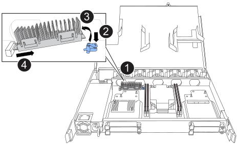

= 更換啟動媒體 - NX224 架
:allow-uri-read: 
:icons: font
:imagesdir: ../media/

[role="lead"]
您可以更換 NX224 架中發生故障的啟動媒體。當機架已通電且 I/O 正在進行時，可以無中斷地更換啟動介質。

.關於這項工作
* 更換開機媒體之後，機櫃合作夥伴 NSM 的開機映像會自動複製到更換的開機媒體。
+
這可能需要五分鐘的時間。

* 在移除和安裝NVMe機櫃模組（NSM）之間、請至少等待70秒。
+
這讓ONTAP 我們有足夠的時間來處理NSM移除事件。

* 如有需要、您可以開啟機櫃的位置（藍色）LED、以協助實際找出受影響的機櫃：「儲存櫃位置導向的修改-機櫃名稱_bidle_name_-leide-Status on」
+
如果您不知道受影響的機櫃的「_shider_name_」、請執行「shorage sh儲存 櫃show」命令。

+
機櫃有三個位置 LED ：一個在操作員顯示面板上，一個在每個 NSM 上。位置LED會持續亮起30分鐘。您可以輸入相同的命令，但使用選項將其關閉 `off`。

* 更換開機媒體之後、您可以依照套件隨附的RMA指示、將故障零件退回NetApp。
+
如果您需要RMA號碼或更換程序的其他協助、請聯絡技術支援部門： https://mysupport.netapp.com/site/global/dashboard["NetApp支援"^]電話：888-463-8277（北美）、00-800-44-638277（歐洲）或+800-800-80-800（亞太地區）。

.開始之前
* 機架的合作夥伴 NSM 必須啟動並運行，並且佈線正確，以便當您移除具有故障 FRU（目標 NSM）的 NSM 時，機架能夠保持連接。您可以透過以下方式驗證合作夥伴 NSM 的狀態 https://mysupport.netapp.com/site/tools/tool-eula/activeiq-configadvisor["下載並執行Config Advisor"^]。
* 系統中的所有其他元件必須正常運作。

.步驟
. 請妥善接地。
. 從包含您要更換的 FRU 的 NSM 拔下纜線：
+
.. 打開電源線固定器，然後從電源上拔下電源線，以斷開電源線與電源的連接。
+
電源供應器沒有電源開關。

.. 從 NSM 連接埠拔下儲存纜線。
+
記下每條纜線所連接的 NSM 連接埠。重新插入 NSM 時，請將纜線重新連接至相同的連接埠，稍後將在本程序中進行。

. 移除 NSM ：
+
image::../media/drw_g_and_t_handles_remove_ieops-1837.svg[移除 NSM 。]

+
[cols="1,4"]
|===

 a| 
image::../media/icon_round_1.png[編號 1]
 a| 
在 NSM 的兩端，將垂直鎖定彈片向外推，以鬆開把手。

 a| 
image::../media/icon_round_2.png[編號 2]
 a| 
** 朝自己的方向拉動把手，將 NSM 從中間背板上取下。
+
拉起時，把手會從機櫃伸出。當您感覺到阻力時，請繼續拉動。

** 將 NSM 滑出機櫃，放在平坦穩定的表面上。
+
將 NSM 滑出機櫃時，請務必支撐其底部。

 a| 
image::../media/icon_round_3.png[編號 3]
 a| 
將把手垂直轉動（在彈片旁邊），將其移出。

|===
. 逆時針轉動指旋螺絲以鬆開 NSM 護蓋，然後打開護蓋。
. 實際找到故障的開機媒體。
. 移除開機媒體：
+

+
[cols="1,4"]
|===

 a| 
image::../media/icon_round_1.png[編號 1]
 a| 
開機媒體位置

 a| 
image::../media/icon_round_2.png[編號 2]
 a| 
按下藍色標籤以釋放開機媒體的右端。

 a| 
image::../media/icon_round_3.png[編號 3]
 a| 
以小角度提起開機媒體的右端，以便在開機媒體的兩側獲得良好的抓握力。

 a| 
image::../media/icon_round_4.png[編號 4.]
 a| 
將開機媒體的左端輕輕拉出插槽。

|===
. 安裝替換開機媒體：
+
.. 將開機媒體的邊緣對齊插槽外殼、然後將其輕推入插槽。
.. 朝鎖定按鈕方向向下旋轉開機媒體。
.. 按下鎖定按鈕，將開機媒體完全向下旋轉，然後放開鎖定按鈕。

. 合上 NSM 護蓋，然後旋緊指旋螺絲。
. 將 NSM 插入機櫃：
+
image::../media/drw_g_and_t_handles_reinstall_ieops-1838.svg[更換 NSM 。]

+
[cols="1,4"]
|===

 a| 
image::../media/icon_round_1.png[編號 1]
 a| 
如果您在維修 NSM 時將 NSM 把手直立（在標籤旁邊）往外移動，請將它們向下旋轉至水平位置。

 a| 
image::../media/icon_round_2.png[編號 2]
 a| 
將 NSM 背面對準機櫃中的開口，然後使用把手輕推 NSM ，直到完全就位。

 a| 
image::../media/icon_round_3.png[編號 3]
 a| 
將把手旋轉至直立位置，並使用彈片鎖定到位。

|===
. 重新連接 NSM 的纜線：
+
.. 將儲存電纜重新連接到相同的八個 NSM 連接埠。
+
插入纜線時、連接器拉片朝上。正確插入纜線時、會卡入定位。

.. 將電源線重新連接到電源，然後使用電源線固定器固定電源線。
+
當電源供應器正常運作時、雙色LED會亮起綠燈。

+
此外，兩個 NSM 連接埠 LNK （綠色） LED 都會亮起。如果LNO LED未亮起、請重新拔插纜線。

. 驗證包含故障開機媒體的 NSM 上的警示（琥珀色） LED 和機櫃操作員顯示面板是否不再亮起。
+
注意LED可能需要5到10分鐘的時間才能關閉。這是 NSM 重新開機和開機媒體映像複本完成所需的時間量。

+
如果故障LED持續亮起、表示開機媒體可能未正確就位、或是有其他問題、您應聯絡技術支援部門以尋求協助。

. 驗證 NSM 是否已正確連接，方法是 https://mysupport.netapp.com/site/tools/tool-eula/activeiq-configadvisor["運行Active IQ Config Advisor"^]。
+
如果產生任何纜線錯誤、請遵循所提供的修正行動。

