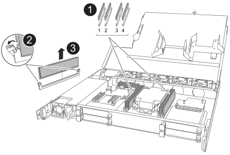

= 更換 DIMM - NX224 托架
:allow-uri-read: 
:icons: font
:imagesdir: ../media/

[role="lead"]
您可以在已開啟電源且 I/O 正在進行的情況下無中斷地更換 NX224 磁碟機架中的故障 DIMM。

.關於這項工作
* 在移除和安裝NVMe機櫃模組（NSM）之間、請至少等待70秒。
+
這讓 ONTAP 有足夠時間處理 NSM 移除事件。

* *最佳實務：*最佳實務是在更換 FRU 組件之前，在系統上安裝最新版本的 NVMe 架模組 (NSM) 韌體和磁碟機韌體。您可以造訪NetApp支援網站 https://mysupport.netapp.com/site/downloads/firmware/disk-shelf-firmware["下載磁碟架韌體"^]和 https://mysupport.netapp.com/site/downloads/firmware/disk-drive-firmware["下載磁碟機韌體"^] 。
+
[NOTE]
====
請勿將韌體還原至不支援機櫃及其元件的版本。

====
* 如有需要、您可以開啟機櫃的位置（藍色）LED、以協助實際找出受影響的機櫃：「儲存櫃位置導向的修改-機櫃名稱_bidle_name_-leide-Status on」
+
如果您不知道受影響的機櫃的「_shider_name_」、請執行「shorage sh儲存 櫃show」命令。

+
機櫃有三個位置 LED ：一個在操作員顯示面板上，一個在每個 NSM 上。位置LED會持續亮起30分鐘。您可以輸入相同的命令，但使用選項將其關閉 `off`。

* 當您打開更換的DIMM的包裝時、請保留所有包裝材料、以便在退回故障的DIMM時使用。
+
如果您需要RMA號碼或更換程序的其他協助、請聯絡技術支援部門： https://mysupport.netapp.com/site/global/dashboard["NetApp支援"^]電話：888-463-8277（北美）、00-800-44-638277（歐洲）或+800-800-80-800（亞太地區）。

.開始之前
* 機架的合作夥伴 NSM 必須啟動並運行，並且正確連接電纜，以便當您移除具有故障 FRU（目標 NSM）的 NSM 時，機架能夠保持連接。您可以透過以下方式驗證合作夥伴 NSM 的狀態 https://mysupport.netapp.com/site/tools/tool-eula/activeiq-configadvisor["下載並執行Config Advisor"^]。
* 系統中的所有其他組件（包括其他三個 DIMM）必須正常運作。

.步驟
. 請妥善接地。
. 從包含您要更換的 FRU 的 NSM 拔下纜線：
+
.. 打開電源線固定器，然後從電源上拔下電源線，以斷開電源線與電源的連接。
+
電源供應器沒有電源開關。

.. 從 NSM 連接埠拔下儲存纜線。
+
記下每條纜線所連接的 NSM 連接埠。重新插入 NSM 時，請將纜線重新連接至相同的連接埠，稍後將在本程序中進行。

. 將 NSM 插入機櫃：
+
image::../media/drw_g_and_t_handles_reinstall_ieops-1838.svg[更換 NSM 。]

+
[cols="1,4"]
|===

 a| 
image::../media/icon_round_1.png[編號 1]
 a| 
如果您在維修 NSM 時將 NSM 把手直立（在標籤旁邊）往外移動，請將它們向下旋轉至水平位置。

 a| 
image::../media/icon_round_2.png[編號 2]
 a| 
將 NSM 背面對準機櫃中的開口，然後使用把手輕推 NSM ，直到完全就位。

 a| 
image::../media/icon_round_3.png[編號 3]
 a| 
將把手旋轉至直立位置，並使用彈片鎖定到位。

|===
. 逆時針轉動指旋螺絲以鬆開 NSM 護蓋，然後打開護蓋。
+
NSM 蓋上的 FRU 標籤顯示了 NSM 中四個 DIMM 的位置。

. 實體識別故障的DIMM。
+
當 DIMM 發生故障時，系統會在系統主控台記錄一則警告訊息，指出需要更換哪個 DIMM 。

. 移除故障 DIMM ：
+

+
[cols="1,4"]
|===

 a| 
image::../media/icon_round_1.png[編號 1]
 a| 
DIMM 插槽編號和位置。

 a| 
image::../media/icon_round_2.png[編號 2]
 a| 
** 請注意插槽中 DIMM 的方向，以便您可以使用相同的方向插入替換 DIMM 。
** 緩慢地推開 DIMM 插槽兩端的兩個 DIMM 彈出卡舌，以退出故障 DIMM 。

IMPORTANT: 小心拿住DIMM的邊角或邊緣、避免對DIMM電路板元件造成壓力。

 a| 
image::../media/icon_round_3.png[編號 3]
 a| 
將 DIMM 從插槽中取出。

推出式彈片仍保持在開啟位置。

|===
. 更換 DIMM ：
+
.. 從防靜電包裝袋中取出備用DIMM。
.. 拿住DIMM的邊角、然後將DIMM正面插入插槽。
+
DIMM底部插針之間的槽口應與插槽中的卡舌對齊。

+
正確插入時、DIMM應可輕鬆插入、但應緊密插入插槽中。如果沒有、請重新插入DIMM。

.. 小心地向下推DIMM頂端邊緣、但穩固地推入、直到彈出彈片卡入DIMM兩端的槽口為止。

. 合上 NSM 護蓋，然後旋緊指旋螺絲。
. 將 NSM 插入機櫃：
+
image::../media/drw_g_and_t_handles_reinstall_ieops-1838.svg[更換 NSM 。]

+
[cols="1,4"]
|===

 a| 
image::../media/icon_round_1.png[編號 1]
 a| 
如果您在維修 NSM 時將 NSM 把手直立（在標籤旁邊）往外移動，請將它們向下旋轉至水平位置。

 a| 
image::../media/icon_round_2.png[編號 2]
 a| 
將 NSM 背面對準機櫃中的開口，然後使用把手輕推 NSM ，直到完全就位。

 a| 
image::../media/icon_round_3.png[編號 3]
 a| 
將把手旋轉至直立位置，並使用彈片鎖定到位。

|===
. 重新連接 NSM 的纜線：
+
.. 將儲存電纜重新連接到相同的八個 NSM 連接埠。
+
插入纜線時、連接器拉片朝上。正確插入纜線時、會卡入定位。

.. 將電源線重新連接到電源，然後使用電源線固定器固定電源線。
+
當電源供應器正常運作時、雙色LED會亮起綠燈。

+
此外，兩個 NSM 連接埠 LNK （綠色） LED 都會亮起。如果LNO LED未亮起、請重新拔插纜線。

. 確認包含故障 DIMM 的 NSM 上的警示（琥珀色） LED 和機櫃操作員顯示面板不再亮起。
+
NSM 注意 LED 會在 NSM 重新開機後熄滅，而不再偵測到 DIMM 問題。這可能需要三到五分鐘的時間。

. 驗證 NSM 是否已正確連接，方法是 https://mysupport.netapp.com/site/tools/tool-eula/activeiq-configadvisor["運行Config Advisor"^]。
+
如果產生任何纜線錯誤、請遵循所提供的修正行動。

