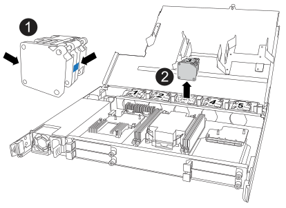
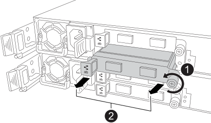

= 更換 NSM - NX224 架子
:allow-uri-read: 
:icons: font
:imagesdir: ../media/

[role="lead"]
您可以在已開啟電源且 I/O 正在進行的情況下，無中斷地更換受損的 NVMe 架模組 (NSM)。

.關於這項工作
* 更換 NSM 涉及將 DIMM、風扇、啟動媒體、I/O 模組和電源供應器從受損的 NSM 移至更換的 NSM。
+
您不要移動實時時鐘 (RTC) 電池。它已預先安裝在替換的 NSM 中。

* 拆卸和安裝 NSM 之間至少間隔 70 秒。
+
這讓ONTAP 我們有足夠的時間來處理NSM移除事件。

* *最佳實務：*最佳實務是在更換 FRU 組件之前在系統上安裝最新版本的 NSM 韌體和磁碟機韌體。您可以造訪NetApp支援網站 https://mysupport.netapp.com/site/downloads/firmware/disk-shelf-firmware["下載磁碟架韌體"^]和 https://mysupport.netapp.com/site/downloads/firmware/disk-drive-firmware["下載磁碟機韌體"^] 。
+
[NOTE]
====
請勿將韌體還原至不支援機櫃及其元件的版本。

====
* 在具有非最新韌體版本的新 NSM 上，機櫃（ NSM ）韌體會自動更新（不中斷營運）。
+
NSM 韌體檢查每 10 分鐘進行一次。NSM韌體更新最多可能需要30分鐘。

* 如有需要、您可以開啟機櫃的位置（藍色）LED、以協助實際找出受影響的機櫃：「儲存櫃位置導向的修改-機櫃名稱_bidle_name_-leide-Status on」
+
如果您不知道受影響機櫃的「shelf_name」、請執行「shorage shelage show」命令。

+
機櫃有三個位置 LED ：一個在操作員顯示面板上，一個在每個 NSM 上。位置LED會持續亮起30分鐘。您可以輸入相同的命令，但使用選項將其關閉 `off`。

* 當您打開更換的NSM的包裝時、請保留所有包裝材料、以便在退回故障的NSM時使用。
+
如果您需要RMA號碼或更換程序的其他協助、請聯絡技術支援部門： https://mysupport.netapp.com/site/global/dashboard["NetApp支援"^]電話：888-463-8277（北美）、00-800-44-638277（歐洲）或+800-800-80-800（亞太地區）。

.開始之前
* 機架的合作夥伴 NSM 必須啟動並運行，並且正確連接電纜，以便在您移除故障的 NSM 時機架能夠保持連接。您可以透過以下方式驗證合作夥伴 NSM 的狀態 https://mysupport.netapp.com/site/tools/tool-eula/activeiq-configadvisor["下載並執行Config Advisor"^]。
* 系統中的所有其他元件必須正常運作。

.步驟
. 請妥善接地。
. 實體識別受損的 NSM 。
+
系統會將警告訊息記錄到系統主控台、指出哪個模組受損。此外、磁碟機櫃操作員顯示面板和受損模組上的警示（黃色）LED會亮起。

. 從受損的 NSM 拔下纜線：
+
.. 打開電源線固定器，然後從電源上拔下電源線，以斷開電源線與電源的連接。
+
電源供應器沒有電源開關。

.. 從 NSM 連接埠拔下儲存纜線。
+
記下每條纜線所連接的 NSM 連接埠。您可以將纜線重新連接至替換 NSM 上的相同連接埠，稍後將在本程序中進行。

. 移除 NSM ：
+
image::../media/drw_g_and_t_handles_remove_ieops-1837.svg[移除 NSM 。]

+
[cols="1,4"]
|===

 a| 
image::../media/icon_round_1.png[編號 1]
 a| 
在 NSM 的兩端，將垂直鎖定彈片向外推，以鬆開把手。

 a| 
image::../media/icon_round_2.png[編號 2]
 a| 
** 朝自己的方向拉動把手，將 NSM 從中間背板上取下。
+
拉起時，把手會從機櫃伸出。當您感覺到阻力時，請繼續拉動。

** 將 NSM 滑出機櫃，放在平坦穩定的表面上。
+
將 NSM 滑出機櫃時，請務必支撐其底部。

 a| 
image::../media/icon_round_3.png[編號 3]
 a| 
將把手垂直轉動（在彈片旁邊），將其移出。

|===
. 拆開備用 NSM 的包裝，並將其放在減損 NSM 附近的平坦表面上。
. 鬆開每個護蓋上的指旋螺絲，打開兩個 NSM 的護蓋。
. 將所有四個 DIMM 從受損的 NSM 移至更換的 NSM：
+
.. 從受損的 NSM 移除每個 DIMM：
+
image::../media/drw_tp_dimm_replace_ieops-2202.svg[移除 DIMM 。]

+
[cols="1,4"]
|===

 a| 
image::../media/icon_round_1.png[編號 1]
 a| 
DIMM 插槽編號和位置。

 a| 
image::../media/icon_round_2.png[編號 2]
 a| 
*** 請注意插槽中 DIMM 的方向，以便您使用相同的方向將其插入替換 DIMM 。
*** 緩慢地推開 DIMM 插槽兩端的兩個 DIMM 彈出卡舌，以退出故障 DIMM 。

IMPORTANT: 小心拿住DIMM的邊角或邊緣、避免對DIMM電路板元件造成壓力。

 a| 
image::../media/icon_round_3.png[編號 3]
 a| 
將 DIMM 從插槽中取出。

推出式彈片仍保持在開啟位置。

|===
.. 在替換 NSM 中安裝每個 DIMM：
+
... 拿住DIMM的邊角、然後將DIMM正面插入插槽。
+
DIMM底部插針之間的槽口應與插槽中的卡舌對齊。

+
正確插入時、DIMM應可輕鬆插入、但應緊密插入插槽中。如果沒有、請重新插入DIMM。

... 小心地向下推DIMM頂端邊緣、但穩固地推入、直到彈出彈片卡入DIMM兩端的槽口為止。

. 將所有風扇從減損的 NSM 移至更換的 NSM ：
+

+
[cols="1,4"]
|===

 a| 
image::../media/icon_round_1.png[編號 1]
 a| 
抓住藍色接觸點所在的側邊，然後將故障風扇垂直拉出插槽，以取下風扇。

 a| 
image::../media/icon_round_1.png[編號 2]
 a| 
將更換的風扇對準導軌，然後向下推，直到風扇接頭完全插入插槽。

|===
. 將開機媒體移至替換的 NSM ：
+
.. 從功能受損的 NSM 移除開機媒體：
+
image::../media/drw_tp_boot_media_replace_ieops-2201.svg[移除開機媒體。]

+
[cols="1,4"]
|===

 a| 
image::../media/icon_round_1.png[編號 1]
 a| 
開機媒體位置

 a| 
image::../media/icon_round_2.png[編號 2]
 a| 
按下藍色標籤以釋放開機媒體的右端。

 a| 
image::../media/icon_round_3.png[編號 3]
 a| 
以小角度提起開機媒體的右端，以便在開機媒體的兩側獲得良好的抓握力。

 a| 
image::../media/icon_round_4.png[編號 4.]
 a| 
將開機媒體的左端輕輕拉出插槽。

|===
.. 在替換的 NSM 中安裝開機媒體：
+
... 將開機媒體的邊緣對準更換 NSM 的插槽外殼，然後將其輕輕地平推入插槽。
... 朝鎖定按鈕方向向下旋轉開機媒體。
... 按下鎖定按鈕，將開機媒體完全向下旋轉，然後放開鎖定按鈕。

. 將所有四個 I/O 模組從受損的 NSM 移至更換的 NSM。
+
.. 從受損的 NSM 移除每個 I/O 模組：
+

+
[cols="1,4"]
|===

 a| 
image::../media/icon_round_1.png[編號 1]
 a| 
逆時針旋轉 I/O 模組指旋螺絲以鬆開。

 a| 
image::../media/icon_round_2.png[編號 2]
 a| 
使用左側的連接埠標籤和指旋螺絲，將 I/O 模組從 NSM 中拉出。

|===
.. 在替換 NSM 中安裝每個 I/O 模組：
+
... 將 I/O 模組與替換 NSM 中插槽的邊緣對齊。
... 輕輕地將 I/O 模組完全推入插槽，確保將模組正確插入連接器。
+
您可以使用左側的標籤和指旋螺絲推入 I/O 模組。

. 合上每個 NSM 的機箱蓋，然後鎖緊每個指旋螺絲。
. 將電源供應器從損壞的 NSM 移至更換的 NSM ：
+
.. 將電源手柄向上旋轉至水平位置，然後抓住它。
.. 用拇指按下電源上的陶土卡舌，釋放鎖定機制。
.. 將電源供應器從 NSM 中拉出，同時用另一隻手支撐其重量。
.. 用雙手支撐電源供應器的邊緣，並將其與替換 NSM 的開口對齊。
.. 將電源供應器輕輕推入 NSM ，直到鎖定機制卡入定位。
+

NOTE: 請勿過度施力、否則可能會損壞內部接頭。

.. 將電源手柄向下旋轉，使其不妨礙正常操作。

. 將 NSM 插入機櫃：
+
image::../media/drw_g_and_t_handles_reinstall_ieops-1838.svg[更換 NSM 。]

+
[cols="1,4"]
|===

 a| 
image::../media/icon_round_1.png[編號 1]
 a| 
如果您在維修 NSM 時將 NSM 把手直立（在標籤旁邊）往外移動，請將它們向下旋轉至水平位置。

 a| 
image::../media/icon_round_2.png[編號 2]
 a| 
將 NSM 背面對準機櫃中的開口，然後使用把手輕推 NSM ，直到完全就位。

 a| 
image::../media/icon_round_3.png[編號 3]
 a| 
將把手旋轉至直立位置，並使用彈片鎖定到位。

|===
. 重新連接 NSM 的纜線：
+
.. 將儲存電纜重新連接到相同的八個 NSM 連接埠。
+
插入纜線時、連接器拉片朝上。正確插入纜線時、會卡入定位。

.. 將電源線重新連接到電源，然後使用電源線固定器固定電源線。
+
當電源供應器正常運作時、雙色LED會亮起綠燈。

+
此外，兩個 NSM 連接埠 LNK （綠色） LED 都會亮起。如果LNO LED未亮起、請重新拔插纜線。

. 確認機櫃操作員顯示面板上的警示（黃色）LED不再亮起。
+
NSM 重新開機後，操作員顯示面板注意 LED 會熄滅。這可能需要三到五分鐘的時間。

. 驗證 NSM 是否已正確連接，方法是 https://mysupport.netapp.com/site/tools/tool-eula/activeiq-configadvisor["運行Active IQ Config Advisor"^]。
+
如果產生任何纜線錯誤、請遵循所提供的修正行動。

. 確定機櫃中的兩個 NSM 都執行相同版本的韌體：版本 0300 或更新版本。

