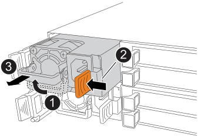

= 熱插拔電源 - NX224 層架
:allow-uri-read: 
:icons: font
:imagesdir: ../media/

[role="lead"]
您可以在已開啟電源且 I/O 正在進行的情況下無中斷地更換 NX224 架中的故障電源。

.關於這項工作
* 請勿混用具有不同效率額定值或不同輸入類型的電源供應器。
+
永遠像這樣更換。

* 如果您要更換多個電源供應器、則必須一次更換一個電源供應器、以便磁碟櫃維持電力。
* 最佳實務做法： * 最佳實務做法是在從 NSM 移除電源供應器後的兩分鐘內進行更換。
+
如果超過兩分鐘、磁碟櫃會繼續運作、ONTAP 但在更換電源供應器之前、會將降級電源供應器的相關訊息傳送至主控台。

* 請勿將韌體還原至不支援機櫃及其元件的版本。
* 如有需要、您可以開啟機櫃的位置（藍色）LED、以協助實際找出受影響的機櫃：「儲存櫃位置導向的修改-機櫃名稱_bidle_name_-leide-Status on」
+
如果您不知道受影響機櫃的「shelf_name」、請執行「shorage shelage show」命令。

+
機櫃有三個位置 LED ：一個在操作員顯示面板上，一個在每個 NSM 上。位置LED會持續亮起30分鐘。您可以輸入相同的命令、但使用「關閉」選項來關閉這些命令。

* 打開更換用電源供應器的包裝時、請保留所有包裝材料、以便在退回故障的電源供應器時使用。
+
如果您需要RMA號碼或更換程序的其他協助、請聯絡技術支援部門： https://mysupport.netapp.com/site/global/dashboard["NetApp支援"^]電話：888-463-8277（北美）、00-800-44-638277（歐洲）或+800-800-80-800（亞太地區）。

.步驟
. 請妥善接地。
. 實體識別故障的電源供應器。
+
系統會將警告訊息記錄到系統主控台、指出哪個電源供應器故障。此外、機櫃操作員顯示面板上的警示（黃色）LED會亮起、故障電源供應器上的雙色LED會亮起紅色。

. 打開電源線固定器、從電源供應器拔下電源線、然後從電源供應器拔下電源線。
+
電源供應器沒有電源開關。

. 移除電源供應器：
+

+
[cols="1,3"]
|===

 a| 
image:../media/icon_round_1.png["編號 1"]
 a| 
將握把向上旋轉至水平位置、然後加以抓住。

 a| 
image:../media/icon_round_2.png["編號 2"]
 a| 
用拇指按下 terra 索引標籤以釋放鎖定機制。

 a| 
image:../media/icon_round_3.png["編號 3"]
 a| 
將電源供應器從 NSM 中拉出，同時用另一隻手支撐其重量。

|===
. 插入替換的電源供應器：
+
.. 用雙手支撐電源供應器的邊緣，並將其與 NSM 的開口對齊。
.. 將電源供應器輕輕推入 NSM ，直到鎖定機制卡入定位。
+

NOTE: 請勿過度施力、否則可能會損壞內部接頭。

.. 向下轉動握把、使其遠離正常作業。

. 將電源線連接至電源供應器、並使用電源線固定器固定電源線。
+
當電源供應器正常運作時、雙色LED會亮起綠燈。

