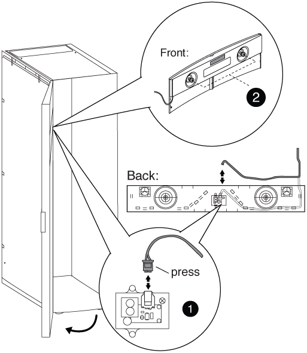

= 安裝機櫃互連套件
:allow-uri-read: 
:icons: font
:imagesdir: ../media/

[role="lead"]
您可以使用選購的機櫃互連套件、將系統機櫃連接在一起。建議您安裝套件、以避免機櫃拉出及損壞系統纜線。

. 將系統機櫃放在一起。
+
機櫃的排列方式應與下圖類似、機櫃的控制器模組位於中央、機櫃的任一側都有額外的磁碟櫃。機櫃的兩側應該要靠近、但還不需要彼此接觸。

+
image::../media/drw_fcc_cabinet_ordering.png[如圖所示、請參閱相關文字。]

. 如果您要依照建議安裝互連套件、並將側邊面板安裝在上、請重新安裝在打開包裝時移除的側邊面板：
+
.. 提起側板、將其從系統機櫃底部傾斜約15度、然後將其懸掛在系統機櫃框架頂端的凸片上。
.. 將側邊面板輕推到機箱框架上、然後用鑰匙將其鎖定到位。
.. 對其餘側邊面板重複這些子步驟。

. 如果您要在卸下側邊面板的情況下安裝互連套件、請卸下正面護蓋、其轉軸位於機箱所在邊緣：
+
.. 解除鎖定並開啟要移除的前側擋門。
.. 請參考下圖、拔下發光式擋板的電源：
+

+
|===

 a| 
image:../media/icon_round_1.png["編號 1"]

 a| 
發光式擋板電路板與纜線

 a| 
image:../media/icon_round_2.png["編號 2"]

 a| 
背面板和指旋螺絲

|===
.. 請參考下列圖例、以移除前擋蓋：
+
image::../media/drw_sys_cab_front_door_daiginjo.png[如何取下前門]

+
|===

 a| 
image:../media/icon_round_1.png["編號 1"]

 a| 
門接地纜線

 a| 
image:../media/icon_round_2.png["編號 2"]

 a| 
機門頂端合頁

 a| 
image:../media/icon_round_3.png["編號 3"]

 a| 
鉸接銷

|===
+
請確定您已將移除的門放在安全的地方、以免意外損壞。

. 卸下後檢修蓋、其轉軸位於機箱所在的邊緣：
+
.. 解除鎖定並開啟您要移除的後側擋門。
.. 提起頂端的鉸接銷、直到它脫離轉軸底部為止。
.. 從系統機箱框架中輕推機箱蓋的頂端、然後釋放鉸接銷。
.. 將門從底部合葉中取出、然後將門放在一邊。

. 將系統機櫃完全移到一起、然後調整系統機櫃底部的四個水平墊腳來對齊並調整其水平。
. 安裝互連支架。
+
** 如果您要在系統機箱側邊面板上安裝互連支架、請參考下圖所示的建議：image:../media/drw_syscab_interconnect_bracket_side_panels_on.gif["如何將互連支架與系統機箱側邊面板一起安裝在上"]

+
|===

 a| 
image:../media/icon_round_1.png["編號 1"]

 a| 
系統機櫃頂端的塑膠推入式鉚釘

 a| 
image:../media/icon_round_2.png["編號 2"]

 a| 
頂端互連支架

 a| 
image:../media/icon_round_3.png["編號 3"]

 a| 
底部互連支架

|===
+
** 如果您要在系統機箱側邊面板關閉的情況下安裝互連支架、請參考下圖：image:../media/drw_syscab_interconnect_bracket_side_panels_off.gif["如何在系統機箱側邊面板關閉的情況下安裝互連支架"]

. 對任何其餘的系統機櫃重複此程序。
. 鎖緊所有互連支架螺絲。

