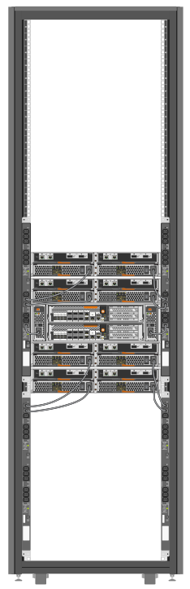

= 開啟系統機櫃電源
:allow-uri-read: 
:icons: font
:imagesdir: ../media/

[role="lead"]
您必須將系統元件連接至PDU、將PDU纜線佈線至AC電源、將其連接至電源、然後開啟系統電源。

IMPORTANT: 為避免 PDU 故障時系統中斷、請勿將任何元件的兩根電源線插入一個 PDU 。將負載分散到插入不同電路的 PDS 、如圖所示。

系統機櫃中的每個PDU都必須有獨立的電源電路可供使用。

. 將設備連接至 PDU ：
+
.. 將控制器電源供應器連接至連接至不同電源的不同 PDU 。
.. 將磁碟機櫃電源供應器連接至連接至不同電源的不同 PDU 。
.. 將任何交換器電源供應器連接至連接至不同電源的不同 PDU 。
+

+
將 PDU 電源線穿過系統機櫃的下列其中一個開口：

+
*** 系統機櫃頂端
*** 系統機櫃的後側機櫃底部與機架之間
*** 透過系統機櫃的開放空間和下方

. 關閉PDU上的電源開關或斷路器。
. 將每條PDU電源線插入獨立AC電路上的個別AC電源。
. 開啟PDU的電源交換器或斷路器。
. 開啟元件的電源、然後啟動系統。
. 關閉並鎖定系統機櫃門。

