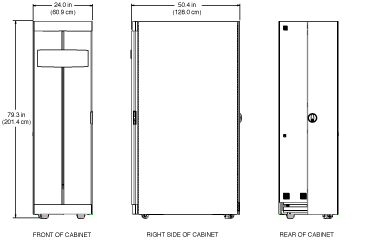

= 空間需求與系統機櫃尺寸
:allow-uri-read: 
:icons: font
:imagesdir: ../media/

[role="lead"]
打開系統機櫃的包裝時、您必須確保有足夠的空間從包裝材料中取出系統機櫃。此外、請確定系統機櫃的預定位置足夠大、以便您將機櫃移到位。

== 打開系統機櫃的包裝所需空間

下表定義了打開和安裝系統機櫃所需的空間：

[cols="2,1,1"]
|===
| 尺寸 | 美國 | 度量 

 a| 
運送用斜坡長度
 a| 
80英寸
 a| 
203.2公分

 a| 
機櫃移動性所需的空間
 a| 
72英寸
 a| 
182.9公分

 a| 
貨板深度
 a| 
59英寸
 a| 
149.9公分

 a| 
貨板寬度
 a| 
42英寸
 a| 
106.6公分

 a| 
貨板和包裝高度
 a| 
86英寸
 a| 
218.4公分

 a| 
機架空間總計、42U
 a| 
73.5吋
 a| 
186.7公分

 a| 
軌道負載容量
 a| 
支援所有目前的系統
 a| 
支援所有目前的系統

 a| 
空重
 a| 
約400磅（約181公斤）磅
 a| 
約181公斤

 a| 
滿載的出貨重量
 a| 
高達1、800磅
 a| 
高達816.5%公斤

 a| 
全負載靜態重量
 a| 
高達2、700磅
 a| 
最高1、224.7公斤

 a| 
前端服務間隙
 a| 
47.2英英寸
 a| 
120公分

 a| 
後檢修間隙*附註：*後檢修門會分開。實際最小後間隙約為建議值的一半。
 a| 
30英寸
 a| 
76.3公分

 a| 
面板移除的最小側邊間隙
 a| 
24英寸
 a| 
61公分

 a| 
最小最大間隙
 a| 
12英寸
 a| 
30 公分

|===

== 系統機櫃外部尺寸

下圖顯示系統機櫃的正面、背面和側視圖：

下圖顯示系統機櫃的上視圖和下視圖、並指出可將纜線束從資料中心地板延伸至系統機櫃的開孔。圖示也顯示系統機櫃腳輪和水平墊腳的位置。

注意：

為避免系統機櫃從資料中心地板掉落、請勿嘗試將系統機櫃捲動到比系統機櫃底部纜線存取孔寬的地板上。

