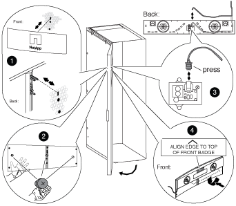

= 重新安裝門並點亮徽章
:allow-uri-read: 
:icons: font
:imagesdir: ../media/

[role="lead"]
將電源供應器和元件移至系統機櫃的另一側、並移動轉軸和鎖扣之後、您必須重新安裝系統機櫃門和亮起的徽章、然後將徽章重新連接至電源。

== 重新安裝系統機櫃門

反轉門蓋轉軸和門鎖之後、您必須先重新安裝接地線、凸耳組件和線路、以及系統機櫃前蓋、然後再重新安裝亮起的徽章。

. 將門旋轉180度。
. 將門的底部對齊底部的鉸接桿、然後將門底部放在鉸接桿上。
. 提起頂端的鉸接銷、使其脫離鉸接外殼。
. 將機箱蓋的頂端推入鉸接外殼、使其對齊鉸接銷和機箱蓋的合腳、然後釋放鉸接銷。
+
請確定轉軸銷已完全透過門栓和門栓外殼的底部固定。

. 將接地接線片和線路組件重新連接至新正面護蓋同一側的系統機櫃框架、然後重新安裝系統機櫃門頂端的接地接線片和帶有鏟形的接地接線片。
. 將接地線重新連接至系統機櫃門上接地突耳組件的鏟形。
. 視情況重新安裝側邊面板或互連支架：
+
** 如果系統機櫃未連接至其他系統機櫃、請重新安裝側邊面板。
** 如果您的系統機櫃已連接至另一個具有互連套件的系統機櫃、請重新安裝互連支架。

== 重新安裝亮起的徽章

安裝系統機櫃門之後、您需要安裝亮起的徽章、以完成門反轉程序、然後關閉並鎖定前擋門。

. 請參考下圖、將發光的徽章重新安裝在系統機櫃的前側擋門上：
+

. 關閉並鎖定前側擋門。

